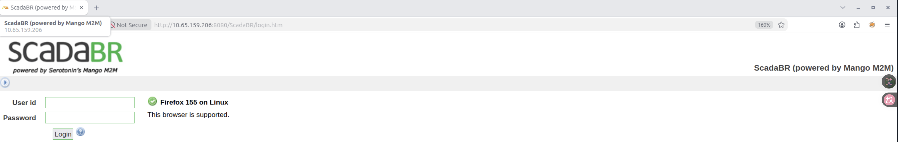
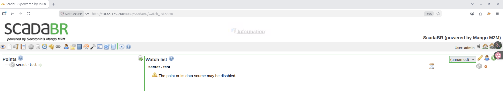
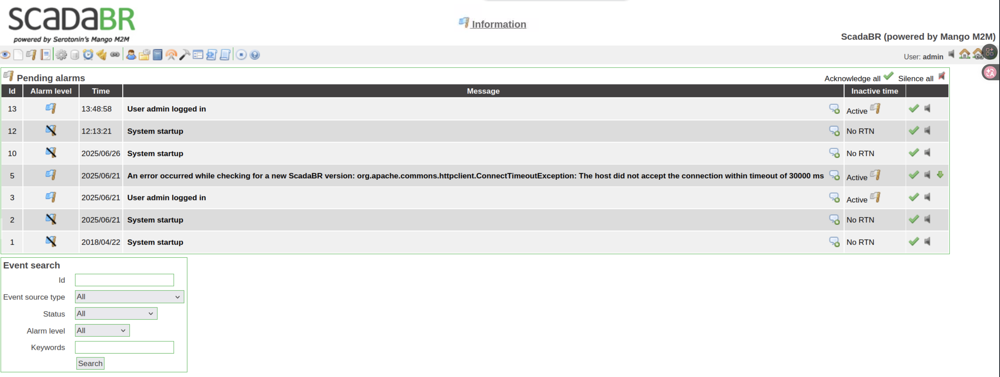
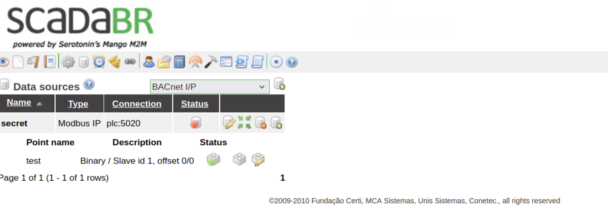
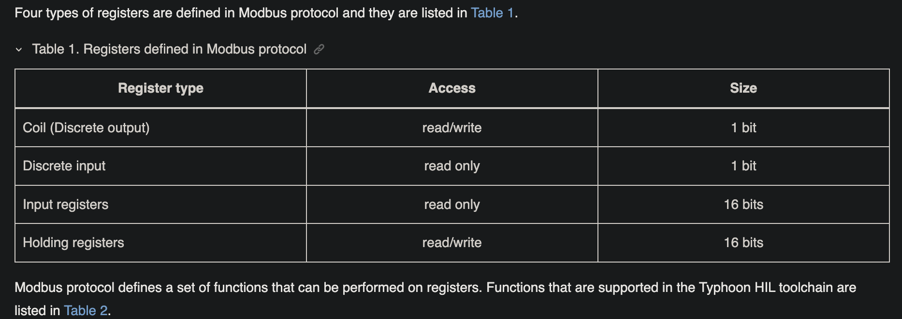
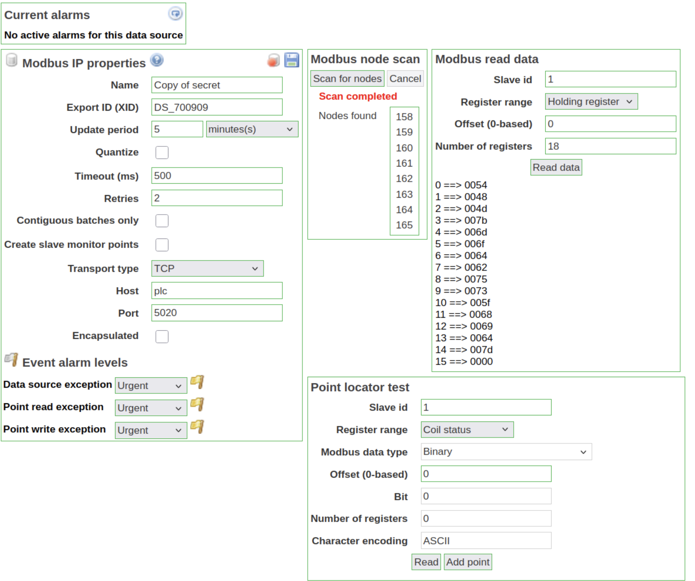

# recon
```sh
root@ip-10-65-71-155:~/wrk# nmap -sSCV -p22,80,5901,8080 -T4  --min-rate 1000 --max-rate 1500 -vv -oN ./ports -Pn 10.65.159.206
PORT     STATE SERVICE REASON         VERSION
22/tcp   open  ssh     syn-ack ttl 64 OpenSSH 9.6p1 Ubuntu 3ubuntu13.11 (Ubuntu Linux; protocol 2.0)
| ssh-hostkey: 
|   256 49:b9:d3:e8:7c:71:ea:a5:fb:e9:ed:4a:59:75:e6:94 (ECDSA)
| ecdsa-sha2-nistp256 AAAAE2VjZHNhLXNoYTItbmlzdHAyNTYAAAAIbmlzdHAyNTYAAABBBEQmiDrDh7VoSOfusMPhIS5ONI5TNWr7Z5D2zMAackdmoJElvA2NuLsuWMHZU0D2PegLgv7l163LsuhaA2FBk5k=
|   256 9d:4e:db:52:4d:8b:47:83:cd:78:d6:7d:46:d8:b5:2f (ED25519)
|_ssh-ed25519 AAAAC3NzaC1lZDI1NTE5AAAAIMDONq3nuOuthoLjtOs0SpQ+0AFnI6B3cA7xb3WzPaLz
80/tcp   open  http    syn-ack ttl 64 WebSockify Python/3.12.3
|_http-title: Error response
|_http-server-header: WebSockify Python/3.12.3
| fingerprint-strings: 
|   GetRequest: 
|     HTTP/1.1 405 Method Not Allowed
|     Server: WebSockify Python/3.12.3
|     Date: Wed, 16 Sep 2026 12:26:38 GMT
|     Connection: close
|     Content-Type: text/html;charset=utf-8
|     Content-Length: 355
|     <!DOCTYPE HTML>
|     <html lang="en">
|     <head>
|     <meta charset="utf-8">
|     <title>Error response</title>
|     </head>
|     <body>
|     <h1>Error response</h1>
|     <p>Error code: 405</p>
|     <p>Message: Method Not Allowed.</p>
|     <p>Error code explanation: 405 - Specified method is invalid for this resource.</p>
|     </body>
|     </html>
|   HTTPOptions: 
|     HTTP/1.1 501 Unsupported method ('OPTIONS')
|     Server: WebSockify Python/3.12.3
|     Date: Wed, 16 Sep 2026 12:26:38 GMT
|     Connection: close
|     Content-Type: text/html;charset=utf-8
|     Content-Length: 360
|     <!DOCTYPE HTML>
|     <html lang="en">
|     <head>
|     <meta charset="utf-8">
|     <title>Error response</title>
|     </head>
|     <body>
|     <h1>Error response</h1>
|     <p>Error code: 501</p>
|     <p>Message: Unsupported method ('OPTIONS').</p>
|     <p>Error code explanation: 501 - Server does not support this operation.</p>
|     </body>
|     </html>
|   RTSPRequest: 
|     <!DOCTYPE HTML>
|     <html lang="en">
|     <head>
|     <meta charset="utf-8">
|     <title>Error response</title>
|     </head>
|     <body>
|     <h1>Error response</h1>
|     <p>Error code: 400</p>
|     <p>Message: Bad request version ('RTSP/1.0').</p>
|     <p>Error code explanation: 400 - Bad request syntax or unsupported method.</p>
|     </body>
|_    </html>
5901/tcp open  vnc     syn-ack ttl 64 VNC (protocol 3.8)
| vnc-info: 
|   Protocol version: 3.8
|   Security types: 
|     VeNCrypt (19)
|     VNC Authentication (2)
|   VeNCrypt auth subtypes: 
|     Unknown security type (2)
|_    VNC auth, Anonymous TLS (258)
8080/tcp open  http    syn-ack ttl 63 Apache Tomcat/Coyote JSP engine 1.1
|_http-server-header: Apache-Coyote/1.1
|_http-open-proxy: Proxy might be redirecting requests
|_http-title: ScadaBR CTF
| http-methods: 
|   Supported Methods: GET HEAD POST PUT DELETE OPTIONS
|_  Potentially risky methods: PUT DELETE
1 service unrecognized despite returning data. If you know the service/version, please submit the following fingerprint at https://nmap.org/cgi-bin/submit.cgi?new-service :
SF-Port80-TCP:V=7.94SVN%I=7%D=9/16%Time=6AAA8AFF%P=x86_64-pc-linux-gnu%r(G
SF:etRequest,21C,"HTTP/1\.1\x20405\x20Method\x20Not\x20Allowed\r\nServer:\
SF:x20WebSockify\x20Python/3\.12\.3\r\nDate:\x20Wed,\x2016\x20Sep\x202026\
SF:x2012:26:38\x20GMT\r\nConnection:\x20close\r\nContent-Type:\x20text/htm
SF:l;charset=utf-8\r\nContent-Length:\x20355\r\n\r\n<!DOCTYPE\x20HTML>\n<h
SF:tml\x20lang=\"en\">\n\x20\x20\x20\x20<head>\n\x20\x20\x20\x20\x20\x20\x
SF:20\x20<meta\x20charset=\"utf-8\">\n\x20\x20\x20\x20\x20\x20\x20\x20<tit
SF:le>Error\x20response</title>\n\x20\x20\x20\x20</head>\n\x20\x20\x20\x20
SF:<body>\n\x20\x20\x20\x20\x20\x20\x20\x20<h1>Error\x20response</h1>\n\x2
SF:0\x20\x20\x20\x20\x20\x20\x20<p>Error\x20code:\x20405</p>\n\x20\x20\x20
SF:\x20\x20\x20\x20\x20<p>Message:\x20Method\x20Not\x20Allowed\.</p>\n\x20
SF:\x20\x20\x20\x20\x20\x20\x20<p>Error\x20code\x20explanation:\x20405\x20
SF:-\x20Specified\x20method\x20is\x20invalid\x20for\x20this\x20resource\.<
SF:/p>\n\x20\x20\x20\x20</body>\n</html>\n")%r(HTTPOptions,22D,"HTTP/1\.1\
SF:x20501\x20Unsupported\x20method\x20\('OPTIONS'\)\r\nServer:\x20WebSocki
SF:fy\x20Python/3\.12\.3\r\nDate:\x20Wed,\x2016\x20Sep\x202026\x2012:26:38
SF:\x20GMT\r\nConnection:\x20close\r\nContent-Type:\x20text/html;charset=u
SF:tf-8\r\nContent-Length:\x20360\r\n\r\n<!DOCTYPE\x20HTML>\n<html\x20lang
SF:=\"en\">\n\x20\x20\x20\x20<head>\n\x20\x20\x20\x20\x20\x20\x20\x20<meta
SF:\x20charset=\"utf-8\">\n\x20\x20\x20\x20\x20\x20\x20\x20<title>Error\x2
SF:0response</title>\n\x20\x20\x20\x20</head>\n\x20\x20\x20\x20<body>\n\x2
SF:0\x20\x20\x20\x20\x20\x20\x20<h1>Error\x20response</h1>\n\x20\x20\x20\x
SF:20\x20\x20\x20\x20<p>Error\x20code:\x20501</p>\n\x20\x20\x20\x20\x20\x2
SF:0\x20\x20<p>Message:\x20Unsupported\x20method\x20\('OPTIONS'\)\.</p>\n\
SF:x20\x20\x20\x20\x20\x20\x20\x20<p>Error\x20code\x20explanation:\x20501\
SF:x20-\x20Server\x20does\x20not\x20support\x20this\x20operation\.</p>\n\x
SF:20\x20\x20\x20</body>\n</html>\n")%r(RTSPRequest,16C,"<!DOCTYPE\x20HTML
SF:>\n<html\x20lang=\"en\">\n\x20\x20\x20\x20<head>\n\x20\x20\x20\x20\x20\
SF:x20\x20\x20<meta\x20charset=\"utf-8\">\n\x20\x20\x20\x20\x20\x20\x20\x2
SF:0<title>Error\x20response</title>\n\x20\x20\x20\x20</head>\n\x20\x20\x2
SF:0\x20<body>\n\x20\x20\x20\x20\x20\x20\x20\x20<h1>Error\x20response</h1>
SF:\n\x20\x20\x20\x20\x20\x20\x20\x20<p>Error\x20code:\x20400</p>\n\x20\x2
SF:0\x20\x20\x20\x20\x20\x20<p>Message:\x20Bad\x20request\x20version\x20\(
SF:'RTSP/1\.0'\)\.</p>\n\x20\x20\x20\x20\x20\x20\x20\x20<p>Error\x20code\x
SF:20explanation:\x20400\x20-\x20Bad\x20request\x20syntax\x20or\x20unsuppo
SF:rted\x20method\.</p>\n\x20\x20\x20\x20</body>\n</html>\n");
Service Info: OS: Linux; CPE: cpe:/o:linux:linux_kernel
```

一台 Linux 机器, 四个端口.
1. `22`: ssh, 等找到凭据再来
2. `80`: `WebSockify Python/3.12.3`, 但没找到接受的 HTTP 方法
3. `5901`: VNC
4. `8080`: 一个 Web 页面

除去 `8080` TTL 均为 64, `8080` TTL 为 63, 其可能运行在一个代理背后或者容器中

# Web - 8080



打开后重定向到 Scadabar 的登陆界面, 对于 Scadabar, 一个模拟工控环境的 app, 其 github 描述如下:
:::note
Open Source, web-based, multi-platform solution for building your own SCADA
(Supervisory Control and Data Acquisition) system.
:::

::github{repo="SCADA-LTS/Scada-LTS"}

## default creds
根据搜索到的[安装手册](https://doc-en.rvspace.org/VisionFive2/AN_OpenPLC/VF2OpenPLC/7_2_2_install_scadabr.html), Scadabar 的默认密码为: `admin/admin`



成功登陆, 来到管理页面, 有一个已经没用的 secret, 点击页面上闪烁的 `information` 得到一些信息, 但没什么有趣的



## datasource
在阅读了相关的文档后, 我发现该 app 的核心功能在于数据源的处理. 在这个页面我们找到了一个 secret 的数据源:


其[类型](https://sourceforge.net/p/scadabr/wiki/Manual%20ScadaBR%20English%204%20Chapter%204/)为 `Modbus IP`, 即该数据源的获取遵循 modbus 协议
:::note
The Modbus IP data source is used to gather data from Modbus equipment accessible over an I/P network. Equipment can be in a local network or intranet, or could also be anywhere in the internet. This is a polling data source.
:::

一些信息:
1. 通信端口: `5020`
2. slaveid: 1

有趣的是, 其通信端口不是标准的 `502`, 而是 `5020`. 靶机的确开放了这个端口. NMAP 错误的识别了服务类别, 但结合上述信息, 有理由推测该协议为 modbus 协议
```sh
nmap -p 5020 10.67.130.5
Starting Nmap 7.94SVN ( https://nmap.org ) at 2026-09-16 15:02 UTC
Nmap scan report for ip-10-67-130-5.ec2.internal (10.67.130.5)
Host is up (0.00041s latency).

PORT     STATE SERVICE
5020/tcp open  zenginkyo-1

Nmap done: 1 IP address (1 host up) scanned in 0.14 seconds
```

## dump from modbus device
在翻找一圈后并没有找到多少有用的信息, 不过考虑到数据源是一个 modbus device, 尝试与 modbus device 交互.

对于一个 [modbus device](https://www.typhoon-hil.com/documentation/typhoon-hil-software-manual/References/modbus_device.html), 其根据 modbus 协议定义了四种寄存器, 每类里有多个寄存器:



从命名来看数据存储最有可能在 `Holding registers` 即存储寄存器中, 使用 Scadabar 的数据源复制功能读取其中信息并扔给 AI 翻译:

```
THM{modbus_hid}
```

# beyond the flag
即然 box 开放了 modbus 协议端口, 那也可以考虑直接通过原始协议与其交互. 我们的目的是完成对 `Holding registers` 的读取.

[wiki](https://en.wikipedia.org/wiki/Modbus#Modbus_messaging_on_TCP/IP) 上给出了 MAPH(MODBUS Application Protocol Header) 结构:
1. Transaction Identifier: 客户端决定的 2 字节标识符
2. Protocol Identifier: `00 00`
3. Length: PDU 和 Unit identifier 的 size
4. Unit identifier: 设备的标记, 也就是上文的 `1`
   
对于 PDU 则简单一些:
1. Function code: 操作吗, 读取 `Holding registers` 为 `0x3`
2. Data: 数据, 该上下文下即从哪个寄存器读多少个 `Holding register`(没有复数)

:::caution
Modbus TCP 采用 big-Endian
:::

对于返回包, 其也遵循 7bit MAPH + PDU 的格式. 其中 PDU 的第一个字段为输出长度
```python
import struct
import socket

pdu = struct.pack(">BHH", 0x3, 0, 20)
maph = struct.pack(">HHHB", 1, 0x0, len(pdu)+1, 1)

host = '10.67.130.5'
port = 5020

frame = maph + pdu

with socket.create_connection((host, port)) as s:
    s.sendall(frame)
    resp = s.recv(124)

pdu = resp[7:]
datasz = pdu[1]
data = struct.unpack(">"+"H"*(datasz//2), pdu[2:2+datasz])
for i in data:
    print(chr(i))
```
