# recon
:::note
Give the machine a minute to boot and then connect to http://10.67.135.219.
Hint: Unless displayed on the page the flags are stored in the flag table in the flag column.
:::

CTF-style SQL 大练习, 直接跳过端口探测, 本次没有测试盲注.

# Web
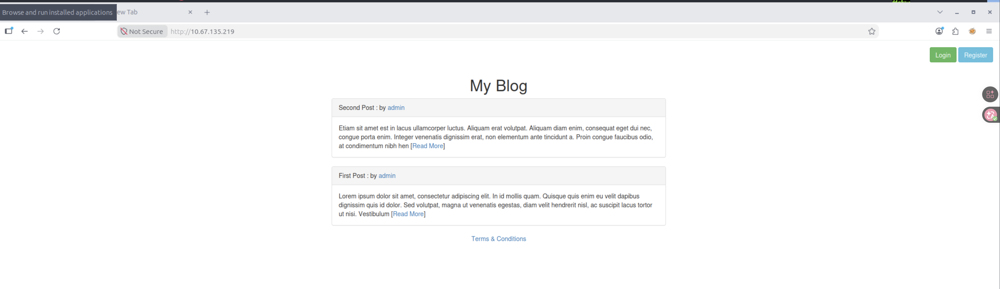
一个博客系统, 有访问控制功能, 两条推文, 但不是英语写的. 给出一个用户名: `admin`

目录爆破给出四个结果:
```sh
dirsearch -u http://10.67.135.219/ -w /usr/share/wordlists/SecLists/Discovery/Web-Content/raft-small-words.txt 

  _|. _ _  _  _  _ _|_    v0.4.3.post1
 (_||| _) (/_(_|| (_| )

Extensions: php, aspx, jsp, html, js | HTTP method: GET | Threads: 25
Wordlist size: 43003

Output File: /root/reports/http_10.67.135.219/__26-09-20_13-49-26.txt

Target: http://10.67.135.219/

[13:49:26] Starting: 
[13:49:26] 200 -    2KB - /login
[13:49:26] 200 -    3KB - /register
[13:49:26] 200 -   21B  - /user
[13:49:28] 200 -   21B  - /post
```
## techstack
```http
HTTP/1.1 200 OK
Server: nginx/1.18.0 (Ubuntu)
Date: Sun, 20 Sep 2026 13:08:50 GMT
Content-Type: text/html; charset=UTF-8
Connection: keep-alive
Content-Length: 2309
```

技术栈没什么有趣的, 标准的 Nginx.

## register
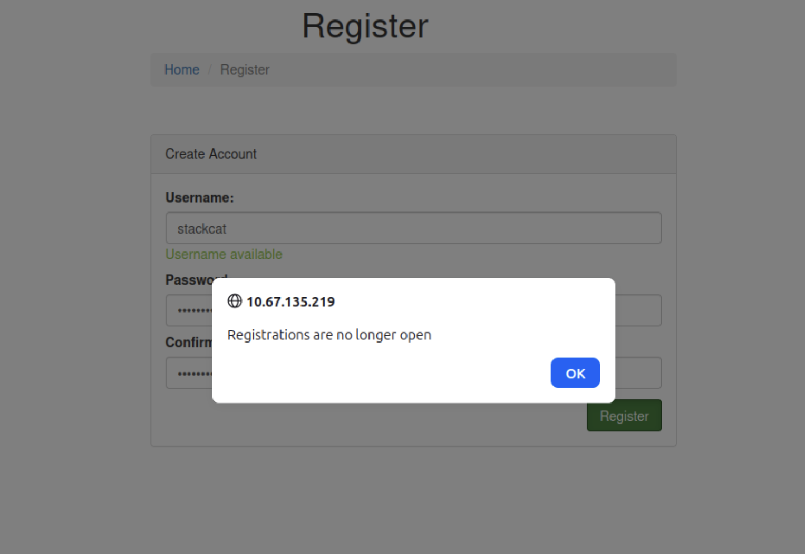
尝试注册一个用户, 但显示注册功能已停用, 而且是真停用了, 没有注册的接口.
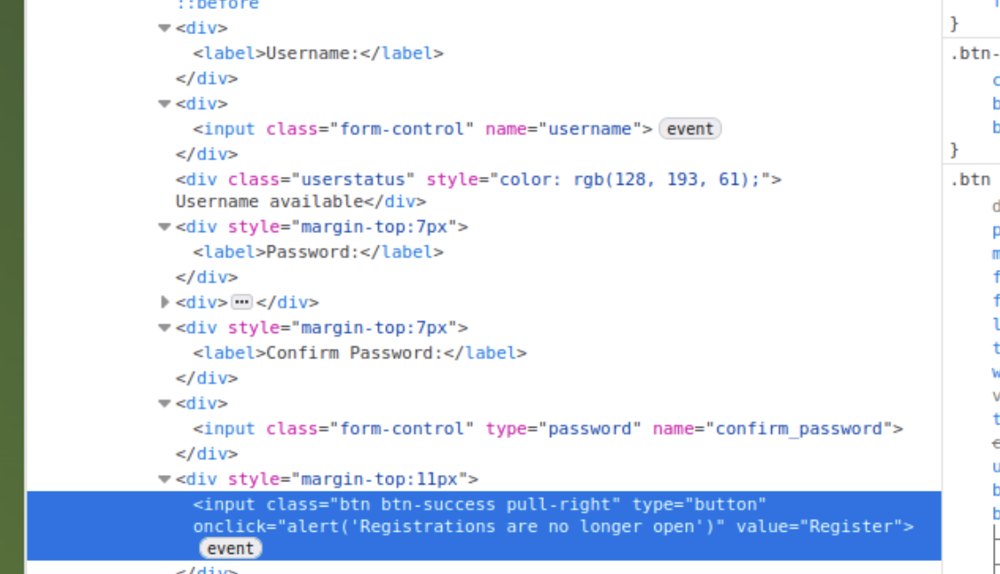


不过有趣的是, 当在页面上输入用户名时, 其会向 `/register/user-check` 发送一个请求, 服务器则会返回状态, 是一个盲注入口

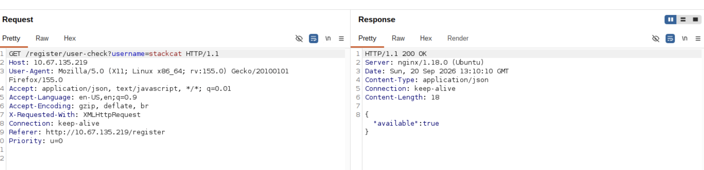

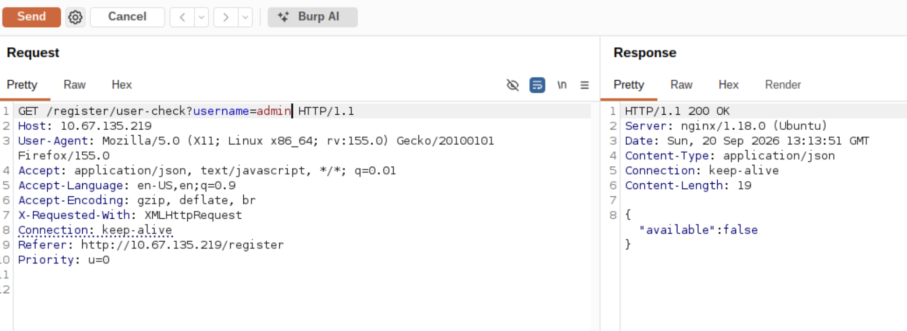

## login - flag1
登录页面, 尝试万能密码, 成功. 但除了一个 flag 啥都没有.
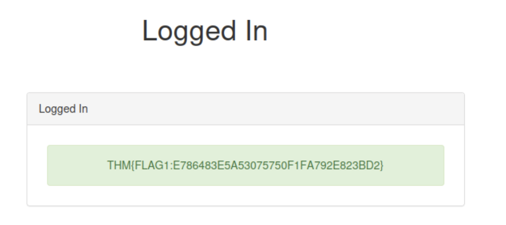

FLAG: `THM{FLAG1:E786483E5A53075750F1FA792E823BD2}`

```http
HTTP/1.1 200 OK
Server: nginx/1.18.0 (Ubuntu)
Date: Sun, 20 Sep 2026 13:18:46 GMT
Content-Type: text/html; charset=UTF-8
Connection: keep-alive
Content-Length: 1315
```

## Post - flag5
Post 页面用于显示 Post, 其接受一个数字参数并回复对应的 Post:
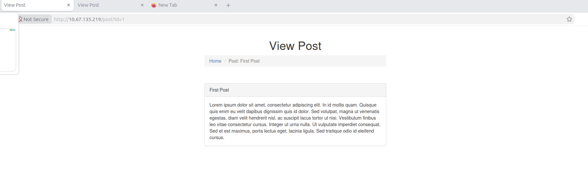

经过测试, 当输入无对应推文的数字时会返回:
```
Post not found
```

但当输入字母时会返回, `clause` 的中文翻译为条目:
```
Unknown column 'a' in 'where clause'
```

推测后端的 SQL 语句为:
```sql
SELECT * FROM posts WHERE <input> = 1;
```

### Union Injection
经过测试共四列, 其中 2,3 列有回显:
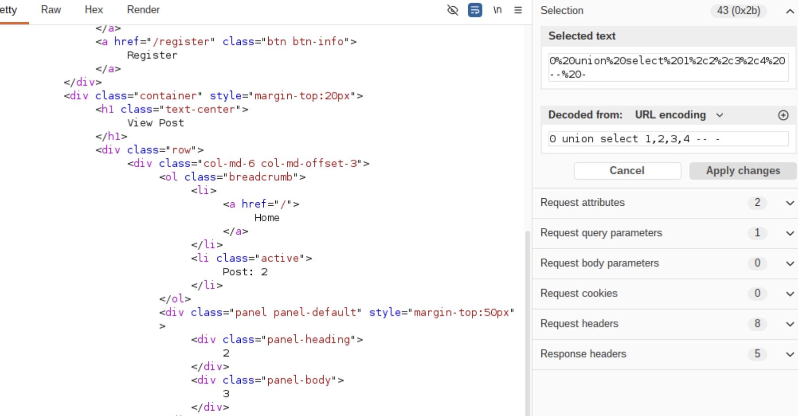

当前位于 `sqlhell_5` 数据库中:
```html
               <div class="panel-heading">2</div>
                <div class="panel-body">
                    sqhell_5
                </div>
```

根据提示, 直接查询 flag: `THM{FLAG5:B9C690D3B914F7038BA1FC65B3FDF3C8}`
哎你怎么是第五个.

## user - flag4
user 页面接受一个通过 GET 方法传递的 id 参数, 但只有 `id=1` 时返回了用户, 为 admin:
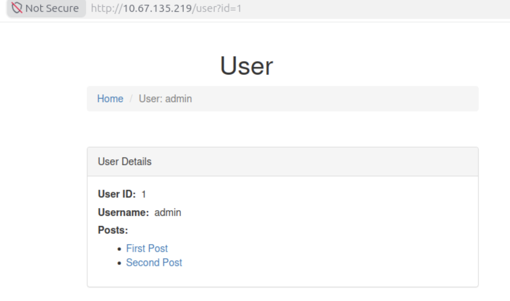

与 Post 页面不同, 包括无效数字字母以及查询失败、查询无有效用户都会返回:
```
Cannot find user
```

对于用户查询, 发现 app 会将 UNION 注入的内容视为用户信息, 推测其根据表中的列索引提取数据而非列名提取

### muti Union Injection
尝试 UNION 注入, 确定为 3 列, 根据回显其中可控的两列为前两列:
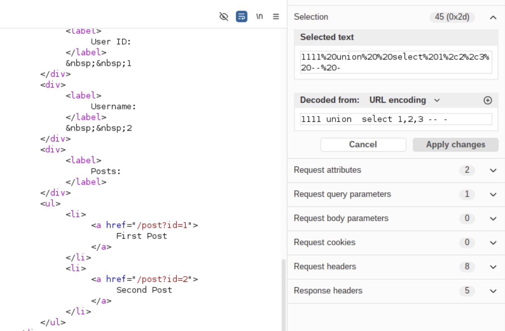


但有趣的是, 第一列的数据会影响到 Post 栏中数据的输出, 当为非有效用户 ID 时:
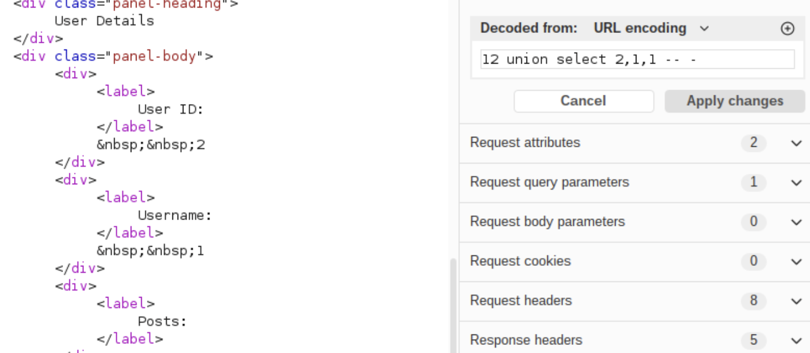

当为有效用户 ID 时:
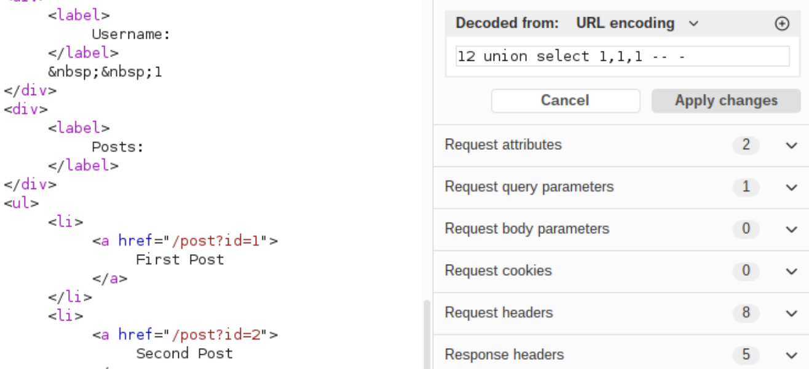

合理推测实际上第一列的数据被二次使用进行了第二次查询, 而用户是否有效的判断也依赖第二次查询.
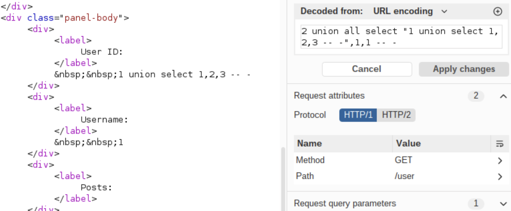

尝试, 成功返回了用户, 但没有返回推文信息, 推测是推文信息查询出现问题, 猜测列数不对. 再加一列后回显正常, 同时发现子查询的第二列会回显:

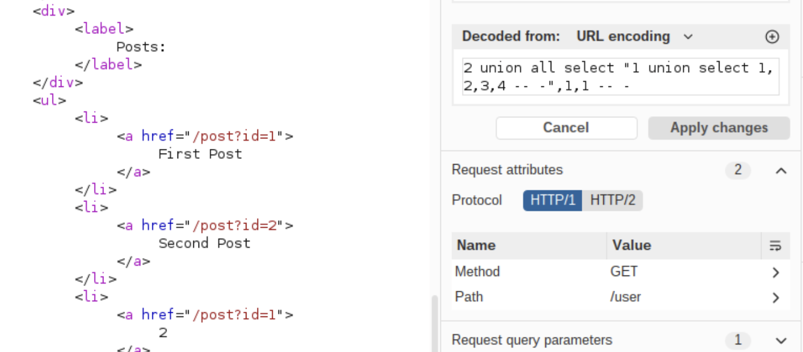

```sql
12 union all select "1 union select 1,flag,3,4 from flag-- -",1,1 -- -
```

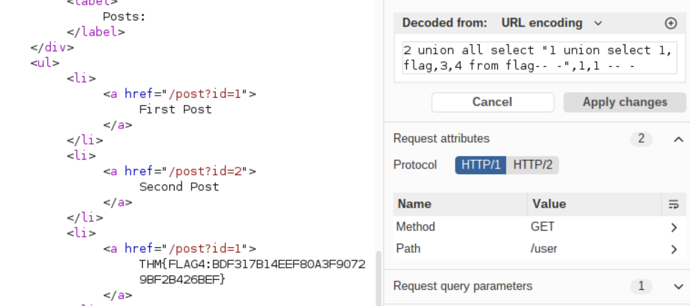

得到 FLAG: `THM{FLAG5:B9C690D3B914F7038BA1FC65B3FDF3C8}`

